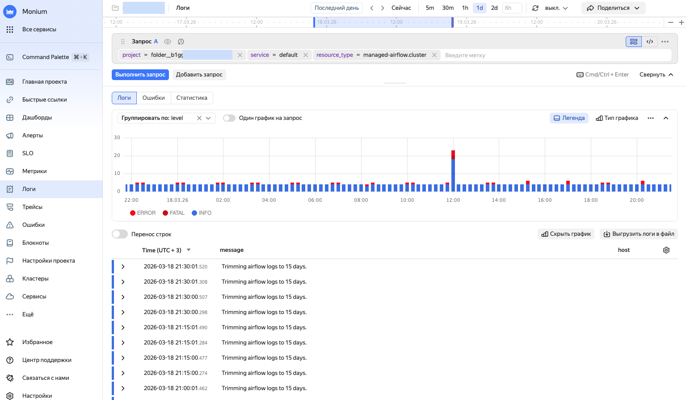
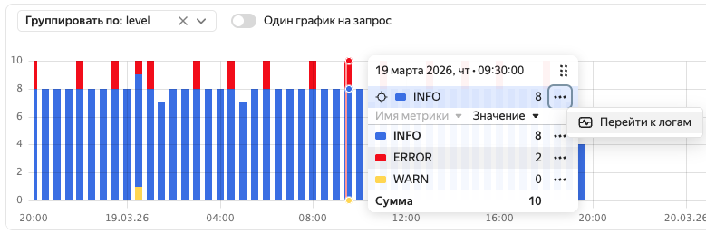

# Поиск и анализ логов

Интерфейс для работы с логами позволяет:

* составлять запросы для поиска и фильтрации логов;
* просматривать графики по логам с разными статусами запроса;
* просматривать содержимое строк лога;
* переходить от логов к исследованию связанных трейсов и спанов через их идентификаторы (если настроена передача трейсов).

Чтобы просматривать логи, настройте их доставку:

* Для вашего приложения или сервиса организуйте передачу данных в формате OpenTelemetry. Например, с помощью [OTel Collector](../collector/opentelemetry.md) или [Fluent Bit](../collector/fluentbit.md).
* Для ресурсов {{ yandex-cloud }} включите логирование. Обычно логирование можно настроить при создании или изменении ресурса. Подробнее в документации нужного сервиса.

  Список сервисов, которые поддерживают автоматический сбор логов, приведен в разделе [{#T}](../../overview/concepts/monitoring-logging-tools.md).

## Поиск логов {#logs-search}



- Интерфейс {{ monium-name }} {#console}

  1. На главной странице [{{ monium-name }}]({{ link-monium }}) слева выберите **{{ ui-key.yacloud_monitoring.aside-navigation.menu-item.logs.title }}**.
  1. Вверху задайте промежуток поиска данных одним из способов:
     * выберите варианты интервалов: `5m`, `30m` и так далее — будут показаны данные за последние 5, 30 минут;
     * введите интервал времени вручную;
     * в поле с точным временным промежутком укажите границы **От** и **До**;
     * на шкале времени перетащите границы промежутка.
  
  1. В строке запроса выберите метки для поиска логов.

     Телеметрия в {{ monium-name }} организована в иерархии «проект → кластер → сервис». Поэтому сначала в строке запроса выбираются параметры `project`, `cluster` и `service`.

      * Для поиска логов приложения укажите:

        

      * Для поиска логов ресурса {{ yandex-cloud }} укажите:

        
      
     Запрос можно вводить в режиме токенов, выбирая метки из списка, или в текстовом режиме. Чтобы переключиться в текстовый режим, нажмите  и введите запрос в формате:
       
     ```
     { <key>="<value>", <key>="<value>", ... }
     ```
      
     Составление запросов описано в разделах [{#T}](../concepts/data-model.md) и [{#T}](../concepts/querying.md).

     Пример запроса для поиска логов приложения:

     ```
     {project = "market", cluster = "production", service = "basket"}
     ```
     
     Пример запроса для поиска логов с ошибками от L7-балансировщика {{ alb-name }}:

     ```
     {project = "folder__{{ folder-id-example }}", service = "default", resource_type = "alb.loadBalancer", level = "ERROR"}
     ```

  1. Нажмите **{{ ui-key.yacloud_monitoring.querystring.action.execute-query }}**.




       





       




## Анализ логов {#logs-analysis}

Для анализа логов вы можете работать с фильтрацией логов в строке запроса, с записями логов и их визуализацией.

### Фильтрация и группировка {#filtering}

* Для поиска конкретной части логов выберите нужные метки из списка. Например, метка `level = WARN` покажет все логи с уровнем WARNING (предупреждение).

  Составление запросов описано в разделах [{#T}](../concepts/data-model.md) и [{#T}](../concepts/querying.md).

* Чтобы одновременно показать логи разных приложений или ресурсов, нажмите **Добавить запрос** и укажите параметры другого запроса.

### Визуализация {#visualization}

На графике отображается количество записей логов во времени. График автоматически обновляется при изменении запроса или временного диапазона.

При работе с графиком доступны возможности:

* **Окно информации**:

    * Чтобы открыть окно с информацией о логах, поступивших в конкретный момент времени, подведите курсор к нужной части графика.
    * Чтобы зафиксировать окно информации, нажмите на нужную часть графика.
    * Чтобы перейти к записям логов, напротив нужной строки нажмите  → **Перейти к логам**.

    

* **Легенда** — показывает значения меток для каждой серии данных на графике.
* **Тип графика** позволяет выбрать вид графика с количеством логов:

    * **Линия** — линии.
    * **Область** — закрашенные области.
    * **Столбец** (по умолчанию) — столбцы.
* **Группировка логов** — выберите параметр группировки в списке **Группировать по**. Например, группировка по `level` покажет распределение логов по уровням важности.
* При работе с несколькими запросами можно для каждого построить собственный график. Для этого включите **Один график на запрос** или выберите, сколько графиков разместить в одном ряду.
* Чтобы детально изучить график или поделиться им, в правом верхнем углу графика нажмите  и выберите:

    * **Показать график на весь экран**.
    * **Скопировать ссылку на скриншот**.
    * **Скопировать скриншот в буфер**.
* **Выгрузить логи в файл** — позволяет сохранить логи в форматах `CSV`, `JSON` и `TXT`. Можно сохранить не более 1 000 строк лога. Если строк больше, уменьшите временной диапазон.

Если визуализация не нужна, нажмите **Скрыть график**. Чтобы отобразить график, нажмите **Показать график**.

### Работа с записями логов {#log-records}

* Если описания логов не помещаются в ширину экрана, включите **Перенос строк**.
* Для исследования определенной записи лога разверните ее и напротив нужной строки лога выберите одно из действий:
    * **=** — добавить в запрос метку ключа из строки;
    * **!=** — исключить из запроса метку ключа из строки;
    *  — скрыть строку лога;
    *  — скопировать строку лога.

    Если вы работаете с [трейсами](../traces/index.md), то с помощью полей `trace.id` и `span.id` вы можете перейти к связанным данным трейсов.

* Чтобы настроить таблицу со строками логов, вверху справа таблицы нажмите  и выберите нужные колонки и контекст.


## Сервисный дашборд для логов {#logs-service-dashboard}


