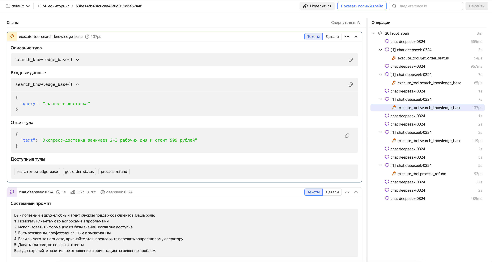

# Инструментирование LLM-приложений: вручную

Ручная инструментация LLM-приложений дает полный контроль над данными трейсов. Вы сами решаете, какие операции размечать спанами, какие атрибуты добавлять, как структурировать иерархию вызовов. Это особенно полезно, когда:

- Используемый фреймворк не поддерживается [автоинструментацией](auto_instrumentation.md);
- Нужно добавить бизнес-контекст: ID пользователя, ID сессии, версию промпта, параметры A/B-теста;
- Требуется разметить сложную логику агента: маршрутизацию между LLM, предобработку данных, постобработку ответов;
- Необходимо инструментировать кастомные инструменты (tools), не покрытые автоинструментацией.

Для ручной инструментации используется [OpenTelemetry SDK](https://opentelemetry.io/docs/languages/) и [семантические конвенции OpenTelemetry для GenAI](https://opentelemetry.io/docs/specs/semconv/gen-ai/). Примеры приведены на Python.

## Основные соглашения {#conventions}

Следуйте этим соглашениям для корректного отображения трейсов:

1. **Стандарт OpenTelemetry.** Используйте атрибуты из [стандарта OpenTelemetry для GenAI](https://opentelemetry.io/docs/specs/semconv/gen-ai/).
2. **Изоляция сервисов.** Каждый LLM-агент должен отправлять спаны с уникальным значением атрибута `service.name`. Это важно для корректной фильтрации данных в системе мониторинга.
3. **Обязательные атрибуты.** Часть атрибутов обязательна для корректной визуализации в интерфейсе — они перечислены в [таблице ниже](#required-attributes).

## Обязательные атрибуты спанов генерации {#required-attributes}

Чтобы трейсы корректно отображались в специализированном интерфейсе LLM-мониторинга {{ traces-name }}, укажите перечисленные ниже атрибуты. По таблице можно понять, какие данные нужны для отображения каждого элемента интерфейса.

#|
|| **Какие данные** | **Атрибут** | **Тип** | **Комментарий** ||
|| Количество токенов во входных данных | `gen_ai.usage.input_tokens` | int | ||
|| Количество токенов в ответе | `gen_ai.usage.output_tokens` | int | ||
|| Входные сообщения (промпты, история диалога, результаты вызова инструментов) | `gen_ai.input.messages` | JSON array | Формат — см. [раздел «Формат сообщений»](#messages-format) ||
|| Системный промпт | `gen_ai.system_instructions` или элемент с `role == system` в `gen_ai.input.messages` | JSON / string | Системное сообщение отдельно от истории чата. При использовании `gen_ai.input.messages` передавайте в элементе с `role == system` и полем `parts` ||
|| Ответ модели | `gen_ai.output.messages` | JSON array | Формат — см. [раздел «Формат сообщений»](#messages-format) ||
|| Тип операции | `gen_ai.operation.name` | string | Определяет отображение спана. Допустимые значения: `chat`, `text_completion`, `create_agent`, `invoke_agent`, `execute_tool`, `embeddings`, `generate_content` ||
|| Название ответившей модели | `gen_ai.response.model` | string | ||
|| Список доступных инструментов (tools) | `gen_ai.tool.definitions` | JSON array | Сигнатуры тулов для LLM. В интерфейсе отображается блок «Доступные инструменты» ||
|#

Кроме указанных атрибутов в стандарте OpenTelemetry описаны и другие полезные атрибуты для GenAI-спанов, такие как `gen_ai.system`, `gen_ai.request.model`, `gen_ai.tool.definitions` и другие. Полный список и их описание см. в [конвенции OpenTelemetry для GenAI](https://opentelemetry.io/docs/specs/semconv/gen-ai/gen-ai-spans/).

### Формат сообщений {#messages-format}

Атрибуты `gen_ai.input.messages` и `gen_ai.output.messages` содержат JSON, сериализованный в строку. Не упрощайте структуру до `{role, content}` — используйте поле `parts` с указанием `type`.

**Системный промпт** можно передать двумя способами: элементом с `role == system` внутри `gen_ai.input.messages` (см. примеры ниже) или отдельным атрибутом `gen_ai.system_instructions` (JSON-массив с объектами `{ "type": "text", "content": "..." }`).

**Входные сообщения** (`gen_ai.input.messages`):

```
[{
    “role”: “user”,
    “parts”: [
      {
        “type”: “text”,
        “content”: “Weather in Paris?"
      }
    ]
  },
  {
    “role”: “assistant”,
    “parts”: [
      {
        “type”: “tool_call”,
        “id”: “call_VSPygqKTWdrhaFErNvMV18Yl”,
        “name”: “get_weather”,
        “arguments”: {
          “location”: “Paris”
        }
      }
    ]
  },
  {
    “role”: “tool”,
    “parts”: [
      {
        “type”: “tool_call_response”,
        “id”: " call_VSPygqKTWdrhaFErNvMV18Yl”,
        “result”: “rainy, 57°F”
      }
    ]
  }
]
```
Подробная JSON Schema для входных сообщений доступна в [документации OpenTelemetry](https://opentelemetry.io/docs/specs/semconv/gen-ai/gen-ai-input-messages.json).

**Выходные сообщения** (`gen_ai.output.messages`):

```json
[
  {
    "role": "assistant",
    "parts": [
      {
        "type": "text",
        "content": "The weather in Paris is currently rainy with a temperature of 57°F."
      }
    ],
    "finish_reason": "stop"
  }
]
ИЛИ
[
  {
    "role": "assistant",
    "parts": [
      {
        "type": "tool_call",
        "id": "call_VSPygqKTWdrhaFErNvMV18Yl",
        "name": "get_weather",
        "arguments": {
          "location": "Paris"
        }
      }
    ],
    "finish_reason": "tool_call"
  }
]
```
Подробная JSON Schema для выходных сообщений доступна в [документации OpenTelemetry](https://opentelemetry.io/docs/specs/semconv/gen-ai/gen-ai-output-messages.json).

Если модель вызывает инструмент, выходное сообщение должно содержать `parts` с типом `tool_call`:

```json
[
  {
    "role": "assistant",
    "parts": [
      {
        "type": "tool_call",
        "id": "call_abc123",
        "name": "get_weather",
        "arguments": {
          "location": "Paris"
        }
      }
    ],
    "finish_reason": "tool_call"
  }
]
```

Результат выполнения инструмента передается в следующем запросе к модели в `gen_ai.input.messages` с `role == tool`:

```json
[
  {
    "role": "tool",
    "parts": [
      {
        "type": "tool_call_response",
        "id": "call_abc123",
        "response": "rainy, 18°C"
      }
    ]
  }
]
```


       

       



## Спаны вызова инструментов {#tool-spans}

Для каждого вызова инструмента (tool) создавайте дочерний спан с `gen_ai.operation.name="execute_tool"`. Это позволяет видеть в интерфейсе полную цепочку: запрос → модель решила вызвать tool → tool выполнился → модель получила результат → финальный ответ.

Рекомендуемые атрибуты спана вызова инструмента:

#|
|| **Атрибут** | **Описание** | **Пример** ||
|| `gen_ai.operation.name` | Тип операции. Для спанов инструментов должен быть `execute_tool` | `execute_tool` ||
|| `gen_ai.tool.name` | Имя вызываемого инструмента | `get_weather` ||
|| `gen_ai.tool.description` | Описание функции инструмента | `Get current weather for a city` ||
|| `gen_ai.tool.definitions` | JSON-массив с описанием инструмента в формате JSON Schema (сериализованный в строку) | См. пример в коде ||
|| `gen_ai.tool.call.arguments` | Аргументы вызова (сериализованные в строку через `json.dumps()`) | `{"location": "Paris"}` ||
|| `gen_ai.tool.call.result` | Результат выполнения (сериализованный в строку через `json.dumps()`) | `{"temperature": 18, "condition": "cloudy"}` ||
|#

Дополнительные примеры правильной инструментации различных сценариев (вызовы инструментов, стриминг, мультимодальность) см. в разделе [Examples: LLM Calls](https://opentelemetry.io/docs/specs/semconv/gen-ai/non-normative/examples-llm-calls/) документации OpenTelemetry.


       

       



## Пример кода {#example}

Ниже — минимальный рабочий пример ручной инструментации: агент на базе [OpenAI API](https://platform.openai.com/docs/api-reference) с одним инструментом (погода). Цикл вызова модели и инструмента реализован явно, чтобы в коде были видны все атрибуты из [таблицы спанов генерации](#required-attributes) и [таблицы спанов инструментов](#tool-spans).

### Установите зависимости

```bash
pip install opentelemetry-sdk opentelemetry-exporter-otlp-proto-grpc openai
```

### Настройте переменные окружения

Установите переменные для подключения к {{ traces-name }} и ключ OpenAI. Выполняйте команды по одной, подставляя свои значения:

```bash
export OTEL_EXPORTER_OTLP_ENDPOINT="{{ api-host-monium }}:443"
```

```bash
export OTEL_EXPORTER_OTLP_HEADERS="Authorization=Api-Key <ваш_API-ключ>,x-monium-project=<имя_проекта>,x-monium-service=my-ai-agent"
```

```bash
export OTEL_SERVICE_NAME="my-ai-agent"
```

```bash
export OPENAI_API_KEY="<ваш_ключ_OpenAI>"
```

Где:
- `<ваш_API-ключ>` — API-ключ сервисного аккаунта с ролью `monium.traces.writer`.
- `<имя_проекта>` — имя проекта в формате `folder__<идентификатор_каталога>`, например `folder__b1g2e3abc4def5ghij6k`.

Подробнее о специальных заголовках {{ monium-name }} см. в разделе [{#T}](../../collector/otlp-protocol.md#headers).


### Код агента

Сохраните код в файл `agent.py`. В коде по шагам показано, какие атрибуты задавать для спана генерации (диалог) и для спана вызова инструмента.

```python
import json
from openai import OpenAI
from opentelemetry import trace
from opentelemetry.trace import Status, StatusCode
from opentelemetry.sdk.trace import TracerProvider
from opentelemetry.sdk.trace.export import BatchSpanProcessor
from opentelemetry.exporter.otlp.proto.grpc.trace_exporter import OTLPSpanExporter

provider = TracerProvider()
provider.add_span_processor(BatchSpanProcessor(OTLPSpanExporter()))
trace.set_tracer_provider(provider)
tracer = trace.get_tracer("my_ai_agent")

TOOL_DEF = {
    "type": "function",
    "name": "get_weather",
    "description": "Get current weather for a city",
    "parameters": {"type": "object", "properties": {"city": {"type": "string"}}, "required": ["city"]},
}


def get_weather(city: str) -> dict:
    return {"temperature": 18, "condition": "cloudy", "city": city}


def to_otel_messages(messages: list) -> list:
    """Формат gen_ai.input.messages / output: parts с type text | tool_call | tool_call_response."""
    out = []
    for m in messages:
        role, content = m["role"], m.get("content") or ""
        if role in ("system", "user"):
            out.append({"role": role, "parts": [{"type": "text", "content": content}]})
        elif role == "assistant":
            parts = [{"type": "text", "content": content}] if content else []
            for tc in m.get("tool_calls", []):
                fn = tc["function"]
                args = json.loads(fn["arguments"]) if isinstance(fn["arguments"], str) else fn["arguments"]
                parts.append({"type": "tool_call", "id": tc["id"], "name": fn["name"], "arguments": args})
            out.append({"role": "assistant", "parts": parts})
        elif role == "tool":
            out.append({"role": "tool", "parts": [{"type": "tool_call_response", "id": m["tool_call_id"], "response": m["content"]}]})
    return out


def run_agent(user_query: str, messages: list | None = None) -> str:
    client = OpenAI()
    model = "gpt-4o-mini"
    tools_spec = [{"type": "function", "function": {"name": "get_weather", "description": TOOL_DEF["description"], "parameters": TOOL_DEF["parameters"]}}]
    if messages is None:
        messages = [
            {"role": "system", "content": "You are a helpful assistant. Use get_weather for weather questions."},
            {"role": "user", "content": user_query},
        ]
    else:
        messages.append({"role": "user", "content": user_query})

    while True:
        with tracer.start_as_current_span("gen_ai.chat") as span:
            span.set_attribute("gen_ai.operation.name", "chat")
            span.set_attribute("gen_ai.system", "openai")
            span.set_attribute("gen_ai.request.model", model)
            span.set_attribute("gen_ai.input.messages", json.dumps(to_otel_messages(messages)))
            span.set_attribute("gen_ai.tool.definitions", json.dumps([TOOL_DEF]))
            try:
                resp = client.chat.completions.create(model=model, messages=messages, tools=tools_spec)
            except Exception as e:
                span.record_exception(e)
                span.set_status(Status(StatusCode.ERROR, str(e)))
                return ""

            msg = resp.choices[0].message
            usage = resp.usage
            span.set_attribute("gen_ai.response.model", resp.model)
            span.set_attribute("gen_ai.usage.input_tokens", usage.prompt_tokens)
            span.set_attribute("gen_ai.usage.output_tokens", usage.completion_tokens)
            out_msg = [{"role": "assistant", "parts": [], "finish_reason": "stop"}]
            if msg.content:
                out_msg[0]["parts"].append({"type": "text", "content": msg.content})
            for tc in msg.tool_calls or []:
                args = json.loads(tc.function.arguments) if isinstance(tc.function.arguments, str) else tc.function.arguments
                out_msg[0]["parts"].append({"type": "tool_call", "id": tc.id, "name": tc.function.name, "arguments": args})
            if out_msg[0]["parts"] and out_msg[0]["parts"][-1].get("type") == "tool_call":
                out_msg[0]["finish_reason"] = "tool_call"
            span.set_attribute("gen_ai.output.messages", json.dumps(out_msg))

            if not msg.tool_calls:
                messages.append({"role": "assistant", "content": msg.content or ""})
                return (msg.content or "").strip()

            # Следующий запрос к API — ответ модели и результаты tool
            messages.append({
                "role": "assistant",
                "content": msg.content or "",
                "tool_calls": [{"id": t.id, "type": "function", "function": {"name": t.function.name, "arguments": t.function.arguments}} for t in msg.tool_calls],
            })
            for tc in msg.tool_calls:
                args = json.loads(tc.function.arguments) if isinstance(tc.function.arguments, str) else tc.function.arguments
                with tracer.start_as_current_span("gen_ai.execute_tool") as tool_span:
                    tool_span.set_attribute("gen_ai.operation.name", "execute_tool")
                    tool_span.set_attribute("gen_ai.tool.name", tc.function.name)
                    tool_span.set_attribute("gen_ai.tool.description", TOOL_DEF["description"])
                    tool_span.set_attribute("gen_ai.tool.definitions", json.dumps([TOOL_DEF]))
                    tool_span.set_attribute("gen_ai.tool.call.arguments", json.dumps(args))
                    try:
                        result = get_weather(args.get("city", ""))
                        tool_span.set_attribute("gen_ai.tool.call.result", json.dumps(result))
                    except Exception as e:
                        tool_span.record_exception(e)
                        tool_span.set_status(Status(StatusCode.ERROR, str(e)))
                        raise
                messages.append({"role": "tool", "tool_call_id": tc.id, "content": json.dumps(result)})


if __name__ == "__main__":
    history = [
        {"role": "system", "content": "You are a helpful assistant. Use get_weather for weather questions."},
    ]
    with tracer.start_as_current_span("agent.demo"):
        print("Ответ:", run_agent("Привет! Кто ты?", history))
        print("Погода:", run_agent("Какая погода в Париже?", history))
```

### Запустите агента

```bash
python agent.py
```

После выполнения в интерфейсе {{ traces-name }} появится один трейс с корневым спаном `agent.demo`: внутри него — спаны генерации (диалог) и при запросе погоды — дочерние спаны вызова инструмента. В атрибуте `gen_ai.input.messages` последнего спана генерации будет вся накопленная история диалога (системный промпт, оба запроса пользователя и ответы модели). Подробнее о работе с интерфейсом — в разделе [{#T}](./traces.md).

## Совместимость с автоинструментацией {#compatibility}

Ручные спаны корректно объединяются с автоматически созданными спанами в рамках одного трейса. Это позволяет комбинировать подходы: использовать автоинструментацию для базового покрытия и добавлять ручные спаны в местах, где нужен дополнительный контекст.

Например, если ваш агент использует OpenAI SDK с автоинструментацией, вы можете создать корневой спан вручную для всей операции агента, а вызовы к LLM будут автоматически размечены дочерними спанами. Это обеспечит полную картину работы агента от запроса пользователя до финального ответа.