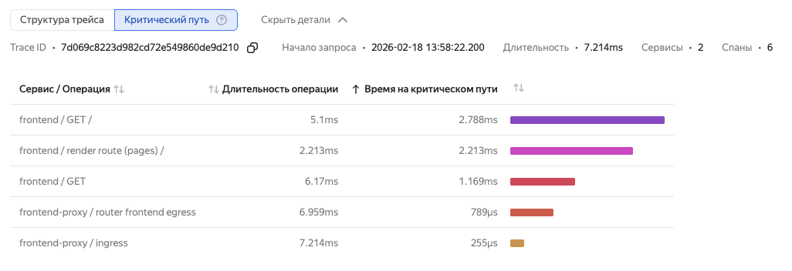

# Анализ критического пути

В распределенной системе обработка запроса выполняется через цепочку операций (спанов) в различных сервисах. Трейсинг визуализирует этот путь в виде графа, где каждая операция вносит вклад в общее время выполнения.

Критический путь — это последовательность спанов, которая определяет общее время выполнения запроса. Оптимизация операций на критическом пути позволяет сократить общее время ответа системы.

Для корректного вычисления критического пути структура трейса должна соответствовать следующим условиям:
* Родительский спан запускает дочерние спаны.
* Родительский спан ожидает завершения всех дочерних спанов.

Если эти условия нарушаются, например, при асинхронных вызовах, критический путь может быть определен некорректно.

На диаграмме Ганта сегменты критического пути подсвечиваются черным цветом. При наведении на спан отображается его длительность и суммарное время на критическом пути.

## Алгоритм вычисления {#critical-path-algorithm}

Алгоритм находит критический путь, обходя дерево спанов от корня. На каждом уровне он выбирает дочерний спан с самым поздним временем завершения (Last Finishing Child, LFC), так как именно он последним завершает свою работу. Этот спан считается частью критического пути. Затем алгоритм рекурсивно применяется к найденному LFC и ищет следующий дочерний спан, который завершился раньше, чем начался предыдущий LFC, но при этом является самым поздним среди оставшихся.

## Ограничения {#critical-path-limitations}

Критический путь вычисляется только для трейсов с одним корневым спаном. Если у трейса нет корневого спана или их несколько, вычисление не производится.

## Посмотреть критический путь {#critical-path-view}

1. Перейдите в [{{ monium-name }}]({{ link-monium }}) → **{{ ui-key.yacloud_monitoring.aside-navigation.menu-item.traces.title }}**.
1. Введите запрос и выберите трейс.
1. Вверху нажмите **{{ ui-key.yacloud_monitoring.traces.trace-tabs.crit-path }}**.

