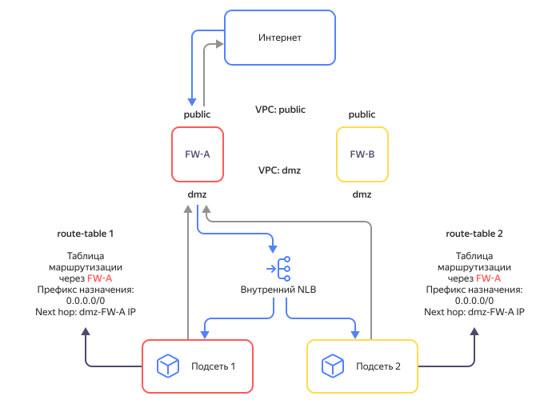

# Особенности внутреннего балансировщика

Внутренний сетевой балансировщик использует маршруты всех подсетей в выбранной сети {{ vpc-name }}. К ним относятся динамические маршруты из [{{ interconnect-name }}](../../interconnect/) и [статические маршруты](../../vpc/concepts/static-routes.md) из таблиц маршрутизации. 

Если у маршрутов одинаковые префиксы назначения, но отличаются [next hop](https://en.wikipedia.org/wiki/Hop_(networking)#Next_hop) адреса, то для исходящего трафика от целевых ресурсов будет выполняться балансировка по next hop адресам. Учитывайте эту особенность, когда к балансировщику проходит трафик через сетевые виртуальные машины (например, межсетевые экраны), которые отслеживают его входящие и исходящие потоки. 

Если трафик к балансировщику не проходил через сетевую ВМ, она может отбросить ответный трафик от целевых ресурсов. Чтобы этого не произошло, настройте маршрутизацию в зависимости от вашего случая:

* [таблицы маршрутизации имеют статические маршруты с одинаковыми префиксами](#same-prefixes);
* [на сетевых ВМ настроен Source NAT](#source-nat);
* [таблицы маршрутизации имеют статические маршруты с одинаковыми префиксами и разными next hop адресами сетевых ВМ](#divergent-next-hop).

### Таблицы маршрутизации имеют статические маршруты с одинаковыми префиксами {#same-prefixes}

У маршрутов должен быть next hop адрес одной из сетевых ВМ. Сетевые ВМ работают в режиме `Active/Standby`. Для обеспечения отказоустойчивости исходящего трафика настройте переадресацию трафика, например с помощью [route-switcher](https://github.com/yandex-cloud/yc-architect-solution-library/tree/main/yc-route-switcher-v2).

### На сетевых ВМ настроен Source NAT {#source-nat}

На ВМ необходимо настроить трансляцию [Source NAT](https://en.wikipedia.org/wiki/Network_address_translation#SNAT) в адреса сетевых ВМ. Сетевые ВМ работают в режиме `Active/Active`. Для настройки Source NAT обратитесь к документации ПО, развернутого на сетевой ВМ. Посмотрите [пример настройки Source NAT](../../tutorials/routing/high-accessible-dmz.md#setup-static-nat) на Check Point NGFW.

### Таблицы маршрутизации имеют статические маршруты с одинаковыми префиксами и разными next hop адресами сетевых ВМ {#divergent-next-hop}



Данный сценарий не поддерживается. Используйте один из вариантов, описанных выше.



