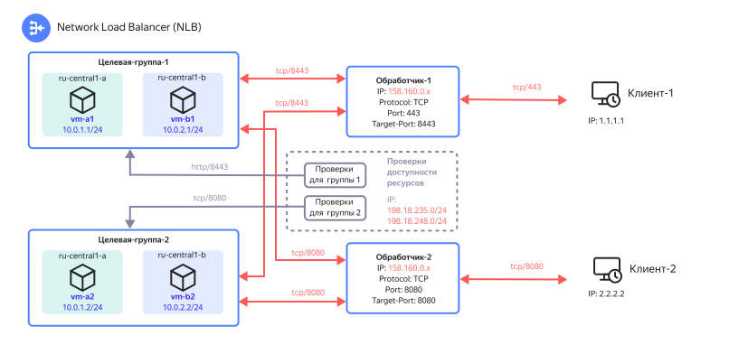
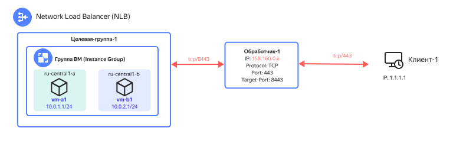
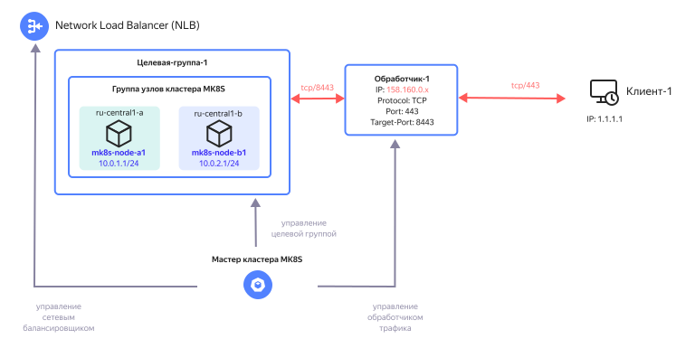

# Сценарии использования сетевого балансировщика

## Виртуальные машины {#nlb-vm}

На рисунке ниже показан пример использования сетевого балансировщика с отдельными [виртуальными машинами](../../compute/concepts/vm.md).

Трафик, поступающий на балансировщик, определенным образом распределяется по виртуальным машинам, которые расположены в целевых группах за ним.

Если на одном балансировщике используется несколько обработчиков трафика, то трафик, приходящий на эти обработчики, будет одновременно распределяться по всем целевым группам, подключенным к этому балансировщику.

Например, трафик, приходящий на «Обработчик-1» будет отправлен к виртуальным машинам в целевых группах 1 и 2. 

Для более гранулярной обработки трафика рекомендуется создавать отдельный сетевой балансировщик для каждого сервиса вместо создания нескольких обработчиков трафика на одном балансировщике.

## Группа виртуальных машин (Instance Group) {#nlb-ig}

На рисунке ниже показан пример использования сетевого балансировщика с [группой виртуальных машин](../../compute/concepts/instance-groups/index.md).

При создании группы виртуальных машин будет создаваться и целевая группа для сетевого балансировщика, в которую будут включены все ВМ из этой группы.

При изменении, добавлении или удалении ВМ из группы эти изменения также будут отражаться и в целевой группе балансировщика.

[Пример](../tutorials/vm-autoscale.md) развертывания группы виртуальных машин с автоматическим масштабированием и интеграцией с сетевым балансировщиком.

## Кластер {{ managed-k8s-name }} {#nlb-mk8s}

На рисунке ниже показан пример использования сетевого балансировщика с сервисом [{{ managed-k8s-name }}](../../managed-kubernetes/concepts/index.md).

Для использования сетевого балансировщика в составе сервисов внутри кластера {{ managed-k8s-name }} необходимо создать сервис с типом `LoadBalancer`. Далее кластер будет самостоятельно создавать объекты сетевого балансировщика в соответствии с предоставленными манифестами и следить за составом целевой группы балансировщика, куда попадут ВМ всех групп узлов этого кластера.

Подробнее о развертывании сервиса с использованием сетевого балансировщика в кластере Kubernetes можно узнать в документе [Обеспечение доступа к приложению, запущенному в кластере Kubernetes](../../managed-kubernetes/operations/create-load-balancer.md).
