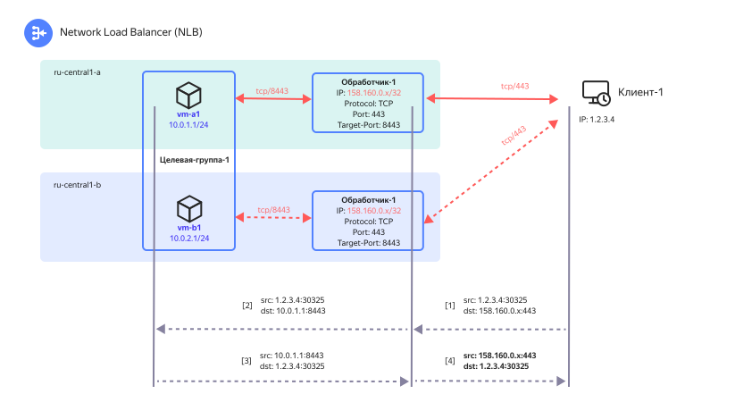
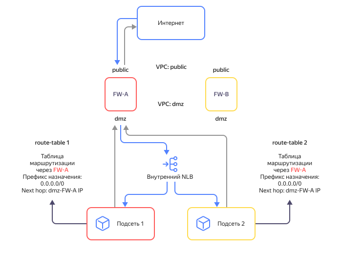
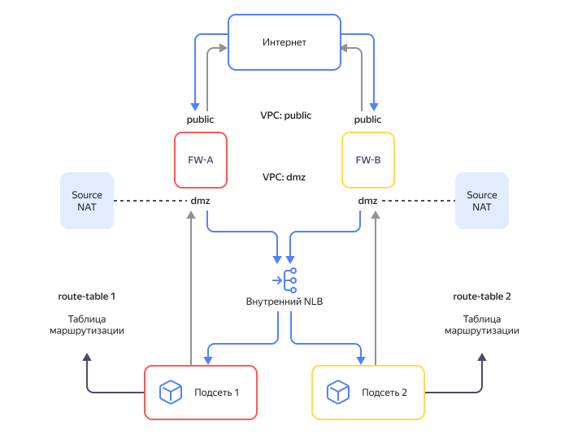
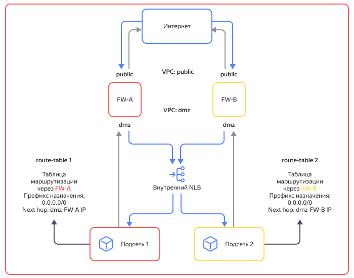

# Особенности реализации

## Обработчик во всех зонах доступности {#nlb-vip}

IP-адрес [обработчика трафика](listener.md) балансировщика анонсируется во внешний мир как префикс `/32` из всех [зон доступности](../../overview/concepts/geo-scope.md) {{ yandex-cloud }}. Если одна из зон доступности выйдет из строя, сетевое оборудование перенаправит входящий трафик на IP-адрес обработчика в другие работающие зоны доступности.

## Потоки трафика {#nlb-flows}

Алгоритм работы внешнего (`EXTERNAL`) балансировщика:

1. Обработчик принимает от граничного маршрутизатора {{ yandex-cloud }} трафик для IP-адреса и порта, на которые он настроен.
1. Обработчик вычисляет `5-tuple` хеш-функцию от параметров принятого IP-пакета, в которую передаются:
    * Протокол передачи информации (TCP или UDP).
    * Публичный IP-адрес отправителя.
    * Порт отправителя (TCP или UDP).
    * Публичный IP-адрес обработчика трафика балансировщика.
    * Порт обработчика трафика балансировщика (TCP или UDP).
1. Обработчик направляет трафик на один из работающих ресурсов в целевой группе на основе результата вычисления хеш-функции.
1. Ресурс в целевой группе обрабатывает полученный трафик и отправляет результат обратно сетевому балансировщику.

Ниже на схеме представлен пример работы внешнего клиентского приложения с веб-сервисом в {{ yandex-cloud }}.

Путь трафика от клиентского приложения к веб-сервису:

1. Трафик от клиентского приложения `1.2.3.4:30325` (номер сокета/порта может быть любой) в виде последовательности IP-пакетов отправляется к балансировщику и обработчик трафика `158.160.0.x:443` получает его.
1. Обработчик вычисляет хеш-функцию с адресацией по принципу `5-tuple` от параметров принятого IP-пакета и направляет трафик к ВМ `vm-a1` в целевой группе. При этом в виртуальной сети сохраняется информация о том, что трафик на обработчик `158.160.0.x:443` был отправлен к ресурсу `10.0.1.1:8443`.
1. ВМ `vm-a1` обрабатывает полученный запрос и отправляет ответ обратно в сторону клиентского приложения, используя свой IP-адрес `10.0.1.1`.
1. Виртуальная сеть уже знает (см. п.2), что ранее трафик от клиентского приложения был принят обработчиком балансировщика и отправлен на обработку к ВМ `vm-a1`. Эта информация даёт возможность виртуальной сети поменять адрес и порт отправителя (сделать [Source NAT](https://ru.wikipedia.org/wiki/NAT)) для всех пакетов от `10.0.1.1:8443` к `158.160.0.x:443`. Далее трафик отправляется к адресу назначения согласно политикам маршрутизации и доходит до клиентского приложения.
1. Трафик отправляется к адресу назначения согласно политикам маршрутизации и доходит до клиентского приложения.



На схеме выше пунктиром показан резервный путь к ВМ `vm-b1`, который выбрал бы обработчик, если проверка доступности для ВМ `vm-a1` была бы неудачной.



## Обработка UDP-трафика {#nlb-udp}

Обработка UDP-трафика для сетевого балансировщика по умолчанию выключена из-за невозможности обеспечить консистентное распределение UDP-пакетов с одинаковой хеш-функцией `5-tuple` на один и тот же ресурс в целевой группе. Однако, сетевой балансировщик может использоваться, например, для обработки трафика протокола DNS, не требующего сохранения состояния соединения.

Чтобы включить обработку UDP-трафика на сетевом балансировщике, обратитесь в [техническую поддержку](../../support/overview.md).

## Локальность при обработке трафика внутренним балансировщиком {#nlb-int-locality}

Если клиент, находящийся внутри {{ vpc-short-name }}, отправляет трафик на внутренний сетевой балансировщик, то обработчик будет распределять этот трафик только по ресурсам в целевых группах, которые находятся в той же зоне доступности, что и клиент. 

Если в зоне доступности, в которой находится клиент, нет работающих целевых ресурсов, трафик будет равномерно распределяться по целевым ресурсам в других зонах. 

## Сходимость маршрутизации в зоне доступности {#nlb-zone-converge}

Если последний целевой ресурс в зоне доступности отключен (или проверка его состояния завершена неудачно), эта зона исключается из маршрутизации трафика через балансировщик. Процесс сходимости протоколов маршрутизации при этом может занимать до 2 минут. В течение этого интервала сходимости трафик, поступающий на данный целевой ресурс, будет отбрасываться.

Если первый целевой ресурс в зоне доступности становится доступен после успешной проверки его состояния, фактический возврат ресурса к обработке трафика произойдет также спустя интервал сходимости, необходимый для анонсирования префикса ресурса из данной зоны доступности.

## Сетевой балансировщик и {{ interconnect-name }} {#nlb-cic}

При использовании внутреннего сетевого балансировщика допускается взаимодействие между IP-адресом обработчика балансировщика и ресурсами на удаленной площадке (On-Prem).

Нельзя использовать ресурсы из On-Prem в составе групп балансировщика, поскольку сетевой балансировщик и ресурсы в целевых группах за ним должны быть в одной сети.

## Маршрутизация трафика через внутренний балансировщик {#nlb-int-routing}

Внутренний сетевой балансировщик использует маршруты всех подсетей в выбранной сети {{ vpc-name }}. К ним относятся динамические маршруты из [{{ interconnect-name }}](../../interconnect/) и [статические маршруты](../../vpc/concepts/static-routes.md) из таблиц маршрутизации VPC.

Если в таблице маршрутизации у нескольких маршрутов будет одинаковый префикс назначения, но разные [next hop](https://en.wikipedia.org/wiki/Hop_(networking)#Next_hop) адреса, то исходящий трафик от целевых ресурсов балансировщика будет распределяться по этим next hop адресам. Учитывайте эту особенность, когда к балансировщику приходит трафик через сетевые ВМ (например, межсетевые экраны), которые могут отслеживать входящие и исходящие потоки трафика и не допускают ассиметрии при его передаче.

Если трафик к балансировщику не проходил через сетевую ВМ, она может отбросить ответный трафик от целевых ресурсов. Чтобы избежать потерь трафика, настройте маршрутизацию в зависимости от вашего случая:

* [таблицы маршрутизации имеют статические маршруты с одинаковыми префиксами](#same-prefixes);
* [на сетевых ВМ настроен Source NAT](#source-nat).

Вариант, в котором [таблицы маршрутизации имеют статические маршруты с одинаковыми префиксами и разными next hop адресами сетевых ВМ](#divergent-next-hop), не поддерживается.

#### Таблицы маршрутизации имеют статические маршруты с одинаковыми префиксами {#same-prefixes}

У маршрутов должен быть next hop адрес одной из сетевых ВМ. Сетевые ВМ работают в режиме `Active/Standby`. Для обеспечения отказоустойчивости исходящего трафика настройте переадресацию трафика, например с помощью [route-switcher](https://github.com/yandex-cloud-examples/yc-route-switcher/tree/main).

#### На сетевых ВМ настроен Source NAT {#source-nat}

На ВМ необходимо настроить трансляцию [Source NAT](https://en.wikipedia.org/wiki/Network_address_translation#SNAT) в адреса сетевых ВМ. Сетевые ВМ работают в режиме `Active/Active`. Для настройки Source NAT обратитесь к документации ПО, развернутого на сетевой ВМ. Посмотрите [пример настройки Source NAT](../../tutorials/routing/high-accessible-dmz.md#setup-static-nat) на Check Point NGFW.

#### Таблицы маршрутизации имеют статические маршруты с одинаковыми префиксами и разными next hop адресами сетевых ВМ {#divergent-next-hop}



Данный сценарий не поддерживается. Используйте один из вариантов, описанных выше.



