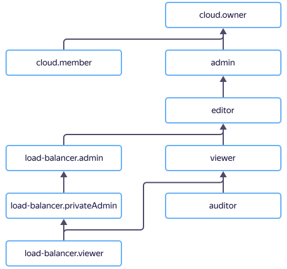

# Управление доступом в {{ network-load-balancer-name }}

В этом разделе вы узнаете:
* [на какие ресурсы можно назначить роль](#resources);
* [какие роли действуют в сервисе](#roles-list);
* [какие роли необходимы](#choosing-roles) для того или иного действия.





## На какие ресурсы можно назначить роль {#resources}



## Какие роли действуют в сервисе {#roles-list}



### Сервисные роли {#service-roles}

#### load-balancer.auditor {#load-balancer-auditor}



#### load-balancer.viewer {#load-balancer-viewer}



#### load-balancer.privateAdmin {#load-balancer-private-admin}



#### load-balancer.admin {#load-balancer-admin}



### Примитивные роли {#primitive-roles}





## Какие роли мне необходимы {#choosing-roles}

В таблице ниже перечислено, какие роли нужны для выполнения указанного действия. Вы всегда можете назначить роль, которая дает более широкие разрешения, нежели указанная. Например, назначить `editor` вместо `viewer`.

Для любых операций с сетевым балансировщиком, имеющим публичный IP-адрес, необходима роль `load-balancer.admin`. В сетях, где расположены целевые группы, допускается иметь вместо нее роль `vpc.publicAdmin`. Для операций над внутренним сетевым балансировщиком необходима роль `load-balancer.privateAdmin`, а для операций над его целевыми группами — `load-balancer.privateAdmin` или `compute.admin`.

Для операций над целевыми группами, расположенных в подсетях, где указанные административные роли отсутствуют, потребуется роль `vpc.user` на эти подсети.

Действие | Методы | Необходимые роли
----- | ----- | -----
**Просмотр информации** | |
Просмотр информации о любом ресурсе | `get`, `list`, `listOperations` | `viewer` на этот ресурс
**Управление сетевыми балансировщиками** | |
[Создание](../operations/load-balancer-create.md) и изменение балансировщиков в каталоге | `create` | `load-balancer.privateAdmin` / `load-balancer.admin` или `editor` на каталог и (в случае публичного балансировщика) сети, в которых расположены целевые группы
[Удаление балансировщиков](../operations/load-balancer-delete.md) | `update`, `delete` | `load-balancer.privateAdmin` / `load-balancer.admin` или `editor` на балансировщик
[Присоединение целевых групп](../operations/target-group-attach.md) | `attachTargetGroup`| `load-balancer.privateAdmin` / `load-balancer.admin` или `editor` на каталог и (в случае публичного балансировщика) сети, в которых расположены целевые группы
[Отсоединение целевых групп](../operations/target-group-detach.md) | `detachTargetGroup` | `load-balancer.privateAdmin` / `load-balancer.admin` или `editor` на балансировщик
[Получение состояний целевых групп](../operations/check-resource-health.md) | `getTargetStates` | `load-balancer.viewer` или `viewer` на балансировщик и на указанные целевые группы
[Добавление](../operations/listener-add.md), [удаление](../operations/listener-remove.md) обработчиков | `addListener`, `removeListener` | `load-balancer.privateAdmin` / `load-balancer.admin` или `editor` на балансировщик
[Остановка и запуск](../operations/load-balancer-start-and-stop.md) балансировщика | `stop`, `start` | `load-balancer.privateAdmin` / `load-balancer.admin` или `editor` на балансировщик
**Управление целевыми группами** | |
[Создание](../operations/target-group-create.md) и изменений целевых групп в каталоге | `create` | `load-balancer.privateAdmin` / `load-balancer.admin` или `editor` на каталог и на подсети, в которых расположены целевые группы
[Удаление целевых групп](../operations/target-group-delete.md) | `update`, `delete` | `load-balancer.privateAdmin` / `load-balancer.admin` или `editor` на целевую группу и балансировщик
Добавление ресурсов в целевой группе | `addTargets` | `load-balancer.privateAdmin` / `load-balancer.admin` или `editor` на целевую группу, балансировщик и на подсети, в которых расположены целевые группы
Удаление ресурсов в целевой группе | `removeTargets` | `load-balancer.privateAdmin` / `load-balancer.admin` или `editor` на целевую группу
**Управление доступом к ресурсам** | |
[Назначение роли](../../iam/operations/roles/grant.md), [отзыв роли](../../iam/operations/roles/revoke.md) и просмотр назначенных ролей на ресурс | `setAccessBindings`, `updateAccessBindings`, `listAccessBindings` | `admin` на этот ресурс

#### Что дальше {what-is-next}

* [Как назначить роль](../../iam/operations/roles/grant.md).
* [Как отозвать роль](../../iam/operations/roles/revoke.md).
* [Подробнее об управлении доступом в {{ yandex-cloud }}](../../iam/concepts/access-control/index.md).
* [Подробнее о наследовании ролей](../../resource-manager/concepts/resources-hierarchy.md#access-rights-inheritance).
