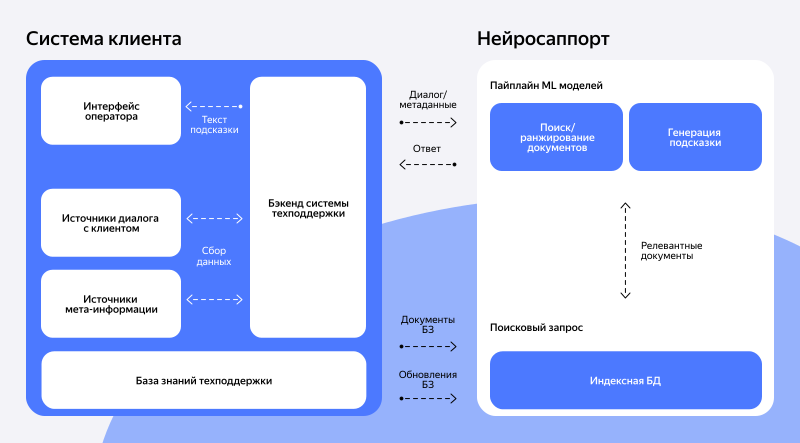

# {{ neurosupport-name }}

## О сервисе {#about}

{{ neurosupport-full-name }} — сервис для подсказок и автоответов на основе базы знаний, специализированный под домен технической поддержки. Выдает рекомендации в реальном времени и естественной языковой манере. Может использоваться для формирования подсказок оператору поддержки, для автоматических ответов клиентам и в качестве внутреннего помощника для сотрудников.

{{ neurosupport-name }} генерирует рекомендацию, как ответить на диалог или запрос, используя:

- текущую реплику клиента или историю диалога с ним;
- метаданные о контексте ситуации;
- релевантные статьи и инструкции из базы знаний.


## Получение доступа {#get-access}

Для получения доступа необходимо быть зарегистрированным в [Облаке](https://yandex.cloud).

Запрос на предоставление доступа подается через [форму](https://yandex.cloud/ru/services/neurosupport) с указанием [ID Облака](../resource-manager/operations/cloud/get-id.md).

Для начала использования требуется:

1. Получить [ID Облака](../resource-manager/operations/cloud/get-id.md).

1. При необходимости cоздать [каталог](../resource-manager/operations/folder/create.md). По умолчанию уже создан каталог с названием `default`.

1. Создать [сервисный аккаунт](../iam/operations/sa/create.md) для выбранного каталога и выдать роли&nbsp;— `editor` и `search-api.webSearch.user` по [инструкции](../iam/operations/sa/assign-role-for-sa.md).

1. Получить токен для запросов в API, для этого:
   
   1. Установить консольную утилиту [yc](../cli/quickstart.md).
   1. Выполнить в консоли команду `yc init`, указав необходимые идентификаторы.
    
1. Получить IAM-токен по [инструкции](../iam/operations/iam-token/create-for-sa.md#via-cli).
    
   
  
   
  
   
    
1. Проверить доступ к API. Адрес: [https://supportgpt.{{ api-host }}](https://supportgpt.{{ api-host }}).

   Пример запроса (с генерацией токена):
   
   ```bash
   IAM_TOKEN=$(yc iam create-token)
   FOLDER_ID="${1:-<ваш folder ID>}"
   curl -H "Authorization: Bearer ${IAM_TOKEN}" -H "x-folder-id: ${FOLDER_ID}" -X GET https://supportgpt.{{ api-host }}/indexer/v1/indexes
   ```

1. Убедиться, что по итогам обработки запроса вам передали параметры для обращения к API:

   - сервис (service);
   - продукт (product);
   - префикс для создания индексов.

При возникновении вопросов добавляйтесь в [общий чат технической поддержки](https://t.me/neurosupport_api).


## Интеграция {#integration}

{{ neurosupport-name }} работает только по API. Логику вызовов API, конкретный состав передаваемых данных, логику использования результата вам требуется определить на своей стороне, в частности:

1. По запросу подсказки:

   - запрашивать всегда или по событию (действию пользователя);
   - по каким диалогам запрашивать;
   - в какой момент запрашивать;
   - какую часть диалога / данных к диалогам передавать;
   - по каким документам разрешать отвечать сервису.

1. По отображению подсказки на своей стороне:

   - где в UI показывать подсказку;
   - показывать только подсказку или в дополнение ссылки на документы, по которым она сгенерировалась;
   - показывать подсказку как рекомендацию, которую можно опционально применить, или сразу вставлять полученный текст в блок ответа (его можно отредактировать перед отправкой).

### Архитектура интеграции {#architecture}

Основные интеграционные потоки:

1. Первичная загрузка базы знаний.
1. Периодическое обновление базы знаний.
1. Передача информации для запроса подсказки (метаданные и диалог), получение ответа.



### Описание структуры API {#api-structure}



Готовый набор запросов к API доступен на [GitHub](https://github.com/yandex/neurosupport-api).





Создание индекса или обновление существующего.

`https://supportgpt.{{ api-host }}/indexer/v1/indexes/{index_name}/documents`

Метод: `POST`.

- `index_name` — Строковое имя индекса (строка, обязательное). Для формирования index_name используйте полученный ранее префикс, значение должно начинаться с него. Подробнее см. раздел [Загрузка базы знаний](#knowledge-base-upload).

Схема запроса (Request Body schema: `application/json`):

- `service` — Строковый идентификатор сервиса (строка, обязательное).
- `product` — Строковый идентификатор продукта (строка, обязательное).
- `meta` — Метаинформация об индексе (опциональное).
- `auto_switch` — Нужно ли сразу переключиться на новый индекс после добавления данных. При установке `false` для переключения есть отдельный запрос. При создании нового индекса, данные старого индекса на какое-то время остаются в базе (логическое значение, опциональное).
- `index_version` — Опциональное поле для указания версии индекса (число, опциональное). В случае отсутствия версия будет определена автоматически. Если указать ранее загруженную версию, на которую еще не было переключения, документы будут добавлены к этой версии. Для добавления документов в активную версию, на которую уже было переключение, используйте флаг `diff`.
- `documents` — Список документов для индексации (обязательное). Обратите внимание, что большие документы при загрузке разбиваются на части меньшего размера. Идентификатор каждой такой части будет `(идентификатор документа)_(номер части)`. Например, объемный документ с `"doc_id": "instructions"` будет загружен частями с идентификаторами `"doc_id": "instructions_0", "instructions_1"` и т.д. (обязательное):
  - `doc_id` — Id документа, длина не более 255 символов (строка, обязательное).
  - `title` — Заголовок документа (строка, обязательное).
  - `text` — Текст документа (строка, обязательное).
  - `meta` — Дополнительные метаданные документа, заносятся в индекс в виде пар key-value в свободном формате (опциональное).


- `diff` — Если `true`, то индекс будет создан на основе существующего, с добавкой переданных документов. При совпадении id документов информация будет заменена (логическое значение, опциональное).

Схема ответа:

- `index_name` — Строковое имя индекса (строка, обязательное).
- `index_version` — Версия индекса, который был обновлен (строка, обязательное).
- `index_parent_version` — Если был выставлен флаг `diff`, то в этом поле будет версия родительского индекса, на основе которого был создан новый индекс (строка, опциональное).

Пример запроса:

```json
{
  "service": "your_service",
  "product": "your_product",
  "meta": {
    "source": "исходный источник данных, зависит от клиента",
    "description": "описание индекса"
  },
  "auto_switch": true,
  "index_version": 1,
  "documents": [
    {
      "doc_id": "doc42",
      "title": "Инструкция по решению такой-то технической проблемы",
      "text": "Чтобы решить такую-то техническую проблему, надо предпринять такие-то действия",
      "meta": {
        "title": "заголовок документа",
        "source_id": "исходный источник документа такой-то",
        "some_another_key": "some_another_value"
      },
      "typed_meta": {
        "params": [
          {
            "name": "entity",
            "param_type": "bool",
            "value": "book"
          }
        ]
      }
    }
  ],
  "diff": false
}
```

Пример ответа:

```json
{
  "index_name": "your_index_name",
  "index_version": 3,
  "index_parent_version": 2
}
```





Получение информации об индексе.

`https://supportgpt.{{ api-host }}/indexer/v1/indexes/{index_name}`

Метод: `GET`.

- `index_name` — Строковое имя индекса (строка, обязательное).

Схема запроса (Query params):

- `service` — Строковый идентификатор сервиса (строка, обязательное).
- `product` — Строковый идентификатор продукта (строка, обязательное).
- `index_version` — Версия индекса. По умолчанию текущая версия индекса, но основе которой делаются генеративные ответы (строка, опциональное).

Схема ответа:

- `index_name` — Строковое имя индекса (строка, обязательное).
- `index_version` — Версия индекса (строка, обязательное).
- `index_parent_version` — Родительская версия индекса (строка, опциональное).
- `doc_count` — Общее количество документов в индексе (число, обязательное).

Пример запроса:

```json
{
  "service": "your_service",
  "product": "your_product",
  "index_version": 3
}
```

Пример ответа:

```json
{
  "index_name": "your_index_name",
  "index_version": 3,
  "index_parent_version": 2,
  "doc_count": 100
}
```





Получение имен и метаданных всех индексов, на которые у пользователя есть права.

`https://supportgpt.{{ api-host }}/indexer/v1/indexes`

Метод: `GET`.

Схема запроса (Query params):

- `service` — Строковый идентификатор сервиса (строка, обязательное).
- `product` — Строковый идентификатор продукта (строка, обязательное).
- `page` — Номер страницы для постраничной загрузки (число, опциональное).
- `size` — Количество записей на странице (число, опциональное).

Схема ответа:

- `indexes` — Список общих данных об индексах, на которые у пользователя есть права (обязательное):
  - `index_id` — Числовой идентификатор индекса (число, обязательное).
  - `name` — Строковое имя индекса (строка, обязательное).
  - `current_version` — Текущая версия индекса, но основе которой делаются генеративные ответы (число, опциональное).
  - `doc_count` — Общее количество документов в индексе (число, опциональное).
- `indexes_count` — Общее количество индексов, удовлетворяющих условиям фильтрации (число, обязательное).
- `pages_count` — Общее количество страниц в пагинации (число, обязательное).

Пример ответа:

```json
{
  "indexes": [
    {
      "index_id": 42,
      "name": "your_index_name",
      "current_version": 3,
      "doc_count": 1000
    }
  ],
  "indexes_count": 0,
  "pages_count": 0
}
```






Получение документов из индекса.

`https://supportgpt.{{ api-host }}/indexer/v1/indexes/{index_name}/documents`

Метод: `GET`.

-	`index_name` — Строковое имя индекса (строка, обязательное).

Схема запроса (Query params):

- `service` — Строковый идентификатор сервиса (строка, обязательное).
- `product` — Строковый идентификатор продукта (строка, обязательное).
- `index_version` — Версия индекса. В случае отсутствия будет использована текущая версия (число, опциональное).
- `after_id` — Для пагинации при сортировке по id документа: вернуть документы, у которых id больше заданного (строка, опциональное).
- `search_query` — Поисковой запрос по прямому вхождению текста (строка, опциональное).
- `document_id` — Получить один документ по заданному id (строка, опциональное).
- `limit` — Максимальное количество документов на запрос. Для получения следующей группы документов можно использовать after_id (число, опциональное).
- `sort_by` — Поле для сортировки (строка, опциональное).
- `sort_order` — Порядок сортировки: `asc` или `desc` (строка, опциональное).

Схема ответа:

- `parameters` — Общие параметры запроса и ответа (обязательное):
  - `items_total` — Общее количество документов в индексе (число, обязательное).
  - `items_returned` — Количество документов, которые были возвращены в этом запросе (число, обязательное).
  - `last_id` — Идентификатор последнего документа, для использования в целях пагинации (строка, опциональное).
  - `after_id` — Параметр из запроса (строка, опциональное).
  - `limit` — Параметр из запроса (число, опциональное).
  - `sort_by` — Параметр из запроса (строка, опциональное).
  - `sort_order` — Параметр из запроса (строка, опциональное).
- `items` — Документы из индекса (обязательное):
  - `doc_id` — Id документа (строка, обязательное).
  - `title` — Заголовок документа (строка, опциональное).
  - `text` — Текст документа (строка, опциональное).
  - `meta` — Дополнительные метаданные документа, заносятся в индекс в виде пар key-value в свободном формате (опциональное).

Пример ответа:

```json
{
  "parameters": {
    "items_total": 100,
    "items_returned": 50,
    "last_id": "doc20",
    "after_id": "doc10",
    "limit": 10,
    "sort_by": "document_id",
    "sort_order": "asc"
  },
  "items": [
    {
      "doc_id": "doc42",
      "title": "Инструкция по решению такой-то технической проблемы",
      "text": "Чтобы решить такую-то техническую проблему, надо предпринять такие-то действия",
      "meta": {
        "title": "заголовок документа",
        "source_id": "исходный источник документа такой-то",
        "some_another_key": "some_another_value"
      }
    }
  ]
}
```






Переключение актуальной версии индекса.

`https://supportgpt.{{ api-host }}/indexer/v1/indexes/{index_name}/switch_version`

Метод: `POST`.

- `index_name` — Строковое имя индекса (строка, обязательное).

Схема запроса (Request Body schema: `application/json`):

- `service` — Строковый идентификатор сервиса (строка, обязательное).
- `product` — Строковый идентификатор продукта (строка, обязательное).
- `index_version` — Версия индекса для переключения (число, обязательное).

Схема ответа:

- `index_name` — Строковое имя индекса (строка, обязательное).
- `index_version` — Версия индекса, на которую было переключение (число, обязательное).

Пример запроса:

```json
{
  "service": "your_service",
  "product": "your_product",
  "index_version": 3
}
```

Пример ответа:

```json
{
  "index_name": "your_index_name",
  "index_version": 3
}
```






Переименование индекса.

`https://supportgpt.{{ api-host }}/indexer/v1/indexes/{index_name}/rename`

Метод: `POST`.

- `index_name` — Строковое имя индекса (строка, обязательное).

Схема запроса (Request Body schema: application/json):

- `service` — Строковый идентификатор сервиса (строка, обязательное).
- `product` — Строковый идентификатор продукта (строка, обязательное).
- `new_index_name` — Новое строковое имя индекса. Новое имя должно начинаться с того же префикса, что и текущее (строка, обязательное).

Схема ответа:

- `index_name` — Строковое имя индекса после переименования (строка, обязательное).

Пример запроса:

```json
{
  "service": "your_service",
  "product": "your_product",
  "new_index_name": "new_index_name"
}
```

Пример ответа:

```json
{
  "index_name": "new_index_name"
}
```






Удаление документов из индекса.

`https://supportgpt.{{ api-host }}/indexer/v1/indexes/{index_name}/documents`

Метод: `DELETE`.

- `index_name` — Строковое имя индекса (строка, обязательное).

Схема запроса (Query params):

- `service` — Строковый идентификатор сервиса (строка, обязательное).
- `product` — Строковый идентификатор продукта (строка, обязательное).
- `docs_ids` — Id документов, которые нужно удалить (обязательное).
- `index_version` — Опционально: версия индекса. В случае отсутствия будет использована текущая версия (число, опциональное).
- `auto_switch` — Нужно ли сразу переключиться на новый индекс после добавления данных. При установке `false` для переключения есть отдельный запрос (логическое значение, опциональное).

Схема ответа:

- `index_name` — Строковое имя индекса (строка, обязательное).
- `index_version` — Версия индекса, который был обновлен (строка, обязательное).
- `index_parent_version` — Если был выставлен флаг `diff`, то в этом поле будет версия родительского индекса, на основе которого был создан новый индекс (строка, опциональное).

Пример ответа:

```json
{
  "index_name": "your_index_name",
  "index_version": 3,
  "index_parent_version": 2
}
```






Удаление индекса и всех его версий.

`https://supportgpt.{{ api-host }}/indexer/v1/indexes/{index_name}/delete`

Метод: `DELETE`.

- `index_name` — Строковое имя индекса (строка, обязательное).

Схема запроса (Query params):

- `service` — строковый идентификатор сервиса (строка, обязательное).
- `product` — строковый идентификатор продукта (строка, обязательное).

Пример запроса:

```json
{
  "service": "your_service",
  "product": "your_product",
}
```

Пример ответа:

Код `200` в случае успешного удаления индекса.






Получение генеративных ответов.

`https://supportgpt.{{ api-host }}/api/v1/answer`

Метод: `POST`.

Схема запроса (Request Body schema: `application/json`):

- `service` — Строковый идентификатор сервиса (строка, обязательное).
- `product` — Строковый идентификатор продукта (строка, обязательное).
- `dialog` — Диалог пользователя и оператора (обязательное):
  - `role` — Тип сообщения (строка, обязательное).
  - `text` — Текст сообщения (строка, обязательное).
  - `id` — Идентификатор сообщения в свободном виде (число, опциональное).
  - `created` — Дата и время создания сообщения в ISO-формате `YYYY-mm-ddTHH:MM:SS` (строка, опциональное).


- `index_name` — Имя индекса, на основании которого нужно сгенерировать ответ. В случае отсутствия будет взято имя по умолчанию, которое зависит от service/product (строка, опциональное).
- `options` — Дополнительные параметры процессинга (опциональное):
  - `filter_settings` — Общие параметры для фильтрации документов (опциональное):
    - `filter_by_meta` — Параметры для фильтрации по метаданным документов (опциональное):
      - `property name` — Массив строк или чисел (опциональное).
    - `document_ids` — Id документов, среди которых будет выполняться поиск. Если список пустой, поиск будет по всем ids (массив строк, опциональное).
- `scoring` — Провести скоринг сгенерированного ответа (логическое значение, опциональное). 
- `candidates_top_k` — Количество чанков, которые передаются в модель. Значение по умолчению 10 (опциональное). 

Схема ответа:

-	`answers` — Список ответов модели (обязательное):
  - `answer` — Текст ответа (строка, обязательное).
  - `meta` — Дополнительные данные по ответу (объект, обязательное):
    - `rag_docs` — Опционально: данные по релевантным документам из индекса (обязательное):
      - `source_id` — Id источника документа в базе клиента (число, опциональное).
    - `answer_annotations` — Аннотации к ответам (обязательное):
      - `label` — Идентификатор аннотации (строка, обязательное).
      - `title` — Заголовок аннотации (строка, обязательное).
      - `type` — Тип аннотации. Сейчас только `source_annotation` (строка, обязательное).
      - `text` — Текст аннотации (строка, обязательное).
      - `answer_position` — Положение аннотации в тексте (объект, обязательное):
        - `begin` — Позиция начала фрагмента текста (число, обязательное).
        - `end` — Позиция конца фрагмента текста (число, обязательное).
      - `url` — Ссылка на источник (строка, опциональное).
    - `source_documents` — Опционально: источники документов, из которых был выбран ответ (обязательное):
      - `source_id` — Id источника документа в базе клиента (строка, обязательное).
      - `title` — Заголовок документа (строка, опциональное).
    - `request_id` — Идентификатор запроса `x-request-id` из хедера (строка, опциональное).
    - `scoring` — Скоринг сгенерированного ответа (число, опциональное).

Пример запроса:

```json
{
  "service": "your_service",
  "product": "your_product",
  "dialog": [
    {
      "role": "operator",
      "text": "Добрый день, чем я могу помочь?"
    },
    {
      "role": "client",
      "text": "Помогите решить такую-то техническую проблему"
    }
  ],
  "index_name": "your_index_name",
  "scoring": true
}
```

Пример ответа:

```json
{
  "answers": [
    {
      "answer": "Чтобы решить техническую проблему по вашему вопросу, надо выполнить такие-то действия",
      "meta": {
        "rag_docs": [
          {
            "source_id": 42
          },
          {
            "source_id": 43
          }
        ],
        "answer_annotations": [
          {
            "label": "1",
            "title": "Например, имя документа",
            "type": "source_annotation",
            "text": "Фрагмент из инструкции, как сделать что-то",
            "answer_position": {
              "begin": 42,
              "end": 78
            },
            "url": "https://example.com"
          }
        ],
        "source_documents": [
          {
            "source_id": "12345daaeaee11efb64d2e8712812345_0",
            "title": "Название документа"
          }
        ],
        "request_id": "string",
        "scoring": 4
      }
    }
  ]
}
```



### Рекомендации по использованию API {#api-recommendations}

При использовании {{ neurosupport-name }} есть 2 ключевых шага:

1. загрузка базы знаний;
1. запрос генеративного ответа.

#### Загрузка базы знаний {#knowledge-base-upload}

Перед выгрузкой базы знаний проверьте ее на соответствие пункту [Рекомендации по формату базы знаний](#base-rcmnd). Соблюдение этих рекомендаций может существенно повысить качество получаемых генеративных ответов.

1. Для первичной загрузки документов базы знаний используйте метод `Documents Post`. Для формирования `index_name` используйте полученный ранее префикс, значение должно начинаться с него. Например, для префикса `10_company_` название индекса может быть:

   - `10_company_archive`
   - `10_company_1`
   - `10_company_answers_and_recommendations`
   
   
   
   ```json
   {
     "service": "your_service",
     "product": "your_product",
     "meta": {
       "source": "исходный источник данных, зависит от клиента",
       "description": "описание индекса"
     },
     "documents": [
       {
         "doc_id": "doc42",
         "title": "Инструкция по решению такой-то технической проблемы",
         "text": "Чтобы решить такую-то техническую проблему, надо предпринять такие-то действия",
         "meta": {
           "title": "заголовок документа",
           "source_id": "исходный источник документа такой-то",
           "some_another_key": "some_another_value"
         }
       }
     ]
   }
   ```
   
   

1. В дальнейшем данный `index_name` потребуется использовать для получения генеративных ответов. Можно использовать разные индексы для разных баз знаний, если при формировании ответа информация из них не должна пересекаться. Например, в разные индексы можно загрузить базы знаний для внутренней и для внешней поддержки или отдельно базу знаний для автоответов и отдельно — для подсказок оператору.

1. Для обновления базы знаний также используется метод `Documents Post`.

1. Проверить результат загрузки можно с помощью метода `Get Index Documents`, а список доступных индексов — с помощью метода `Get Indexes List`. Удалить документы можно с помощью метода `Delete Index Documents`, а индекс целиком с помощью метода `Delete Index`. Как работать с разными версиями индекса описано в разделе [Работа с версиями индексов](#working-index-versions).

1. Обратите внимание, что большие документы при загрузке разбиваются на части меньшего размера. Идентификатор каждой такой части будет `(идентификатор документа)_(номер части)`. Например, объемный документ с `"doc_id": "instructions"` будет загружен частями с идентификаторами `"doc_id": "instructions_0"`, `"instructions_1"` и т.д.

При вызове метода `Documents Post` рекомендуется заранее заполнять метаинформацию об индексе для дальнейшего упрощения процессов администрирования системы. Раздел метаинформации об индексе содержит следующие поля:

- `source` — Исходный источник данных, зависит от клиента. Можно указать основной источник данных, на базе которого собирался индекс.
- `description` — Описание, какие данные содержит индекс.

##### Работа с версиями индексов {#working-index-versions}

В {{ neurosupport-name }} реализовано версионирование индексов документов. Каждое изменение в индексе сохраняется в новую версию, между которыми при необходимости можно переключаться.

- **Получить информацию** о текущей версии индекса можно с помощью метода `Get Index Info`.
- Для **переключения версии**, на основе которой генерируются ответы, используйте метод `Switch Index Version`.
- Для **получения и загрузки документов** в конкретную версию нужно явно указывать параметр `index_version`.
- Обратите внимание, что при **удалении документов** нужно самостоятельно переключить версию или использовать параметр `auto_switch`.
- При обычной **загрузке документов** с помощью метода `Documents Post` новая версия индекса будет содержать только загруженные документы, родительская версия индекса для нее отсутствует (`index_parent_version` будет `null`). При дозагрузке документов на основе существующей версии с указанием параметра `diff` новая версия будет содержать и документы из родительской версии, и новые загруженные документы (уже имеющиеся документы в новой версии будут актуализированы). В таком случае будет указана родительская версия индекса.

Например:

1. Создадим индекс `10_company_archive`, для этого загрузим документы с помощью метода `Documents Post` . `diff` не указываем, т.к. создается новая версия индекса).
   - Версия индекса: `1`.
   - Родительская версия: `null`.
   - Версия для генерации ответов: `1`.

1. Дозагрузим новые документы к уже имеющимся в индексе `10_company_archive`. Метод `Documents Post`, `diff` равен `True`, т.к. документы загружаются к уже имеющимся.
   - Версия индекса: `2`.
   - Родительская версия: `1`.
   - Версия для генерации ответов: `2`.

1. Вернемся к предыдущей версии со старым набором документов для генерации ответов. Метод `Switch Index Version`, `index_version` равен `1`.
   - Версия индекса: `1`.
   - Родительская версия: `null`.
   - Версия для генерации ответов: `1`.

1. Удалим часть документов из версии за ненадобностью. Метод `Delete Index Documents`, явно указываем параметры `index_version` равным `1` и `auto_switch` равным `True` для переключения на новую версию индекса после удаления документов.
   - Версия индекса: `3`.
   - Родительская версия: `1`.
   - Версия для генерации ответов: `3`.

1. Для генерации ответов можно использовать любую из версий, переключившись на нее с помощью метода `Switch Index Version`, указав `index_version`.


#### Запрос генеративного ответа {#request-generative-response}

После успешной загрузки документов можно переходить к этапу получения генеративных ответов.



Передавайте реплики в правильном порядке по возрастанию времени и даты (вначале самая "старая" реплика, в конце — самая новая), при этом завершающей должна быть реплика клиента, на которую нужно сформировать ответ.



Для этого используется метод `Answer Public`. В запросе указываются ранее полученные параметры `service` и `product`, а также `index_name`, который загружали на этапе загрузки базы знаний.



```json
{
  "service": "your_service",
  "product": "your_product",
  "dialog": [
    {
      "role": "operator",
      "text": "Добрый день, чем я могу помочь?"
    },
    {
      "role": "client",
      "text": "Помогите решить такую-то техническую проблему"
    }
  ],
  "meta_features": {
    "user_name": "...",
    "user_created_date": "..."
  },
  "index_name": "your_index_name",
  "options": {
    "filter_settings": {
      "filter_by_meta": {
        "doc_meta_key1": [
          "doc_meta_value1",
          "doc_meta_value2"
        ],
        "doc_meta_key2": [
          "doc_meta_value3",
          "doc_meta_value4"
        ]
      },
      "document_ids": [
        "doc1",
        "doc45",
        "doc99"
      ]
    }
  }
}
```



##### Роли {#roles}

В запросе в поле `dialog`&nbsp;→ `role` рекомендуется использовать значения:

- `client` — реплика или запрос клиента (того, кто обращается в техническую поддержку);

- `operator` — ответ оператора (если требуется ответить на диалог, уже содержащий ответы оператора);

- `bot` (также можно `robot`) — автоматические вопросы и ответы, которые дает чат-бот, например при определения тематики обращения или генерации каких-то стандартных ответов или сообщений (если требуется ответить на диалог, уже содержащий ответы робота).

##### Метаданные {#metadata}

Метаданные&nbsp;— это любая дополнительная информация, относящаяся к конкретному диалогу (и специфичная по отношению к данному диалогу). Метаданные необходимы для генерации корректного ответа.

Для передачи метаданных используется блок `meta_features`. В него рекомендуется передавать полностью русифицированный текст в виде списка «ключ: значение»:

```text
<Название_поля_на_русском_языке_1>: <значение поля (если текст, то на русском)>
<Название_поля_на_русском_языке_2>: <значение поля (если текст, то на русском)>
…
<Название_поля_на_русском_языке_N>: <значение поля (если текст, то на русском)>
```



```text
Номер заказа: 123
Регион: Москва
Метод оплаты: Наличные
```



Состав метаданных определяется исходя из потенциальной пользы для ответа на вопрос (и наличия этих данных на момент генерации ответа). Очень желательно не передавать в метаданных значений, которые никогда не будут использованы в ответах. Допустимо передавать общий список метаданных в каждом запросе, хотя в определенных тематиках/ситуациях потребуется использовать только часть. Не рекомендуется составлять список длиннее 3000 символов.

Если решаемая задача не подразумевает использование метаданных, рекомендуется оставлять это поле пустым.


#### Настройки API {#api-settings}

##### Формирование промта {#transfer-custom-promt}

Чтобы передать в сервис свой шаблон промта в теле запроса, используйте блок `meta_features` с предзаданным ключом `custom_prompt_template`.

Внутри шаблона допускаются 4 плейсхолдера (другие значения не поддерживаются):
- `{dialog_str}` — обязательный;
- `{prompt_header}` — опциональный;
- `{meta_str}` — опциональный;
- `{knowledge_str}` — опциональный.

Если эти плейсхолдеры будут найдены в `custom_prompt_template`, то они будут заменены на другие значения на стороне сервиса.

Предусмотрены следующие замены:

- `{dialog_str}` — заменяется на переработанный для модели диалог, который обязателен для передачи в запросе и приходит в блоке `dialog`;

- `{meta_str}` — заменяется на переработанную мета-информацию о запросе, которая передается в блоке `meta_feature`. Если в запросе никакие метаданные не переданы (а значит, в модель ничего передавать не нужно), то этот плейсхолдер можно убрать из `custom_prompt_template`;

- `{knowledge_str}` — заменяется на тексты наиболее релевантных запросу документов, найденных на стороне сервиса. Если не требуется, чтобы сервис вставлял в промт тексты релевантных документов, по которым нужно формировать ответ (то есть ответ формируется только на основании диалога), то можно убрать этот плейсхолдер из `custom_prompt_template`;

- `{prompt_header}` — заменяется на заголовок системного промта, который по дефолту задан на стороне сервиса. Если пользователю нужно передать в модель другие инструкции в качестве системного промта, можно отправить ее вместо этого плейсхолдера.


Примеры данных, которые можно передать в качестве `custom_prompt_template`:

- ```"{prompt_header}\n\n### Метаинформация: \n{meta_str}\n\n### Тексты:\n{knowledge_str}\n\n### Диалог:\n{dialog_str}"``` — шаблон промта с максимальной заменой на стороне сервиса, к которому будет присоединен универсальный заголовок промта из ссылки выше, метаинформацию запроса, тексты релевантных документов и непосредственно диалог.

- ```"Помоги пользователю решить техническую проблему \n\n### Метаинформация: \n{meta_str}\n\n ### Тексты:\n{knowledge_str}\n\n ### Диалог:\n{dialog_str}"``` — промт, который отдает в модель кастомный заголовок вместо универсального заголовка от сервиса.

- ```"Помоги пользователю решить техническую проблему \n\n### Метаинформация: \n{meta_str}\n\n ### Диалог:\n{dialog_str}"``` — промт, который отдает в модель кастомный заголовок вместо универсального заголовка от сервиса, при этом найденные тексты документов не будут использоваться.

- ```"Помоги пользователю решить техническую проблему \n\n### Диалог:\n{dialog_str}"``` — промт, который отдает в модель кастомный заголовок вместо универсального заголовка от сервиса, при этом найденные тексты документов не будут использоваться, а также в промт не войдут метаданные запроса (даже если они будут переданы).

В `{prompt_header}` уже прописан алгоритм взаимодействия с базой знаний по умолчанию, поэтому если база знаний не соответствует стандартному формату или требует сложных взаимодействий, лучше использовать свой шаблон. Вот несколько простых правил, которые могут вам помочь:

- Пропишите роль и задачу модели.
- Сформулируйте четкий алгоритм взаимодействия с Базой Знаний.
    Пример:
    - Шаг 1: Определи проблему пользователя.
    - Шаг 2: Найди в базе знаний релевантную ответу информацию.
    - Шаг 3: Сформируй ответ на проблему пользователя в соответствии с найденной информацией.
- Укажите четкие требования к ответу (редакционная политика): напишите, как модель может, а как не может отвечать, какие есть правила и ограничения для ответов.
- Сформулируйте правила общения для модели в крайних случаях:
    - Закрывающие сообщения для случаев, когда все проблемы пользователя уже решены, и надо попрощаться с пользователем.
    - Уточняющие сообщения для случаев, когда пользователь нечетко сформулировал запрос, и нужно попросить его конкретизировать.
    - Отказы от ответа для ситуаций, в которых вы не хотите, чтобы модель отвечала автоматически (также допускается и в Базе Знаний).
- Допишите важную информацию, которую модели необходимо знать для ответа на запрос пользователя, и которая универсальна для всех запросов
    Примеры:
    - Словарь общих понятий, специфичных для вашего домена.
    - Общая справочная информация



   ```markdown
   Ты лучший оператор технической поддержки <Название вашей компании или сервиса>. Твоя задача - давать ответы на запросы пользователя в чате поддержки
   
   Чтобы ответить пользователю, выполни следующую последовательность действий:
   - Шаг 1: Определи проблему пользователя
   - Шаг 2: Найди в базе знаний релевантную ответу информацию
   - Шаг 3: Сформируй ответ на проблему пользователя в соответствии с найденной информацией
   
   ## Редакционная политика
   Отвечай пользователю на том же языке, на котором задан вопрос.
   Будь вежлив и выражай готовность помочь.
   Никогда не используй технические подробности.
   
   ## Правила общения
   ### Уточнения
   Если проблема пользователя не ясна, то вместо ответа используй один из следующих шаблонов:
   * Шаблон (Пользователь написал непонятный набор слов)
   Я вас не очень понимаю. Пожалуйста, уточните, что Вы имели в виду?
   
   ### Завершение диалога
   Если все проблемы пользователя были решены и новые он еще не озвучил, то вежливо попрощайся и вырази готовность помочь в дальнейшем
   
   ### Отказ от ответа
   Если пользователь хамит и не идет на контакт, ответь "Я не могу с этим помочь."
   
   ## Контекст
   ### Словарь понятий
   * Пользователь – это ваш собеседник, с которым ты ведешь диалог.
   * Сервис – это название нашего сервиса. Если пользователь его упоминает, то он имеет в виду нас
   
   ### Общая справочная информация
   Ссылка на личный кабинет: https://lk.servis-nash-servis.com
   Коды регионов:
      - Москва: 77
      - Санкт-Петербург: 78

   ## Метаинформация
   {meta_str}
   
   ## База знаний
   {knowledge_str}
   
   ## История диалога с пользователем
   {dialog_str}
   ```



Перед составлением собственного промта можете ознакомиться с нашими общими рекомендациями по работе с LLM и промтами:

- [Рекомендации по использованию {{ yagpt-name }}](../foundation-models/gpt-prompting-guide/popular-problems-solving.md)
- [Параметры LLM](../foundation-models/gpt-prompting-guide/introduction/llm-settings.md)
- [Основы работы с промтами](../foundation-models/gpt-prompting-guide/introduction/basics.md)
- [Элементы промта](../foundation-models/gpt-prompting-guide/introduction/elements.md)
- [Общие советы для создания промтов](../foundation-models/gpt-prompting-guide/introduction/general-tips.md)
- [Примеры промтов](../foundation-models/gpt-prompting-guide/introduction/examples.md)


##### Скоринг {#api-scoring}

Скоринг (автоматическая система оценки качества ответа) выдает вещественное число в промежутке от 1 до 5. Оценка относительная и зависит от конкретной базы знаний и бизнес-кейса — в одной ситуации для конкретной базы знаний хороший ответ могут означать оценки выше 4, но для другой ситуации и другой базы знаний хорошими будут считаться ответы с оценкой выше 3.
На пороговое значение может повлиять сложность сценария ответа и базы знаний. Рекомендуется предварительно подобрать на тестовых примерах пороговое значение оценки, с которой можно пропускать автоответы.



Включенный скоринг может увеличить время формирования ответа. По умолчанию скоринг отключен.



##### Количество чанков документов, которые передаются в модель {#number-document-chunks-model}

Для управления количеством чанков, которые передаются в модель, используется параметр `candidates_top_k`. По умолчанию значение равно 10.



```json
{
  "service": "your_service",
  "product": "your_product",
  "dialog": [
    {
      "role": "operator",
      "text": "Добрый день, чем я могу помочь?"
    },
    {
      "role": "client",
      "text": "Помогите решить такую-то техническую проблему"
    }
  ],
  "index_name": "your_index_name"
  "candidates_top_k": 3,
  "meta_features": {
  "custom_prompt_template": "{prompt_header}\n\n### Метаинформация: \n{meta_str}\n\n### Тексты:\n{knowledge_str}\n\n### Диалог:\n{dialog_str}"
  }
}
```


#### Ограничения API {#api-limitations}

- в тестовом периоде: 10 запросов в минуту;
- количество загружаемых индексов: не более 5;
- в каждом индексе не более 1000 документов, объем одного документа не более 50&nbsp;000 символов.


## Рекомендации по улучшению качества ответов {#improving-response}

Качество ответов существенно зависит от качества входных данных:

- базы знаний (ее структура, релевантность и актуальность);
- метаданных (достаточность для формирования генеративных ответов и доступность этих данных когда требуется сгенерировать ответ).

Часто на качество ответов может повлиять и длина диалога — если предыдущий диалог очень длинный, то вероятнее всего пользователь озвучил и уже получил ответ на несколько своих вопросов. Нередко качество ответа можно повысить, оставив в запросе только N последних реплик диалога (но здесь нет универсальных рекомендаций для значения N, это зависит от конкретного бизнес-сценария использования).

### Рекомендации по структуре базы знаний {#base-forman}

Мы рекомендуем использовать следующий формат для базы знаний:

 

   ```markdown
   ## <Заголовок раздела/общая тематика, объединяющая несколько тем>
   ### <Более конкретная тема обращения специфичная для этой страницы>
   Ключевые слова: <слово1>, <слово2>, ...
   Контекст
   Словарь специфичных для страницы понятий:
   * <Понятие 1> - это <текст>
   * <Понятие 2> - это <текст>
   ...
   
   Важная информация: <текст>
   Связанные заголовки: <Заголовок 1>, <Заголовок 2>, ...
   
   -- Повторяющийся блок для описания ситуаций
   #### Ситуация: <описание конкретной ситуации>
   Примеры обращений:
   - <обращение 1>
   - <обращение 2>
   ...
   
   Решение:
   * Шаг 1: <Действие 1>
   * Шаг 2: <Действие 2>
   ...
   * Шаг n: Выведи <текст>
   -- Конец повторяющегося блока
   ```




Для горизонтальной прокрутки примеров используйте полосу прокрутки внизу блока или сочетание **Shift** + вращение колеса мыши.



   

   ```markdown
   # Решение проблем с подключением
   
   **Ключевые слова:** не работает, подключение, ошибка сети, интернет, сбой соединения
   
   Контекст
   Важная информация:
   При обращении в техническую поддержку рекомендуйте подготовить следующую информацию:
   
   - ФИО пользователя и адрес подключения.
   - Название интернет-провайдера.
   - Модель и марку роутера или модема.
   - Тип подключения (кабельное, беспроводное, мобильное).
   - Подробности проблемы: отсутствие доступа к сети, низкая скорость, периодические разрывы соединения, ошибки при подключении и т. д.
   - Время начала возникновения неисправности.
   - Какие действия уже предпринимались для устранения проблемы.
   
   Также уточните, наблюдается ли проблема на всех устройствах или только на одном. Это поможет оперативно определить источник сбоя. В случае аппаратной неисправности или нарушения на стороне провайдера может быть организован визит специалиста.
   
   #### Ситуация: у пользователя возникли проблемы с подключением к интернету (через кабель или Wi-Fi)
   Примеры обращений:
   - Почему компьютер/телефон не подключается к интернету?
   - Что делать при ошибке соединения?
   - Как устранить сбой сети?
   - Почему не работает Wi-Fi?
   - Почему интернет работает медленно или нестабильно?
   
   Решение:
   Последовательно пройдите по набору шагов. Если шаг уже был выполнен, переходите к следующему, не выполняя инструкции этого шага.
   Если в тексте шага написано "Завершите выполнение алгоритма.", значит после выполнения этого шага надо закончить выполнение алгоритма. Если все шаги уже были выполнены ранее, а проблема все еще не решена, ответьте следующей фразой без кавычек "Я не могу с этим помочь." и завершите выполнение алгоритма.
   
   * Шаг 1. Предложите пользователю **перезагрузить оборудование.**
   Текст: "Полностью выключите и обесточьте роутер/модем на 30 секунд, затем включите снова. Это помогает устранить временные сбои в работе устройства."
   Завершите выполнение алгоритма.
   
   * Шаг 2. Предложите пользователю **проверить физическое подключение.**
   Текст: "- Убедитесь, что все сетевые кабели (Ethernet, оптика или телефонная линия) подключены надежно и без повреждений.
   - Проверьте, что индикаторы на роутере активны (обычно мигают лампочки Power, Internet, WLAN)."
   Завершите выполнение алгоритма.
   
   * Шаг 3. Предложите пользователю **проверить состояние сети на устройстве.**
   Текст: "- На Windows: в панели задач нажмите значок сети → **Диагностика неполадок сети**.
   - На macOS: откройте меню Wi-Fi → **Диагностика беспроводной сети**.
   - На смартфоне: отключите и заново включите Wi-Fi или мобильную сеть."
   Завершите выполнение алгоритма.
   
   * Шаг 4. Предложите пользователю **проверить правильность подключения к Wi-Fi.**
   Текст:"- Убедитесь, что выбран верный Wi-Fi и введен корректный пароль.
   - При необходимости «забудьте» сеть и подключитесь заново."
   Завершите выполнение алгоритма.
   
   * Шаг 5. Предложите пользователю **обновить драйверы сетевого адаптера (для ПК).**
   Текст: "- На Windows: **Пуск** → **Диспетчер устройств** → **Сетевые адаптеры** → **Обновить драйвер**.
   - Проверьте наличие обновлений системы: **Параметры** → **Центр обновления Windows**."
   Завершите выполнение алгоритма.
   
   * Шаг 6. Предложите пользователю **Проверить, работает ли интернет на другом устройстве.** Сообщите, что это поможет определить, связана ли проблема с конкретным устройством или с интернет-соединением в целом.
   Завершите выполнение алгоритма.
   
   * Шаг 7. Предложите пользователю **Сбросить сетевые настройки.**
   Текст: "- На Windows: **Параметры** → **Сеть и интернет** → **Состояние** → **Сброс сети**.
   - На Android или iOS: **Настройки** → **Сброс** → **Сбросить настройки сети**."
   Завершите выполнение алгоритма.
   
   * Шаг 8. Зафиксируйте код или текст ошибки (если появилось сообщение: например, `Ошибка DNS`, `Неудачное соединение`,`Отсутствует IP-адрес`)
   
   * Шаг 9. Сообщите пользователю, что необходимо обратиться в техническую поддержку провайдера с подробным описанием проблемы и указанием всех предпринятых шагов.
   ```





   ```markdown
   ### Корректировка платежей
   **Ключевые слова:** оплата, счет, платеж, возврат, списание, транзакция
   
   Контекст
   Важная информация:
   Чтобы ускорить обработку заявки, рекомендуется указать в обращении следующую информацию:
   - ФИО плательщика и контактные данные.
   - Точный способ оплаты (банковская карта, перевод, электронный кошелек и т. д.).
   - Дата и время совершения платежа.
   - Сумма и назначение платежа.
   - Номер транзакции или платежного поручения (если доступен).
   - Приложенный скриншот, фото чека или другого подтверждения.
   
   Также уточните, был ли платеж выполнен из личного кабинета, через сторонний сервис (банковское приложение, терминал и т. п.) или с чужого аккаунта.
   
   Важно:
   - Возврат средств невозможен при отсутствии подтвержденной транзакции.
   - В случае ошибки при вводе реквизитов необходимо проверить, были ли средства зачислены. Если платеж ушел неправильно, потребуется дополнительная проверка.
   - Если оплата не прошла, возможно, банк отклонил операцию. В таком случае рекомендуйте связаться с банком-эмитентом карты.
   
   
   #### Ситуация: у пользователя возникли вопросы, связанные с платежами, действия могут отличаться в зависимости от ситуации
   Примеры обращений:
   - Как отменить ошибочный платеж?
   - Почему списалась некорректная сумма?
   - Как оформить возврат средств?
   - Не пришло подтверждение оплаты — что делать?
   
   Решение
   Последовательно пройдите по набору шагов. Если шаг уже был выполнен, переходите к следующему, не выполняя инструкции этого шага.
   Если в тексте шага написано "Завершите выполнение алгоритма.", значит после выполнения этого шага надо закончить выполнение алгоритма. Если все шаги уже были выполнены ранее, а проблема все еще не решена, ответь следующей фразой без кавычек "Я не могу с этим помочь." и заверши выполнение алгоритма.
   
   * Шаг 1. Предложите пользователю **проверить историю операций.**
   Текст: "Войдите в личный кабинет и ознакомьтесь с деталями последней транзакции. Убедитесь, что операция действительно прошла и отображается корректно."
   Завершите выполнение алгоритма.
   
   * Шаг 2. Сообщите пользователю, что при необходимости срочного реагирования пользователь может позвонить в службу поддержки по телефону: +7 (XXX) XXX-XX-XX
   
   * Шаг 3. Предложите пользователю **сохранить платежные документы.**
   Текст: "Сохраните квитанцию, скриншот платежа, банковскую выписку или СМС-подтверждение. Эти данные могут понадобиться для рассмотрения заявки."
   Завершите выполнение алгоритма.
   
   * Шаг 4. Предложите пользователю **оформить заявку на корректировку.**
   Текст: "Перейдите в раздел **Платежи** или **Финансы** в личном кабинете и заполните форму с описанием ситуации. Укажите дату, сумму и способ оплаты."
   Завершите выполнение алгоритма.
   
   * Шаг 5. Сообщите пользователю, что стандартный срок рассмотрения — от 1 до 3 рабочих дней. Заявка будет рассмотрена специалистами, после чего пользователь получит уведомление о результате.
   ```



### Рекомендации по формату базы знаний {#base-rcmnd}

Информация в API загружается только в текстовом виде, базу знаний необходимо сконвертировать в текст (идеальный формат — классический _Markdown_, но это необязательное условие).




   Markdown — это простой язык разметки, созданный для легкого форматирования текста. Его цель — быть читаемым в исходном виде и легко преобразуемым в HTML.
   
   **Основные виды форматирования Markdown:**
   
   - **Заголовки:**

      ```markdown
      # Заголовок 1
      ## Заголовок 2
      ### Заголовок 3
      ```
   
   - **Выделение текста:**

      ```markdown
      *Курсив* или _Курсив_
      **Жирный** или __Жирный__
      ```
   
   - **Списки:**
   
      Нумерованный:

      ```markdown
      1. Первый пункт
      2. Второй пункт
      ```

      
      
      Пункты списка в разметке можно нумеровать в любом порядке. Markdown расставит правильную нумерацию автоматически.
      
      

      Маркированный:

      ```markdown
      - Пункт
      * Пункт
      + Пункт
      ```
   
   - **Ссылки:**

      ```markdown
      [Текст ссылки](https://example.com)
      ```
      
   - **Цитаты:**

      ```markdown
      > Это цитата
      >> Вложенная цитата
      ```
      
   - **Разделительная линия:**

      ```markdown
      ---
      ```
      
   - **Таблицы:**
      
      Markdown поддерживает простое создание таблиц:

      ```markdown
      | Заголовок 1 | Заголовок 2 |
      |-------------|--------------|
      | Ячейка 1    | Ячейка 2     |
      | Ячейка 3    | Ячейка 4     |
      ```
      
      Можно выравнивать текст в ячейках:

      ```markdown
      | Лево       | Центр       | Право      |
      |:-----------|:-----------:|-----------:|
      | текст      | текст       | текст      |
      | еще текст  | еще текст   | еще текст  |
      ```
      
      Примеры выравнивания:
      
      * `:---` — по левому краю;
      * `:---:` — по центру;
      * `---:` — по правому краю.
      
      Если таблица больше 10 строк, то лучше привести ее к плоской структуре.

      ```markdown
      | Заголовок 1 | Заголовок 2 |
      |-------------|--------------|
      | Ячейка 1    | Ячейка 2     |
      | Ячейка 3    | Ячейка 4     |
      
      Например, так:
      
      Строка 1:

      **Заголовок 1**: Ячейка 1
      **Заголовок 2**: Ячейка 2
      
      Строка 2:

      **Заголовок 1**: Ячейка 3
      **Заголовок 2**: Ячейка 4
      
      ...
      ```



Рекомендации перед конвертацией в текст:

1. Если в документах содержатся ссылки или другие вложенные файлы/документы (и эти данные важны для формирования генеративного ответа), то необходимо выкачать их отдельными документами и обозначить связь с исходным документом, к которому они относятся по смыслу.

1. Необходимо перевести табличные части документов в плоскую структуру (без таблиц внутри таблиц), чтобы таблицы не содержали объединенных ячеек.

1. Смысловое наполнение схем и картинок в базе знаний необходимо продублировать текстовым описанием (если эти изображения важны для формирования корректных ответов).

1. Требуется привести термины в соответствие с метаданными, чтобы в базе знаний использовались аналогичные значения и на том же языке. Например, если в метаданных используется термин `ORDER_STATUS` со значениями `OPEN`, `IN_PROCESS`, `CLOSED`, то такие же значения должны использоваться в базе знаний (а если там используется понятие `Статус заказа` со значениями `Открыт`, `В процессе`, `Закрыт`, то это может быть не учтено при формировании генеративного ответа).

1. Если размер базы знаний значительный, то рекомендуется разделить ее части (размер одной части — не более 50&nbsp;000 символов). Каждая часть должна быть самодостаточна по смысловому наполнению. Идеально, если каждый тип обращений будет представлен отдельным документом.


После конвертации убедитесь, что база знаний приведена в формат, корректный для загрузки:

- У каждого документа есть заголовок / уникальный идентификатор.
- Все документы имеют единую кодировку.
- Удалены технические вставки (например, css и js, которые не имеют значения для решения проблем).
- Удалены url-кодировки, картинки в виде base64.

Также для получения корректных и полных ответов необходимо, чтобы в передаваемых данных содержалась только релевантная и актуальная информация, поэтому перед загрузкой:

1. Провалидируйте статьи базы знаний на актуальность и удалите архивные или неактуальные разделы.

1. Удалите техническую информацию (например, история изменений документа и&nbsp;т.&nbsp;п.), а также любые внутренние инструкции, которые напрямую не используются при генерации ответа.

### Рекомендации к тестированию и оценке качества {#qa-recommendations}

Для тестирования рекомендуется подготовить релевантный набор данных, соответствующий потоку, на котором в дальнейшем планируется использовать сервис. Например, если планируется запускать сервис только для 1-й линии поддержки, то в тестировании должны присутствовать данные только с нее. Либо, если планируется запускать сервис по определенным тематикам, то набор данных должен отражать реальное распределение по тематикам. Это необходимо, чтобы выводы, сделанные на тестовом наборе данных, можно было потом корректно обобщить.

Рекомендуется выбирать ту часть потока обращений, для которой:

- база знаний наиболее полная;
- для формирования ответов достаточно метаданных;
- для помощи пользователю чаще всего не требуется дополнительных действий оператора (звонки, изменения в смежных системах и&nbsp;т.&nbsp;п.).

Для оценки качества ответов рекомендуется применять сравнение side-by-side, то есть сравнивать ответы {{ neurosupport-name }} с ответами оператора, который был дан для аналогичного диалога.

Рекомендации для проведения такого сравнения:

1. Подготовьте диалоги по выбранной части потока (диалог можно случайным образом разрезать так, чтобы последней была реплика клиента, на которую требуется сформировать ответ). Рекомендуется брать не более 300-500 диалогов, потому что дальнейшую разметку результатов потребуется производить вручную. Рядом с диалогом выгрузите доступные метаданные.

1. Выгрузите ответ оператора, который был фактически дан на последнюю реплику клиента. Запросите ответ {{ neurosupport-name }} для аналогичного диалога.

1. Оцените ответ оператора и ответ {{ neurosupport-name }} по шкале 1-5 с критериями из таблицы ниже. Рекомендуется выполнять оценку с перекрытием (когда несколько человек оценивают один и тот же диалог и потом эти оценки усредняются, либо диалоги с большим разбросом оценок не учитываются при сравнении), таким образом можно снизить фактор субъективности при оценках. Как минимум, рекомендуется выборочно перепроверить корректность проставленных оценок.

   #|
   || **Оценка** | **Расшифровка** | **Критерий** ||
   || 5 | Идеально | Ответили на все вопросы и дали отличный безошибочный ответ пользователю. ||
   || 4 | Хорошо | Написанный текст решает вопрос пользователя и по алгоритму является верным, но есть небольшие ошибки в формулировках и/или небольшие расхождения с редакционной политикой. ||
   || 3 | Средне | В целом, написанный текст отвечает на обращение, соответствует базе знаний и приближает к решению задачи, но требует правок (фразы и предложения):
   - Не дописали какую-то значимую информацию.
   - Ответили не на все вопросы пользователя, если их было несколько.
   ||
   || 2 | Плохо | Ответ абсолютно бесполезен и его нельзя было использовать в диалоге. Нужно писать правильный ответ с нуля.
   - Совершенно не соответствует базе знаний.
   - Не соответствует действительности и входным данным (например, решили проблему не по тому обращению или ответили не на тот вопрос).
   - Дезинформирует пользователя.
   ||
   || 1 | Критично | Очень плохой ответ. Может вызвать риски, если пользователь получит такой текст. Критерии:
   - Проникла NDA-информация.
   - Использована неприемлемая лексика.
   - Неразборчивый или непонятный текст.
   ||
   |#

1. Отдельно можно оценить диалоги с точки зрения:

   1. Полноты предоставленной информации (диалога и метаданных) для формирования правильного ответа.

   1. Необходимости выполнять дополнительные действия для обработки обращения, которые может выполнить только человек.

1. Корректно будет сравнивать {{ neurosupport-name }} и оператора только на тех диалогах, где нет какой-то дополнительной информации, доступной оператору (но недоступной для модели) и где не требуется дополнительных действий (т.&nbsp;к. оператор, как правило, отвечает на основании результата данных действий).

1. Сравните долю полученных оценок 3, 4, 5 для оператора и для {{ neurosupport-name }} — это покажет, какую долю потока возможно автоматизировать с помощью сервиса.
