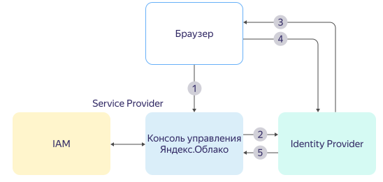

# SAML-совместимые федерации удостоверений

{{ yandex-cloud }} поддерживает идентификацию федераций удостоверений с помощью [SAML 2.0](https://wiki.oasis-open.org/security). Это популярный язык разметки для реализации системы единого входа (Single Sign-On, SSO) — технологии, с помощью которой пользователи могут получать доступ ко множеству приложений без необходимости каждый раз вводить свой логин и пароль. Например, когда вы заходите на сайт и видите кнопку _Войти с помощью Яндекс_, _Google_ или _Facebook_ — все это реализация системы единого входа.

Такой подход получил название _федерация удостоверений_ — когда вся информация о логинах и паролях пользователей хранится у доверенного _поставщика удостоверений_ (Identity Provider, IdP). А поставщик услуг (Service Provider, SP), например {{ yandex-cloud }}, отправляет пользователя проходить аутентификацию на сервере поставщика удостоверений (IdP).

Если в вашей компании есть система управления пользователями и доступом (например, Active Directory или Google Workspace), вы можете использовать ее для авторизации сотрудников в {{ org-full-name }}. Тогда не нужно будет создавать новый аккаунт в Яндексе для каждого сотрудника компании, сотрудники смогут получить доступ к сервисам {{ yandex-cloud }} с помощью своих корпоративных аккаунтов.

## Настройка федераций в {{ org-full-name }} {#federation-usage}

С помощью федераций удостоверений вы можете настроить систему единого входа (Single Sign-On, SSO) и использовать корпоративные аккаунты для авторизации в {{org-name}}. В этом случае ваша корпоративная система управления учетными записями пользователей выступает в роли поставщика удостоверений (IdP — identity provider).

В {{ org-name }} можно создать федерацию удостоверений с любым сервисом управления учетными данными (поставщиком удостоверений), который поддерживает протокол [SAML]({{ link-saml }}).

Информация о логинах и паролях пользователей хранится у поставщика удостоверений. При входе в {{org-name}} система направляет пользователя для аутентификации на сервер поставщика удостоверений (IdP). В случае успешной аутентификации пользователь получает доступ к сервисам {{ yandex-cloud }}.

Так как процесс аутентификации происходит на стороне сервера IdP, то можно настроить более надежную проверку данных пользователя, например двухфакторную аутентификацию или использование USB-токенов.

Вы можете настроить федерацию удостоверений для разных поставщиков удостоверений:

* [Active Directory](operations/federations/integration-adfs.md).
* [Google Workspace](operations/federations/integration-gworkspace.md).
* [Azure Active Directory](operations/federations/integration-azure.md).
* [Keycloak](operations/federations/integration-keycloak.md).
* [Другие SAML-совместимые поставщики удостоверений](operations/federations/integration-common.md).

## Как происходит аутентификация в федерации {#saml-authentication}



Процесс аутентификации показан на диаграмме:

1. Пользователь открывает в браузере ссылку для входа в консоль.

1. Если это первая аутентификация пользователя, то консоль отправляет его на сервер IdP для прохождения аутентификации.

    Если пользователь уже проходил аутентификацию, то информация об этом сохранена в cookie его браузера. Если время жизни cookie не истекло, то консоль управления сразу аутентифицирует пользователя и отправляет на главную страницу. Время жизни cookie указывается при создании федерации.

    Если время жизни cookie истекло, то консоль отправляет пользователя на сервер IdP для повторной аутентификации.

    Вы также можете включить принудительную повторную аутентификацию в настройках федерации. Если опция включена, IdP будет повторно аутентифицировать пользователя по истечении сессии в {{ yandex-cloud }}.

1. Сервер IdP показывает пользователю страницу аутентификации. Например, просит ввести логин и пароль.

1. Пользователь вводит на сервере IdP данные, необходимые для аутентификации.

1. В случае успешной аутентификации сервер IdP отправляет браузер пользователя назад на страницу для входа в консоль управления.

1. Консоль управления спрашивает IAM, добавлен ли такой пользователь в облако. Если да, то консоль управления аутентифицирует пользователя и отправляет на главную страницу.



В федерации удостоверений пользователь взаимодействует и с IdP, и с консолью управления {{ yandex-cloud }}. При этом сетевой доступ между IdP и {{ yandex-cloud }} не требуется.

