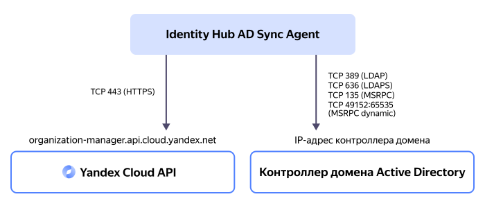

# Синхронизация пользователей и групп с {{ microsoft-idp.ad-full }}



Если для управления пользователями ваша компания использует [{{ microsoft-idp.ad-full }}](https://docs.microsoft.com/ru-ru/windows-server/identity/ad-ds/active-directory-domain-services) и вы хотите организовать для ваших пользователей доступ к {{ yandex-cloud }}, вам не нужно вручную создавать в {{ yandex-cloud }} учетные записи для ваших пользователей. Вместо этого вы можете [синхронизировать](../operations/sync-ad.md) с {{ org-full-name }} пользователей и группы, созданные в вашем каталоге {{ microsoft-idp.ad-short }}.



Синхронизация пользователей и групп выполняется [агентом](#sync-agent) синхронизации {{ ad-sync-agent }}, который может быть запущен на любом сервере под управлением ОС [Linux](https://ru.wikipedia.org/wiki/Linux) или [Windows](https://ru.wikipedia.org/wiki/Windows).

Схема синхронизации:

На сервере, где [запущен](../operations/sync-ad.md) агент синхронизации, должны быть открыты следующие [TCP](https://ru.wikipedia.org/wiki/TCP)-порты для входящего и исходящего трафика:

* Для обращения к API {{ yandex-cloud }}:

    * `443` — для [HTTPS](https://ru.wikipedia.org/wiki/HTTPS);

* Для обращения к контроллеру домена {{ microsoft-idp.ad-short }}:

    

## Объекты синхронизации {#sync-objects}

Агент {{ ad-sync-agent }} синхронизирует с каталогом {{ microsoft-idp.ad-short }} следующие объекты:

* **Пользователи**.
* **Атрибуты пользователей**.

    Таблица сопоставления атрибутов пользователей по умолчанию:

    Атрибут в {{ microsoft-idp.ad-short }} | Атрибут в {{ org-name }}
    --- | ---
    `displayName` | `full_name`
    `givenName` | `given_name`
    `sn` | `family_name`
    `mail` | `email`
    `telephoneNumber` | `phone_number`
    `userPrincipalName` | `username`
    `ObjectGUID` | `external_id`
* **Группы пользователей**.
* **Атрибуты групп пользователей**.

    Таблица сопоставления атрибутов групп пользователей по умолчанию:

    Атрибут в {{ microsoft-idp.ad-short }} | Атрибут в {{ org-name }}
    --- | ---
    `name` | `name`
    `description` | `description`
    `ObjectGUID` | `external_id`
* **Членства пользователей в группах**.
* **[Хэши](https://ru.wikipedia.org/wiki/Хеш-функция) паролей пользователей**.

    Пароли пользователей хранятся в {{ microsoft-idp.ad-short }} не в открытом виде, а в виде хэшей. {{ yandex-cloud }}, получив из каталога {{ microsoft-idp.ad-short }} хэш пароля пользователя, формирует на его основе собственный хэш с использованием современного и устойчивого к взлому алгоритма [Argon2](https://ru.wikipedia.org/wiki/Argon2).

    

    {{ yandex-cloud }} не хранит в своих базах данных пароли пользователей в открытом виде.

    

## Настройка синхронизации {#sync-setup}

Чтобы реализовать синхронизацию пользователей и групп {{ org-name }} с {{ microsoft-idp.ad-short }}, необходимо выполнить предварительные настройки, как на стороне вашего [контроллера домена](https://ru.wikipedia.org/wiki/Контроллер_домена) с развернутыми службами {{ microsoft-idp.ad-short }}, так и на стороне {{ yandex-cloud }}.

## Настройка на стороне контроллера домена {{ microsoft-idp.ad-short }} {#dc-setup}

Для корректной работы [агента](#sync-agent) синхронизации на стороне {{ microsoft-idp.ad-short }} выполните следующие действия:



## Настройка на стороне {{ yandex-cloud }} {#yc-setup}

Для корректной работы [агента](#sync-agent) синхронизации на стороне {{ yandex-cloud }} выполните следующие действия:

* [Создайте](../../iam/operations/sa/create.md) сервисный аккаунт, от имени которого синхронизация будет выполняться на стороне {{ org-name }}.
* [Создайте](../../iam/operations/authentication/manage-authorized-keys.md#create-authorized-key) и сохраните [авторизованный ключ](../../iam/concepts/authorization/key.md) сервисного аккаунта.
* [Назначьте](../../iam/operations/sa/assign-role-for-sa.md#binding-role-organization) сервисному аккаунту следующие [роли](../../iam/concepts/access-control/roles.md) на [организацию](./organization.md), в которой находится нужный пул пользователей:

    

## Агент {{ ad-sync-agent }} {#sync-agent}

Агент синхронизации {{ ad-sync-agent }} выполняет чтение данных о пользователях и группах пользователей в [выбранных](#agent-config) Organization Units (OU) в каталоге {{ microsoft-idp.ad-short }} и синхронизирует их с данными пользователей и групп пользователей в [пуле](./user-pools.md) {{ org-name }}.

На стороне {{ microsoft-idp.ad-short }} агент синхронизации получает данные пользователей и групп от имени пользователя, [созданного](#dc-setup) в домене {{ microsoft-idp.ad-short }}. При получении этих данных используются протоколы [LDAP](https://learn.microsoft.com/en-us/windows/win32/api/_ldap/) и [DRSR](https://learn.microsoft.com/en-us/openspecs/windows_protocols/ms-drsr/), запросы отправляются на адрес контроллера домена {{ microsoft-idp.ad-short }}, заданный в [конфигурации](#agent-config) агента.

На стороне {{ yandex-cloud }} агент синхронизации управляет пользователями и группами пользователей от имени [сервисного аккаунта](../../iam/concepts/users/service-accounts.md) с [назначенными](#yc-setup) разрешениями на выполнение синхронизации. Запросы к {{ yandex-cloud }} направляются на публичный эндпоинт `https://organization-manager.{{ api-host }}` по протоколу [HTTPS](https://ru.wikipedia.org/wiki/HTTPS).

Скрипт установки агента синхронизации доступен для следующих операционных систем:

* [Linux]({{ ad-sync-agent-linuxlink }});
* [Windows]({{ ad-sync-agent-windowslink }}).

### Процесс синхронизации {#sync-process}

В процессе синхронизации данных агент {{ ad-sync-agent }} может создавать, изменять или удалять пользователей и группы пользователей в {{ org-name }}. Синхронизация пользователей и групп {{ org-name }} с пользователями и группами в {{ microsoft-idp.ad-short }} выполняется в два этапа: [первичная синхронизация](#full-sync) и [инкрементальная синхронизация](#incremental-sync).

#### Полная (первичная) синхронизация {#full-sync}

При выполнении полной синхронизации агент считывает данные всех пользователей, групп и их атрибутов в [выбранных](#agent-config) Organization Units в каталоге {{ microsoft-idp.ad-short }} и создает аналогичных пользователей и группы с аналогичными атрибутами в пуле пользователей {{ org-name }}.

Процесс первичной синхронизации для большого количества [объектов](#sync-objects) может занять достаточно длительное время. Если процесс полной синхронизации прервется в результате ошибки, повторный запуск агента продолжит синхронизацию с того места, на котором прервалась предыдущая попытка. Прогресс полной синхронизации агент отслеживает с помощью файлов с токенами процессов в директории с запущенным агентом:

* `main_sync_replication_token.json`
* `password_hash_replication_token.json`
* `user_control_replication_token.json`

После успешного завершения полной синхронизации агент, запущенный в виде сервиса или службы операционной системы, переходит к непрерывному выполнению частичной (инкрементальной) синхронизации.



Вы можете повторно запустить процесс полной синхронизации. Для этого удалите указанные выше файлы с токенами процессов и перезапустите агент.



#### Частичная (инкрементальная) синхронизация {#incremental-sync}

Инкрементальная синхронизация непрерывно выполняется запущенным агентом со следующей периодичностью:

* _Синхронизация паролей и состояний пользователей_ — агент отслеживает статус блокировки/разблокировки пользователей в домене {{ microsoft-idp.ad-short }} и смену пользовательских паролей и переносит эти изменения в {{ org-name }} с интервалом в несколько секунд. Частоту выполнения этого типа синхронизации изменить нельзя.
* _Синхронизация иных значений_ — агент отслеживает прочие изменения свойств, атрибутов и параметров пользователей и групп с интервалом, [установленным](#agent-config) в файле конфигурации агента.

При выполнении синхронизации в пуле пользователей может обнаружиться пользователь или группа пользователей с именами, идентичными именам пользователя или группы, которые требуется синхронизировать. В этом случае агент, в зависимости от [заданных настроек](#agent-config), перезапишет данные из {{ microsoft-idp.ad-short }} в существующего пользователя или группу {{ org-name }} либо выведет сообщение об ошибке.

### Отслеживаемые изменения {#tracked-changes}

В процессе непрерывной синхронизации агент отслеживает следующие изменения в {{ microsoft-idp.ad-short }} и переносит их в {{ org-name }}:

* создание, изменение, блокировка, разблокировка и удаление пользователей;
* создание, изменение и удаление групп пользователей;
* изменение атрибутов пользователей и групп;
* добавление пользователей в группы и исключение их из групп;
* изменение паролей пользователей.

### Логирование процесса синхронизации {#logging}

Агент {{ ad-sync-agent }} регистрирует события, возникающие в процессе синхронизации.

По умолчанию информация о событиях и ошибках выводится в [стандартный поток](https://ru.wikipedia.org/wiki/Стандартные_потоки) `stdout`. Вместо этого в [конфигурации](#agent-config) агента вы можете задать настройки для сохранения логов в файлы.

По умолчанию информация о событиях выводится в простом текстовом формате, но в конфигурации агента формат можно изменить на [JSON](https://ru.wikipedia.org/wiki/JSON).

Кроме того, в конфигурации агента можно задать следующие уровни логирования:



### Конфигурация агента {#agent-config}

Конфигурация агента синхронизации задается в [YAML](https://yaml.org/)-файле в следующем формате:





#### См. также {#see-also}

* [{#T}](../operations/sync-ad.md)