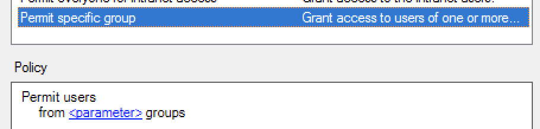
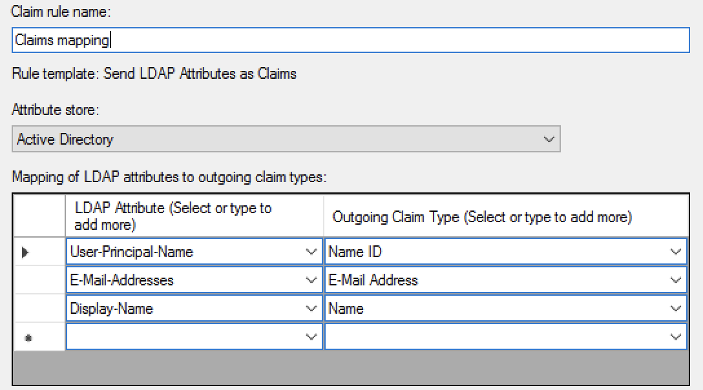
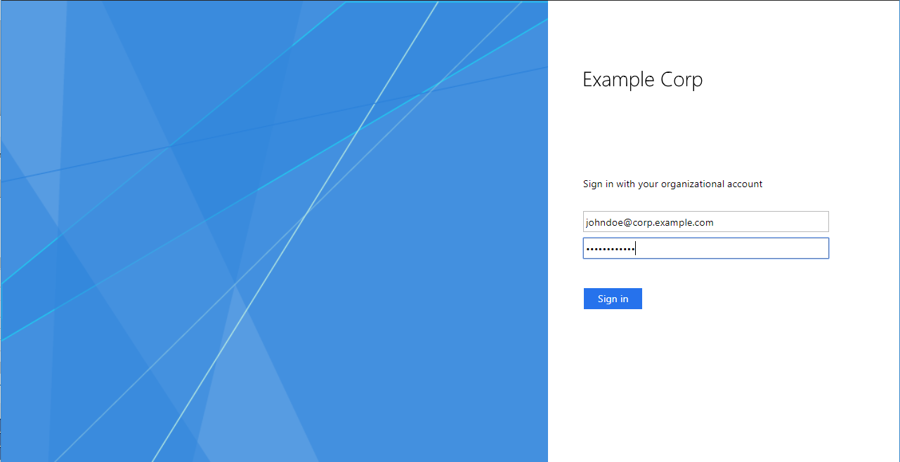

# Аутентификация с помощью Active Directory

С помощью [федерации удостоверений](../../add-federation.md) вы можете использовать [Active Directory Federation Services]({{link-adfs}}) (AD FS) для аутентификации в облаке.

Чтобы настроить аутентификацию:

1. [Создайте федерацию в организации](#create-federation).

1. [Добавьте сертификаты в федерацию](#add-certificate).

1. [Получите ссылку для входа в консоль](#get-link).

1. [Настройте аутентификацию на сервере AD FS](#configure-sso).

1. [Добавьте пользователей в организацию](#add-users).

1. [Протестируйте аутентификацию](#test-auth).

## Перед началом {#before-you-begin}

Чтобы воспользоваться инструкциями в этом разделе, вам понадобятся:

1. Работающая ферма AD FS. Если на вашем сервере еще не настроен AD FS, [установите и настройте его](https://docs.microsoft.com/en-us/windows-server/identity/ad-fs/deployment/deploying-a-federation-server-farm). Для развертывания AD FS вам также необходимо установить и настроить Active Directory Domain Services (AD DS).

    
   
    Если у вас нет машины с ОС Windows, чтобы развернуть сервер AD FS, вы можете [создать виртуальную машину](../../../compute/quickstart/quick-create-windows.md) в {{ yandex-cloud }}.

    

    

    В ферму рекомендуется включать более одного сервера, чтобы обеспечить большую надежность аутентификации.

    

1. Действующий сертификат, который используется для подписи в службе AD FS. Если у вас нет действующего SSL-сертификата, получите новый.

    Имя субъекта в сертификате должно содержать FQDN сервера поставщика удостоверений, например `fs.contoso.com`, чтобы страница аутентификации не могла быть заблокирована браузером.

## Создайте федерацию в организации {#create-federation}



- Консоль управления

  Чтобы создать федерацию:

  1. Перейдите в сервис [{{org-full-name}}]({{link-org-main}}).

  1. На левой панели выберите раздел [Федерации]({{link-org-federations}}) .

  1. Нажмите кнопку **Создать федерацию**.

  1. Задайте имя федерации. Имя должно быть уникальным в каталоге.

  1. При необходимости добавьте описание.

  1. В поле **Время жизни cookie** укажите время, в течение которого браузер не должен требовать у пользователя повторной аутентификации.

  1. В поле **IdP Issuer** укажите ссылку в формате `http://<ADFS>/adfs/services/trust`, где `<ADFS>` — это FQDN вашего AD FS сервера.

  1. В поле **SSO метод** выберите **POST**.

  1. В поле **Ссылка на страницу для входа в IdP** укажите ссылку в формате `https://<ADFS>/adfs/ls/`, где `<ADFS>` — это FQDN вашего AD FS сервера.

  1. Включите опцию **Автоматически создавать пользователей**, чтобы аутентифицированный пользователь автоматически добавлялся в организацию. Если вы не включите эту опцию, федеративных пользователей потребуется [добавить вручную](../../add-account.md#add-user-sso).

- CLI

    

    

    1. Посмотрите описание команды создания федерации:

        ```
        yc organization-manager federation saml create --help
        ```

    1. Создайте федерацию:

        ```bash
        yc organization-manager federation saml create --name my-federation \
            --organization-id <ID организации> \
            --auto-create-account-on-login \
            --cookie-max-age 12h \
            --issuer "http://example.com/adfs/services/trust" \
            --sso-binding POST \
            --sso-url "https://example.com/adfs/ls/"
        ```

        Где:

        * `name` — имя федерации. Имя должно быть уникальным в каталоге.
        * `organization-id` — идентификатор организации. 
        * `auto-create-account-on-login` — флаг, который активирует автоматическое создание новых пользователей в облаке после аутентификации на IdP-сервере. 
        Опция упрощает процесс заведения пользователей, но созданный таким образом пользователь не сможет выполнять никаких операций с ресурсами в облаке. Исключение — те ресурсы, на которые назначены роли [системной группе](../../../iam/concepts/access-control/system-group.md) `allUsers` или `allAuthenticatedUsers`.

            Если  опцию не включать, то пользователь, которого не добавили в организацию, не сможет войти в консоль управления, даже если пройдет аутентификацию на вашем сервере. В этом случае вы можете управлять списком пользователей, которым разрешено пользоваться ресурсами {{ yandex-cloud }}.

        * `cookie-max-age` — время, в течение которого браузер не должен требовать у пользователя повторной аутентификации.
        * `issuer` — идентификатор IdP-сервера, на котором должна происходить аутентификация.

            Укажите ссылку в формате `http://<ADFS>/adfs/services/trust`, где `<ADFS>` — это FQDN вашего AD FS сервера.

        * `sso-url` — URL-адрес страницы, на которую браузер должен перенаправить пользователя для аутентификации.

            Укажите ссылку в формате `https://<ADFS>/adfs/ls/`, где `<ADFS>` — это FQDN вашего AD FS сервера.

        * `sso-binding` — укажите тип привязки для Single Sign-on. Большинство поставщиков поддерживают тип привязки `POST`.

- API

  1. [Получите идентификатор каталога](../../../resource-manager/operations/folder/get-id.md), в котором вы будете создавать федерацию.

  1. Создайте файл с телом запроса, например `body.json`:

      ```json
      {
        "folderId": "<ID каталога>",
        "name": "my-federation",
        "organizationId": "<ID организации>",
        "autoCreateAccountOnLogin": true,
        "cookieMaxAge":"43200s",
        "issuer": "http://example.com/adfs/services/trust",
        "ssoUrl": "https://example.com/adfs/ls/",
        "ssoBinding": "POST"
      }
      ```

      Где:

      * `folderId` — идентификатор каталога.
      * `name` — имя федерации. Имя должно быть уникальным в каталоге.
      * `organizationId` — идентификатор организации. 
      * `autoCreateAccountOnLogin` — флаг, который активирует автоматическое создание новых пользователей в облаке после аутентификации на IdP-сервере. 
        Опция упрощает процесс заведения пользователей, но созданный таким образом пользователь не сможет выполнять никаких операций с ресурсами в облаке. Исключение — те ресурсы, на которые назначены роли [системной группе](../../../iam/concepts/access-control/system-group.md) `allUsers` или `allAuthenticatedUsers`.

          Если  опцию не включать, то пользователь, которого не добавили в организацию, не сможет войти в консоль управления, даже если пройдет аутентификацию на вашем сервере. В этом случае вы можете управлять списком пользователей, которым разрешено пользоваться ресурсами {{ yandex-cloud }}.

      * `cookieMaxAge` — время, в течение которого браузер не должен требовать у пользователя повторной аутентификации.
      * `issuer` — идентификатор IdP-сервера, на котором должна происходить аутентификация.

          Укажите ссылку в формате `http://<ADFS>/adfs/services/trust`, где `<ADFS>` — это FQDN вашего AD FS сервера.

      * `sso-url` — URL-адрес страницы, на которую браузер должен перенаправить пользователя для аутентификации.

          Укажите ссылку в формате `https://<ADFS>/adfs/ls/`, где `<ADFS>` — это FQDN вашего AD FS сервера.

      * `ssoBinding` — укажите тип привязки для Single Sign-on. Большинство поставщиков поддерживают тип привязки `POST`.

  1. 

- Terraform

  Если у вас ещё нет Terraform, [установите его и настройте провайдер {{ yandex-cloud }}](../../../tutorials/infrastructure-management/terraform-quickstart.md#install-terraform).

  1. В конфигурационном файле опишите параметры федерации:

        * `name` — имя федерации. Имя должно быть уникальным в каталоге.
        * `description` — описание федерации.
        * `organization_id` — идентификатор организации. 
        * `labels` — набор пар меток ключ/значение, которые присвоены федерации.
        * `issuer` — идентификатор IdP-сервера, на котором должна происходить аутентификация.

            Укажите ссылку в формате `http://<ADFS>/adfs/services/trust`, где `<ADFS>` — это FQDN вашего AD FS сервера. 
        
        * `sso_binding` — укажите тип привязки для Single Sign-on. Большинство поставщиков поддерживают тип привязки `POST`.
        * `sso_url` — URL-адрес страницы, на которую браузер должен перенаправить пользователя для аутентификации.

            Укажите ссылку в формате `https://<ADFS>/adfs/ls/`, где `<ADFS>` — это FQDN вашего AD FS сервера.

        * `cookie_max_age` — время в секундах, в течение которого браузер не должен требовать у пользователя повторной аутентификации. Значение по умолчанию `8 часов`. 
        * `auto_create_account_on_login` — флаг, который активирует автоматическое создание новых пользователей в облаке после аутентификации на IdP-сервере. 
        Опция упрощает процесс заведения пользователей, но созданный таким образом пользователь не сможет выполнять никаких операций с ресурсами в облаке. Исключение — те ресурсы, на которые назначены роли [системной группе](../../../iam/concepts/access-control/system-group.md) `allUsers` или `allAuthenticatedUsers`.

            Если  опцию не включать, то пользователь, которого не добавили в организацию, не сможет войти в консоль управления, даже если пройдет аутентификацию на вашем сервере. В этом случае вы можете управлять списком пользователей, которым разрешено пользоваться ресурсами {{ yandex-cloud }}.
        * `case_insensitive_name_ids` — зависимость имен пользователей от регистра.
           Если опция включена, идентификаторы имен федеративных пользователей будут нечувствительны к регистру.
        * `security_settings` — настройки безопасности федерации: 
          * `encrypted_assertions` — подписывать запросы аутентификации. 
            Если включить опцию, то все запросы аутентификации от {{yandex-cloud}} будут содержать цифровую подпись. Вам потребуется скачать и установить сертификат {{yandex-cloud}}.

     Пример структуры конфигурационного файла:

     ```
     resource "yandex_organizationmanager_saml_federation" federation {
      name            = "my-federation"
      organization_id = "<ID организации>"
      auto_create_account_on_login = "true"
      issuer          = "http://example.com/adfs/services/trust"      
      sso_url         = "https://example.com/adfs/ls/"
      sso_binding     = "POST"
      security_settings {
         encrypted_assertions = "true"
         }
     }
     ```

  1. Проверьте корректность конфигурационных файлов.

     1. В командной строке перейдите в папку, где вы создали конфигурационный файл.
     1. Выполните проверку с помощью команды:

        ```
        $ terraform plan
        ```

     Если конфигурация описана верно, в терминале отобразятся параметры федерации. Если в конфигурации есть ошибки, Terraform на них укажет. 

  1. Создайте федерацию.

     1. Если в конфигурации нет ошибок, выполните команду:

        ```
        $ terraform apply
        ```

     1. Подтвердите создание федерации.

     После этого в указанной организации будет создана федерация. Проверить появление федерации и ее настроек можно в организации в разделе [Федерации]({{link-org-federations}}).



## Укажите сертификаты для федерации {#add-certificate}

Когда поставщик удостоверений (IdP) сообщает {{org-full-name}}, что пользователь прошел аутентификацию, он подписывает сообщение своим сертификатом. Чтобы сервис {{org-name}} мог проверить этот сертификат, добавьте его в созданную федерацию.

Чтобы получить сертификат службы AD FS:

1. Войдите на ваш сервер AD FS и откройте **Server Manager**.

1. Откройте консоль управления AD FS: **Tools** → **AD FS Management**.

1. В открывшемся окне в дереве слева нажмите **Services** → **Certificates**.

1. Нажмите правой кнопкой мыши на сертификате в блоке **Token-signing** и выберите **View certificate**.

1. В открывшемся окне перейдите на вкладку **Details**.

1. Нажмите кнопку **Copy to file**.

1. Нажмите кнопку **Next**.

1. Выберите формат **Base-64 encoded X.509 (.CER)** и нажмите **Next**.

1. Укажите, куда сохранить сертификат и с каким именем, и нажмите **Next**.

1. Проверьте настройки экспорта сертификата и нажмите **Finish**.

Чтобы добавить сертификат в федерацию:



- Консоль управления

  1. Перейдите в сервис [{{org-full-name}}]({{link-org-main}}).

  1. На левой панели выберите раздел [Федерации]({{link-org-federations}}) .

  1. Нажмите имя федерации, для которой нужно добавить сертификат.

  1. Внизу страницы нажмите кнопку **Добавить сертификат**.

  1. Введите название и описание сертификата.

  1. Выберите способ добавления сертификата:
      * Чтобы добавить сертификат в виде файла, нажмите **Выбрать файл** и укажите путь к нему.
      * Чтобы вставить скопированное содержимое сертификата, выберите способ **Текст** и вставьте содержимое.
  1. Нажмите кнопку **Добавить**.

- CLI

  

  

  1. Посмотрите описание команды добавления сертификата:

      ```
      yc organization-manager federation saml certificate create --help
      ```

  1. Добавьте сертификат для федерации, указав путь к файлу сертификата:

      ```
      yc organization-manager federation saml certificate create --federation-name my-federation \
        --name "my-certificate" \
        --certificate-file test.pem
      ```

- API

  Чтобы добавить сертификат, воспользуйтесь методом [create](../../api-ref/Certificate/create.md) для ресурса [Certificate](../../api-ref/Certificate/index.md):

  1. Сформируйте тело запроса, указав содержимое сертификата в свойстве `data`:

      ```json
      {
        "federationId": "<ID федерации>",
        "name": "my-certificate",
        "data": "MII...=="
      }
      ```

  1. Отправьте запрос на добавление сертификата:

      ```bash
      $ export IAM_TOKEN=CggaATEVAgA...
      $ curl -X POST \
          -H "Content-Type: application/json" \
          -H "Authorization: Bearer ${IAM_TOKEN}" \
          -d '@body.json' \
          "https://organization-manager.{{ api-host }}/organization-manager/v1/saml/certificates"
      ```





Чтобы аутентификация не прерывалась в тот момент, когда у очередного сертификата закончился срок действия, рекомендуется добавлять в федерацию несколько сертификатов — текущий и те, которые будут использоваться после текущего. Если один сертификат окажется недействительным, {{ yandex-cloud }} попробует проверить подпись другим сертификатом.



## Получите ссылку для входа в консоль {#get-link}

Когда вы настроите аутентификацию с помощью федерации, пользователи смогут войти в консоль управления по ссылке, в которой содержится идентификатор федерации. Эту же ссылку необходимо будет указать при настройке сервера аутентификации.

Получите и сохраните эту ссылку:

1. Получите идентификатор федерации:

    1. Перейдите в сервис [{{org-full-name}}]({{link-org-main}}).

    1. На левой панели выберите раздел [Федерации]({{link-org-federations}}) .

    1. Скопируйте идентификатор федерации, для которой вы настраиваете доступ.

1. Сформируйте ссылку с помощью полученного идентификатора:

    `{{ link-console-main }}/federations/<ID федерации>`

## Настройте аутентификацию на сервере AD FS {#configure-sso}

После того, как вы получили ссылку для входа в консоль управления вы можете настроить сервер AD FS так, чтобы он сообщал консоли управления о каждой успешной аутентификации и возвращал пользователя на указанный адрес для входа в консоль управления.

Инструкции в этом разделе написаны для ОС Windows Server 2016, для других версий шаги могут отличаться.

Чтобы настроить аутентификацию на сервере AD FS:

1. [Создайте отношение доверия с проверяющей стороной](#configure-relying-party-trust)

1. [Настройте Claims Mapping](#configure-claims-mapping)

### Создайте отношение доверия с проверяющей стороной {#configure-relying-party-trust}

AD FS требует создавать _отношение доверия с проверяющей стороной (relying party trust)_ для каждого поставщика услуг (Service Provider, SP), который будет использовать AD FS для аутентификации.

Создайте отношение доверия с проверяющей стороной для федерации, созданной в облаке:

1. Войдите на ваш сервер AD FS и откройте **Server Manager**.

1. Откройте консоль управления AD FS: **Tools** → **AD FS Management**.

1. В списке действий выберите **Add Relying Party Trust**.

1. Откроется окно помощника. На первой странице выберите **Claims aware** и нажмите **Start**.

1. Выберите **Enter data about the relying party manually** и нажмите **Next**.

1. Задайте имя, например <q>{{ yandex-cloud }}</q>, и нажмите **Next**.

1. На следующем шаге вас попросят указать сертификат для подписи токенов. Этот шаг необязательный, поэтому нажмите **Next**.

1. На шаге Configure URL выберите **Enable support for the SAML 2.0 WebSSO protocol** и укажите [ссылку для входа в консоль](#get-link), полученную ранее. После этого нажмите **Next**.

    
    
    

1. На следующей странице введите в качестве идентификатора эту же [ссылку для входа в консоль](#get-link) и нажмите **Add**. После этого нажмите **Next**.

1. На следующей странице можно выбрать, кому будет доступна аутентификация с помощью этой федерации. По умолчанию выбрана политика **Permit for everyone**, которая разрешает доступ для всех пользователей.

    Вы можете выбрать другую политику. Например, чтобы разрешить доступ только для отдельной группы пользователей, выберите **Permit specific group** и нажмите на слово `<parameter>`, чтобы выбрать, для каких групп разрешить доступ. [Подробнее о политиках управления доступом](https://docs.microsoft.com/en-us/windows-server/identity/ad-fs/operations/access-control-policies-in-ad-fs).

    

1. Нажмите **Next**.

1. На странице **Ready to Add Trust** проверьте введенные данные и нажмите **Close**.

### Настройте Claims Mapping {#configure-claims-mapping}

Когда служба AD FS аутентифицирует пользователя, она отправляет в {{ yandex-cloud }} SAML-сообщение с подтверждением успешной аутентификации. Сообщение обязательно должно содержать элемент Name ID, однозначно идентифицирующий пользователя, а также может содержать другие данные пользователя (имя, электронная почта и так далее). Для этого необходимо настроить соответствие атрибутов пользователя типам исходящих утверждений (Outgoing Claim Type). Типы персональных данных, которые поддерживает {{ org-full-name }}, приведены ниже.

Данные пользователя | Комментарий | Outgoing Claim Type
------------------- | ----------- | -------------------
Уникальный идентификатор пользователя | Обязательный атрибут. Рекомендуется использовать атрибут **User-Principal-Name** или адрес электронной почты. | Name ID 
Фамилия | Отображается в сервисах {{yandex-cloud}}. Рекомендуется использовать атрибут **Surname**. | Surname
Имя | Отображается в сервисах {{yandex-cloud}}. Рекомендуется использовать атрибут **Given-Name**.| Given Name
Полное имя | Отображается в сервисах {{yandex-cloud}}. Пример: Иван Иванов.<br>Рекомендуется использовать атрибут **Display-Name**. | Name
Почта | Используется для отправки уведомлений из сервисов {{yandex-cloud}}. Пример:&nbsp;`ivanov@example.com`<br>Рекомендуется использовать атрибут **E-Mail-Address**. | E-Mail Address
Телефон | Используется для отправки уведомлений из сервисов {{yandex-cloud}}. Пример: +71234567890+972571234567<br>Рекомендуется использовать атрибут `Telephone-Number`. | В поле **Outgoing Claim Type** введите `phone`
Аватар | Отображается в сервисах {{yandex-cloud}}.<br>Рекомендуется использовать атрибут `thumbnailPhoto`. [Как добавить аватар](#add-avatar) | В поле **Outgoing Claim Type** введите `thumbnailPhoto`



Идентификатор Name ID должен быть уникальным для всех пользователей федерации. В качестве идентификатора рекомендуется указывать User Principal Name (UPN) или адрес электронной почты.



Чтобы настроить соответствие данных пользователя типам исходящих утверждений (Outgoing Claim Type):

1. В консоли управления AD FS в блоке **Relying Party Trusts** нажмите правой кнопкой мыши на созданном ранее отношении доверия с проверяющей стороной и выберите **Edit Claim Issuance Policy**.

1. В открывшемся окне нажмите **Add Rule**.

1. Выберите **Send LDAP Attributes as Claims** и нажмите **Next**.

1. На следующей странице настройте, какие данные будут передаваться в сообщении:

    1. В поле **Claim rule name** задайте имя правила, например `Claims mapping`

    1. В поле **Attribute Store** выберите **Active Directory**.

    1. Укажите, что будет передаваться в качестве Name ID — уникального идентификатора пользователя. Для этого добавьте строчку в списке **Mapping of LDAP attributes**:

        В столбце **LDAP Attribute** выберите **User-Principal-Name** или **E-Mail-Addresses**.

        В столбце **Outgoing Claim Type** выберите **Name ID**.

    1. Чтобы пользователь мог обратиться в службу технической поддержки {{ yandex-cloud }} из [консоли управления]({{link-console-support}}), добавьте адрес электронной почты (тип утверждения **E-Mail Address**) и имя пользователя (тип утверждения **Name**).

    1. Чтобы передавать отдельно имя и фамилию пользователя, добавьте типы утверждения **Given Name** и **Surname**.
	
	1. Чтобы добавить номер телефона или [аватар пользователя](#add-avatar), в поле **Outgoing Claim Type** вручную введите название типа: `phone` или `thumbnailPhoto`.

       

1. Нажмите **Finish**, затем нажмите **OK**, чтобы закрыть окно **Edit Claim Issuance Policy**.


#### Как добавить аватар в Active Directory {#add-avatar}

Чтобы добавить в Active Directory аватар пользователя, запишите изображение в атрибут `thumbnailPhoto` с помощью командной оболочки PowerShell. 



Атрибут `thumbnailPhoto` поддерживает максимальный размер изображения 100 Кбайт. Рекомендуемый размер файла до 10 Кбайт, размер изображения до 96×96 пикселей.



1. Запустите командную оболочку PowerShell.

1. Подключите модуль Active Directory Module for Windows PowerShell с помощью команды: 
   
   ```
   Import-Module ActiveDirectory
   ```

1. Чтобы добавить аватар для одного пользователя, выполните команду:

   ```
   Set-ADUser <имя пользователя> -Replace @{thumbnailPhoto=([byte[]](Get-Content "<путь к изображению>" -Encoding byte))}
   ```

1. Чтобы массово добавить аватары для пользователей:

   1. Подготовьте CSV-файл, в котором указаны имена пользователей и пути к изображениям.
   
      Пример CSV-файла:
	  
	  ```csv
	  AD_username, Photo
      smith, C:\Photo\smith.jpg
      jones, C:\Photo\jones.jpg
	  ```
	  
   1. Выполните команду:
   
      ```
	  Import-Csv <путь к CSV-файлу> |%{Set-ADUser -Identity $_.AD_username -Replace @{thumbnailPhoto=([byte[]](Get-Content $_.Photo -Encoding byte))}}
	  ```
   
## Добавьте пользователей в организацию {#add-users}

Если при создании федерации вы не включили опцию **Автоматически создавать пользователей**, федеративных пользователей нужно добавить в организацию вручную.

Для этого вам необходимо знать Name ID пользователей, которые возвращает сервер поставщика удостоверений (IdP) вместе с ответом об успешной аутентификации. Обычно это основной email пользователя. Если вы не знаете, что возвращает сервер в качестве Name ID, обратитесь к администратору, который настраивал аутентификацию в вашей федерации.

Добавить пользователя может администратор (роль `organization-manager.admin`) или владелец (роль `organization-manager.organizations.owner`) организации. Как назначить роль пользователю, читайте в разделе [Роли](../../roles.md#admin).

Чтобы добавить пользователей федерации в организацию:



- Консоль управления

  1. [Войдите в аккаунт]({{link-passport}}) администратора или владельца организации.

  1. Перейдите в сервис [{{org-full-name}}]({{link-org-main}}).

  1. На левой панели выберите раздел [Пользователи]({{link-org-users}}) .

  1. В правом верхнем углу нажмите на стрелку возле кнопки **Добавить пользователя**. Выберите пункт **Добавить федеративных пользователей**.

  1. Выберите федерацию, из которой необходимо добавить пользователей.

  1. Перечислите Name ID пользователей, разделяя их переносами строк.

  1. Нажмите кнопку **Добавить**. Пользователи будут подключены к организации.

- CLI

  

  

  1. Посмотрите описание команды добавления пользователей:

      ```
      yc organization-manager federation saml add-user-accounts --help
      ```

  1. Добавьте пользователей, перечислив их Name ID через запятую:

      ```
      yc organization-manager federation saml add-user-accounts --name my-federation \
        --name-ids=alice@example.com,bob@example.com,charlie@example.com
      ```

- API

  Чтобы добавить пользователей федерации в облако:

  1.  Сформируйте файл с телом запроса, например `body.json`. В теле запроса укажите массив Name ID пользователей, которых необходимо добавить:

      ```json
      {
        "nameIds": [
          "alice@example.com",
          "bob@example.com",
          "charlie@example.com"
        ]
      }
      ```
  1.  Отправьте запрос, указав в параметрах идентификатор федерации:

      ```bash
      $ curl -X POST \
        -H "Content-Type: application/json" \
        -H "Authorization: Bearer <IAM-токен>" \
        -d '@body.json' \
        https://organization-manager.{{ api-host }}/organization-manager/v1/saml/federations/<ID федерации>:addUserAccounts
      ```



## Протестируйте аутентификацию {#test-auth}

Теперь, когда вы закончили настройку аутентификации с помощью Active Directory, проверьте ее работу:

1. Откройте браузер в гостевом режиме или режиме инкогнито для чистой симуляции нового пользователя.

1. Перейдите по [ссылке для входа в консоль управления](#get-link), которую вы получили ранее. Браузер должен перенаправить вас на страницу аутентификации в AD FS, которая по умолчанию выглядит так:

    

1. Введите ваши данные для аутентификации. По умолчанию, необходимо ввести UPN и пароль. Затем нажмите кнопку **Sign in**.

1. После успешной аутентификации AD FS перенаправит вас обратно по ссылке для входа в консоль управления, а после этого — на главную страницу консоли управления. В правом верхнем углу вы можете увидеть, что вы вошли в консоль от имени аккаунта в Active Directory.

#### Что дальше {#what-is-next}

* [Назначьте роли добавленным пользователям](../../../iam/operations/roles/grant.md#access-to-federated-user).
