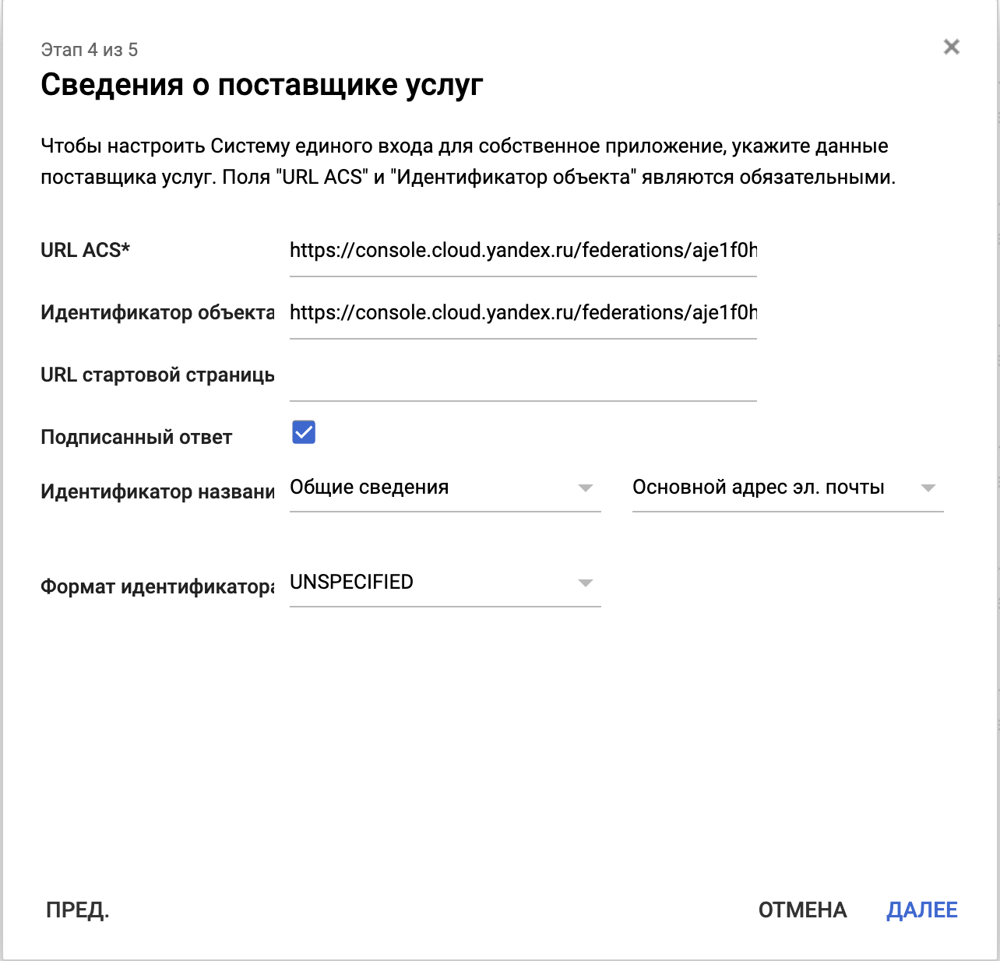
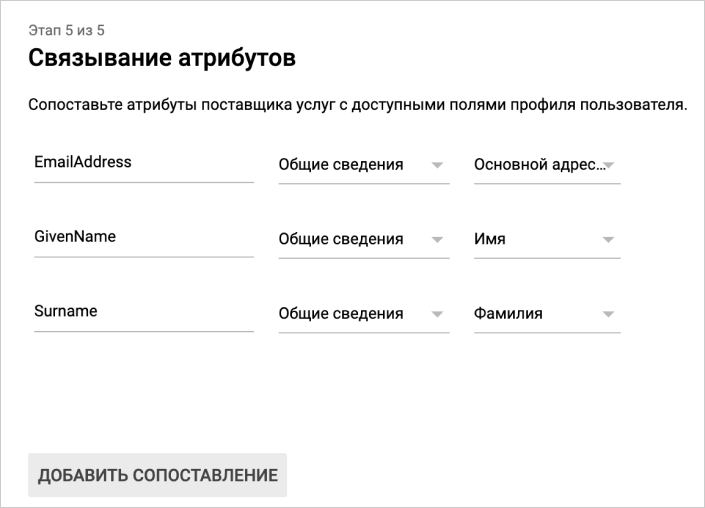

# Аутентификация с помощью Google Workspace

С помощью [федерации удостоверений](../../add-federation.md) вы можете использовать [Google Workspace](https://workspace.google.com/) для аутентификации в облаке.

Чтобы настроить аутентификацию:

1. [Начните создавать SAML-приложение](#configure-sso-gworkspace-start).
1. [Создайте федерацию в организации](#create-federation).
1. [Добавьте сертификаты в федерацию](#add-certificate).
1. [Получите ссылку для входа в консоль](#get-link).
1. [Завершите создание SAML-приложения](#configure-sso-gworkspace-finish).
1. [Добавьте пользователей в организацию](#add-users).
1. [Протестируйте аутентификацию](#test-auth).

## Перед началом {#before-you-begin}

Для того, чтобы воспользоваться инструкциями в этом разделе, вам понадобится активированный домен, для которого вы будете настраивать SAML-приложение в Google Workspace.

## Начните создавать SAML-приложение {#configure-sso-gworkspace-start}

Прежде чем вы создадите федерацию в организации, вам необходимо получить сведения о поставщике удостоверений (IdP), которым является SAML-приложение в Google Workspace:

1. Зайдите в [консоль администратора Google Workspace](https://admin.google.com/).
1. Нажмите на иконку **Приложения**.
1. Нажмите на карточку **SAML-приложения**.
1. Нажмите на кнопку добавления приложения (значок **+** в правом нижнем углу страницы).
1. Внизу открывшегося окна нажмите **Добавить свое приложение**.
1. На странице **Сведения о поставщике услуг идентификации Google** написаны данные сервера IdP. Не закрывайте это окно, эти данные необходимо будет ввести при [создании федерации](#create-federation) и [добавлении сертификата](#add-certificate).

## Создайте федерацию в организации {#create-federation}



- Консоль управления

  1. Перейдите в сервис [{{org-full-name}}]({{link-org-main}}).
  1. На левой панели выберите раздел [Федерации]({{link-org-federations}}) .
  1. Нажмите кнопку **Создать федерацию**.
  1. Задайте имя федерации. Имя должно быть уникальным в каталоге.
  1. При необходимости добавьте описание.
  1. В поле **Время жизни cookie** укажите время, в течении которого браузер не будет требовать у пользователя повторной аутентификации.
  1. В поле **IdP Issuer** скопируйте ссылку, указанную в поле **Идентификатор объекта** на странице **Сведения о поставщике услуг идентификации Google** в Google Workspace. Это ссылка в формате:
      ```
      https://accounts.google.com/o/saml2?idpid=<ID SAML-приложения>
      ```
  1. В поле **Ссылка на страницу для входа в IdP** скопируйте ссылку, указанную в поле **URL Системы единого входа** на странице **Сведения о поставщике услуг идентификации Google** в Google Workspace. Это ссылка в формате:
      ```
      https://accounts.google.com/o/saml2/idp?idpid=<ID SAML-приложения>
      ```
  1. Включите опцию **Автоматически создавать пользователей**, чтобы аутентифицированный пользователь автоматически добавлялся в организацию. Если вы не включите эту опцию, федеративных пользователей потребуется [добавить вручную](../../add-account.md#add-user-sso).

- CLI

    

    

    1. Посмотрите описание команды создания федерации:

        ```
        yc organization-manager federation saml create --help
        ```

    1. Создайте федерацию:

        ```
        yc organization-manager federation saml create --name my-federation \
            --auto-create-account-on-login \
            --cookie-max-age 12h \
            --issuer "https://accounts.google.com/o/saml2?idpid=C03xolm0y" \
            --sso-binding POST \
            --sso-url "https://accounts.google.com/o/saml2/idp?idpid=C03xolm0y"
        ```

        Где:

        * `name` — имя федерации. Имя должно быть уникальным в каталоге.
        * `auto-create-account-on-login` — флаг, активирующий автоматическое создание новых пользователей в облаке после аутентификации на IdP-сервере. Эта опция упрощает процесс заведения пользователей, но созданному таким образом пользователю по умолчанию назначается только роль `resource-manager.clouds.member`: он не сможет выполнять никаких операций с ресурсами в этом облаке. Исключение — те ресурсы, на которые назначены роли системной группе `allUsers` или `allAuthenticatedUsers`.

            Если эту опцию не включать, то пользователь, которого не добавили в облако, не сможет войти в консоль управления, даже если пройдет аутентификацию на вашем сервере. В этом случае вы можете управлять белым списком пользователей, которым разрешено пользоваться ресурсами {{ yandex-cloud }}.
        * `cookie-max-age` — время, в течении которого браузер не должен требовать у пользователя повторной аутентификации.
        * `issuer` — идентификатор IdP-сервера, на котором должна происходить аутентификация.

            Скопируйте сюда ссылку, указанную в поле **Идентификатор объекта** на странице **Сведения о поставщике услуг идентификации Google** в Google Workspace. Это ссылка в формате:

            ```
            https://accounts.google.com/o/saml2?idpid=<ID SAML-приложения>
            ```
        * `sso-url` — URL-адрес страницы, на которую браузер должен перенаправить пользователя для аутентификации.

            Скопируйте сюда ссылку, указанную в поле **URL Системы единого входа** на странице **Сведения о поставщике услуг идентификации Google** в Google Workspace. Это ссылка в формате:

            ```
            https://accounts.google.com/o/saml2/idp?idpid=<ID SAML-приложения>
            ```
        * `sso-binding` — укажите тип привязки для Single Sign-on. Большинство поставщиков поддерживают тип привязки `POST`.

- API

    1. [Получите идентификатор каталога](../../../resource-manager/operations/folder/get-id.md), в котором вы будете создавать федерацию.
    1. Создайте файл с телом запроса, например `body.json`:

        ```json
        {
          "folderId": "<ID каталога>",
          "name": "my-federation",
          "autocreateUsers": true,
          "cookieMaxAge":"43200s",
          "issuer": "https://accounts.google.com/o/saml2?idpid=C03xolm0y",
          "ssoUrl": "https://accounts.google.com/o/saml2/idp?idpid=C03xolm0y",
          "ssoBinding": "POST"
        }
        ```

        Где:

        * `folderId` — идентификатор каталога.
        * `name` — имя федерации. Имя должно быть уникальным в каталоге.
        * `autocreateUsers` — флаг, активирующий автоматическое создание новых пользователей в облаке после аутентификации на IdP-сервере. Эта опция упрощает процесс заведения пользователей, но созданному таким образом пользователю по умолчанию назначается только роль `resource-manager.clouds.member`: он не сможет выполнять никаких операций с ресурсами в этом облаке. Исключение — те ресурсы, на которые назначены роли системной группе `allUsers` или `allAuthenticatedUsers`.

            Если эту опцию не включать, то пользователь, которого не добавили в облако, не сможет войти в консоль управления, даже если пройдет аутентификацию на вашем сервере. В этом случае вы можете управлять белым списком пользователей, которым разрешено пользоваться ресурсами {{ yandex-cloud }}.
        * `cookieMaxAge` — время, в течении которого браузер не должен требовать у пользователя повторной аутентификации.
        * `issuer` — идентификатор IdP-сервера, на котором должна происходить аутентификация.

            Скопируйте сюда ссылку, указанную в поле **Идентификатор объекта** на странице **Сведения о поставщике услуг идентификации Google** в Google Workspace. Это ссылка в формате:

            ```
            https://accounts.google.com/o/saml2?idpid=<ID SAML-приложения>
            ```
        * `ssoUrl` — URL-адрес страницы, на которую браузер должен перенаправить пользователя для аутентификации.

            Скопируйте сюда ссылку, указанную в поле **URL Системы единого входа** на странице **Сведения о поставщике услуг идентификации Google** в Google Workspace. Это ссылка в формате:

            ```
            https://accounts.google.com/o/saml2/idp?idpid=<ID SAML-приложения>
            ```
        * `ssoBinding` — укажите тип привязки для Single Sign-on. Большинство поставщиков поддерживают тип привязки `POST`.

    1. 



## Укажите сертификаты для федерации {#add-certificate}

Когда поставщик удостоверений (IdP) сообщает {{org-full-name}}, что пользователь прошел аутентификацию, он подписывает сообщение своим сертификатом. Чтобы сервис {{org-name}} мог проверить этот сертификат, добавьте его в созданную федерацию.



Скачайте сертификат с открытой страницы **Сведения о поставщике услуг идентификации Google** в Google Workspace. Добавьте этот сертификат в созданную федерацию.

Чтобы добавить сертификат в федерацию:



- Консоль управления

  1. Перейдите в сервис [{{org-full-name}}]({{link-org-main}}).
  1. На левой панели выберите раздел [Федерации]({{link-org-federations}}) .
  1. Нажмите имя федерации, для которой нужно добавить сертификат.
  1. Внизу страницы нажмите кнопку **Добавить сертификат**.
  1. Введите название и описание сертификата.
  1. Выберите способ добавления сертификата:
      * Чтобы добавить сертификат в виде файла, нажмите **Выбрать файл** и укажите путь к нему.
      * Чтобы вставить скопированное содержимое сертификата, выберите способ **Текст** и вставьте содержимое.
  1. Нажмите кнопку **Добавить**.

- CLI

  

  

  1. Посмотрите описание команды добавления сертификата:

      ```
      yc organization-manager federation saml certificate create --help
      ```

  1. Добавьте сертификат для федерации, указав путь к файлу сертификата:

      ```
      yc organization-manager federation saml certificate create --federation-name my-federation \
        --name "my-certificate" \
        --certificate-file test.pem
      ```

- API

  Чтобы добавить сертификат, воспользуйтесь методом [create](../../../organization/api-ref/grpc/certificate_service.md#Create) для ресурса [Certificate](../../../organization/api-ref/grpc/certificate_service.md):

  1. Сформируйте тело запроса, указав содержимое сертификата в свойстве `data`:

      ```json
      {
        "federationId": "<ID федерации>",
        "name": "my-certificate",
        "data": "MII...=="
      }
      ```

  2. Отправьте запрос на добавление сертификата:

      ```bash
      $ export IAM_TOKEN=CggaATEVAgA...
      $ curl -X POST \
          -H "Content-Type: application/json" \
          -H "Authorization: Bearer ${IAM_TOKEN}" \
          -d '@body.json' \
          "https://organization-manager.api.cloud.yandex.net/organization-manager/v1/saml/certificates"
      ```



## Получите ссылку для входа в консоль {#get-link}

Когда вы настроите аутентификацию с помощью федерации, пользователи смогут войти в консоль управления по ссылке, в которой содержится идентификатор федерации. Эту же ссылку необходимо будет указать при настройке сервера аутентификации.

Получите и сохраните эту ссылку:

1. Получите идентификатор федерации:

    1. Перейдите в сервис [{{org-full-name}}]({{link-org-main}}).
    1. На левой панели выберите раздел [Федерации]({{link-org-federations}}) .
    1. Скопируйте идентификатор федерации, для которой вы настраиваете доступ.

2. Сформируйте ссылку с помощью полученного идентификатора:

    `{{ link-console-main }}/federations/<ID федерации>`

## Завершите создание SAML-приложения {#configure-sso-gworkspace-finish}

Когда создали федерацию и получили ссылку для входа в консоль, завершите создание SAML-приложения в Google Workspace:

1. Откройте снова окно создания SAML-приложения и нажмите **Далее**.
1. Введите название SAML-приложения, например <q>yandex-cloud-federation</q>. Если надо, добавьте описание и логотип. Нажмите **Далее**.
1. Укажите сведения о {{ yandex-cloud }}, которое выступает в роли поставщика услуг:
    * В полях **URL ACS** и **Идентификатор объекта** введите полученную ранее [ссылку для входа в консоль](#get-link).
    * Включите опцию **Подписанный ответ**.
    * В поле **Идентификатор названия** укажите, что будет сервер будет возвращать в качестве Name ID — уникального идентификатора пользователя федерации.

        Выберите **Общие сведения**, а рядом — **Основной адрес эл. почты**.
    * Остальные поля необязательные, поэтому можете не использовать их и нажать **Далее**.

    

1. Чтобы пользователь мог обратиться в службу технической поддержки {{ yandex-cloud }} из [консоли управления]({{link-console-support}}), нажмите **Добавить сопоставления** и настройте, чтобы сервер передавал адрес электронной почты пользователя. Также рекомендуется передавать имя и фамилию пользователя. Атрибуты пользователей, которые поддерживают сервисы {{ org-full-name }}, перечислены в разделе [{#T}](#claims-mapping). После этого нажмите **Готово**.

    

1. На следующей странице вы можете проверить введенные данные вашего SAML-приложения.
1. Включите ваше SAML-приложение, нажав **Изменить статус приложения**.
1. На открывшейся странице выберите, кому будет доступна аутентификация в этой федерации:
    * Чтобы включить доступ для всех пользователей федерации, выберите **Включено для всех**.
    * Чтобы включить доступ для отдельного организационного подразделения, выберите подразделение в списке слева и настройте статус сервиса для этого подразделения. По умолчанию дочерние подразделения наследуют настройки доступа от родительского подразделения.

### Сопоставление атрибутов {#claims-mapping}

Типы персональных данных, которые поддерживает {{ org-full-name }} для Google Workspace, приведены ниже.

Данные пользователя | Комментарий | Атрибуты приложений
------------------- | ----------- | -------------------
Уникальный идентификатор пользователя | Обязательный атрибут. Рекомендуется использовать адрес электронной почты. | Поле **Идентификатор названия** в настройках поставщика услуг
Фамилия | Отображается в сервисах {{yandex-cloud}}. | `http://schemas.xmlsoap.org/ws/2005/05/identity/claims/surname`
Имя | Отображается в сервисах {{yandex-cloud}}. | `http://schemas.xmlsoap.org/ws/2005/05/identity/claims/givenname`
Полное имя | Отображается в сервисах {{yandex-cloud}}.<br>Пример: Иван Иванов | Атрибут недоступен
Почта | Используется для отправки уведомлений из сервисов {{yandex-cloud}}.<br>Пример:&nbsp;`ivanov@example.com` | `http://schemas.xmlsoap.org/ws/2005/05/identity/claims/emailaddress`
Телефон | Используется для отправки уведомлений из сервисов {{yandex-cloud}}.<br>Пример: +71234567890 | `http://schemas.xmlsoap.org/ws/2005/05/identity/claims/mobilephone`
Аватар | Отображается в сервисах {{yandex-cloud}}. | Атрибут недоступен

>Пример сопоставления атрибутов:
>
>



## Добавьте пользователей в организацию {#add-users}

Если при создании федерации вы не включили опцию **Автоматически создавать пользователей**, федеративных пользователей нужно добавить в организацию вручную.

Для этого вам необходимо знать Name ID пользователей, которые возвращает сервер поставщика удостоверений (IdP) вместе с ответом об успешной аутентификации. Обычно это основной email пользователя. Если вы не знаете, что возвращает сервер в качестве Name ID, обратитесь к администратору, который настраивал аутентификацию в вашей федерации.

Чтобы добавить пользователей федерации в организацию:



- Консоль управления

  1. [Войдите в аккаунт]({{link-passport}}) администратора организации.
  1. Перейдите в сервис [{{org-full-name}}]({{link-org-main}}).
  1. На левой панели выберите раздел [Пользователи]({{link-org-users}}) .
  1. В правом верхнем углу нажмите на стрелку возле кнопки **Добавить пользователя**. Выберите пункт **Добавить федеративных пользователей**.
  1. Выберите федерацию, из которой необходимо добавить пользователей.
  1. Перечислите Name ID пользователей, разделяя их переносами строк.
  1. Нажмите кнопку **Добавить**. Пользователи будут подключены к организации.

- CLI

  

  

  1. Посмотрите описание команды добавления пользователей:

      ```
      yc organization-manager federation saml add-user-accounts --help
      ```

  1. Добавьте пользователей, перечислив их Name ID через запятую:

      ```
      yc organization-manager federation saml add-user-accounts --name my-federation \
        --name-ids=alice@example.com,bob@example.com,charlie@example.com
      ```

- API

  Чтобы добавить пользователей федерации в облако:

  1.  Сформируйте файл с телом запроса, например `body.json`. В теле запроса укажите массив Name ID пользователей, которых необходимо добавить:

      ```json
      {
        "nameIds": [
          "alice@example.com",
          "bob@example.com",
          "charlie@example.com"
        ]
      }
      ```
  1.  Отправьте запрос, указав в параметрах идентификатор федерации:

      ```bash
      $ curl -X POST \
        -H "Content-Type: application/json" \
        -H "Authorization: Bearer <IAM-токен>" \
        -d '@body.json' \
        https://organization-manager.api.cloud.yandex.net/organization-manager/v1/saml/federations/<ID федерации>:addUserAccounts
      ```



## Протестируйте аутентификацию {#test-auth}

Теперь, когда вы закончили настройку сервера, вы можете протестировать, что все работает:

1. Откройте браузер в гостевом режиме или режиме инкогнито, чтобы не нарушить работу в консоли с аккаунтом на Яндексе.
1. Перейдите по [ссылке для входа в консоль](#get-link), полученной ранее. Браузер должен перенаправить вас на страницу аутентификации в Google.
1. Введите ваши данные для аутентификации. По умолчанию, необходимо ввести UPN и пароль и нажать **Sign in**.
1. После успешной аутентификации, сервер перенаправит вас обратно по по ссылке для входа в консоль, а после на главную страницу консоли управления. В правом верхнем углу вы можете увидеть, что вы вошли в консоль от имени федеративного пользователя.

#### Что дальше {#what-is-next}

* [Назначьте роли добавленным пользователям](../../../iam/operations/roles/grant.md#access-to-federated-user).
