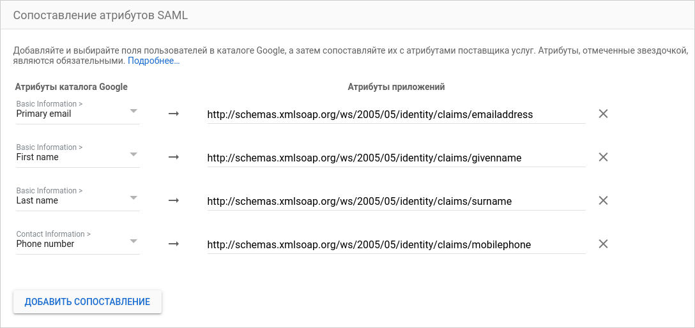

# Аутентификация с помощью Google Workspace

С помощью [федерации удостоверений](../../concepts/add-federation.md) вы можете использовать [Google Workspace](https://workspace.google.com/) для аутентификации пользователей в организации.

Настройка аутентификации состоит из следующих этапов:

1. [Создание и настройка SAML-приложения в Google Workspace](#gworkspace-settings).

1. [Создание и настройка федерации в {{ org-full-name }}](#yc-settings).

1. [Настройка системы единого входа (SSO)](#sso-settings).

1. [Проверка аутентификации](#test-auth).

## Перед началом работы {#before-you-begin}

Чтобы воспользоваться инструкциями в этом разделе, вам понадобится подписка на сервисы Google Workspace и подтвержденный домен, для которого вы будете настраивать SAML-приложение.

## Создание и настройка SAML-приложения в Google Workspace {#gworkspace-settings}

### Создайте SAML-приложение и скачайте сертификат {#create-app}

В роли поставщика удостоверений (IdP) выступает SAML-приложение в Google Workspace. Начните создавать приложение и скачайте сертификат:

1. Зайдите в [консоль администратора Google Workspace](https://admin.google.com/).

1. На панели слева выберите **Мобильные и веб-приложения**.

1. Нажмите **Добавить** → **Добавить пользовательское SAML-приложение**.

1. Ведите название приложения, выберите логотип и нажмите **Продолжить**.

1. На шаге **Сведения о поставщике идентификационной информации Google** указаны данные сервера IdP. Эти данные понадобятся при [настройке федерации {{ org-full-name }}](#yc-settings).



Не закрывайте страницу создания приложения в Google Workspace: необходимые данные для настроек на шаге **Сведения о поставщике услуг** будут получены на [следующих этапах](#add-link).



## Создание и настройка федерации в {{ org-full-name }} {#yc-settings}

### Создайте федерацию {#create-federation}



- Консоль управления

  1. Перейдите в сервис [{{ org-full-name }}]({{ link-org-main }}).

  1. На панели слева выберите раздел [{{ ui-key.yacloud_org.pages.federations }}]({{ link-org-federations }}) .

  1. Нажмите кнопку **{{ ui-key.yacloud_org.form.federation.action.create }}**.

  1. Задайте имя федерации. Имя должно быть уникальным в каталоге.

  1. При необходимости добавьте описание.

  1. В поле **{{ ui-key.yacloud_org.entity.federation.field.cookieMaxAge }}** укажите время, в течение которого браузер не будет требовать у пользователя повторной аутентификации.
  
  1. В поле **{{ ui-key.yacloud_org.entity.federation.field.issuer }}** скопируйте ссылку, указанную в поле **Идентификатор объекта** на странице **Сведения о поставщике услуг идентификации Google** в Google Workspace. Формат ссылки:

      ```
      https://accounts.google.com/o/saml2?idpid=<ID SAML-приложения>
      ```

  1. В поле **{{ ui-key.yacloud_org.entity.federation.field.ssoUrl }}** скопируйте ссылку, указанную в поле **URL системы единого входа** на странице **Сведения о поставщике услуг идентификации Google** в Google Workspace. Формат ссылки:

      ```
      https://accounts.google.com/o/saml2/idp?idpid=<ID SAML-приложения>
      ```
      

  1. Включите опцию **{{ ui-key.yacloud_org.entity.federation.field.autocreateUsers }}**, чтобы аутентифицированный пользователь автоматически добавлялся в организацию. Если вы не включите эту опцию, федеративных пользователей потребуется [добавить вручную](../../operations/add-account.md#add-user-sso).

     

  1. 

- CLI

    

    

    1. Посмотрите описание команды создания федерации:

        ```
        yc organization-manager federation saml create --help
        ```

    1. Создайте федерацию:

        ```bash
        yc organization-manager federation saml create --name my-federation \
            --organization-id <ID организации> \
            --auto-create-account-on-login \
            --cookie-max-age 12h \
            --issuer "https://accounts.google.com/o/saml2?idpid=<ID SAML-приложения>" \
            --sso-binding POST \
            --sso-url "https://accounts.google.com/o/saml2/idp?idpid=<ID SAML-приложения>" \
            --force-authn
        ```

        Где:

        * `name` — имя федерации. Имя должно быть уникальным в каталоге.
        
        * `organization-id` — идентификатор организации. 

        * `auto-create-account-on-login` — флаг, который активирует автоматическое создание новых пользователей в облаке после аутентификации на IdP-сервере. 
        Опция упрощает процесс заведения пользователей, но созданный таким образом пользователь не сможет выполнять никаких операций с ресурсами в облаке. Исключение — те ресурсы, на которые назначены роли [системной группе](../../../iam/concepts/access-control/system-group.md) `allUsers` или `allAuthenticatedUsers`.

            Если опцию не включать, то пользователь, которого не добавили в организацию, не сможет войти в консоль управления, даже если пройдет аутентификацию на вашем сервере. В этом случае вы можете управлять списком пользователей, которым разрешено пользоваться ресурсами {{ yandex-cloud }}.

        * `cookie-max-age` — время, в течение которого браузер не должен требовать у пользователя повторной аутентификации.
        
        * `issuer` — идентификатор IdP-сервера, на котором должна происходить аутентификация.

            Используйте ссылку, которая указанна в поле **Идентификатор объекта** на странице **Сведения о поставщике услуг идентификации Google** в Google Workspace. Это ссылка в формате:

            ```
            https://accounts.google.com/o/saml2?idpid=<ID SAML-приложения>
            ```

        * `sso-url` — URL-адрес страницы, на которую браузер должен перенаправить пользователя для аутентификации.

            Используйте ссылку, указанную в поле **URL Системы единого входа** на странице **Сведения о поставщике услуг идентификации Google** в Google Workspace. Формат ссылки:

            ```
            https://accounts.google.com/o/saml2/idp?idpid=<ID SAML-приложения>
            ```

            

        * `sso-binding` — укажите тип привязки для Single Sign-on. Большинство поставщиков поддерживают тип привязки `POST`.

        * 

- API

    1. Создайте файл с телом запроса, например `body.json`:

        ```json
        {
          "name": "my-federation",
          "organizationId": "<ID организации>",
          "autoCreateAccountOnLogin": true,
          "cookieMaxAge":"43200s",
          "issuer": "https://accounts.google.com/o/saml2?idpid=<ID SAML-приложения>",
          "ssoUrl": "https://accounts.google.com/o/saml2/idp?idpid=<ID SAML-приложения>",
          "ssoBinding": "POST",
          "securitySettings": {
            "forceAuthn": true
          }
        }
        ```

        Где:
        
        * `name` — имя федерации. Имя должно быть уникальным в каталоге.

        * `organizationId` — идентификатор организации. 

        * `autoCreateAccountOnLogin` — флаг, который активирует автоматическое создание новых пользователей в облаке после аутентификации на IdP-сервере. 
        Опция упрощает процесс заведения пользователей, но созданный таким образом пользователь не сможет выполнять никаких операций с ресурсами в облаке. Исключение — те ресурсы, на которые назначены роли [системной группе](../../../iam/concepts/access-control/system-group.md) `allUsers` или `allAuthenticatedUsers`.

            Если опцию не включать, то пользователь, которого не добавили в организацию, не сможет войти в консоль управления, даже если пройдет аутентификацию на вашем сервере. В этом случае вы можете управлять списком пользователей, которым разрешено пользоваться ресурсами {{ yandex-cloud }}.

        * `cookieMaxAge` — время, в течение которого браузер не должен требовать у пользователя повторной аутентификации.
        
        * `issuer` — идентификатор IdP-сервера, на котором должна происходить аутентификация.

            Используйте ссылку, указанную в поле **Идентификатор объекта** на странице **Сведения о поставщике услуг идентификации Google** в Google Workspace. Формат ссылки:

            ```
            https://accounts.google.com/o/saml2?idpid=<ID SAML-приложения>
            ```
        * `ssoUrl` — URL-адрес страницы, на которую браузер должен перенаправить пользователя для аутентификации.

            Скопируйте сюда ссылку, указанную в поле **URL Системы единого входа** на странице **Сведения о поставщике услуг идентификации Google** в Google Workspace. Формат ссылки:

            ```
            https://accounts.google.com/o/saml2/idp?idpid=<ID SAML-приложения>
            ```

            

        * `ssoBinding` — укажите тип привязки для Single Sign-on. Большинство поставщиков поддерживают тип привязки `POST`.

        * 

    1. 

- {{ TF }}

  Если у вас ещё нет {{ TF }}, [установите его и настройте провайдер {{ yandex-cloud }}](../../../tutorials/infrastructure-management/terraform-quickstart.md#install-terraform).

  1. В конфигурационном файле опишите параметры федерации:

        * `name` — имя федерации. Имя должно быть уникальным в каталоге.
        * `description` — описание федерации.
        * `organization_id` — идентификатор организации. 
        * `labels` — набор пар меток ключ/значение, которые присвоены федерации.
        * `issuer` — идентификатор IdP-сервера, на котором должна происходить аутентификация.

            Используйте ссылку, указанную в поле **Идентификатор объекта** на странице **Сведения о поставщике услуг идентификации Google** в Google Workspace. Формат ссылки:

            ```
            https://accounts.google.com/o/saml2?idpid=<ID SAML-приложения>
            ```
        
        * `sso_binding` — укажите тип привязки для Single Sign-on. Большинство поставщиков поддерживают тип привязки `POST`.
        * `sso_url` — URL-адрес страницы, на которую браузер должен перенаправить пользователя для аутентификации.

            Скопируйте сюда ссылку, указанную в поле **URL Системы единого входа** на странице **Сведения о поставщике услуг идентификации Google** в Google Workspace. Формат ссылки:

            ```
            https://accounts.google.com/o/saml2/idp?idpid=<ID SAML-приложения>
            ```

            

        * `cookie_max_age` — время в секундах, в течение которого браузер не должен требовать у пользователя повторной аутентификации. Значение по умолчанию `8 часов`. 
        * `auto_create_account_on_login` — флаг, который активирует автоматическое создание новых пользователей в облаке после аутентификации на IdP-сервере. 
        Опция упрощает процесс заведения пользователей, но созданный таким образом пользователь не сможет выполнять никаких операций с ресурсами в облаке. Исключение — те ресурсы, на которые назначены роли [системной группе](../../../iam/concepts/access-control/system-group.md) `allUsers` или `allAuthenticatedUsers`.

            Если опцию не включать, то пользователь, которого не добавили в организацию, не сможет войти в консоль управления, даже если пройдет аутентификацию на вашем сервере. В этом случае вы можете управлять списком пользователей, которым разрешено пользоваться ресурсами {{ yandex-cloud }}.
        * `case_insensitive_name_ids` — зависимость имен пользователей от регистра.
           Если опция включена, идентификаторы имен федеративных пользователей будут нечувствительны к регистру.
        * `security_settings` — настройки безопасности федерации: 
          * `encrypted_assertions` — подписывать запросы аутентификации. 
            Если включить опцию, то все запросы аутентификации от {{ yandex-cloud }} будут содержать цифровую подпись. Вам потребуется скачать и установить сертификат {{ yandex-cloud }}.

     Пример структуры конфигурационного файла:

     ```
     resource "yandex_organizationmanager_saml_federation" federation {
      name            = "my-federation"
      organization_id = "<ID организации>"
      auto_create_account_on_login = "true"
      issuer          = "https://accounts.google.com/o/saml2?idpid=<ID SAML-приложения>"
      sso_url         = "https://accounts.google.com/o/saml2/idp?idpid=<ID SAML-приложения>"
      sso_binding     = "POST"
      security_settings {
         encrypted_assertions = "true"
         }
     }
     ```

  1. Проверьте корректность конфигурационных файлов.

     1. В командной строке перейдите в папку, где вы создали конфигурационный файл.
     1. Выполните проверку с помощью команды:

        ```
        $ terraform plan
        ```

     Если конфигурация описана верно, в терминале отобразятся параметры федерации. Если в конфигурации есть ошибки, {{ TF }} на них укажет. 

  1. Создайте федерацию.

     1. Если в конфигурации нет ошибок, выполните команду:

        ```
        $ terraform apply
        ```

     1. Подтвердите создание федерации.

     После этого в указанной организации будет создана федерация. Проверить появление федерации и ее настроек можно в организации в разделе [{{ ui-key.yacloud_org.pages.federations }}]({{ link-org-federations }}).



### Добавьте сертификаты {#add-certificate}

При аутентификации у сервиса {{ org-name }} должна быть возможность проверить сертификат IdP-сервера. Для этого скачайте сертификат с открытой страницы **Сведения о поставщике услуг идентификации Google** в Google Workspace и добавьте его в созданную федерацию:



- Консоль управления

  1. На панели слева выберите раздел [{{ ui-key.yacloud_org.pages.federations }}]({{ link-org-federations }}) .

  1. Нажмите имя федерации, для которой нужно добавить сертификат.

  1. Внизу страницы нажмите кнопку **{{ ui-key.yacloud_org.entity.certificate.action.add }}**.

  1. Введите название и описание сертификата.

  1. Выберите способ добавления сертификата:

      * Чтобы добавить сертификат в виде файла, нажмите **{{ ui-key.yacloud_portal.component.file-input.button_choose }}** и укажите путь к нему.

      * Чтобы вставить скопированное содержимое сертификата, выберите способ **{{ ui-key.yacloud_org.component.form-file-upload.method.manual }}** и вставьте содержимое.

  1. Нажмите кнопку **{{ ui-key.yacloud_org.actions.add }}**.

- CLI

  

  

  1. Посмотрите описание команды добавления сертификата:

      ```
      yc organization-manager federation saml certificate create --help
      ```

  1. Добавьте сертификат для федерации, указав путь к файлу сертификата:

      ```
      yc organization-manager federation saml certificate create --federation-id <ID_федерации> \
        --name "my-certificate" \
        --certificate-file certificate.pem
      ```

- API

  Воспользуйтесь методом [create](../../api-ref/Certificate/create.md) для ресурса [Certificate](../../api-ref/Certificate/index.md):

  1. Сформируйте тело запроса. В свойстве `data` указажите содержимое сертификата:

      ```json
      {
        "federationId": "<ID_федерации>",
        "name": "my-certificate",
        "data": "-----BEGIN CERTIFICATE..."
      }
      ```

  1. Отправьте запрос на добавление сертификата:

      ```bash
      $ export IAM_TOKEN=CggaATEVAgA...
      $ curl -X POST \
          -H "Content-Type: application/json" \
          -H "Authorization: Bearer ${IAM_TOKEN}" \
          -d '@body.json' \
          "https://organization-manager.{{ api-host }}/organization-manager/v1/saml/certificates"
      ```





Чтобы аутентификация не прерывалась в тот момент, когда у очередного сертификата закончился срок действия, рекомендуется добавлять в федерацию несколько сертификатов — текущий и те, которые будут использоваться после текущего. Если один сертификат окажется недействительным, {{ yandex-cloud }} попробует проверить подпись другим сертификатом.




## Настройка системы единого входа (SSO) {#sso-settings}

### Укажите URL для перенаправления {#add-link}

Когда вы создали федерацию, завершите создание SAML-приложения в Google Workspace:

1. Вернитесь на страницу создания SAML-приложения на шаге **Сведения о поставщике идентификационной информации Google** и нажмите **Продолжить**.

1. На шаге **Сведения о поставщике услуг** укажите сведения о {{ yandex-cloud }}, выступающем в роли поставщика услуг:

    * В полях **URL ACS** и **Идентификатор объекта** введите URL, на который пользователи будут перенаправляться после аутентификации:

      ```
      https://{{ auth-host }}/federations/<ID_федерации>
      ```
   
      
   
      
   
      
    
    * Включите опцию **Подписанный ответ**.

1. Нажмите **Продолжить**.

    

    Чтобы пользователь мог обратиться в службу технической поддержки {{ yandex-cloud }} из [консоли управления]({{ link-console-support }}), на шаге **Сопоставление атрибутов** нажмите **Добавить сопоставления** и настройте передачу атрибутов:
    * **Primary email**.
    * **First name**.
    * **Last name**.

    Атрибуты пользователей, которые поддерживают сервисы {{ org-full-name }}, перечислены в разделе [{#T}](#claims-mapping).

    

1. Чтобы завершить создание приложения, нажмите **Готово**.

### Добавьте пользователей {#add-users}

1. На странице приложения в разделе **Доступ пользователей** нажмите **Отключено для всех**. 

1. На открывшейся странице выберите, кому будет доступна аутентификация в этой федерации:

    * Чтобы включить доступ для всех пользователей федерации, выберите **Включено для всех**.

    * Чтобы включить доступ для отдельного организационного подразделения, выберите подразделение в списке слева и настройте статус сервиса для этого подразделения. По умолчанию дочерние подразделения наследуют настройки доступа от родительского подразделения.

1. Нажмите **Сохранить**.

### Сопоставление атрибутов пользователей {#claims-mapping}

Данные пользователя | Комментарий | Атрибуты приложений
------------------- | ----------- | -------------------
Уникальный идентификатор пользователя | Обязательный атрибут. Рекомендуется использовать адрес электронной почты. | Поле **Идентификатор названия** в настройках поставщика услуг
Фамилия | Отображается в сервисах {{ yandex-cloud }}.<br> Ограничение значения по длине: {{ saml-limit-last-name }}. | `http://schemas.xmlsoap.org/ws/2005/05/identity/claims/surname`
Имя | Отображается в сервисах {{ yandex-cloud }}.<br> Ограничение значения по длине: {{ saml-limit-first-name }}. | `http://schemas.xmlsoap.org/ws/2005/05/identity/claims/givenname`
Полное имя | Отображается в сервисах {{ yandex-cloud }}.<br>Пример: Иван Иванов.<br> Ограничение значения по длине: {{ saml-limit-display-name }}. | Атрибут недоступен
Почта | Используется для отправки уведомлений из сервисов {{ yandex-cloud }}.<br>Пример:&nbsp;`ivanov@example.com`.<br> Ограничение значения по длине: {{ saml-limit-email }}. | `http://schemas.xmlsoap.org/ws/2005/05/identity/claims/emailaddress`
Телефон | Используется для отправки уведомлений из сервисов {{ yandex-cloud }}.<br>Пример: +71234567890.<br> Ограничение значения по длине: {{ saml-limit-phone }}. | `http://schemas.xmlsoap.org/ws/2005/05/identity/claims/mobilephone`
Аватар | Отображается в сервисах {{ yandex-cloud }}.<br> Ограничение значения по длине: {{ saml-limit-thumbnail-photo }}. | Атрибут недоступен



Значение атрибута `thumbnailPhoto`, превышающее ограничение по длине, игнорируется. Если значение другого атрибута превышает ограничения, то часть значения, выходящая за пределы ограничения, отбрасывается.



>Пример сопоставления атрибутов:
>
>

### Добавьте пользователей в организацию {#add-users-to-org}

Если при [создании федерации](#yc-settings) вы не включили опцию **{{ ui-key.yacloud_org.entity.federation.field.autocreateUsers }}**, федеративных пользователей нужно добавить в организацию вручную.

Для этого вам понадобятся пользовательские Name ID. Их возвращает IdP-сервер вместе с ответом об успешной аутентификации.



Добавить пользователя может администратор (роль `organization-manager.admin`) или владелец (роль `organization-manager.organizations.owner`) организации. Как назначить роль пользователю, читайте в разделе [Роли](../../security/index.md#admin).



- Консоль управления

  1. [Войдите в аккаунт]({{ link-passport }}) администратора или владельца организации.

  1. Перейдите в сервис [{{ org-full-name }}]({{ link-org-main }}).

  1. На панели слева выберите раздел [{{ ui-key.yacloud_org.pages.users }}]({{ link-org-users }}) .

  1. В правом верхнем углу нажмите  → **{{ ui-key.yacloud_org.page.users.action.add-federated-users }}**.

  1. Выберите федерацию, из которой необходимо добавить пользователей.

  1. Перечислите Name ID пользователей, разделяя их переносами строк.

  1. Нажмите кнопку **{{ ui-key.yacloud_org.actions.add }}**. Пользователи будут подключены к организации.

- CLI

  

  

  1. Посмотрите описание команды добавления пользователей:

      ```
      yc organization-manager federation saml add-user-accounts --help
      ```

  1. Добавьте пользователей, перечислив их Name ID через запятую:

      ```
      yc organization-manager federation saml add-user-accounts --id <ID_федерации> \
        --name-ids=alice@example.com,bob@example.com,charlie@example.com
      ```

      Где:

      * `id` — идентификатор федерации.

      * `name-ids` — Name ID пользователей.

- API

  Чтобы добавить пользователей федерации в облако:

  1. Сформируйте файл с телом запроса, например `body.json`. В теле запроса укажите массив Name ID пользователей, которых необходимо добавить:

      ```json
      {
        "nameIds": [
          "alice@example.com",
          "bob@example.com",
          "charlie@example.com"
        ]
      }
      ```
  1.  Отправьте запрос, указав в параметрах идентификатор федерации:

      ```bash
      $ curl -X POST \
        -H "Content-Type: application/json" \
        -H "Authorization: Bearer <IAM-токен>" \
        -d '@body.json' \
        https://organization-manager.{{ api-host }}/organization-manager/v1/saml/federations/<ID_федерации>:addUserAccounts
      ```



## Проверка аутентификации {#test-auth}

Когда вы закончили настройку сервера, протестируйте, что все работает:

1. Откройте браузер в гостевом режиме или режиме инкогнито.

1. Перейдите по URL для входа в консоль:

   ```
   https://{{ console-host }}/federations/<ID_федерации>
   ```

   

   

   

   Браузер должен перенаправить вас на страницу аутентификации в Google.

1. Введите данные для аутентификации и нажмите кнопку **Sign in**.

После успешной аутентификации IdP-сервер перенаправит вас обратно по URL `https://{{ auth-host }}/federations/<ID_федерации>`, который вы указали в настройках Google Workspace, а после — на главную страницу [консоли управления]({{ link-console-main }}). В правом верхнем углу вы можете увидеть, что вы вошли в консоль от имени федеративного пользователя.

#### Что дальше {#what-is-next}

* [Назначьте роли добавленным пользователям](../../security/index.md#add-role).
