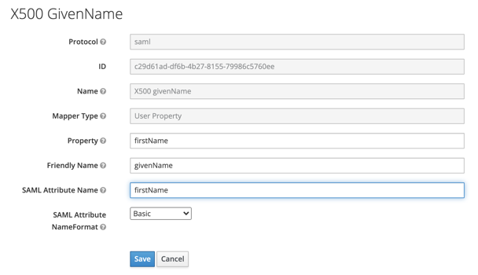

# Аутентификация с помощью Keycloak

С помощью [федерации удостоверений](../../concepts/add-federation.md) вы можете использовать [Keycloak](https://www.keycloak.org/) для аутентификации пользователей в организации.

Настройка аутентификации состоит из следующих этапов:

1. [Создание и настройка федерации в {{ org-full-name }}](#yc-settings).

1. [Создание и настройка SAML-приложения в Keycloak](#keycloak-settings).

1. [Добавление пользователей в {{ org-full-name }}](#add-users).

1. [Проверка аутентификации](#test-auth).

## Подготовка к работе {#before-you-begin}

Чтобы воспользоваться инструкциями в этом разделе, вам понадобятся:

1. Платформа [Docker](/blog/posts/2022/03/docker-containers). Если у вас не установлен Docker, [установите его](https://docs.docker.com/get-docker/). Убедитесь, что Docker Engine запущен.

1. Локальный IdP-сервер [Keycloak](https://www.keycloak.org/). Чтобы установить и запустить Keycloak, выполните команды:

    

    - Keycloak 20 в режиме разработчика

      ```bash
      docker run -p 8080:8080 -e KEYCLOAK_ADMIN=admin -e KEYCLOAK_ADMIN_PASSWORD=Pa55w0rd quay.io/keycloak/keycloak:latest start-dev
      ```

    - Keycloak 19

      ```bash
      git clone https://github.com/keycloak/keycloak-containers.git
      cd ./keycloak-containers/docker-compose-examples
      docker-compose -f keycloak-postgres.yml up
      ```

    

    

    Чтобы сотрудники в корпоративной сети или интернете могли использовать Keycloak для аутентификации в вашем приложении, разверните IdP-сервер Keycloak в сети и настройте публичный адрес. Подробнее читайте в [документации Keycloak](https://www.keycloak.org/server/hostname).

    

1. Действующий сертификат, который используется для подписи в службе Keycloak. Чтобы его получить: 

    1. Войдите в аккаунт администратора Keycloak по адресу:

        

        - Keycloak 17 или новее

          `http://keycloak.example.com:8080/admin`. Вместо `keycloak.example.com` должен быть указан адрес вашего локального сервера, например: `http://localhost:8080/admin`.

        - Keycloak 16 и предшествующих версий

          `http://keycloak.example.com:8080/auth/admin`. Вместо `keycloak.example.com` должен быть указан адрес вашего локального сервера, например: `http://localhost:8080/auth/admin`.

        

        Параметры входа по умолчанию:
        * **User name or email**: `admin`.
        * **Password**: `Pa55w0rd`.

    1. В разделе **Realm Settings** выберите вкладку **Keys**.

    1. В строке **RS256** нажмите **Certificate** и скопируйте значение сертификата.

    1. Сохраните сертификат в текстовом файле с расширением `.cer` в следующем формате:

        ```
        -----BEGIN CERTIFICATE-----
          <значение_сертификата>
        -----END CERTIFICATE-----
        ```

    Вы также можете получить сертификат по прямой ссылке:

    

    - Keycloak 17 или новее

      `http://keycloak.example.com:8080/realms/master/protocol/saml/descriptor`. Значение сертификата хранится в теге `<ds:X509Certificate>...</ds:X509Certificate>`.

    - Keycloak 16 и предшествующих версий

      `http://keycloak.example.com:8080/auth/realms/master/protocol/saml/descriptor`. Значение сертификата хранится в теге `<ds:X509Certificate>...</ds:X509Certificate>`.

    

## Создание и настройка федерации в {{ org-full-name }} {#yc-settings}

### Создайте федерацию {#create-federation}



- Интерфейс {{ cloud-center }} {#cloud-center}

  1. Перейдите в сервис [{{ org-full-name }}]({{ link-org-cloud-center }}).

  1. На панели слева выберите  **{{ ui-key.yacloud_org.pages.federations }}**.

  1. В правом верхнем углу страницы нажмите кнопку  **{{ ui-key.yacloud_org.form.federation.action.create }}**. В открывшемся окне:

      1. Задайте имя федерации. Имя должно быть уникальным в каталоге.

      1. При необходимости добавьте описание.

      1. В поле **{{ ui-key.yacloud_org.entity.federation.field.cookieMaxAge }}** укажите время, в течение которого браузер не будет требовать у пользователя повторной аутентификации.

      1. В поле **{{ ui-key.yacloud_org.entity.federation.field.issuer }}** вставьте ссылку вида:

          - Keycloak 17 или новее

              ```
              http://<хост>:8080/realms/master
              ```

              Если для IdP-сервера настроен [публичный адрес](https://www.keycloak.org/server/hostname), укажите его URL. Например:

              ```
              {{ link-keycloak-example }}
              ```

          - Keycloak 16 и предшествующих версий

              ```
              http://<хост>:8080/auth/realms/master
              ```

              Если для IdP-сервера настроен [публичный адрес](https://www.keycloak.org/server/hostname), укажите его URL. Например:

              ```
              {{ link-keycloak-example-old }}
              ```

      1. В поле **{{ ui-key.yacloud_org.entity.federation.field.ssoUrl }}** вставьте ссылку вида:

          - Keycloak 17 или новее

              ```
              http://<хост>:8080/realms/master/protocol/saml
              ```

              Если для IdP-сервера настроен [публичный адрес](https://www.keycloak.org/server/hostname), укажите его URL. Например:

              ```
              {{ link-keycloak-example }}/protocol/saml
              ```

          - Keycloak 16 и предшествующих версий

              ```
              http://<хост>:8080/auth/realms/master/protocol/saml
              ```

              Если для IdP-сервера настроен [публичный адрес](https://www.keycloak.org/server/hostname), укажите его URL. Например:

              ```
              {{ link-keycloak-example-old }}/protocol/saml
              ```

          

      1. Включите опцию **{{ ui-key.yacloud_org.entity.federation.field.autocreateUsers }}**, чтобы автоматически добавлять пользователя в организацию после аутентификации. Если опция отключена, федеративных пользователей потребуется [добавить вручную](../../operations/add-account.md#add-user-sso).

          

      1. Чтобы все запросы аутентификации от {{ yandex-cloud }} содержали цифровую подпись, включите опцию **{{ ui-key.yacloud_org.entity.federation.field.encryptedAssertions }}**. Для завершения настройки потребуется скачать и [установить](#signature) сертификат {{ yandex-cloud }}.
      
          
      
          Вы также сможете скачать сертификат и после создания федерации. Для этого на странице сведений о федерации в {{ org-full-name }} нажмите кнопку  **{{ ui-key.yacloud_org.page.federation.action.download-cert }}** в поле **{{ ui-key.yacloud_org.entity.federation.field.encryptedAssertions }}**.

      1. 

      1. Нажмите кнопку **{{ ui-key.yacloud_org.form.federation.create.action.create }}**.

- CLI {#cli}

  

  

  1. Посмотрите описание команды создания федерации:

     ```
     yc organization-manager federation saml create --help
     ```

  1. Создайте федерацию:

      - Keycloak 17 или новее

        ```bash
        yc organization-manager federation saml create --name my-federation \
          --organization-id <идентификатор_организации> \
          --auto-create-account-on-login \
          --encrypted-assertions \
          --cookie-max-age 12h \
          --issuer "http://<хост>:8080/realms/master" \
          --sso-binding POST \
          --sso-url "http://<хост>:8080/realms/master/protocol/saml" \
          --force-authn
        ```

      - Keycloak 16 и предшествующих версий

        ```bash
        yc organization-manager federation saml create --name my-federation \
          --organization-id <идентификатор_организации> \
          --auto-create-account-on-login \
          --encrypted-assertions \
          --cookie-max-age 12h \
          --issuer "http://<хост>:8080/auth/realms/master" \
          --sso-url "http://<хост>:8080/auth/realms/master/protocol/saml" \
          --sso-binding POST \
          --force-authn
        ```

        Где:

        * `--name` — имя федерации. Имя должно быть уникальным в каталоге.

        * `--organization-id` — [идентификатор](../../operations/organization-get-id.md) организации.

        * `--auto-create-account-on-login` — флаг, который активирует автоматическое создание новых пользователей в облаке после аутентификации на IdP-сервере.
        Опция упрощает процесс заведения пользователей, но созданный таким образом пользователь не сможет выполнять никаких операций с ресурсами в облаке. Исключение — те ресурсы, на которые назначены роли [публичной группе](../../../iam/concepts/access-control/public-group.md) `All users` или `All authenticated users`.

          Если опцию не включать, то пользователь, которого не добавили в организацию, не сможет войти в консоль управления, даже если пройдет аутентификацию на вашем IdP-сервере. В этом случае вы можете управлять списком пользователей, которым разрешено пользоваться ресурсами {{ yandex-cloud }}.

        * `--encrypted-assertions` — флаг, который включает цифровую подпись запросов аутентификации. Для завершения настройки потребуется скачать и [установить](#signature) сертификат {{ yandex-cloud }}.

        * `--cookie-max-age` — время, в течение которого браузер не должен требовать у пользователя повторной аутентификации.

        * `--issuer` — идентификатор IdP-сервера, на котором должна происходить аутентификация:

          - Keycloak 17 или новее

            ```
            http://<хост>:8080/realms/master
            ```

            Если для IdP-сервера настроен [публичный адрес](https://www.keycloak.org/server/hostname), укажите его URL. Например:

            ```
            {{ link-keycloak-example }}
            ```

          - Keycloak 16 и предшествующих версий

            ```
            http://<хост>:8080/auth/realms/master
            ```

            Если для IdP-сервера настроен [публичный адрес](https://www.keycloak.org/server/hostname), укажите его URL. Например:

            ```
            {{ link-keycloak-example-old }}
            ```

        * `--sso-url` — URL-адрес страницы, на которую браузер должен перенаправить пользователя для аутентификации:

            - Keycloak 17 или новее

              ```
              http://<хост>:8080/realms/master/protocol/saml
              ```

              Если для IdP-сервера настроен [публичный адрес](https://www.keycloak.org/server/hostname), укажите его URL. Например:

              ```
              {{ link-keycloak-example }}/protocol/saml
              ```

            - Keycloak 16 и предшествующих версий

              ```
              http://<хост>:8080/auth/realms/master/protocol/saml
              ```

              Если для IdP-сервера настроен [публичный адрес](https://www.keycloak.org/server/hostname), укажите его URL. Например:

              ```
              {{ link-keycloak-example-old }}/protocol/saml
              ```

            

        * `--sso-binding` — укажите тип привязки для Single Sign-on. Большинство поставщиков поддерживают тип привязки `POST`.

        * 

- API {#api}

  1. Создайте файл с телом запроса, например `body.json`:

      - Keycloak 17 или новее

        ```json
        {
          "name": "my-federation",
          "organizationId": "<идентификатор_организации>",
          "autoCreateAccountOnLogin": true,
          "cookieMaxAge":"43200s",
          "issuer": "http://<хост>:8080/realms/master",
          "ssoUrl": "http://<хост>:8080/realms/master/protocol/saml",
          "securitySettings": {
              "encryptedAssertions": true,
              "forceAuthn": true
          },
          "ssoBinding": "POST"
        }       
        ```

      - Keycloak 16 и предшествующих версий

        ```json
        {
          "name": "my-federation",
          "organizationId": "<идентификатор_организации>",
          "autoCreateAccountOnLogin": true,
          "cookieMaxAge":"43200s",
          "issuer": "http://<хост>:8080/auth/realms/master",
          "ssoUrl": "http://<хост>:8080/auth/realms/master/protocol/saml",
          "securitySettings": {
            "encryptedAssertions": true,
            "forceAuthn": true
          },
          "ssoBinding": "POST"
        }       
        ```

        Где:

        * `name` — имя федерации. Имя должно быть уникальным в каталоге.

        * `organizationId` — [идентификатор](../../operations/organization-get-id.md) организации. 

        * `autoCreateAccountOnLogin` — флаг, который активирует автоматическое создание новых пользователей в облаке после аутентификации на IdP-сервере.
        Опция упрощает процесс заведения пользователей, но созданный таким образом пользователь не сможет выполнять никаких операций с ресурсами в облаке. Исключение — те ресурсы, на которые назначены роли [публичной группе](../../../iam/concepts/access-control/public-group.md) `All users` или `All authenticated users`.

          Если опцию не включать, то пользователь, которого не добавили в организацию, не сможет войти в консоль управления, даже если пройдет аутентификацию на вашем IdP-сервере. В этом случае вы можете управлять списком пользователей, которым разрешено пользоваться ресурсами {{ yandex-cloud }}.

        * `cookieMaxAge` — время, в течение которого браузер не должен требовать у пользователя повторной аутентификации.

        * `issuer` — идентификатор IdP-сервера, на котором должна происходить аутентификация:

          - Keycloak 17 или новее

            ```
            http://<хост>:8080/realms/master
            ```

            Если для IdP-сервера настроен [публичный адрес](https://www.keycloak.org/server/hostname), укажите его URL. Например:

            ```
            {{ link-keycloak-example }}
            ```

          - Keycloak 16 и предшествующих версий

            ```
            http://<хост>:8080/auth/realms/master
            ```

            Если для IdP-сервера настроен [публичный адрес](https://www.keycloak.org/server/hostname), укажите его URL. 

            Например:

            ```
            {{ link-keycloak-example-old }}
            ```

        * `ssoUrl` — URL-адрес страницы, на которую браузер должен перенаправить пользователя для аутентификации:

          - Keycloak 17 или новее

            ```
            http://<хост>:8080/realms/master/protocol/saml
            ```

            Если для IdP-сервера настроен [публичный адрес](https://www.keycloak.org/server/hostname), укажите его URL. Например:

            ```
            {{ link-keycloak-example }}/protocol/saml
            ```

          - Keycloak 16 и предшествующих версий

            ```
            http://<хост>:8080/auth/realms/master/protocol/saml
            ```

            Если для IdP-сервера настроен [публичный адрес](https://www.keycloak.org/server/hostname), укажите его URL. Например:

            ```
            {{ link-keycloak-example-old }}/protocol/saml
            ```

          

        * `encryptedAssertions` — флаг, который включает цифровую подпись запросов аутентификации. Для завершения настройки потребуется скачать и [установить](#signature) сертификат {{ yandex-cloud }}.

        * 

        * `ssoBinding` — укажите тип привязки для Single Sign-on. Большинство поставщиков поддерживают тип привязки `POST`.

  1. 

- {{ TF }} {#tf}

  

  1. В конфигурационном файле опишите параметры федерации.

      Пример структуры конфигурационного файла:

      - Keycloak 17 или новее

          ```hcl
          resource "yandex_organizationmanager_saml_federation" federation {
          name            = "my-federation"
          organization_id = "<идентификатор_организации>"
          auto_create_account_on_login = "true"
          issuer          = "http://<хост>:8080/auth/realms/master"
          sso_url         = "http://<хост>:8080/auth/realms/master/protocol/saml"
          sso_binding     = "POST"
          security_settings {
              encrypted_assertions = "true"
              force_authn          = "true"
            }
          }
          ```

      - Keycloak 16 и предшествующих версий

          ```hcl
          resource "yandex_organizationmanager_saml_federation" federation {
          name            = "my-federation"
          organization_id = "<идентификатор_организации>"
          auto_create_account_on_login = "true"
          issuer          = "http://<хост>:8080/realms/master"
          sso_url         = "http://<хост>:8080/realms/master/protocol/saml"
          sso_binding     = "POST"
          security_settings {
              encrypted_assertions = "true"
              force_authn          = "true"
            }
          }
          ```

      Где:

      * `name` — имя федерации. Имя должно быть уникальным в каталоге.
      * `description` — описание федерации.
      * `organization_id` — [идентификатор](../../operations/organization-get-id.md) организации. 
      * `labels` — набор пар меток ключ/значение, которые присвоены федерации.
      * `issuer` — идентификатор IdP-сервера, на котором должна происходить аутентификация: 

        - Keycloak 17 или новее

          ```
          http://<хост>:8080/realms/master
          ```

          Если для IdP-сервера настроен [публичный адрес](https://www.keycloak.org/server/hostname), укажите его идентификатор. Например:

          ```
          {{ link-keycloak-example }}
          ```

        - Keycloak 16 и предшествующих версий

          ```
          http://<хост>:8080/auth/realms/master
          ```

          Если для IdP-сервера настроен [публичный адрес](https://www.keycloak.org/server/hostname), укажите его идентификатор. Например:

          ```
          {{ link-keycloak-example-old }}
          ``` 

      * `sso_binding` — укажите тип привязки для Single Sign-on. Большинство поставщиков поддерживают тип привязки `POST`.
      * `sso_url` — URL-адрес страницы, на которую браузер должен перенаправить пользователя для аутентификации: 

        - Keycloak 17 или новее

          ```
          http://<хост>:8080/realms/master/protocol/saml
          ```

          Если для IdP-сервера настроен [публичный адрес](https://www.keycloak.org/server/hostname), укажите его URL. 

          Например:

          ```
          {{ link-keycloak-example }}/protocol/saml
          ```

        - Keycloak 16 и предшествующих версий

          ```
          http://<хост>:8080/auth/realms/master/protocol/saml
          ```

          Если для IdP-сервера настроен [публичный адрес](https://www.keycloak.org/server/hostname), укажите его URL. 

          Например:

          ```
          {{ link-keycloak-example-old }}/protocol/saml
          ```

        

      * `cookie_max_age` — время в секундах, в течение которого браузер не должен требовать у пользователя повторной аутентификации. Значение по умолчанию `8 часов`. 
      * `auto_create_account_on_login` — флаг, который активирует автоматическое создание новых пользователей в облаке после аутентификации на IdP-сервере. 
        Опция упрощает процесс заведения пользователей, но созданный таким образом пользователь не сможет выполнять никаких операций с ресурсами в облаке. Исключение — те ресурсы, на которые назначены роли [публичной группе](../../../iam/concepts/access-control/public-group.md) `All users` или `All authenticated users`.

        Если опцию не включать, то пользователь, которого не добавили в организацию, не сможет войти в консоль управления, даже если пройдет аутентификацию на вашем сервере. В этом случае вы можете управлять списком пользователей, которым разрешено пользоваться ресурсами {{ yandex-cloud }}.
      * `case_insensitive_name_ids` — зависимость имен пользователей от регистра.
        Если опция включена, идентификаторы имен федеративных пользователей будут нечувствительны к регистру.
      * `security_settings` — настройки безопасности федерации:

        * 

        * 

      

  1. Проверьте корректность конфигурационных файлов.

      1. В командной строке перейдите в папку, где вы создали конфигурационный файл.
      1. Выполните проверку с помощью команды:

          ```bash
          terraform plan
          ```

          Если конфигурация описана верно, в терминале отобразятся параметры федерации. Если в конфигурации есть ошибки, {{ TF }} на них укажет. 

  1. Создайте федерацию.

      1. Если в конфигурации нет ошибок, выполните команду:

          ```bash
          terraform apply
          ```

      1. Подтвердите создание федерации.

  После этого в указанной организации будет создана федерация. Проверить появление федерации и ее настроек можно в организации в разделе [{{ ui-key.yacloud_org.pages.federations }}]({{ link-org-federations }}).



### Добавьте сертификаты {#add-certificate}

При аутентификации у сервиса {{ org-name }} должна быть возможность проверить сертификат IdP-сервера. Для этого добавьте сертификат в федерацию:



- Интерфейс {{ cloud-center }} {#cloud-center}

  

- CLI {#cli}

  

  

  1. Посмотрите описание команды добавления сертификата:

     ```bash
     yc organization-manager federation saml certificate create --help
     ```

  1. Добавьте сертификат для федерации, указав путь к файлу сертификата:

     ```
     yc organization-manager federation saml certificate create \
       --federation-id <ID_федерации> \
       --name "my-certificate" \
       --certificate-file certificate.cer
     ```

- API {#api}

  Воспользуйтесь методом [create](../../saml/api-ref/Certificate/create.md) для ресурса [Certificate](../../saml/api-ref/Certificate/index.md):
  1. Сформируйте тело запроса. В свойстве `data` укажите содержимое сертификата:

     ```json
     {
       "federationId": "<ID_федерации>",
       "name": "my-certificate",
       "data": "-----BEGIN CERTIFICATE..."
     }
     ```

  1. Отправьте запрос на добавление сертификата:

     ```bash
     export IAM_TOKEN=CggaAT********
     curl \
       --request POST \
       --header "Content-Type: application/json" \
       --header "Authorization: Bearer ${IAM_TOKEN}" \
       --data '@body.json' \
       "https://organization-manager.{{ api-host }}/organization-manager/v1/saml/certificates"
     ```





## Создание и настройка SAML-приложения в Keycloak {#keycloak-settings}

В роли поставщика удостоверений (IdP) выступает SAML-приложение в Keycloak. Чтобы создать и настроить SAML-приложение:

1. Войдите в аккаунт администратора Keycloak по адресу:

   

   - Keycloak 17 или новее

     `http://keycloak.example.com:8080/admin`. Вместо `keycloak.example.com` должен быть указан адрес вашего локального сервера, например: `http://localhost:8080/admin`.

   - Keycloak 16 и предшествующих версий

     `http://keycloak.example.com:8080/auth/admin`. Вместо `keycloak.example.com` должен быть указан адрес вашего локального сервера, например: `http://localhost:8080/auth/admin`.

   

   Параметры входа по умолчанию:
    * **User name or email**: `admin`.
    * **Password**: `Pa55w0rd`.

1. Создайте SAML-приложение:

    

    - Keycloak 19 или новее

      1. На панели слева выберите **Clients**. Нажмите кнопку **Create client**.

      1. В поле **Client ID** укажите ACS URL, на который пользователи будут перенаправляться после аутентификации.
      
         
      
         
      
         


         

         

         


      1. В поле **Client type** выберите вариант **saml**.

      1. Нажмите **Save**.

    - Keycloak 18 и предшествующих версий

      1. На панели слева выберите **Clients**. Нажмите кнопку **Create**.

      1. В поле **Client ID** укажите ACS URL, на который пользователи будут перенаправляться после аутентификации.

         

         

         


         

         

         


      1. В поле **Client Protocol** выберите вариант **saml**.

      1. Нажмите **Save**.

    

1. Настройте параметры SAML-приложения на вкладке **Settings**:

    1. Укажите ACS URL для перенаправления, в полях:

       

       - Keycloak версии 19 или новее

         * **Home URL**;
         * **Valid Redirect URIs**;
         * **IDP Initiated SSO Relay State**.

       - Keycloak 18 и предшествующих версий

         * **Valid Redirect URIs**;
         * **Base URL**;
         * **IDP Initiated SSO Relay State**.

       


       

       

       


    1. Включите опции:
       * **Include AuthnStatement**;
       * **Sign Assertions**;
       * **Force POST Binding**;
       * **Front Channel Logout**.

    1. В поле **Signature Algorithm** выберите **RSA_SHA256**.

    1. В поле **SAML Signature Key Name** выберите **CERT_SUBJECT**.

    1. В качестве **Name ID Format** выберите подходящий вариант из списка. Чтобы выбранный вариант передавался вне зависимости от настроек {{ org-full-name }}, включите опцию **Force Name ID format**.

    1. Нажмите кнопку **Save**.

1. Если при [создании федерации](#create-federation) в {{ org-full-name }} вы включили опцию **{{ ui-key.yacloud_org.entity.federation.field.encryptedAssertions }}**, настройте в SAML-приложении проверку цифровой подписи:

    

    - Keycloak 19 или новее

      1. На вкладке **Keys** SAML-приложения включите опции **Encrypt Assertions**, опция **Client Signature Required** должна быть выключена.

      1. Для опций **Client Signature Required** нужно выбрать метод **Import**.

      1. В поле **Archive Format** выберите **Certificate PEM**. (возможно понадобится сначала сгенерировать сертификаты, чтобы после нажатия кнопки **Import key** стал доступен вариант **Certificate PEM**)
      {#signature}
      1. Нажмите кнопку **Browse** и выберите скачанный ранее SAML-сертификат {{ yandex-cloud }} для подписи запросов аутентификации. Если вы не скачивали SAML-сертификат при создании федерации, вы можете скачать его на странице сведений о федерации в {{ org-full-name }}, нажав кнопку  **{{ ui-key.yacloud_org.page.federation.action.download-cert }}** в поле **{{ ui-key.yacloud_org.entity.federation.field.encryptedAssertions }}**.

      1. Нажмите **Confirm**.

    - Keycloak 18 и предшествующих версий

      1. В настройках SAML-приложения включите опции **Encrypt Assertions** и **Client Signature Required** и сохраните приложение, чтобы обновить доступные вкладки.

      1. На вкладке **Keys** SAML-приложения в разделах **Signing Key** и **Encryption Key** нажмите кнопку **Import**.

      1. В поле **Archive Format** выберите **Certificate PEM**.
      {#signature}
      1. Нажмите кнопку **Select file** и выберите скачанный ранее SAML-сертификат {{ yandex-cloud }} для подписи запросов аутентификации. Если вы не скачивали SAML-сертификат при создании федерации, вы можете скачать его на странице сведений о федерации в {{ org-full-name }}, нажав кнопку  **{{ ui-key.yacloud_org.page.federation.action.download-cert }}** в поле **{{ ui-key.yacloud_org.entity.federation.field.encryptedAssertions }}**.

      1. Нажмите **Import**.

    

1. Добавьте пользователей:

    1. На панели слева выберите **Users**.

    1. Нажмите **Add user** и введите данные пользователя.

    1. Нажмите кнопку **Save**.

    1. На вкладке **Credentials** нажмите **Set Password** и задайте пароль.

## Добавление пользователей в {{ org-full-name }} {#add-users}

Если при [создании федерации](#yc-settings) вы не включили опцию **{{ ui-key.yacloud_org.entity.federation.field.autocreateUsers }}**, федеративных пользователей нужно добавить в организацию вручную.

Для этого вам понадобятся пользовательские Name ID. Их возвращает IdP-сервер вместе с ответом об успешной аутентификации.



Добавить пользователя может администратор (роль `organization-manager.admin`) или владелец (роль `organization-manager.organizations.owner`) организации. О том, как назначить пользователю роль, читайте в разделе [Роли](../../security/index.md#admin).





- Интерфейс {{ cloud-center }} {#cloud-center}

  

- CLI {#cli}

  

  

  1. Посмотрите описание команды добавления пользователей:

     ```bash
     yc organization-manager federation saml add-user-accounts --help
     ```

  1. Добавьте пользователей, перечислив их Name ID через запятую:

     ```bash
     yc organization-manager federation saml add-user-accounts --id <ID_федерации> \
       --name-ids=alice@example.com,bob@example.com,charlie@example.com
     ```

     Где:

     * `--id` — идентификатор федерации.
     * `--name-ids` — Name ID пользователей.

- API {#api}

  Чтобы добавить пользователей федерации в облако:

  1. Сформируйте файл с телом запроса, например `body.json`. В теле запроса укажите массив Name ID пользователей, которых необходимо добавить:

      ```json
      {
        "nameIds": [
          "alice@example.com",
          "bob@example.com",
          "charlie@example.com"
        ]
      }
      ```

  1. Отправьте запрос, указав в параметрах идентификатор федерации:

      ```bash
      curl \
        --request POST \
        --header "Content-Type: application/json" \
        --header "Authorization: Bearer <IAM-токен>" \
        --data '@body.json' \
        https://organization-manager.{{ api-host }}/organization-manager/v1/saml/federations/<ID_федерации>:addUserAccounts
      ```



### Настройка сопоставления атрибутов пользователей {#claims-mapping}

После аутентификации IdP-сервер отправит пользователю через браузер SAML-сообщение, которое будет содержать:

* информацию об успешной аутентификации;

* атрибуты пользователя, такие как список ролей, имя, фамилия и адрес электронной почты.

Вы можете настроить сопоставление между атрибутами SAML-сообщения и персональными данными, которые хранятся на IdP-сервере. Для этого:

1. Включите опцию сопоставления ролей поставщика удостоверений и {{ org-full-name }}:

    1. На панели слева выберите **Client Scopes** → **role_list**.

    1. Перейдите на вкладку **Mappers** и выберите **role list**.

    1. Включите опцию **Single Role Attribute**.

1. Настройте атрибуты, которые будут передаваться в {{ yandex-cloud }}:

    

    - Keycloak 19 или новее

      1. На панели слева выберите **Client** и откройте настройки вашего SAML-приложения → **role_list**.

      1. На вкладке **Client Scopes** выберите напротив пункта **role_list** значение **optional** и нажмите на строку с одноименным названием вашего клиента

      1. В открывшемся окне нажмите кнопку **Add predefined mappers**.

      1. Отметьте атрибуты в списке и нажмите кнопку **Add**. В Keycloak по умолчанию доступны атрибуты пользователя:
          * `X500 email` — адрес электронной почты;
          * `X500 surname` — фамилия;
          * `X500 givenName` — имя;
          * `role list` — перечень ролей.

      1. Вы можете создать дополнительные атрибуты для пользователей, например номер телефона. Для этого нажмите **Add mappers** -> **By configuration** -> **User Property**, в таблице **Configure a new mapper** выберите пункт **User Attribute** и введите параметры атрибута.

      1. Настройте синхронизацию атрибутов Keycloak и {{ org-full-name }}: откройте атрибут и измените значение **SAML Attribute Name**. Значения **SAML Attribute Name**, которые поддерживаются в {{ org-full-name }}, приведены ниже.

    - Keycloak 18 и предшествующих версий

      1. На панели слева выберите **Clients** и откройте настройки вашего SAML-приложения.

      1. На вкладке **Mappers** нажмите кнопку **Add Builtins**.

      1. Отметьте атрибуты в списке и нажмите кнопку **Add selected**. В Keycloak по умолчанию доступны атрибуты пользователя:
          * `X500 email` — адрес электронной почты;
          * `X500 surname` — фамилия;
          * `X500 givenName` — имя;
          * `role list` — перечень ролей.

      1. Вы можете создать дополнительные атрибуты для пользователей, например номер телефона. Для этого нажмите **Create**, в поле **Mapper Type** выберите опцию **User Attribute** и введите параметры атрибута.

      1. Настройте синхронизацию атрибутов Keycloak и {{ org-full-name }}: откройте атрибут и измените значение **SAML Attribute Name**. Значения **SAML Attribute Name**, которые поддерживаются в {{ org-full-name }}, приведены ниже.

   

1. Если вы создали дополнительные атрибуты, добавьте их в параметры пользователя:

    1. На панели слева выберите **Users**, откройте параметры пользователя и перейдите на вкладку **Attributes**.

    1. В поле **Key** укажите значение **Name**, которые было присвоено дополнительному атрибуту.

    1. В поле **Value** введите данные пользователя, которые будут передаваться в атрибуте.

        

        По умолчанию для поля **Value** установлено ограничение в 256 символов. Атрибуты могут содержать большее количество символов — например, аватар в кодировке Base64. Чтобы добавить такое значение, измените тип данных поля во внутреннем хранилище Keycloak в таблице `user_attribute`. 

        

    1. Нажмите **Add** и затем **Save**.

Данные пользователя | Комментарий | SAML Attribute Name
------------------- | ----------- | -------------------
Фамилия | Используется для поиска в сервисах {{ yandex-cloud }}.<br> Ограничение значения по длине: {{ saml-limit-last-name }}. | `lastName`
Имя | Используется для поиска в сервисах {{ yandex-cloud }}.<br> Ограничение значения по длине: {{ saml-limit-first-name }}. | `firstName`
Полное имя | Отображается в сервисах {{ yandex-cloud }}.<br> Ограничение значения по длине: {{ saml-limit-display-name }}. | `name`
Почта | Используется для отправки уведомлений из сервисов {{ yandex-cloud }}.<br>Пример:&nbsp;`ivanov@example.com`.<br> Ограничение значения по длине: {{ saml-limit-email }}. | `email`
Телефон | Используется для отправки уведомлений из сервисов {{yandex-cloud}}.<br>Пример: +71234567890.<br> Ограничение значения по длине: {{ saml-limit-phone }}. | `phone`
Аватар | Отображается в сервисах {{ yandex-cloud }}. Изображение должно быть представлено в символьном формате Base64.<br> Ограничение значения по длине: {{ saml-limit-thumbnail-photo }}. | `thumbnailPhoto`
Членство в группах | Используется для функционала динамического сопоставления членства в группах. | `member`



Значение атрибута `thumbnailPhoto`, превышающее ограничение по длине, игнорируется. Если значение другого атрибута превышает ограничения, то часть значения, выходящая за пределы ограничения, отбрасывается.



>Пример сопоставления атрибутов:
>
>

## Проверка аутентификации {#test-auth}

Когда вы закончили настройку SSO, протестируйте, что все работает:

1. Откройте браузер в гостевом режиме или режиме инкогнито.

1. Перейдите по URL для входа в консоль:

   ```
   {{ link-console-main }}/federations/<ID_федерации>
   ```

   

   

   
   
   Браузер должен перенаправить вас на страницу аутентификации в Keycloak.

1. Введите данные для аутентификации и нажмите кнопку **Sign in**.

После успешной аутентификации IdP-сервер перенаправит вас по ACS URL, который вы указали в настройках Keycloak, а после — на главную страницу [консоли управления]({{ link-console-main }}). В правом верхнем углу вы сможете увидеть, что вошли в консоль от имени федеративного пользователя.