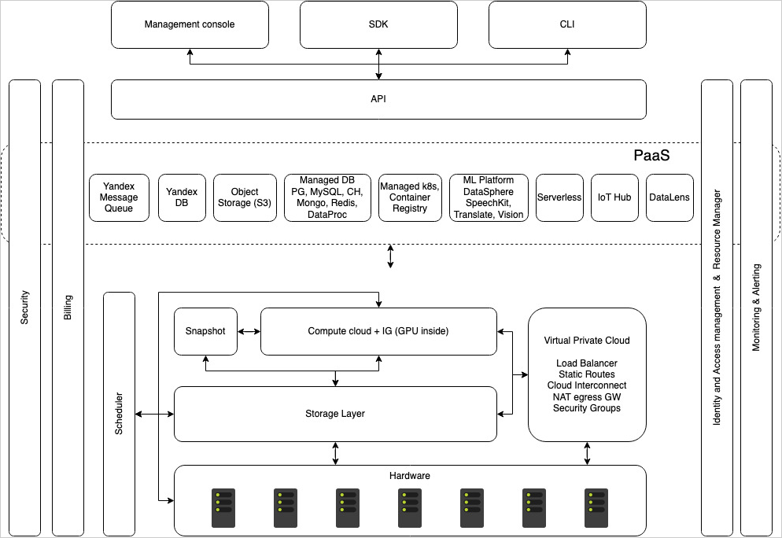
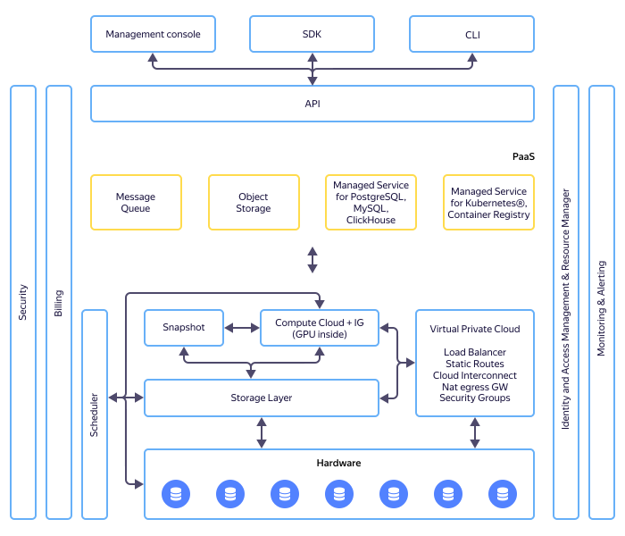

# Архитектура платформы {{ yandex-cloud }}

Особенность архитектуры {{ yandex-cloud }} — единый пул унифицированных аппаратных ресурсов. В {{ yandex-cloud }} нет выделенных физических серверов управления, многие сервисы платформы развернуты на таких же [виртуальных машинах](../glossary/vm.md)виртуальных машинах, как и у внешних пользователей. 

Такой подход позволяет легко масштабировать платформу: с минимальными затратами автоматически подключать дополнительную инфраструктуру — от одного сервера до целого дата-центра с тысячами машин. 

Архитектура {{ yandex-cloud }} выглядит так:









В основе {{ yandex-cloud }} — хранилище данных и системной информации всех сервисов (Storage Layer). Storage Layer использует разработанную в Яндексе СУБД {{ ydb-full-name }}, которая позволяет надежно и эффективно размещать данные, а также выдерживать большие нагрузки и горизонтально масштабироваться с ростом {{ yandex-cloud }}. С помощью специального механизма репликации {{ ydb-short-name }} охватывает все аппаратные хранилища, доступные {{ yandex-cloud }}. 

Поверх хранилища построен сервис {{ compute-full-name }}. Он позволяет управлять виртуальными машинами, которые используются как внешними пользователями, так и внутренними компонентами платформы. Гипервизором служит KVM, а эмулятором — QEMU. Для [виртуализации](../glossary/virtualization)виртуализации устройств используются VirtIO-драйверы. Важной частью связки виртуальных машин и аппаратной инфраструктуры является Scheduler. Именно он определяет, на каком физическом сервере будет развернута виртуальная машина. 

На этом же уровне находятся другие сервисы категории [Infrastructure]({{ link-cloud-services-infrastructure }}).

Уровнем выше — платформенные сервисы (Platform as a Service, PaaS). В их число входят сервисы категории Data Storage & Analytics, Machine Learning & Artificial Intelligence (например, {{ speechkit-full-name }}, {{ translate-full-name }})Containers и другие. 

Сервисы {{ iam-name }} ({{ iam-short-name }}) и {{ resmgr-name }} помогают управлять доступом к ресурсам с помощью ролей (role-based access control): каждый пользователь получает роль, которая разрешает некоторые операции. Например, роль {{ roles-editor }} позволяет создавать, удалять и редактировать ресурсы, но не позволяет управлять доступом к ним. 