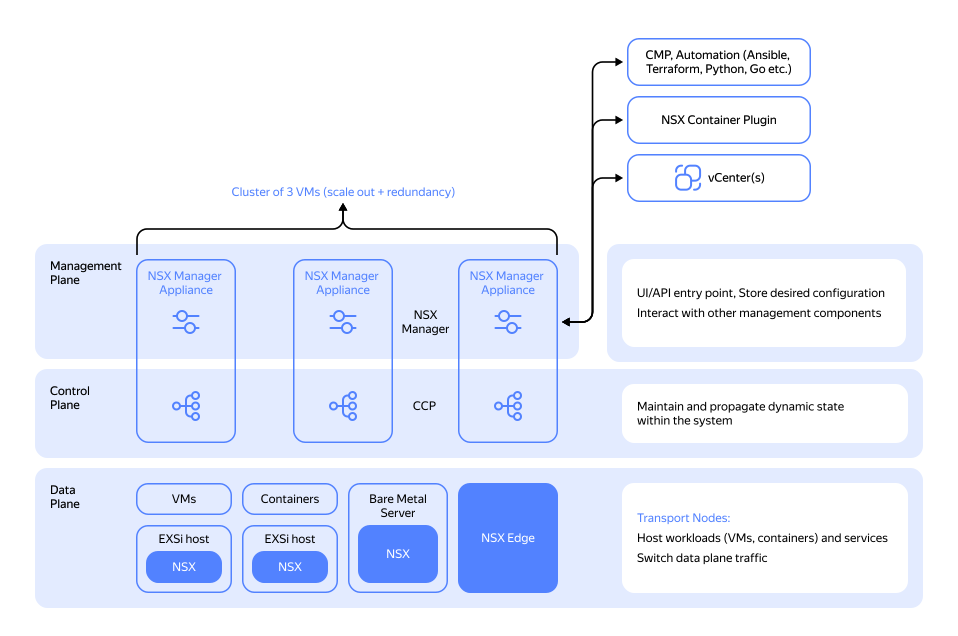
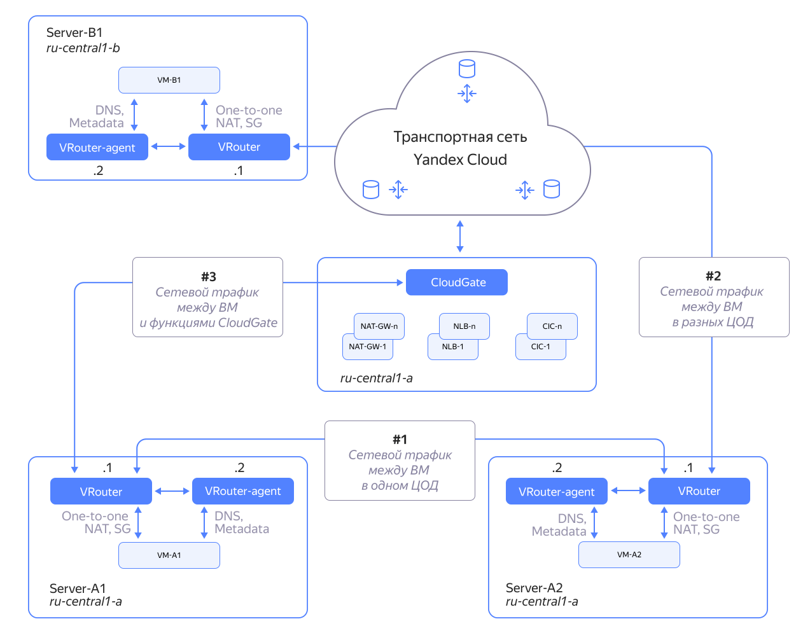
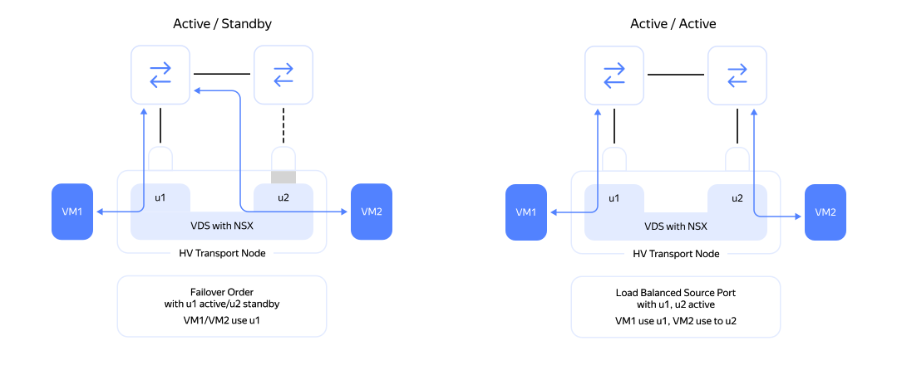
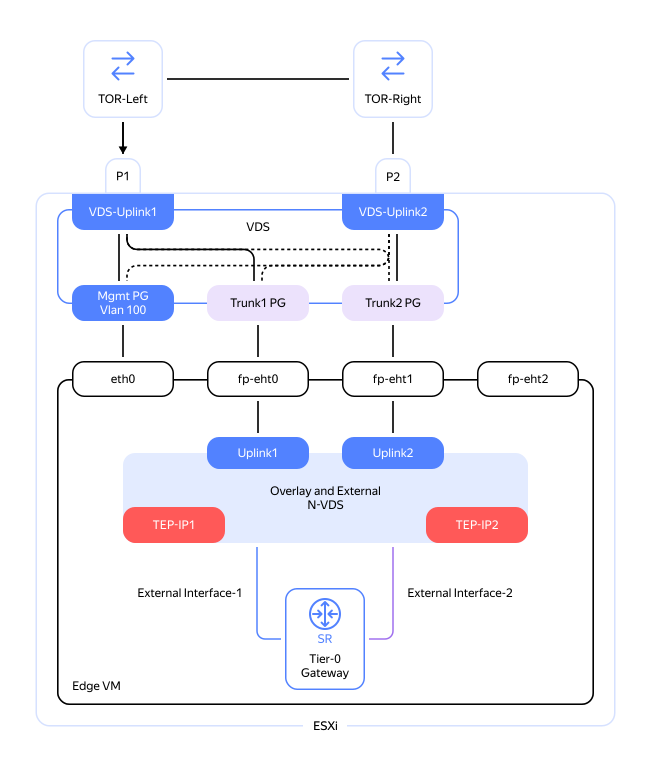

# Сетевая подсистема (Network)

## Общая архитектура VMware NSX {#architecture-vmware-nsx}

VMware использует для своих платформ собственную сетевую архитектуру NSX-T, которая подробно описана в [дизайн-гайде](https://communities.vmware.com/t5/VMware-NSX-Documents/VMware-NSX-T-Reference-Design/ta-p/2778093).

## Виртуальная сеть в {{ yandex-cloud }} {#yc-network}

Подробное описание виртуальной сети {{ yandex-cloud }} рассмотрено в [документации](../../../vpc/concepts/network-overview.md).

Основные компоненты сетевой архитектуры NSX-T:

* **Data Plane** — уровень передачи данных. Основная задача — производительная и надежная передача сетевого трафика внутри и из NSX-фабрики.

* **Control Plane** — уровень передачи и хранения маршрутной информации. Основная задача данного уровня — обновление и надежное хранение необходимых для обеспечения сетевой связности таблиц: маршрутных, ARP- и TEP-таблиц.

* **Management Plane** — уровень мониторинга и управления NSX сетью. Основная задача данного уровня — настройка, мониторинг NSX-сети и автоматизация работы NSX через API.

На уровнях Control Plane и Management Plane используется кластеризация, при этом для экономии количества виртуальных машин оба процесса — Control и Management Plane — расположены на одной и той же виртуальной машине NSX Manager Appliance, но выбор «мастера» в кластерах Control Plane и Management Plane происходит независимо.

Над уровнем Management Plane расположен уровень CMP (Cloud Management Platform) — уровень облачной оркестрации, который позволяет построить частное облако на базе программно определяемого центра обработки данных.

## Сравнение основных компонентов сетевой архитектуры {#comparison}

### Уровень Data Plane {#data-plane}

#|
|| **VMware Cloud Director** | **{{ yandex-cloud }}** ||
|| На этом уровне расположены как распределенные компоненты — маршрутизатор NSX, так и сосредоточенные компоненты (работающие на выделенных узлах) — NSX Edge (виртуальные машины или bare-metal-серверы, которые обеспечивают высокопроизводительный стык оверлейной NSX-сети с физической сетью ЦОД). 
| Аналогичный подход к построению SDN используется в {{ yandex-cloud }}: внутри каждого гипервизора есть компоненты vRouter, которые занимаются маршрутизацией и обработкой сетевых пакетов, также есть cloud-gateway-компоненты, которые стыкуют SDN облака с внешним миром.

Основные различия заключаются в технологиях оверлейной инкапсуляции и обеспечении связности системных компонентов решения между собой.

Если в NSX-T используется инкапсуляция Geneve, то в {{ yandex-cloud }} — инкапсуляция MPLSoverUDP.

Оба подхода позволяют обеспечивать гранулярную балансировку сетевого трафика на уровне транспорта, а также при необходимости «расширять» заголовок для передачи дополнительной служебной информации на уровне транспорта (телеметрия, трассировка). ||
|#

### Уровни Control Plane и Management Plane {#control-management-planes}

#|
|| **VMware Cloud Director** | **{{ yandex-cloud }}** ||
|| Control Plane и Management Plane NSX-T располагаются на узлах кластера NSX-T Manager (3 узла). На каждом узле запускаются процессы Control и Management Plane, и все переменные состояния системы хранятся в CorfuDB. 
| Control Plane и Management Plane в {{ yandex-cloud }} реализованы на разных узлах (в отличие от NSX-T). Кластер контроллеров может включать в себя более трех нод. ||
|#

### Транспортные зоны и узлы {#transport-zones}

#|
|| **VMware Cloud Director** | **{{ yandex-cloud }}** ||
|| Транспортные зоны NSX (TZ) определяют границы работы сетевых сегментов (VLAN и программных оверлеев).

Транспортная зона может включать несколько типов кластеров vSphere.

В NSX-T транспортные зоны могут быть оверлейными или VLAN-based. 
| В {{ yandex-cloud }} на уровне SDN аналогом NSX-T транспортной зоны оверлейного типа может являться [зона доступности](../../concepts/geo-scope.md) (AZ). Уровень L2 внутри каждой зоны доступности уникален и не «растягивается» между другими зонами.

Транспортной зоны типа VLAN в {{ yandex-cloud }} нет. Все хосты, в том числе «выделенные» (dedicated), виртуализованы, поэтому для подключения облачных нагрузок можно использовать оверлейные сегменты.

Логический коммутатор, созданный в транспортной зоне (TZ), будет работать на всех узлах виртуализованной инфраструктуры, которые добавлены как транспортные ноды в данную TZ. Аналогично LR (распределенный логический маршрутизатор), связанный с логическими коммутаторами в этой TZ, создаст экземпляр LR на каждом из узлов виртуализации, прикрепленных к транспортной зоне. ||
|#

### Виртуальные «коммутаторы» {#virtual-switches}

#|
|| **VMware Cloud Director** | **{{ yandex-cloud }}** ||
|| В случае с NSX-T речь идет именно о виртуальном коммутаторе, который работает в ядре каждого гипервизора. Он предоставляет виртуальные порты для подключения виртуальной машины к сетевой инфраструктуре через uplink — физические интерфейсы хоста. Реализует оверлейную инкапсуляцию Geneve.

В инфраструктуре NSX-T поддерживается multicast (L2/L3) и VRRP/HSRP. 
| Аналогом в {{ yandex-cloud }} является компонента vRouter — виртуальный маршрутизатор, который также работает в ядре гипервизора каждого хоста и реализует похожие функции с инкапсуляцией MPLSoverUDP (обеспечивает высокую энтропию исходящих потоков и гранулярную балансировку потоков трафика, а также потенциальную возможность использовать расширяемые заголовки для трассировки пакетов и сбора телеметрии).

Отличием vRouter от N-VDS является встроенная маршрутизация между всеми виртуальными портами, даже формально находящимися внутри одного сабнета. В N-VDS трафик группы портов, находящихся в одном сабнете, не маршрутизируется.

В связи с этим внутри {{ yandex-cloud }} не поддерживаются такие протоколы, как VRRP/HSRP, а также multicast (L2/L3). ||
|#

### Распределенные маршрутизаторы {#distributed-routers}

#|
|| **VMware Cloud Director** | **{{ yandex-cloud }}** ||
|| Все хосты NSX-T-фабрики сначала инициируются как транспортные ноды. На них устанавливаются необходимые программные компоненты для последующей настройки и мониторинга со стороны NSX-T Manager.

Для распределенной маршрутизации трафика внутри NSX-T инфраструктуры используется LR — логический маршрутизатор, который имеет сложную внутреннюю архитектуру:

  * компонента Tier1-GW — тенантная составляющая;

  * компонента Tier0-GW — межтенантная составляющая (провайдерская).

Tier1-GW и Tier0-GW имеют распределенную часть, DR (distributed router), и сервисную часть, SR (service router). DR находится на всех транспортных нодах внутри выбранной транспортной зоны, SR — только на Edge-нодах (стыковочные узлы: виртуальные или bare metal) выбранной транспортной зоны. 
| В {{ yandex-cloud }} аналогом DR (distributed router) в компонентах Tier0-GW и Tier1-GW является маршрутизирующий модуль vRouter, который работает на всех хостах облака.

Пограничные шлюзы реализованы в виде выделенных виртуальных машин, внутри которых нет составляющей распределенного маршрутизатора. В этом смысле архитектура SDN {{ yandex-cloud }} больше похожа на архитектуру NSX-v for Sphere. ||
|#

### Отказоустойчивость подключения хостов к сетевой фабрике {#fault-tolerance}

**VMware Cloud Director**

В NSX-T используются различные варианты балансировки, см. схему:

**{{ yandex-cloud }}**

В {{ yandex-cloud }} подключение хоста к физической сетевой фабрике происходит одним 25-Gbps интерфейсом, в связи с чем дополнительных сложностей в сопровождении (настройке и диагностике) teaming policy на серверах не возникает.

### Стык SDN-фабрик с внешним миром и сервисные ноды {#junction}

**VMware Cloud Director**

В NSX-T Edge ВМ устроена достаточно сложно.

Внутри — свой собственный виртуальный коммутатор с uplink и внутренними портами, см. схему:

 

В NSX-T Edge-нода помимо маршрутизации трафика выполняет и сервисные функции: NAT, VPN, FW периметра, базовая балансировка нагрузки, DHCP-сервер.

NAT в NSX-T работает внутри SR-компонент Tier0-GW или Tier1-GW на Edge-ноде.

В NSX-T на SR-компоненте Tier0-GW Edge-ноды можно настроить Firewall периметра.

На SR-компонентах Tier0-GW и Tier1-GW есть возможность настроить VPN IPSEC (policy-based). 

**{{ yandex-cloud }}**

В {{ yandex-cloud }} пограничные ноды Cloud Gateway устроены чуть проще, так же как в NSX-v for vSphere, — это выделенные виртуальные машины без дополнительного виртуального коммутатора внутри

NAT (network address translation) выполняется непосредственно в гипервизоре хоста, где расположена виртуальная машина, которой присвоен «белый» IP-адрес. Внутри хоста работает распределенный 1-to-1 NAT.

В {{ yandex-cloud }} можно запустить NAT из виртуальной машины, развернув либо сервис egress NAT GW (доступ из облака), либо выделенную пользовательскую [ВМ с NAT-функциональностью](../../../tutorials/routing/nat-instance/index.md).

Сервисных VPN, так же как и сервисных Firewall, в облаке пока нет. При этом вы можете подключить данные функции из образов, доступных на маркетплейсе или сделанных самостоятельно. Для упрощения процесса создали раздел в документации «Практические руководства», а также репозиторий на [GitHub](https://github.com/yandex-cloud/yc-solution-library-for-security):

  * [настройка Firewall](../../../tutorials/routing/network-segmentation-checkpoint.md)

  * [настройка VPN](../../../tutorials/routing/ipsec/index.md)

### Внутренняя маршрутизация и интеграция с внешними сетями {#internal-routing}

**VMware Cloud Director**

Внутри SDN (не на уровне транспорта) NSX-T используют статические маршруты.

Есть поддержка IPv4 и IPv6.

Для реализации внешнего доступа NSX-T может использовать протоколы OSPF и eBGP на Edge-нодах (а точнее, на Tier0-GW SR Edge-ноды):

**{{ yandex-cloud }}**

Аналогично в {{ yandex-cloud }} внутри SDN используют статические маршруты.

Есть поддержка IPv4, но не поддерживается IPv6.

Для реализации выделенного подключения on-premise-инфраструктуры заказчика к облаку подключается сервис для создания приватных выделенных сетевых соединений - [{{ interconnect-name }}](../../../interconnect/concepts/index.md), который использует eBGP для обмена маршрутной информацией. 

 

### Производительность работы сети {#efficiency}

#|
|| **VMware Cloud Director** | **{{ yandex-cloud }}** ||
|| В NSX-T есть возможность использовать выделенные кластеры под определенный класс нагрузок.

Для высокопроизводительного стыка с внешним миром в NSX-T есть возможность использовать кластеры Bare Metal Edge.

Для того чтобы снять с гостевой ВМ нагрузку, связанную с обработкой сетевого трафика в NSX-T, вы можете реализовать оффлоад оверлейной инкапсуляции с использованием технологий SR-IOV/DPU/SmartNICs. 
| В {{ yandex-cloud }} можно использовать [выделенные виртуализованные хосты](../../../compute/concepts/dedicated-host.md).

Также есть возможность настроить [программно-ускоренную сеть](../../../compute/concepts/software-accelerated-network.md) для распределения нагрузки. ||
|#

### Балансировка нагрузки {#load-balancer}

#|
|| **VMware Cloud Director** | **{{ yandex-cloud }}** ||
|| В NSX-T для балансировки нагрузки можно использовать либо встроенный L7-балансировщик, либо VMware NSX Advanced Load Balancer (AVI).

Оба варианта позволяют реализовать балансировку трафика на уровнях L4 и L7. 
| В {{ yandex-cloud }} есть возможность использовать отдельно балансировщик уровня L4 — [{{ network-load-balancer-name }}](https://yandex.cloud/ru/services/network-load-balancer) (NLB) и L7 — [{{ alb-name }}](https://yandex.cloud/ru/services/application-load-balancer) (ALB).

Сервис балансировки трафика на уровне приложения (ALB) также может играть роль ingress в Managed K8s (аналогично NSX-T Basic / Advanced Load Balancer). ||
|#

### Безопасность и микросегментация {#security}

#|
|| **VMware Cloud Director** | **{{ yandex-cloud }}** ||
|| В NSX-T нет встроенных средств защиты от DDoS-атак. Данные сервисы подключаются отдельно.

Для решения задач микросегментации и защиты от внутренних атак в NSX-T есть набор средств под названием NSX-T Security, куда входят NSX-T Distributed FW (Application-Layer Gateway + L7-фильтрация), distributed IDS и Malware prevention.

Для обеспечения защиты периметра в NSX-T есть встроенный Gateway Firewall, который настраивается на NSX-T Edge. Это не Next-Generation Firewall, но он может осуществлять FQDN-анализ и URL-фильтрацию. 
| В {{ yandex-cloud }} есть средства защиты от DDoS-атак — [{{ ddos-protection-name }}](https://yandex.cloud/ru/services/ddos-protection) и [{{ sws-name }}](https://yandex.cloud/ru/services/smartwebsecurity).

Также вы можете подключить [Security Groups](../../../vpc/concepts/security-groups.md) разграничения сетевого доступа, которые обеспечивают L4-statefull-фильтрацию трафика на уровне гипервизора, при этом за всеми сетевыми интерфейсами виртуальных машин в облаке может быть настроен свой собственный L4-Firewall.

Аналога distributed IDS и distributed Malware Protection в {{ yandex-cloud }} на данный момент нет, в качестве альтернативы можно использовать специализированные пользовательские ВМ из [маркетплейса](https://yandex.cloud/ru/marketplace?search=ids&categories=security), но в таком случае необходима [сегментация сети](../../../tutorials/routing/network-segmentation-checkpoint.md). ||
|#

### Сетевая диагностика {#network-diagnostics}

**VMware Cloud Director**

Для поиска и устранения неисправностей, связанных с сетевой связностью внутри оверлейного сегмента сети, в NSX-T можно использовать встроенный инструмент [Traceflow](https://docs.vmware.com/en/VMware-NSX-T-Data-Center/3.2/administration/GUID-A85621BC-1CFD-4703-846A-2B3D36E7ABAC.html). Он позволяет не только проверить топологию и целостность виртуальных каналов, но и провести комплексную data-plane-диагностику кастомным сетевым пакетом.

Для диагностики проблем на стыках между виртуальной и физической сетью, а также построения карты сетевых взаимодействий информационных систем между собой в NSX-T используется [VMware Aria Operations for Networks](https://www.vmware.com/products/cloud-infrastructure/aria-operations-for-networks#features). 

**{{ yandex-cloud }}**

В {{ yandex-cloud }} диагностикой проблем на стыках между виртуальной и физической сетями занимается сетевая команда, которая использует собственные инструменты по оперативной сетевой диагностике.

Для поиска проблем в оверлейных (облачных) сетях {{ yandex-cloud }} есть инструмент под названием [Карта облачной сети](../../../vpc/concepts/network.md#map). Карта позволяет быстро проверить корректность настройки виртуальной сетевой связности между объектами облака (cloud wiring).

