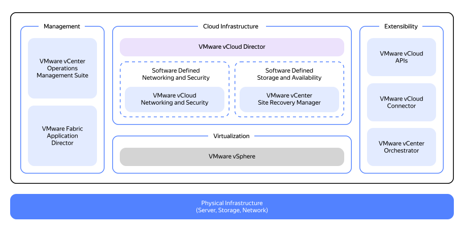

# Ресурсно-ролевая модель

Сравним модели организации частного облака — VMware Cloud Director (vCloud Director или vCD) и {{ yandex-cloud }}.

## Ресурсная модель VMware {#resource-vmware}

_VMware Cloud Director_ — продукт, реализующий мультитенантный подход, при котором каждый заказчик изолированного контейнера ресурсов получает его в рамках логических границ безопасности.

vCloud Director представляет собой абстракцию, которая скрывает:

* уровень кластеров физических серверов VMware ESXi и дата-центры, где они размещены;
* элементы управления в виде `vCenter Server` — управляющие кластерами ESXi.

Ресурсная модель VMware Cloud Director (vCD) представлена на схеме ниже.

Исходя из данной схемы, мы можем выделить в архитектуре vCD основные уровни:

* На нижнем уровне архитектуры — физическое оборудование.
* На физических серверах — уровень виртуализации VMware ESXi. Все гипервизоры VMware ESXi группируются в кластеры и управляются VMware vCenter — данная интеграция называется _vSphere_. В vSphere создаются пулы ресурсов, виртуальные коммутаторы (Distributed vSwitch) и подключаются общие хранилища для виртуальных машин.
* Каждый vCenter интегрируется с менеджером оверлейных сетей VMware NSX-T с одной стороны и управляется веб-порталом Cloud Director.
* В Cloud Director располагаются пользователи, организации и виртуальные машины, логически разделенные между разными организациями (Tenants).
vCD взаимодействует с vCenter Server через vSphere API.

Решение vCD предполагает мультитенантность, поэтому наследование модели пользователей и групп от vSphere выглядит нереализуемым.

У vCD есть свой собственный Identity Provider с субъектами и ролевой моделью. Интеграция тенантов Cloud Director с Active Directory возможна через SAML-федерацию по схеме Service Provider Initiated Web SSO.

## Ресурсная модель {{ yandex-cloud }} {#resource-yc}

Все ресурсы {{ yandex-cloud }}: [виртуальные машины](../../../compute/concepts/vm.md), [диски](../../../compute/concepts/disk.md), [сети](../../../vpc/concepts/network.md#network) и другие — размещаются в [каталогах](../../../resource-manager/concepts/resources-hierarchy.md#folder). При создании ресурса указывается каталог, в котором ресурс будет создан.

Каждый каталог принадлежит одному [облаку](../../../resource-manager/concepts/resources-hierarchy.md#cloud). Не существует каталогов вне облака. Нельзя создать каталог внутри другого каталога.

[Облака](../../../resource-manager/concepts/resources-hierarchy.md#cloud) принадлежат организациям.

Организации изолированы друг от друга. Ресурсы одной организации не могут взаимодействовать с ресурсами другой средствами {{ yandex-cloud }}. Сервис [{{ org-full-name }}](../../../organization/) управляет организациями.

Внутри организации вы можете настроить доступ к ресурсу на [уровнях](../../../resource-manager/concepts/resources-hierarchy.md#access-rights-inheritance):

* Организация.
* Облако.
* Каталог.
* Отдельный ресурс, если сервис поддерживает разграничение доступа на этом уровне.

По умолчанию новый пользователь — участник организации не имеет доступа к ресурсам в облаках организации. Права доступа ему необходимо выдать явно: назначить роль непосредственно на ресурс или на каталог, облако или организацию этого ресурса.

Подробнее с ресурсной моделью можно ознакомиться в [документации](../../../resource-manager/concepts/resources-hierarchy.md).

Ниже приведем основные концепции Cloud Director и сущности vSphere в сравнении с {{ yandex-cloud }}.

## Сравнение ресурсных моделей {#resource-models-comparison}

### Виртуальная инфраструктура (Virtual Datacenters) {#virtual-datacenters}

#|
|| **VMware Cloud Director** | **{{ yandex-cloud }}** ||
|| _Virtual Datacenters (vDC)_ — изолированная среда, предоставляемая пользователю облака для размещения ресурсов, хранения и эксплуатации приложений и систем.

Для vDC администраторы облака задают квоты на число vCPU, объем RAM и объем дискового пространства для виртуальных дисков виртуальных машин. Структурно vDC является дочерним контейнером в организации. Архитектурно — один vDC равен соответствующему инстансу vCenter Server. При создании vDC со стороны vSphere задаются ресурсный пул (Resource Pool) с информацией о квотах vCPU/RAM и политика хранения. 
| Ближайшим аналогом vDC является облако (Cloud) — дочерний контейнер организации. Разница в том, что облако не привязано к конкретной зоне доступности и представляет логическую геораспределенную организационную единицу. ||
|#

### Организации (Organizations) {#organizations}

#|
|| **VMware Cloud Director** | **{{ yandex-cloud }}** ||
|| _Organizations_ — корневой контейнер для администрирования пользователей, групп, федераций удостоверений и вычислительных ресурсов.

Системные администраторы облака (администраторы сервис-провайдера) могут создавать и инициализировать организации.

Администраторы организаций (администраторы тенанта) могут создавать пользователей, группы и каталоги услуг.

Создание организаций пользователем облака на базе vCD не предусмотрено. Администраторы тенанта не имеют доступа на уровень инфраструктуры облака. 
| В {{ yandex-cloud }} организации также являются корневыми контейнерами ресурсов и предназначены для управления субъектами, группами субъектов, федерациями удостоверений и нижележащими каталогами и сервисами. ||
|#

### Пользователи и сервисные аккаунты (Users & Service Accounts) {#users-sa}

#|
|| **VMware Cloud Director** | **{{ yandex-cloud }}** ||
|| Администраторы организации могут создавать пользователей, группы пользователей или сервисные аккаунты вручную или программно либо интегрироваться со службой каталогов, такой как LDAP, через SAML-федерацию.

По умолчанию пользователи / группы пользователей относятся к соответствующей организации и управляются Cloud Director. При этом все действия с виртуальными машинами, сетями и контейнерами Tanzu выполняются в системной учетной записи с правами администратора в vSphere. 
| Каждый пользователь платформы {{ yandex-cloud }} имеет свой аккаунт, который используется для идентификации при выполнении операций с ресурсами.

Это может быть аккаунт Яндекс ID или федеративный аккаунт федерации удостоверений.

Также существуют сервисные аккаунты — особый тип аккаунтов, от имени которых ваши программы могут выполнять операции с ресурсами {{ yandex-cloud }}. Подробнее об [аккаунтах](../../../iam/concepts/users/accounts.md). ||
|#

### Управление сетями (Organization Networks) {#organization-networks}

#|
|| **VMware Cloud Director** | **{{ yandex-cloud }}** ||
|| Управление сетями в VMware Cloud Director осуществляется за счет Organization Networks. При этом сеть доступна только определенной организации и всем vApps в организации. При необходимости такие сети можно подключить к внешним сетям. 
| В {{ yandex-cloud }} за аналогичный функционал отвечает сервис {{ vpc-name }}, который располагается в каталогах.

Ключевым отличием {{ yandex-cloud }} {{ vpc-short-name }} от Organization Networks в VMware является реализация сценария multi-folder, при котором сеть VPC может быть доступна в пределах одного облака. ||
|#

### Каталог (vApp) {#vapp}

#|
|| **VMware Cloud Director** | **{{ yandex-cloud }}** ||
|| В VMware _vApp_ — дочерний vDC контейнер, содержащий одну или несколько виртуальных машин. vApps может объединять несколько виртуальных машин, работающих вместе, как единый стек взаимосвязанных систем или приложений внутри ВМ.

vApp позволяет управлять порядком запуска и остановки ВМ, при этом если хотя бы одна ВМ в vApp выключена — vApp считается запущенным частично. Расположение Cloud Director VM вне vApp не предусмотрено. 
| В {{ yandex-cloud }} ближайшим аналогом vApp, с одной стороны, является каталог (Folder), однако тут требуется пояснение: каталогом в {{ yandex-cloud }} является контейнер ресурсов и сервисов, выполняющий функцию размещения и изоляции сервисов (большинство сервисов облака размещается именно в каталогах) и не предполагающий управления сервисами как единой сущностью (за эту функцию отвечают другие инструменты оркестрации).

С другой стороны, для управления порядком запуска группы виртуальных машин в {{ yandex-cloud }} существует сервис [Instance Groups](../../../compute/concepts/instance-groups/index.md). ||
|#

## Сравнение ролевой модели {#role-models-comparison}

Как в vCloud Director, так и в {{ yandex-cloud }} роли — это набор разрешений, который определяет допустимые действия пользователей и операции с ресурсами.

#|
|| **vCloud Director** | **{{ yandex-cloud }}** ||
|| _Сервис-провайдер_ — компания, предоставляющая облачные услуги. | - ||
|| _Тенант (заказчик)_ — пользователь облачных ресурсов. | - ||
|| По умолчанию в Cloud Director есть предустановленные роли:

  * `Organization Administrator` — роль для администрирования организации (полный доступ).

  * `Catalog Author` — права на создание и публикацию новых каталогов с шаблонами.

  * `Console Access Only` — права на просмотр статуса виртуальной машины, свойств и использования гостевой ОС через консоль.

  * `Defer to Identity Provider` — передача прав в соответствии с данными, полученными от внешних Identity Provider.

  * `vApp Author` — права на использование каталога и создание vApp.

  * `vApp User` — пользователи, которые пользуются vApp, созданными другими.

  * `Kubernetes Cluster Author` — права на создание и управление кластерами Kubernetes. 
| Роли бывают двух типов:

  * _Примитивные_ — содержат разрешения, действующие для всех типов ресурсов {{ yandex-cloud }}. Это роли `admin`, `editor`, `viewer` и `auditor`.

  * _Сервисные_ — содержат разрешения только для определенного типа ресурсов в указанном сервисе. Например, роль `compute.images.user` позволяет использовать образы в сервисе {{ compute-full-name }}.

Сервисную роль можно назначить на ресурс, для которого предназначена роль, или на ресурс, от которого наследуются права доступа. Например, роль `compute.images.user` можно назначить на каталог или облако, так как образ наследует разрешения от них.

Подробное описание примитивных и сервисных ролей, а также их иерархии — в документации [{{ iam-short-name }}](../../../iam/concepts/access-control/roles.md) и [{{ resmgr-name }}](../../../resource-manager/concepts/resources-hierarchy.md). ||
|| Кастомные роли возможно создать только с привлечением администраторов VMware Cloud Director. Состав таких ролей определяется сервис-провайдерами или создается для тенанта через техподдержку. 
| На данный момент пользователи не могут создавать новые роли со своим набором разрешений. ||
|#