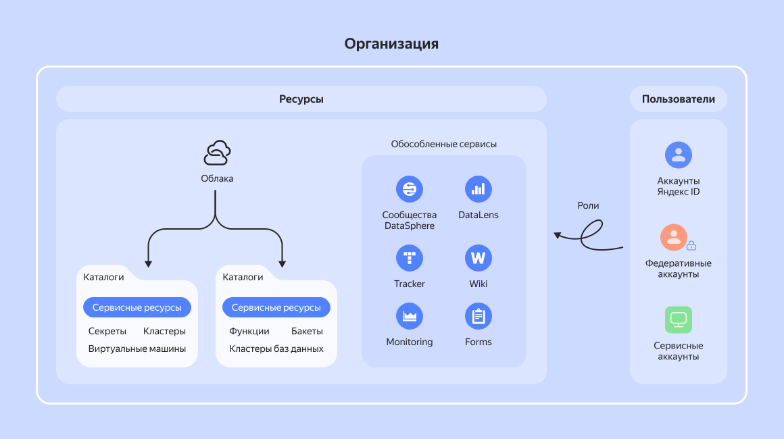

# Взаимодействие пользователей и ресурсов {{ yandex-cloud }}

Все сервисы платформы {{ yandex-cloud }} построены на принципах общей _ресурсно-ролевой модели_ взаимодействия. В основе модели лежат _организации_, которые объединяют разные типы ресурсов и пользователей в единое рабочее пространство. Добавление пользователей и управление пользователями происходит на уровне организации, подробнее см. в статье [{#T}](../organization/concepts/membership.md).

## Ресурсы {{ yandex-cloud }} {#resources}

При работе с сервисами {{ yandex-cloud }} вы создаете _ресурсы_: [виртуальные машины](../compute/concepts/vm.md), кластеры управляемых баз данных и [{{ k8s }}](../managed-kubernetes/concepts/index.md), [реестры](../container-registry/concepts/registry.md), [секреты](../lockbox/concepts/secret.md) и многие другие. Большинство сервисов хранит создаваемые ресурсы в [каталогах](../resource-manager/concepts/resources-hierarchy.md#folder). Каталоги принадлежат [облакам](../resource-manager/concepts/resources-hierarchy.md#cloud), а облака — организациям. 

Кроме этого, в организации могут быть активированы [{{ ml-platform-full-name }}]({{ link-datasphere-main }}), экземпляр [{{ datalens-full-name }}]({{ link-datalens-main }}) и сервисы [{{ tracker-full-name }}]({{ link-tracker }}), [{{ wiki-full-name }}]({{ link-wiki }}), [{{ forms-full-name }}]({{ link-forms-b2b }}), [{{ speechsense-full-name }}]({{ link-speechsense-main }}). Все они самостоятельно хранят свои ресурсы, но могут обмениваться информацией с другими сервисами в рамках одной организации. Организации не взаимодействуют друг с другом.

В [интерфейсе {{ cloud-center }}]({{ cloud-center-link }}) можно посмотреть, какие сервисы существуют в вашей организации. 

[Подробнее об иерархии ресурсов {{ yandex-cloud }}](../resource-manager/concepts/resources-hierarchy.md).

## Пользователи {#users}

Каждый пользователь платформы {{ yandex-cloud }} имеет свой _аккаунт_, который используется для идентификации при выполнении операций с ресурсами. Это может быть аккаунт [Яндекс ID](https://yandex.ru/id/about), федеративный аккаунт [федерации удостоверений](../organization/concepts/add-federation.md) или локальный аккаунт из [пула пользователей](../organization/concepts/user-pools.md). Также существуют сервисные аккаунты — особый тип аккаунтов, от имени которых ваши программы могут выполнять операции с ресурсами {{ yandex-cloud }}. [Подробнее об аккаунтах](../iam/concepts/users/accounts.md).

Любой пользователь состоит как минимум в одной организации. При первом входе в {{ yandex-cloud }} с Яндекс ID появится приглашение зарегистрировать свою организацию. После создания организации можно подключать и отключать сервисы {{ yandex-cloud }}, создавать облака, каталоги и другие ресурсы.

В организацию можно приглашать других участников с аккаунтами на Яндексе, чтобы они имели доступ к сервисам и ресурсам организации. Если в компании уже используется другая система управления учетными данными, например, [Active Directory](https://learn.microsoft.com/windows-server/identity/ad-ds/get-started/virtual-dc/active-directory-domain-services-overview) или [Keycloak](https://www.keycloak.org/), можно [настроить федерацию удостоверений](../organization/concepts/add-federation.md). Тогда сотрудники смогут использовать свои рабочие аккаунты для доступа к сервисам {{ yandex-cloud }}. Кроме того, в организации можно [создать пул пользователей](../organization/operations/user-pools/create-userpool.md) и, добавив в него [домен](../organization/concepts/domains.md), создавать в организации [локальные пользовательские аккаунты](../iam/concepts/users/accounts.md#local).

Для массового управления доступом пользователей можно объединять в [группы](../organization/operations/manage-groups.md).

## Управление доступом {#access}

Контроль над доступом к ресурсам {{ yandex-cloud }} осуществляется с помощью [ролей](../iam/concepts/access-control/roles.md). Чтобы аккаунт (_субъект_) мог выполнять действия с ресурсом (_объектом_), ему или группе, в которой он состоит, необходимо назначить соответствующие роли на этот ресурс. По сути, каждая роль — это список разрешенных операций, которые можно выполнять с объектом. За управление правами доступа в {{ yandex-cloud }} отвечает сервис [{{ iam-full-name }}](../iam/concepts/index.md).

Для аутентификации пользователей сервисы {{ yandex-cloud }} запрашивают [учетные данные](../iam/concepts/authorization/index.md). Тип запрашиваемых данных зависит от типа аккаунта, сервиса и интерфейса обращения. При работе с [API](api.md) также требуется [идентификатор каталога](../resource-manager/operations/folder/get-id.md), чтобы однозначно определить ресурс и проверить разрешения. Если действия выполняются от имени сервисного аккаунта, по умолчанию используется идентификатор каталога этого аккаунта.
