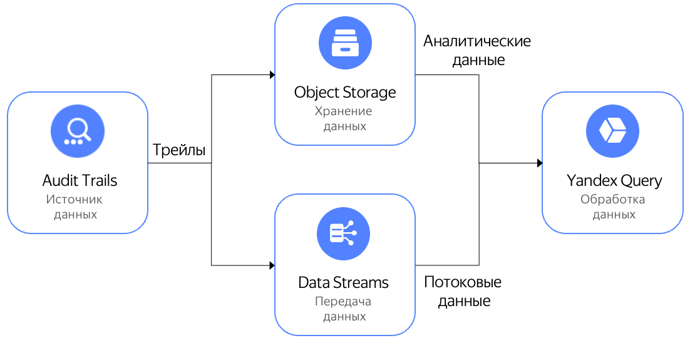

{{at-full-name}} и {{yq-full-name}} интегрированы между собой, что позволяет как решать типичные задачи поиска в аудитных логах, так и выполнять свои собственные поиски, выраженные на языке YQL.

## Типичные задачи поиска в {{at-full-name}}

В {{yq-full-name}} заранее подготовлены запросы для типовых сценариев поиска данных в трейлах {{at-full-name}}. 

Например, с помощью типовых сценариев поиска можно: 
- Найти, кто удалил фолдер.
- Найти, кто добавил доступ к серийной консоли ВМ.
- Найти, кто изменил права на доступ к бакету {{objstorage-full-name}}.
- Найти, кто получил права администратора.

Полный список поисков и их описания доступны [в репозитории на github](https://github.com/yandex-cloud/yc-solution-library-for-security/tree/master/auditlogs/_use_cases_and_searches). 

## Настройка {{at-full-name}}

Для начала работы необходимо [предварительно настроить {{ at-full-name }}](../../audit-trails/quickstart.md).

## Настройка интеграции {{at-full-name}} и {{yq-full-name}}

Для настройки интеграции выполните следующие действия:
1. Перейдите к списку трейлов в консоли {{yandex-cloud}}.
1. Выберите необходимый трейл и нажмите кнопку **Обработать в YQ**.
1. При первом переходе из {{at-full-name}} в {{yq-full-name}} необходимо выполнить настройку интеграции:
   1. В интерфейсе **{{yq-full-name}}** в диалоге создания подключения выбрать сервисный аккаунт, от имени которого будет выполнять чтение данных из {{objstorage-full-name}} и нажать кнопку **Создать**.
   1. В интерфейсе **{{yq-full-name}}** в диалоге создания привязки к данным проверить предустановленные параметры, нажав кнопку **Предпросмотр**, после чего завершить интеграцию, нажав кнопку **Создать**.
   1. После завершения настроек интеграции, вы будете автоматически перемещены в раздел **Audit Trails**.

## Исполнение аналитических запросов к данным, хранимых в {{objstorage-full-name}}

Для выполнения запросов к аналитическим данным {{at-full-name}}, хранящимся в {{objstorage-full-name}}, выполните следующие действия:
1. В разделе **Audit Trails** в интерфейсе **{{yq-full-name}}** выберите тип анализа данных **Аналитический**, а в списке [привязок к данным](../../query/concepts/glossary.md#binding) выберите нужную, если их несколько.
1. Выберите нужный запрос к данным из {{objstorage-full-name}} из списка и нажмите кнопку **Выполнить**.

## Исполнение потоковых запросов к данным, передаваемых через {{yds-full-name}}

Для выполнения запросов к потоковым данным {{at-full-name}}, передающихся через {{yds-full-name}}, выполните следующие действия:
1. В разделе **Audit Trails** в интерфейсе **{{yq-full-name}}** выберите нужный тип анализа данных: **Потоковый**, а в списке [привязок к данным](../../query/concepts/glossary.md#binding) выберите нужную, если их несколько.
1. Выберите нужный запрос к данным из {{objstorage-full-name}} из списка и нажмите кнопку **Выполнить**.

## Работа с результатами

В зависимости от типов обрабатываемых данных: потоковых или аналитических — существуют различные варианты работы с результатами.

### Работа с результатами аналитический обработки данных
Результаты аналитической обработки данных можно:
1. Скачать через интерфейс пользователя {{yq-full-name}} с помощью кнопки **Экспорт**.
1. [Сохранить в бакет](../../query/sources-and-sinks/object-storage-write.md) {{objstorage-full-name}}.
1. [Визуализировать](../../query/tutorials/datalens.md) в {{datalens-full-name}}.
1. Получить и обработать через [{{yq-full-name}} HTTP API](../api/index.md).

### Работа с результатами потоковй обработки данных
Результаты потоковой обработки данных можно:
1. [Отправить в {{monitoring-full-name}}](../../query/sources-and-sinks/monitoring.md) в виде метрик.
1. [Отправить в выходной поток {{yds-full-name}}](../../query/sources-and-sinks/data-streams-write.md) в виде данных, откуда их можно обработать с помощью [триггеров {{sf-full-name}}](../../functions/operations/trigger/data-streams-trigger-create.md).

## Смотрите также
* [{{objstorage-full-name}}](../../storage/).
* [{{yds-full-name}}](../../data-streams/).
* [{{datalens-full-name}}](../../datalens/).
* [{{sf-full-name}}](../../functions/).