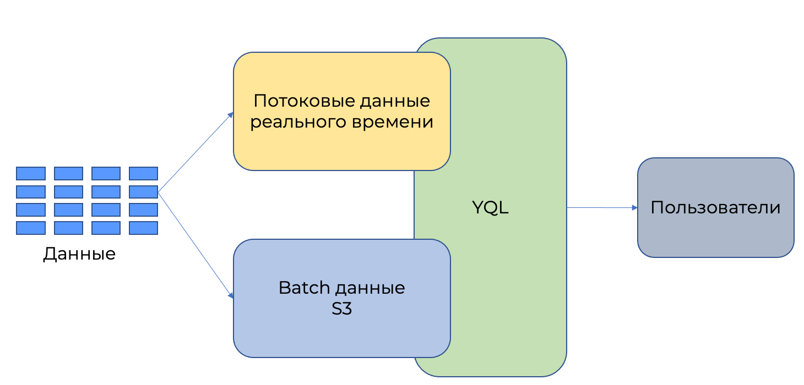

# Обзор {{ yq-full-name }}

{{ yq-full-name }} – это сервис обработки данных, способный выполнять запросы к объектному хранилищу [{{objstorage-full-name}}](../../storage/concepts/index.md), потокам данных реального времени [{{yds-full-name}}](../../data-streams/concepts/index.md) с помощью единого диалекта SQL – YQL, агрегировать результаты выполнения запросов между этими системами. 

{{ yq-full-name }} является полностью управляемым облачным решением, это означает, что нет необходимости иметь запущенные сервера, на которых развернуто ПО. Все необходимые ресурсы для исполнения запросов выделяются в момент их запуска и освобождаются после завершения, а сами запросы начинают исполняться немедленно.

{{ yq-full-name }} позволяет:

* Использовать один и тот же разработанный запрос для сценариев [аналитики данных](../../glossary/data-analytics.md)аналитики данных, хранимых в {{objstorage-full-name}}, и аналитики данных реального времени.
* Агрегировать результаты исполнения запросов между различными системами.
* Уменьшить расходы на разработку за счет общего языка – YQL и общих подходов.

{{ yq-full-name }} объединяет возможности [виртуализации](../../glossary/virtualization.md)виртуализации данных и систему потоковой аналитики реального времени. Такая архитектура системы называется [Unified Lambda](../concepts/unified-processing.md).

В модели Unified Lambda используется единый текст SQL-запроса для обработки потоковых данных и данных, хранимых в различных классах систем хранения.

## Поддержка хранилищ «сырых» данных

Большие объемы данных с редким доступом компании предпочитают хранить в объектных хранилищах класса {{ objstorage-full-name }}. Долгосрочное хранение данных с редкой обработкой в таких хранилищах является наиболее экономически выгодными. При этом данные в {{ objstorage-full-name }} хранятся в неструктурированном виде и эти данные необходимо обрабатывать простым и удобным для аналитиков способом. 

## Потоковая обработка данных

Потоковая обработка основана на группирующих оконных функциях, которые получают потоки данных, группируют их по источникам и временным окнам, после чего выполняют расчеты, а результаты исполнения отправляют во внешние системы. Особенностью {{ yq-full-name }} является единый текст SQL-запроса, который используется как для потоковой, так и для аналитической обработки.

## Интеграция с внешними системами

### Потоковая обработка

Потоковые запросы могут получать данные из следующих источников:

* {{ yds-full-name }}. Данными могут являться, например, логи работы приложений, поток изменений от базы данных [Debezium](../tutorials/debezium.md) или любая другая информация.

Результаты потоковой обработки экспортируются в:

* В {{monitoring-name}} в виде метрик для построения графиков, дашбордов или алертинга.
* В {{ yds-full-name }}. C помощью {{ data-transfer-full-name }} данные из {{ yds-full-name }} могут быть отправлены в различные системы, в том числе в различные СУБД.

### Аналитическая обработка {#analytic}

Аналитические запросы {{ yq-full-name }} могут получать данные из {{ objstorage-full-name }} в [форматах JSON, CSV/TSV, Parquet, сжатых различными алгоритмами](../sources-and-sinks/formats.md). Результаты исполнения запросов можно в свою очередь сохранять в {{ objstorage-full-name }}. 

Кроме этого, результаты исполнения доступны для скачивания из интерфейса пользователя {{ yq-full-name }}.

### {{ datalens-full-name }}
С помощью {{ yq-full-name }} можно выполнять визуализацию данных, хранящихся в {{ objstorage-full-name }}.
