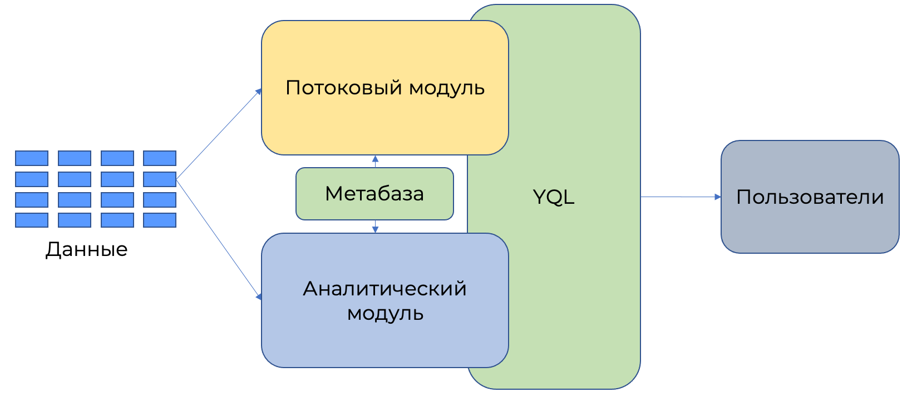
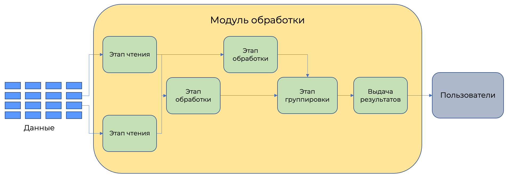

# Обработка запроса

{{ yq-full-name }} является [массивно-параллельной системой](https://en.wikipedia.org/wiki/Massively_parallel) и состоит из двух модулей: модуля аналитической обработки и модуля потокового анализа. Оба модуля хранят данные в единой метабазе запросов. Запрос может быть аналитическим или потоковым. В зависимости от типа запроса выбирается среда исполнения.

Модуль исполнения разбивает запрос на этапы, каждый из которых выполняет свою функцию. Чем более сложный запрос, тем большее число этапов участвует в исполнении.

## Модуль аналитической обработки

После получения аналитического запроса происходит его разделение на набор независимых этапов, которые распределяются по большому числу серверов для исполнения. Число этапов выбирается {{ yq-full-name }} автоматически на основании анализа объема данных. Все вычисления в процессе обработки производятся в памяти, никакие данные на диск при этом не сохраняются.

На данный момент модуль аналитической обработки может получать данные из:
- {{ objstorage-full-name }}.

Так как исполнение запросов производится в памяти, то существуют ограничения на максимальный объем данных, участвующих в запросах с агрегациями данных (`GROUP BY`) или с объединениями данных (`JOIN`). 

Для исполнения аналитических запросов используются общие мощности из всего кластера. Эти мощности используются на время обработки запроса, после чего освобождаются. Если одновременно запущено много аналитических запросов с обработкой больших объемов данных, новые запросы в это время могут получать ошибки, связанных с нехваткой ресурсов. Такие ситуации редки, обычно достаточно повторить запуск запроса для начала его работы.

## Модуль потоковой обработки

Для потоковой обработки данные считываются из шины потоков данных и, аналогично модулю потоковой обработки, разделяются на независимые этапы, которые распределяются по серверам. Количество этапов выполняется на основе анализа мощности потока данных. Все вычисления в процессе обработки производятся в памяти, никакие данные на диск при этом не сохраняются.

Зачастую в потоках данных передается только набор изменений из системы-источника. Этого набора изменений может быть недостаточно для обработки запроса и принятия решений, поэтому для расширения семантики обрабатываемых данных используются справочники. Справочники — это статические наборы информации, позволяющие обогатить потоковые данные.  

На данный момент модуль потоковой обработки может получать данные из:
- [{{ yds-full-name }}](../../data-streams/concepts/index.md).

Справочники могут храниться в:
- [{{ objstorage-full-name }}](../../storage/concepts/index.md).

В рамках защиты от перегрузки системы, происходит автоматическое масштабирование вычислений и обработка нехватки памяти. Для защиты от сбоев происходит периодическое сохранение текущего состояния вычислений во внешнюю систему хранения.

