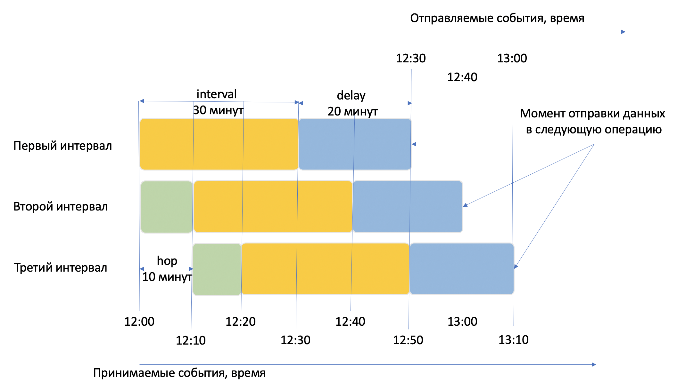

# Окна обработки потоковых данных

Потоковая обработка данных используется для вычислений над неограниченными потоками данных. Так как поток данных не ограничен, то агрегирующие функции типа COUNT, SUM и тп не могут завершить свою работу так как поток данных не завершается, а без этого нельзя получить правильные результаты. 

Поэтому для потоковых запросов используется специальный режим агрегации данных — оконный. При оконной агрегации все операции выполняются не над всем объемом данных, а только над их частью, ограниченных временным окном.

Потоковая обработка данных часто используется для анализа данных с различных устройств, например, с мобильных телефонов. Устройства могут быть не постоянно подключены к сети, они могут терять связь, а потом ее восстанавливать, отправляя накопленные за это время данные. Из-за этого возникает баланс между точностью расчетов и скоростью результатов. Этим балансом можно управлять с помощью времени ожидания прихода данных: 
- чем больше время ожидания - тем более точные результаты, но и тем позднее они будут расчитаны.
- чем меньше время ожидания - тем менее точные результаты, но и тем быстрее они будут расчитаны.

Например, запрос ниже вычисляет количество элементов во временном окне длиной 20 секунд, при этом запрос будет ожидать запаздывающие данные еще в течение 30 секунд.

```sql
SELECT
    HOP_END(),
    COUNT(*)
FROM
    source
GROUP BY HOP(`timestamp`, "PT20S", "PT20S", "PT30S")
```

В YQL `HOP window` определен как:

```sql
HOP(time_extractor, hop, interval, delay)
```

|Название|Описание|
|--------|--------|
|`time_extractor`|Выражение для получения временной метки для группировки|
|`hop`|Шаг окна группировки по времени|
|`interval`|Длина окна группировки по времени|
|`delay`|Время ожидания опаздывающих данных|

Значения полей `hop`, `interval`, `delay` указываются в формате [ISO_8601](https://ru.wikipedia.org/wiki/ISO_8601). Например, "PT10M" означает временной интервал 10 минут, а "PT30S" - временной интервал 30 секунд.

Запрос целиком приведен ниже:

```sql
SELECT 
    key,
    COUNT(*)
FROM my_stream
GROUP BY
    HOP(CAST(evt_time AS Timestamp), "PT10M", "PT30M", "PT20M"),
    key;
```

Предположим, данные начали поступать в 12:00, тогда:
- Первый интервал данных будет: 12:00 — 12:30 (длина интервала, `interval`, 30 минут);
- Второй: 12:10 — 12:40 (шаг данных, `hop`, 10 минут и длина интервала 30 минут);
- Третий: 12:20 — 12:50;
- и так далее.

Не все данные будут приходить вовремя, например, данные приходили с мобильного телефона пользователя, который потерял связь, из-за чего часть данных может задерживаться.

Будем ожидать 20 минут прихода всех отстающих данных, поэтому окончательно результаты запроса будут расчитаны:
- Первый интервал в 12:50 (время ожидания отстающих данных, `delay`, 20 минут). Отправляемые данные будут содержать события вплоть до 12:30;
- Второй интервал в 13:00. Отправляемые данные будут содержать события вплоть до 12:40;
- Третий интервал в 13:10. Отправляемые данные будут содержать события вплоть до 12:50;
- и так далее.

Чем больше значение устанавлено в параметре `delay`, тем более полные данные будут, но тем позже они будут отправлены на дальнейшую обработку.

На рисунке ниже приведена иллюстрация работы агрегации по времени HOP из примера выше.



Желтым цветом на рисунке помечен параметр `interval`, зеленым цветом параметр `hop`, а синим цветом параметр `delay`.

## Примеры использования {#examples}

* [{#T}](../tutorials/cloud-logging.md).
* [{#T}](../tutorials/debezium.md).
