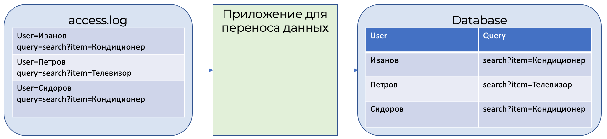
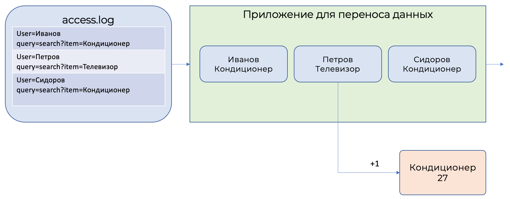

# Потоковый анализ данных

Потоковый анализ данных проще всего объяснить на примере: для нашего интернет-магазина мы хотим построить систему предварительного заказа товаров. Каждый день будем анализировать число поисков слова "кондиционер" на сайте интернет-магазина за последний день, чтобы сделать заказ на следующий день. 

Все истории поисков сохраняются в файле access.log. Данные из файла access.log специальной программой переносятся в таблицу в базе данных.



Каждый день пользователи выполняют 100 000 поисков товаров, значит, в таблице базы данных будет храниться 300 000 записей о поисках товаров. 

Для того, чтобы посчитать число поисков товаров за последний день, нужно выполнить запрос следующего вида:

```sql
SELECT 
    date, 
    count(*) 
FROM 
    database 
WHERE 
    query LIKE ‘%кондиционер%’ 
        AND 
            date IN [today()-1, today] 
GROUP BY date
```

Если каждая запись о поиске товара занимает 1 КБ, то 100 000 записей будут занимать 100 МБ. То есть для расчета числа поисков кондиционеров за последний день, нам нужно просканировать все 100 МБ данных. 

## Потоковый анализ

Теперь решим эту же задачу через потоковый анализ.

Потоковый анализ обрабатывает не предварительно накопленные данные в системах хранения, а обрабатывает записи по одной прямо в процессе их передачи из источника в приемник, то есть из файла access.log в базу данных. При этом сохраняются только результаты вычислений, а ненужные данные отсеиваются.



Системы потокового анализа позволяют описывать операции над передаваемым данными на обычном SQL.

Аналогичный SQL-запрос для потокового анализа будет выглядеть:

```sql
SELECT 
    HOP_BEGIN(), 
    COUNT(*) 
FROM 
    database 
WHERE 
    query LIKE '%кондиционер%'
GROUP BY HOP(`date`, "PT24H", "PT24H", "PT1H")
```

Данный запрос будет рассчитывать число запросов, содержащих слово "кондиционер", и группировать их по интервалам 24 часа.

## Отличия аналитического и потокового анализа

[Аналитический анализ](./batch-processing.md) данных обычно исполняется в контексте какой-либо СУБД, в которой уже находятся все нужные для анализа данные. Потоковый анализ выполняется на данных, поступающих в данный момент времени от реальных источников, и эти данные могут быть не полны на момент анализа. 

Основным отличием между потоковой и аналитической обработкой данных является баланс между скоростью и полнотой обрабатываемых данных. Потоковая обработка смещена в сторону меньшей задержки при меньшей полноте данных, а аналитическая обработка смещена в сторону большей задержки, но и большей полноты данных.

||Аналитическая обработка|Потоковая обработка|
|----|----|----|
|Задержка обработки данных|Часы, дни. Производится в момент полного накопления необходимых данных|Секунды, минуты. Выполняется на частично полученных данных|
|Точность результатов|Полная, так как необходимые данные накоплены заранее|Частичная, так как обработка ограничена максимальным временем ожидания данных|
|Влияние на исполняющую систему|Влияет на СУБД, в контексте которой исполняется|Выполняется на выделенных мощностях системы потокового анализа и не влияет на СУБД|
|Вариативность|СУБД позволяет выполнять любые виды запросов, даже не предусмотренные заранее|Только заранее подготовленные запросы|

## Использование справочников

Обычно потоковые данные не содержат полных данных, а только идентификаторы. Например, только идентификатор пользователя вместо полного имени. При этом полное имя пользователя хранится в какой-либо системе хранения данных.

При обработке потоковые данные часто расширяют дополнительной информацией. Такую информацию называют справочной, а сам процесс добавления данных - обогащением.

{{yq-full-name}} может использовать хранимые в {{ objstorage-full-name }} данные для обогащения. Обогащение выполняется за счет SQL-конструкции `JOIN`. 



Объединение потоковых данных и справочников с помощью конструкции `JOIN` должно выполняться таким образом, чтобы на первом месте в конструкции `JOIN` находился поток данных, а на втором - справочник.



Пример запроса обогащения потоковых данных.

```sql
$json_stream =
SELECT
    CAST(Data AS json) AS data,
FROM 
    yds.`input_stream`
WITH 
(  
    format=raw, 
    SCHEMA (Data String)
);

$events =
SELECT
    CAST(JSON_VALUE(data, '$.hostid') AS String) AS hostid,
FROM 
    $json_stream;

$host_dictionary =
SELECT
        *
FROM object_storage_lookup.`hosts.csv`
WITH 
(
    format=csv_with_names,
    SCHEMA 
    (
        hostid String,
        host_name String
    )
);

SELECT 
    *
FROM 
    $events AS events
INNER JOIN $host_dictionary AS host_dictionary
    ON events.hostid=host_dictionary.hostid;
```
