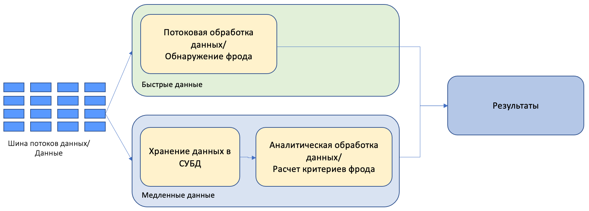
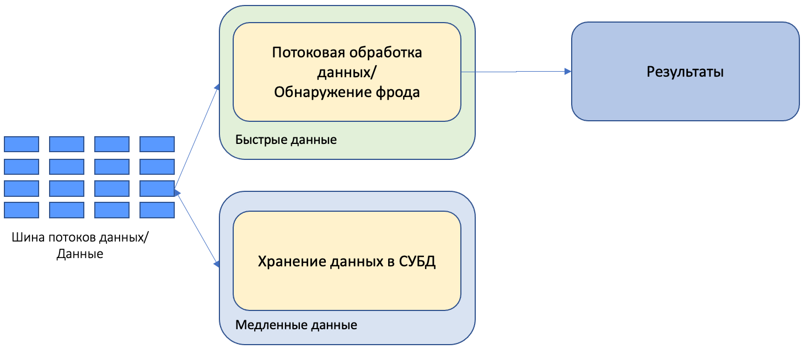
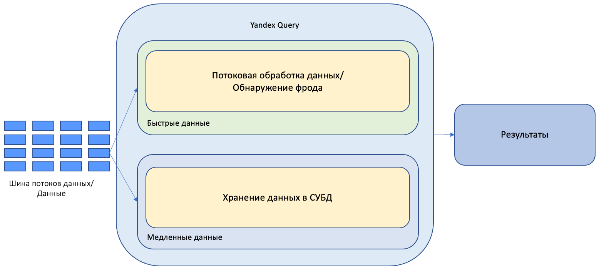

# Единый анализ потоковых и аналитических данных

Предположим, что необходимо разработать систему антифрода, которая будет обнаруживать мошеннические транзакции. Обнаруживать мошеннические транзакции необходимо в реальном времени, поэтому для этих целей удобно использовать [потоковую обработку данных](./stream-processing.md).

Для обнаружения мошеннических транзакций необходимо знать критерии, которые отличают мошеннические транзакции от обычных. В СУБД процессинга банковских данных накапливается полная история всех транзакций клиентов, с помощью этих данных можно подготовить критерии, которые позволят находить мошеннические действия. Для этого можно подготовить SQL-запросы, которые проанализируют все хранимые данные, и рассчитают нужные критерии. 

Найденные с помощью аналитических запросов критерии нужно перенести в систему потокового анализа для быстрого обнаружения мошеннических действий. То есть необходимо обрабатывать одни и те же данные разными способами: аналитическим и потоковым. 

Ниже приведены варианты архитектур, позволяющие выполнять аналитические и потоковые запросы:
- [Lambda-архитектура](#lambda). 
- [Kappa-архитектура](#kappa).
- [Unified Lambda-архитектура](#unified).

## [Lambda-архитектура](https://en.wikipedia.org/wiki/Lambda_architecture) { #lambda }

Данные о транзакциях из [шины данных](../../data-streams/concepts/index.md) поступают одновременно в систему потоковой обработки и отправляются на хранение в СУБД (или аналогичную систему). Система потокового анализа обнаруживает мошеннические действия. Аналитическая система сохраняет данные на продолжительное время и на их основе рассчитывает критерии для обнаружения мошеннических транзакций. То есть используются две независимые системы анализа: одна для потоковой аналитики, вторая для выполнения аналитических запросов.

Основным преимуществом такой архитектуры является простота, когда каждую отдельную задачу решает отдельная система. Основным недостатком такой архитектуры является то, что для решения обеих задач используются отдельные системы.

Если для аналитической обработки используется одна система и отдельный язык обработки, а для потокового анализа используется другая система с другим языком разработки, то возникают задачи по эксплуатации двух разных систем, по поддержке и переносу программного кода, по отдельным специалистам для поддержки обеих систем - что значительно усложняет поддержку решения.

## [Kappa-архитектура](https://hazelcast.com/glossary/kappa-architecture/) { #kappa }

Данная архитектура пытается решить основной недостаток Lambda-архитектуры: необходимость поддерживать две независимые системы обработки данных.

В данной архитектуре поток данных из шины потоков данных отправляется на обработку в систему потокового анализа и на хранение в СУБД (или аналогичную систему).

Как и Lambda-архитектуре, потоковый анализ выполняется в выделенной системе потокового анализа. Однако в отличие от расчетов в выделенной аналитической системе в Lambda-архитектуре, в Kappa-архитектуре и аналитические расчеты выполняются в системе потокового анализа. Для этого исторические данные из системы хранения данных отправляются в шину потоков данных, откуда они поступают в систему потокового анализа.

Достоинством такой системы является то, что единая система выполняет все виды обработки: аналитическую и потоковую. Недостатком такой системы является то, что весь объем аналитических данных необходимо передавать на обработку через шину потоков данных. Фактически, необходимо скопировать все хранимые данные из системы хранения в шину потоков данных. Если необходимо обработать значительный объем данных, это может привести к существенным задержкам, связанным с копированием данных, а также со сложностью администрирования шины потоков данных таких объемов.

## Единый анализ потоковых и аналитических данных - Unified Lambda-архитектура { #unified }

Unified Lambda архитектура обладает преимуществами и лишена недостатков обеих систем предыдущих поколений.

В Unified Lambda архитектуре единая система обрабатывает и аналитические и потоковые данные. 

В такой архитектуре система исполнения должна обеспечивать обработку аналитических и потоков данных с помощью единых инструментов. Это позволяет унифицировать все процессы вокруг обработки таких данных.

{{yq-full-name}} является представителем данной архитектуры. {{yq-full-name}} позволяет единообразно взаимодействовать с потоковыми и аналитическими данными, хранящимися в различных системах хранения. Это позволяет:
- унифицировать процессы обработки за счет единой среды исполнения.
- упросить эксплуатацию системы за счет единой системы обработки.
