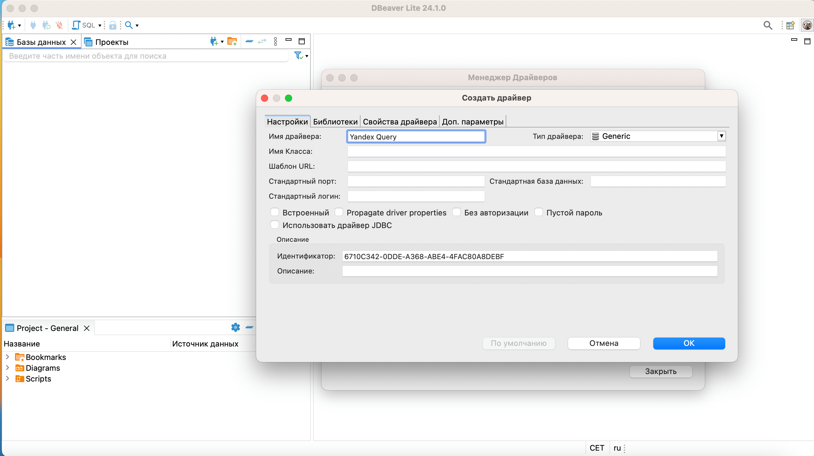
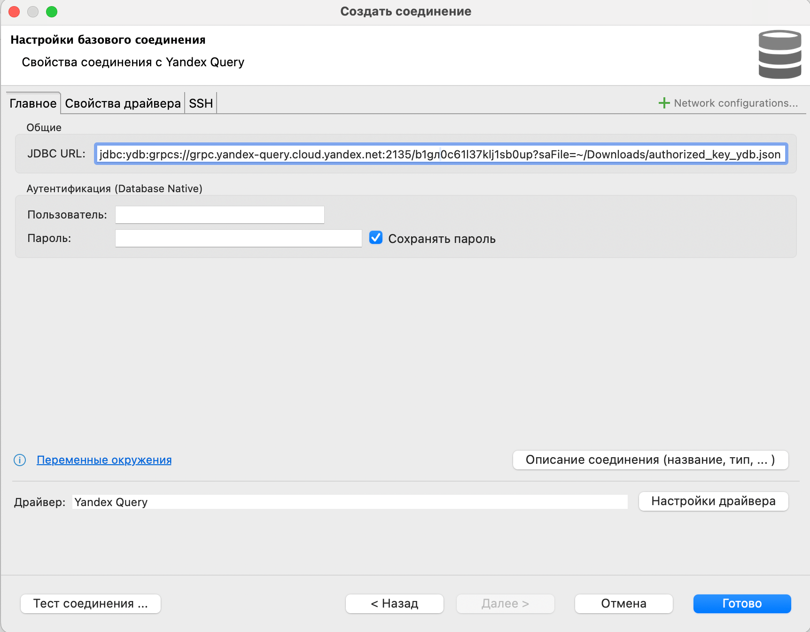
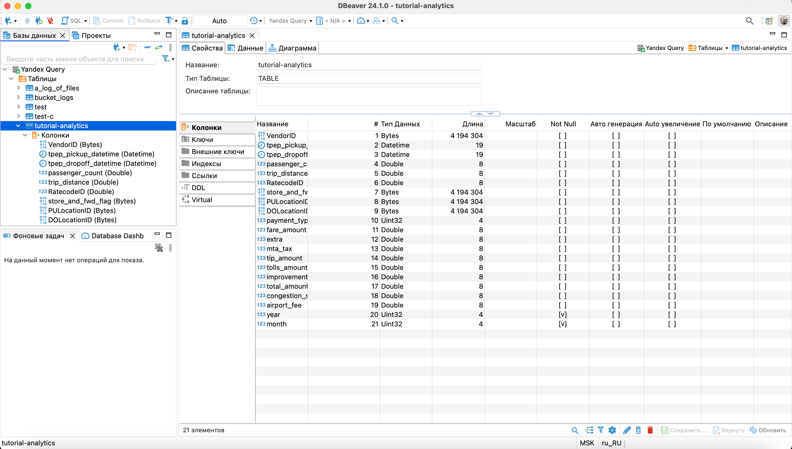
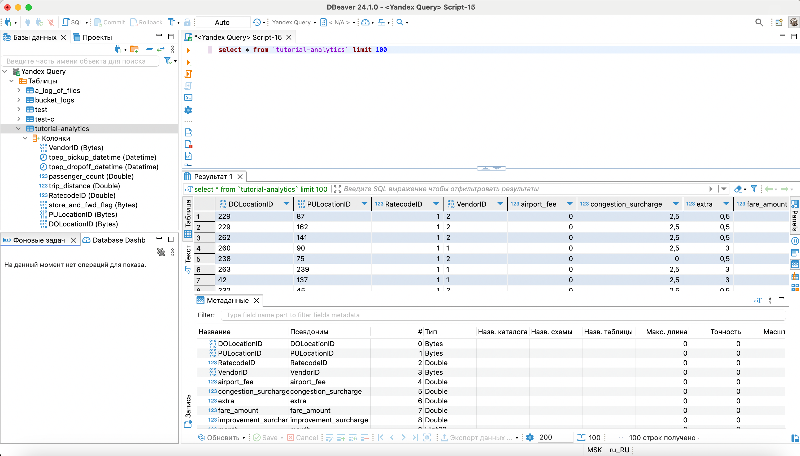

# Подключение с помощью IDE

{{ yq-full-name }} позволяет выполнять подключения по протоколу Java DataBase Connectivity ([JDBC](https://ru.wikipedia.org/wiki/Java_Database_Connectivity)), поэтому для работы с подключениями в {{ yq-name }} подходят графические IDE, также поддерживающие этот протокол: например DBeaver, DataGrip или другие.

В этом документе описан процесс подключения с помощью DBeaver, но подключение в рамках любой системы, поддерживающей источники данных JDBC, выполняется аналогично.

## DBeaver {#dbeaver}

[DBeaver](https://dbeaver.com) — бесплатный кроссплатформенный инструмент управления базами данных с открытым исходным кодом, который обеспечивает удобный интерфейс для подключения к различным базам данных и выполнения SQL-запросов. Он поддерживает множество баз данных, включая MySQL, PostgreSQL, Oracle, SQLite и другие.

### JDBC-драйвер {#jdbc}

Для подключения к {{ yq-full-name }} из DBeaver понадобится JDBC-драйвер. Так как {{ yq-full-name }} построен с помощью [федеративных запросов]({{ ydb.docs }}/concepts/federated_query/) {{ ydb-short-name }}, то для подключения будет использоваться JDBC-драйвер {{ydb-short-name}}.

Для скачивания драйвера выполните следующие шаги:
1. Перейдите в [репозиторий ydb-jdbc-driver](https://github.com/ydb-platform/ydb-jdbc-driver/releases).
1. Выберите последний релиз (отмечен тегом `Latest`) и сохраните файл `ydb-jdbc-driver-shaded-<driver-version>.jar`.

### Подключение JDBC-драйвера к DBeaver {#dbeaver_yq}

Для подключения JDBC-драйвера выполните следующие шаги:
1. Выберите в верхнем меню DBeaver пункт **База данных**, а затем подпункт **Управление драйверами**:

    

1. Чтобы создать новый драйвер, в открывшемся окне **Менеджер Драйверов** нажмите кнопку **Новый**:

    

1. В открывшемся окне **Создать драйвер**, в поле **Имя драйвера**, укажите `Yandex Query`:

    

1. Перейдите в раздел **Библиотеки**, нажмите кнопку **Добавить файл**, укажите путь к скачанному ранее JDBC-драйверу {{ ydb-short-name }} и нажмите кнопку **OK**:

    


1. В списке драйверов появится драйвер **Yandex Query**. Дважды кликните по новому драйверу и перейдите на вкладку **Библиотеки**, нажмите кнопку **Найти Класс** и в выпадающем списке выберите `tech.ydb.jdbc.YdbDriver`.

    

    Обязательно явно выберите пункт выпадающего списка `tech.ydb.jdbc.YdbDriver`, нажав на него. В противном случае DBeaver будет считать, что драйвер не был выбран.

    

    

### Создание подключения к {{ yq-full-name }} {#dbeaver_yq_connection}

Для создания подключения необходимо выполнить предварительные шаги:
1. [Создайте сервисный аккаунт](../../iam/operations/sa/create.md) `dbeaver` с ролью `editor`.

1. [Создайте авторизованный ключ](../../iam/operations/authentication/manage-authorized-keys.md#create-authorized-key) для сервисного аккаунта и сохраните его в файл.


После этого выполните следующие шаги:
1. В DBeaver создайте новое соединение, указав тип соединения `Yandex Query`.

1. В открывшемся окне перейдите в раздел **Главное**.
1. В подразделе **Общие**, в поле ввода **JDBC URL**, укажите следующий путь:

    ```text
    jdbc:ydb:grpcs://grpc.yandex-query.cloud.yandex.net:2135/<folder_id>?saFile=<path_to_auth_key_file.json>
    ```

    Где:
    - `folder_id` — идентификатор каталога, в котором будут выполняться запросы к {{ yq-full-name }}.
    - `path_to_auth_key_file.json` — путь к файлу с авторизованным ключом.

    

1. Нажмите кнопку **Тест соединения ...** для проверки настроек.

    Если все настройки выполнены правильно, то появится сообщение об успешном тестировании соединения:

    

1. Нажмите кнопку **Готово** для сохранения соединения.

### Работа с {{ yq-full-name }} {#dbeaver_yq_connection}

С помощью DBeaver можно просматривать список и структуру [привязок к данным](../concepts/glossary.md#binding):



А также выполнять запросы к данным:



