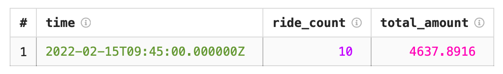

# Пример анализа потоковых данных

{{yq-full-name}} может выполнять [потоковую обработку](../concepts/stream-processing.md) данных на SQL-подобном языке — [YQL](https://ydb.tech/en/docs/yql/reference/syntax/)(https://ydb.tech/ru/docs/yql/reference/syntax/).

В данном примере возьмем заранее подготовленный набор данных - генератор данных про поездки Нью-Йоркского такси, и рассчитаем число поездок и их стоимость за временной интервал. 

Для этого необходимо:
1. Настроить подключение к [{{yds-full-name}}](#credentials).
1. [Выполнить запрос](#run_query).

### Настройка реквизитов подключения к {{yds-full-name}} { #credentials }

Создайте поток данных с именем `yellow-taxi`. Для этого выполните следующие шаги:



Создайте инфраструктуру для генерации данных:



По окончании создания инфраструктуры, запустится генерация данных в поток `yellow-taxi`.


## Выполнение запроса к потоковым данных { #run_query }

В редакторе запросов в интерфейсе {{yq-full-name}} нажмите кнопку **New streaming query**, в текстовом поле введите текст запроса, указанный ниже.

```sql
$data = 
SELECT 
    *
FROM bindings.`tutorial-streaming` LIMIT 10;

SELECT
    HOP_END() AS time,
    COUNT(*) AS ride_count,
    SUM(total_amount) AS total_amount
FROM 
    $data
GROUP BY 
    HOP(CAST(tpep_pickup_datetime as Timestamp), "PT1M", "PT1M", "PT1M");
```

## Результат выполнения запроса
После выполнения запроса станет доступен результат: количество и общая стоимость первых десяти поездок, совершененных после запуска запроса.

