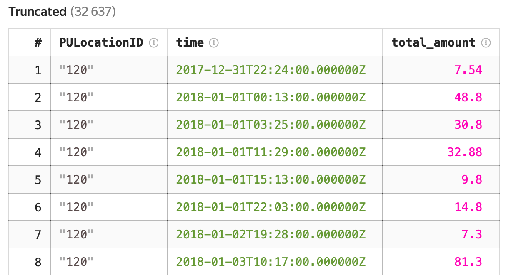

# Пример единого анализа потоковых и аналитических данных 

{{yq-full-name}} разработан в концепции [объединенных потоковых и аналитических вычислений](../concepts/unified-processing.md), это позволяет с помощью единого запроса обрабатывать как потоковые, так и аналитическиие данные.

В примере ниже рассчитаем количество совершаемых поездок в такси и их стоимость, которые выполняются только в определенных локациях над аналитическими и потоковыми данными с помощью единого запроса. Оба запроса используют хранимый в {{ objstorage-full-name }} справочник для фильтрации данных в запросе.

В данном примере будет использоваться заранее подготовленный набор данных - генератор данных про поездки Нью-Йоркского такси, по нему будем рассчитывать число поездок и их стоимость за временной интервал. Данные заранее размещены в {{ objstorage-full-name }} в общедоступном бакете `yq-sample-data` в каталоге `nyc_taxi_csv`








Для этого необходимо:
1. [Настроить реквизиты подключения к {{yds-full-name}}](#credentials).
1. [Создать поток данных {{yds-full-name}}](#create_stream).
1. [Запустить генератор потоковых данных](#generator_start).
1. [Выполнить аналитический запрос](#run_query_analytics).
1. [Выполнить потоковый запрос](#run_query_streaming).


## Подготовительные шаги {#prepare}
Для начала работы необходимо выполнить следующие подготовительные шаги.

### Настройка реквизитов подключения к {{yds-full-name}} { #credentials }




### Создание потока данных {{yds-full-name}} { #create_stream }

Создайте поток данных с именем `yellow-taxi`. Для этого выполните следующие шаги.



### Запуск генератора данных { #generator_start }



## Выполнение аналитического запроса { #run_query_analytics }

Для начала работы необходимо создать подключение к {{ objstorage-full-name }}:



### Выполните запрос
В редакторе запросов в интерфейсе {{ yq-full-name }} нажмите кнопку **New Analytics Query**, в текстовом поле введите текст запроса, указанный ниже.

```sql
$data = 
SELECT 
    *
FROM 
    `yellow-taxi`.`nyc_taxi_csv/yellow_tripdata_2018-01.csv.gz`
WITH 
(
    format=csv_with_names, 
    compression="gzip", 
    SCHEMA 
    (
        VendorID Int,
        tpep_pickup_datetime Datetime,
        tpep_dropoff_datetime Datetime,
        passenger_count Int,
        trip_distance float,
        RatecodeID String,
        store_and_fwd_flag String,
        PULocationID String,
        DOLocationID String,
        payment_type Int,
        fare_amount Double,
        extra String,
        mta_tax Double,
        tip_amount Double,
        tolls_amount Double,
        improvement_surcharge Double,
        total_amount Double
    )
);

$locations = 
SELECT 
    PULocationID
FROM 
    `yellow-taxi`.`nyc_taxi_csv/example_locations.csv`
WITH 
(
    format=csv_with_names,
    SCHEMA 
    (
        PULocationID String 
    )
);

$time = 
SELECT
    HOP_END() AS time,
    rides.PULocationID AS PULocationID,
    SUM(total_amount) AS total_amount    
FROM $data AS rides
INNER JOIN $locations AS locations
    ON rides.PULocationID=locations.PULocationID
GROUP BY 
    HOP(cast(tpep_pickup_datetime AS Timestamp?), "PT1M", "PT1M", "PT1M"),
    rides.PULocationID;

SELECT 
    * 
FROM 
    $time;
```

### Результат выполнения запроса
После выполнения запроса станет доступен результат: распределение длительности поездок в такси по числу поездок.



## Выполнение запроса к потоковым данным { #run_query_streaming }

Для начала работы необходимо создать подключение:
1. Перейдите в интерфейс {{ yq-full-name }} в раздел **Connections** и нажмите кнопку **Create**.
1. В открывшемся окне в поле **Name** введите `yds-yellow-taxi`.
1. В выпадающем поле **Type** выберите **Yandex Datastreams**.
1. В поле поле **Database** выберите базу данных {{ydb-name}}, где был создан поток данных `yellow-taxi` в предыдущих пунктах.
1. В поле **Service account** укажите сервисный аккаунт с ролью **admin**, который будет использоваться для доступа к данным. 
1. Создать подключение, нажав кнопку **Create**.

### Выполните запрос

В редакторе запросов в интерфейсе {{yq-full-name}} нажмите кнопку **New streaming query**, в текстовом поле введите текст запроса, указанный ниже.

```sql
$data = 
SELECT 
    CAST(DateTime::MakeDatetime(DateTime::Parse("%Y-%m-%d %H:%M:%S")(JSON_VALUE(Data, "$.tpep_pickup_datetime"))) AS Timestamp) AS tpep_pickup_datetime, 
    JSON_VALUE(Data, "$.PULocationID") AS PULocationID,
    CAST(JSON_VALUE(Data, "$.total_amount") AS float) AS total_amount 
FROM
(
    SELECT 
        CAST(Data AS Json) AS Data 
    FROM 
        `yds-yellow-taxi`.`yellow-taxi`
    WITH 
    (
        format=raw
    )
    LIMIT 100
);

$locations = 
SELECT 
    PULocationID
FROM 
    `yellow-taxi`.`nyc_taxi_csv/example_locations.csv`
WITH 
(
    format=csv_with_names,
    SCHEMA 
    (
        PULocationID String 
    )
);

$time = 
SELECT
    HOP_END() AS time,
    rides.PULocationID AS PULocationID,
    SUM(total_amount) AS total_amount    
FROM $data AS rides
INNER JOIN $locations AS locations
    ON rides.PULocationID=locations.PULocationID
GROUP BY 
    HOP(cast(tpep_pickup_datetime AS Timestamp?), "PT1M", "PT1M", "PT1M"),
    rides.PULocationID;

SELECT 
    * 
FROM 
    $time;
```

### Результат выполнения запроса
После выполнения запроса станет доступен результат: количество и общая стоимость первых десяти поездок, совершененных после запуска запроса, в определенных локациях.


## Выводы

В обоих примерах выше использовался единый запрос для анализа аналитических и потоковых данных. Запросы различаются подключениями к данным: одни данные хранятся в {{ objstorage-full-name }}, а другие в {{ yds-full-name }}. 

Текст SQL-запроса анализа данных одинаков для обоих сценариев.