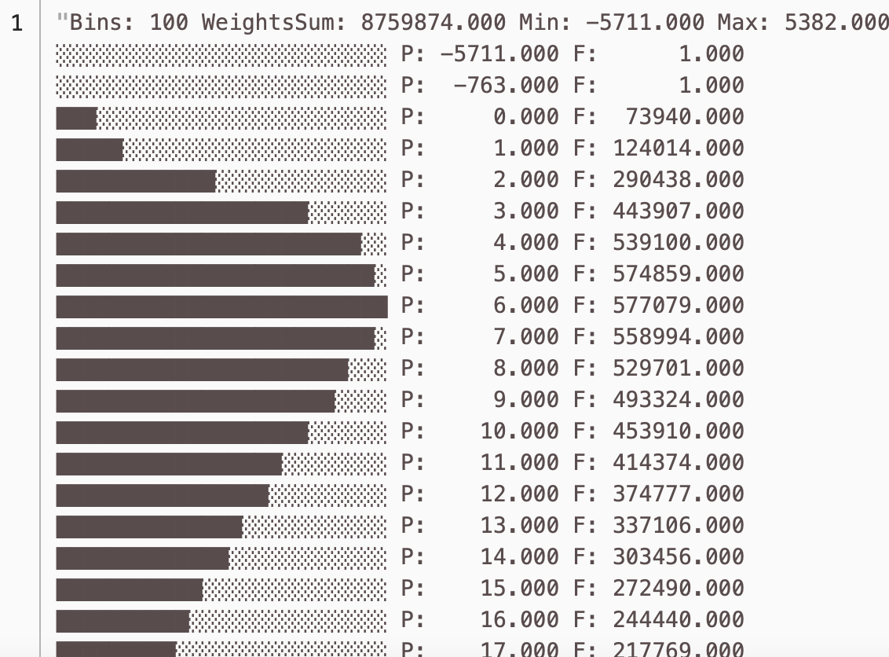

# Пример анализа данных из {{ objstorage-full-name }}

{{yq-full-name}} может выполнять полноценную аналитическую обработку данных, хранящихся в [{{ objstorage-full-name }}](../../storage/concepts/index.md), на SQL-подобном языке — [YQL](https://ydb.tech/en/docs/yql/reference/syntax/)(https://ydb.tech/ru/docs/yql/reference/syntax/).

В данном примере возьмем заранее подготовленный набор данных - поездки Нью-Йоркского такси за 2018 год, и посмотрим на распределение времен поездок. 







Данные заранее размещены в {{ objstorage-full-name }} в общедоступном бакете `yq-sample-data` в каталоге `nyc_taxi_csv`.

Для этого необходимо:
1. [Создать подключение к бакету в {{ objstorage-full-name }}](#create_connection).
1. [Выполнить запрос](#run_query).

## Создание подключения { #create_connection }



## Выполните запрос { #run_query }
В редакторе запросов в интерфейсе {{yq-full-name}} нажмите кнопку **New analytics query**, в текстовом поле введите текст запроса, указанный ниже.

```sql
$data = 
SELECT 
    * 
FROM 
    `yellow-taxi`.`nyc_taxi_csv/yellow_tripdata_2018-01.csv.gz`
WITH (
    format=csv_with_names, 
    compression="gzip",
    SCHEMA 
    (
        VendorID Int,
        tpep_pickup_datetime Datetime,
        tpep_dropoff_datetime Datetime,
        passenger_count Int,
        trip_distance float,
        RatecodeID String,
        store_and_fwd_flag String,
        PULocationID String,
        DOLocationID String,
        payment_type Int,
        fare_amount Double,
        extra String,
        mta_tax Double,
        tip_amount Double,
        tolls_amount Double,
        improvement_surcharge Double,
        total_amount Double
    )
);

$ride_time = 
SELECT
    DateTime::ToMinutes(tpep_dropoff_datetime-tpep_pickup_datetime) as ride_time
FROM 
    $data;

SELECT 
    Histogram::Print(histogram(ride_time)) 
FROM 
    $ride_time;
```

## Результат выполнения запроса
После выполнения запроса станет доступен результат: распределение длительности поездок в такси по числу поездок.

