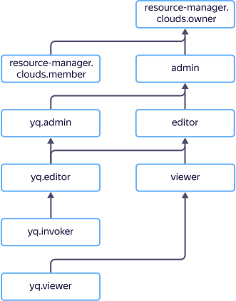

# Управление доступом в {{ yq-name }}

Для управления правами доступа в {{ yq-name }} используются [роли](../../iam/concepts/access-control/roles.md).

Пользователь {{ yandex-cloud }} может выполнять только те операции над ресурсами, которые разрешены назначенными ему ролями. Пока у пользователя нет никаких ролей, почти все операции ему запрещены.

Чтобы разрешить доступ к ресурсам сервиса {{ yq-full-name }}, назначьте пользователю нужные роли из приведенного ниже списка. На данный момент роль может быть назначена только на родительский ресурс (каталог или облако), роли которого наследуются вложенными ресурсами.



Подробнее о наследовании ролей читайте в разделе [{#T}](../../resource-manager/concepts/resources-hierarchy.md#access-rights-inheritance) документации сервиса {{ resmgr-full-name }}.



## Назначение ролей {#grant-roles}

Чтобы назначить пользователю роль:



## Какие роли действуют в сервисе {#roles-list}

Управлять доступом к объектам {{ yq-name }} можно как с помощью сервисных, так и с помощью примитивных ролей. На диаграмме показано, какие роли есть в сервисе и как они наследуют разрешения друг друга. Например, в `editor` входят все разрешения `viewer`. После диаграммы дано описание каждой роли.

## Роли {#roles}

Ниже перечислены все роли, которые учитываются при проверке прав доступа в сервисе {{ yq-name }}.

### yq.invoker

Пользователь с ролью `yq.invoker` может запускать запросы в {{ yq-name }}. Роль предназначена для автоматического выполнения запросами сервисными аккаунтами. Например, запуск запросов по событию или по расписанию.

### yq.viewer

Пользователь с ролью `yq.viewer` может просматривать соединения и биндинги, создавать запросы и запускать их {{ yq-name }}.

### yq.editor

Пользователь с ролью `yq.editor` может просматривать, редактировать, удалять созданные им самим соединениями. Роль позволяет создавать, редактировать, удалять и запускать созданные пользователем запросы. Роль `yq.editor` включает в себя все разрешения роли `ydb.viewer`.

### yq.admin

Роль `yq.admin` разрешает управлять любыми ресурсами {{ yq-name }}, в том помеченными приватными. Роль `yq.admin` включает в себя все разрешения роли `ydb.editor`.

### {{ roles-viewer }}

Пользователь с ролью `{{ roles-viewer }}` может просматривать информацию о ресурсах, например, о запусках запроса.

### {{ roles-editor }}

Пользователь с ролью `{{ roles-editor }}` может управлять любыми ресурсами, например, создать или удалить запрос. Роль `{{ roles-editor }}` включает в себя все разрешения роли `{{ roles-viewer }}`.

### {{ roles-admin }}

Пользователь с ролью `{{ roles-admin }}` может управлять правами доступа к ресурсам, например, разрешить другим пользователям создавать запросы. Роль `{{ roles-admin }}` включает в себя все разрешения роли `{{ roles-editor }}`.


