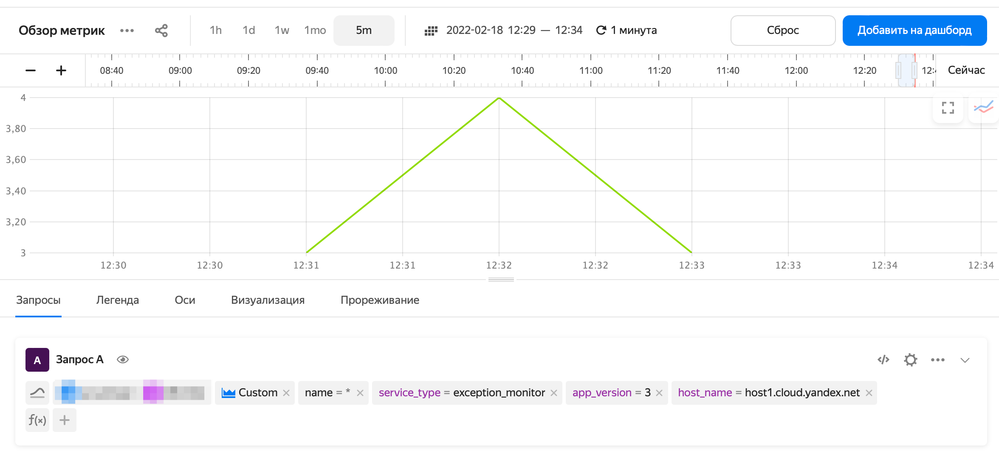

# Запись метрик в {{ monitoring-name }}

[{{ monitoring-name }}](../../monitoring/concepts/index.md) — сервис для сбора и хранения метрик, а также их отображения на дашбордах. Отправляемые в {{ monitoring-name }} данные содержат значения измеряемых величин — метрики — и описывающие их метки.

Например, чтобы отслеживать количество сбоев приложения, в качестве метрики можно использовать число сбоев за интервал времени. Название хоста и версия приложения при сбое являются метками. В интерфейсе {{ monitoring-name }} можно выполнять агрегацию метрик по меткам.

Пример записи метрик из {{ yq-full-name }} в {{ monitoring-name }}:

```sql
INSERT INTO `monitoring`.custom
SELECT
    `my_timestamp`,
    host_name,
    app_version,
    exception_count,
    "exception_monitor" AS service_type
FROM $query;
```

При [потоковой обработке данных](../concepts/stream-processing.md) {{ yq-full-name }} может отправлять в {{ monitoring-name }} результаты выполнения запроса в виде метрик и их меток.

## Настройка соединения {#setup-connection}

Чтобы настроить отправку метрик в {{ monitoring-name }}:

1. [Перейдите]({{ link-console-yq }}) в сервис **{{ ui-key.yacloud.iam.folder.dashboard.label_yq_ru }}**.
1. На панели слева выберите **{{ ui-key.yql.yq-ide-aside.connections.tab-text }}**.
1. Нажмите **{{ ui-key.yql.yq-connection-form.action_create-new }}**.
1. В открывшемся окне в поле **{{ ui-key.yql.yq-connection-form.connection-name.input-label }}** укажите название соединения с {{ monitoring-name }}.
1. В поле **{{ ui-key.yql.yq-connection-form.connection-type.input-label }}** выберите `{{ ui-key.yql.yq-connection.action_monitoring }}`.
1. В поле **{{ ui-key.yql.yq-connection-form.service-account.input-label }}** выберите сервисный аккаунт, который будет использоваться для записи метрик, или создайте новый и назначьте ему роль [`monitoring.editor`](../../monitoring/security/index.md#monitoring-editor).

   

1. Нажмите **{{ ui-key.yql.yq-connection-form.create.button-text }}**.

## Модель данных {#data-model}

Запись метрик в {{ monitoring-name }} выполняется с помощью SQL-выражения следующего вида:

```sql
INSERT INTO
    <соединение>.custom
SELECT
    <поля>
FROM
    <запрос>;
```

Где:

* `<соединение>` — название соединения с {{ monitoring-name }}, созданного в предыдущем разделе.
* `<поля>` — список полей, содержащих временную метку, метрики и их метки.
* `<запрос>` — запрос-источник данных {{ yq-full-name }}.



Для записи пользовательских метрик используйте конструкцию `INSERT INTO <соединение>.custom`. В ней [`custom`](../../monitoring/api-ref/MetricsData/write.md#query_params) — зарезервированное имя в {{ monitoring-name }}.



Для записи метрик используется метод [write](../../monitoring/api-ref/MetricsData/write.md) API {{ monitoring-name }}. Передайте следующие данные:

* временную метку;
* список метрик с указанием их типа — {{ yq-full-name }} поддерживает типы `DGAUGE` и `IGAUGE`;
* список меток.

{{ yq-full-name }} автоматически выводит семантику параметров из SQL-запроса.

#|
|| **Тип поля** | **Описание** | **Ограничения** ||
|| Временной: `Date`, `Datetime`, `Timestamp`, `TzDate`, `TzDatetime`, `TzTimestamp` | Временная метка всех метрик | В запросе может быть только одно поле с временной меткой. ||
|| Целочисленный: `Bool`, `Int8`, `Uint8`, `Int16`, `Uint16`, `Int32`, `Uint32`, `Int64`, `Uint64` | Значения метрик типа `IGAUGE` | Название поля из SQL-выражения является именем метрики. В одном запросе может быть неограниченное число метрик. ||
|| С плавающей точкой: `Float`, `Double` | Значения метрик типа `DGAUGE` | Название поля из SQL-выражения является именем метрики. В одном запросе может быть неограниченное число метрик. ||
|| Текстовый: `String`, `Utf8` | Значения меток | Название поля из SQL-выражения является именем метки, а текстовое значение — значением метки. В одном запросе может быть неограниченное число меток. ||
|#

Другие типы данных в полях не допускаются.

## Пример записи метрик {#example}

Пример запроса для записи метрик из {{ yq-full-name }} в {{ monitoring-name }}:

```sql
INSERT INTO
    `monitoring`.custom
SELECT
    `my_timestamp`,
    host AS host_name,
    app_version,
    exception_count,
    "exception_monitor" AS service_type
FROM $query;
```

Где:

#|
|| **Поле** | **Тип** | **Описание** ||
|| `monitoring` |  | Название соединения с {{ monitoring-name }}. ||
|| `$query` |  | Источник данных в SQL-запросе. Это может быть подзапрос YQL, в том числе [подключение](../quickstart/streaming-example.md) к источнику данных. ||
|| `my_timestamp` | Метка времени | Источник данных — столбец `my_timestamp` в потоке-источнике данных `stream`. ||
|| `exception_count` | Метрика | Источник данных — столбец `exception_count` в потоке-источнике данных `stream`. ||
|| `host_name` | Метка | Источник данных — столбец `host` в потоке-источнике данных `stream`. ||
|| `app_version` | Метка | Источник данных — столбец `app_version` в потоке-источнике данных `stream`. ||
|#

Пример результата выполнения запроса в {{ monitoring-name }}:


