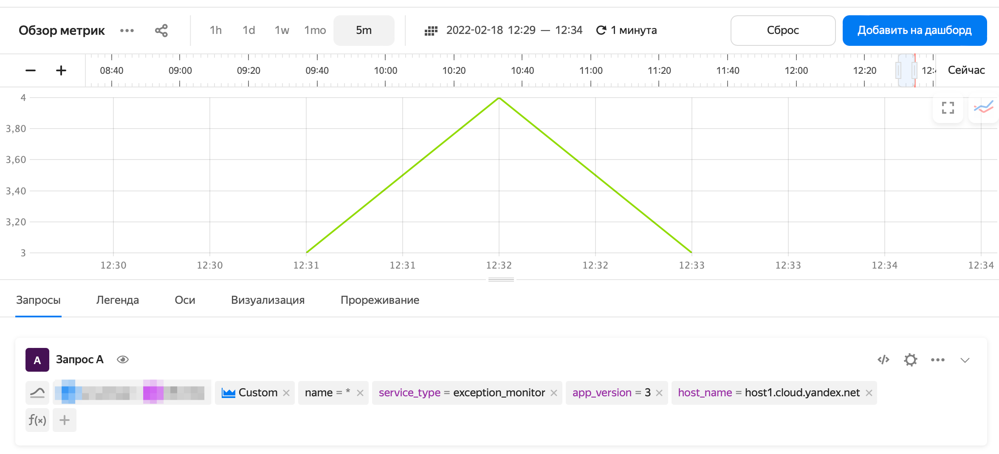

# Запись метрик в {{ monitoring-name }}

[{{ monitoring-name }}](../../monitoring/concepts/index.md) - это сервис, позволяющий собирать и хранить метрики, а также отображать их в виде графиков на дашбордах. Отправляемые в {{ monitoring-name }} данные представляют из себя значения измеряемых величин (`метрики`) и метки (`labels`), их описывающие. 

Например, чтобы следить за количеством сбоев приложения, в качестве метрики можно использовать число сбоев за интервал времени. Данные, описывающие это падение: название хоста, версия приложения - являются метками. В интерфейсе {{ monitoring-name }} можно проводить различные агрегации метрик по меткам.

Пример записи метрик из {{ yq-full-name }} в {{ monitoring-name }}.

```sql
INSERT INTO `monitoring`.custom
SELECT
        `my_timestamp`,
        host_name,
        app_version,
        exception_count,
        "exception_monitor" as service_type
FROM $query;
```

При [потоковой обработке данных](../concepts/stream-processing.md) 
{{ yq-full-name }} может отправлять в {{ monitoring-name }} результаты исполнения запроса в виде метрик и их меток. 

## Настройка подключения 
Для отправки метрик в {{ monitoring-name }} необходимо:
1. Перейти в интерфейс {{ yq-full-name }} в раздел **Connections** и нажать кнопку **Create**.
1. В открывшемся окне в поле **Name** указать название подключения к {{ monitoring-name }}.
1. В выпадающем поле **Type** выбрать **Monitoring**.
1. В поле **Service account** выбрать сервисный аккаунт, который будет использоваться для записи метрик, или создать новый, выдав ему права [`monitoring.editor`](../../monitoring/security/index.md). 
1. Создать подключение, нажав кнопку **Create**.

## Модель данных

Запись метрик в {{ monitoring-name }} выполняется с помощью SQL-выражения 

```sql
INSERT INTO 
        <monitoring_connection_name>.custom 
SELECT 
        <fields> 
FROM 
        <query>;
```

Где:

- `monitoring_connection_name` — название подключения к {{ monitoring-name }}, созданного в предыдущем пункте.
- `fields` — список полей, содержащих временную отметку, метрики и их метки.
- `query` — запрос-источник данных {{ yq-full-name }}.



При записи метрик необходимо использовать конструкцию `INSERT INTO  <monitoring_connection_name>.custom`, где [`custom`](../../monitoring/api-ref/MetricsData/write.md#query_params) — зарезервированное имя в {{ monitoring-name }} для записи пользовательских метрик.



Для записи метрик используется метод [write](
https://cloud.yandex.ru/docs/monitoring/api-ref/MetricsData/write) {{ monitoring-name }} API. При записи метрик необходимо передать:
- временную метку;
- список метрик с указанием их типа. {{ yq-full-name }} поддерживает типы метрик `DGAUGE`, `IGAUGE`;
- список меток.

{{ yq-full-name }} автоматически выводит семантику параметров из SQL-запроса.

|Тип поля|Описание|Ограничения|
|---|---|---|
|Временной: `Date`, `Datetime`, `Timestamp`, `TzDate`,` TzDatetime`, `TzTimestamp`|Временная метка всех метрик|В запросе может быть только одно поле с временной меткой|
|Целочисленный: `Bool`, `Int8`, `Uint8`, `Int16`, `Uint16`, `Int32`, `Uint32`, `Int64`, `Uint64` |Значения метрик, `IGAUGE`|Название поля из SQL-выражения является именем метрики. В одном запросе может быть неограниченное число метрик|
|С плавающей точкой: `Float`, `Double`|Значения метрик, `DGAUGE`|Название поля из SQL-выражения является именем метрики. В одном запросе может быть неограниченное число метрик|
|Текстовый: `String`, `Utf8`|Значения меток|Название поля из SQL-выражения является именем метки, а текстовое значение является значением метки. В одном запросе может быть неограниченное число метрик|

Другие типы данных в полях не допускаются.

## Пример записи метрик

Пример запроса для записи метрик из {{ yq-full-name }} в {{ monitoring-name }}.

```sql
INSERT INTO 
        `monitoring`.custom
SELECT
        `my_timestamp`,
        host AS host_name,
        app_version,
        exception_count,
        "exception_monitor" as service_type
FROM $query;
```

Где:

|Поле|Тип|Описание|
|--|---|---|
|`monitoring`| |Название подключения к {{ monitoring-name }}|
|`$query`| |Источник данных в SQL-запросе, может быть подзапросом языка YQL, в том числе [подключением](../quickstart/streaming-example.md) к источнику данных|
|`my_timestamp`| Метка времени| Источник данных — столбец `my_timestamp` в потоке-источнике данных `stream`|
|`exception_count`|Метрика| Источник данных — столбец `exception_count` в потоке-источнике данных `stream`|
|`host_name`|Метка| Источник данных — столбец `host` в потоке-источнике данных `stream`|
|`app_version`|Метка| Источник данных — столбец `app_version` в потоке-источнике данных `stream`|

Пример результата работы запроса в {{ monitoring-name }}.


