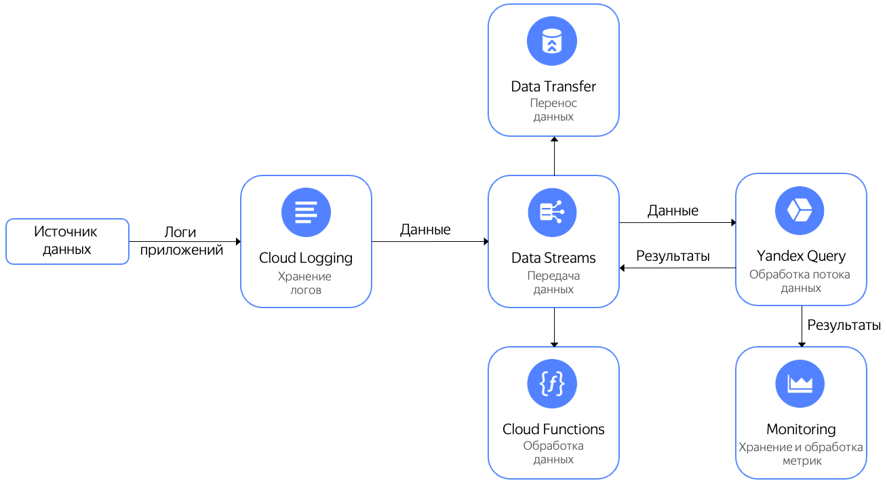

# Обработка логов {{ cloud-logging-full-name }}

[{{ cloud-logging-full-name }}](../../logging/index.yaml) — это сервис, который позволяет читать и записывать логи сервисов {{ yandex-cloud }} и пользовательских приложений.

Логи можно отправить в [поток](../../data-streams/concepts/glossary.md#stream-concepts) {{ yds-full-name }} и далее обработать в реальном времени с помощью {{ yq-full-name }}. Обработанные данные можно:

* отправить в {{ monitoring-full-name }} для построения графиков и алертинга;
* записать в поток {{ yds-short-name }} и далее отправить на обработку в {{ sf-full-name }};
* записать в поток {{ yds-short-name }} и далее передать в {{ data-transfer-full-name }} [для отправки в различные системы хранения](../../data-streams/tutorials/data-ingestion.md).



В этом сценарии вы отправите логи {{ cloud-logging-short-name }} в поток {{ yds-short-name }}, а затем выполните к ним запрос с помощью {{ yq-name }}. В результате выполнения запроса вы получите количество сообщений по каждому хосту, сгруппированное по интервалам продолжительностью 10 секунд.

Для выполнения сценария:

1. [{#T}](#create-yds-stream).
1. [{#T}](#create-log-group).
1. [{#T}](#send-to-loggroup).
1. [{#T}](#connect-query).
1. [{#T}](#query).

## Перед началом работы {#before-you-begin}



Установите [интерфейс командной строки](../../cli/quickstart.md#install) {{ yandex-cloud }}.

## Создайте поток данных {{ yds-name }} {#create-yds-stream}

[Создайте поток данных](../../data-streams/operations/manage-streams.md#create-data-stream) c именем `cloud-logging-stream`.

## Создайте лог-группу {{ cloud-logging-name }} {#create-log-group}

[Создайте лог-группу](../../logging/operations/create-group.md) c именем `cloud-logging-group`. При задании параметров лог-группы укажите созданный на предыдущем шаге поток данных `cloud-logging-stream`.

## Запустите отправку данных в лог-группу {#send-to-loggroup}

Чтобы запустить отправку данных в лог-группу, выполните следующую команду:

```bash
while true; do yc logging write \
  --group-name=cloud-logging-group \
  --message="test_message" \
  --timestamp="1s ago" \
  --level=INFO \
  --json-payload='{"request_id": "1234", "host":"test_host"}' \
  --folder-id b1kmrhakmf8a********; \
  sleep 1; \
done
```

* `--group-name` — название лог-группы, в которую отправляются сообщения;
* `--message` — текст сообщения;
* `--json_payload` — дополнительные данные сообщения в формате JSON;
* `--folder-id` — идентификатор каталога, в котором создана лог-группа.



   Флаги `--group-name`, `--message`, `--json-payload` можно опустить и указать только значения параметров. Например: `cloud-logging-group "test_message" '{"request_id": "1234", "host":"test_host"}'`.

   

## Подключите {{ yq-name }} к потоку данных {#connect-query}

1. [Создайте соединение](../operations/connection.md#create) с именем `cloud-logging-connection` и типом `{{ ui-key.yql.yq-connection.action_datastreams }}`.
1. На странице создания привязки:
    * Выберите **{{ ui-key.yql.yq-binding-form.binding-fields-templates.button.label }} {{ cloud-logging-short-name }}**.
    * Введите имя привязки `cloud-logging-binding`.
    * Укажите поток данных `cloud-logging-stream`.
    * Задайте формат `json-list`.
1. Нажмите кнопку **{{ ui-key.yql.yq-binding-form.binding-create.button-text }}**.

## Выполните запрос к данным {#query}

В редакторе запросов в интерфейсе {{ yq-name }} выполните следующий запрос:

```sql
$cloud_logging_data = 
SELECT 
    CAST(JSON_VALUE(data, "$.timestamp") AS Timestamp) AS `timestamp`,
    JSON_VALUE(data, "$.jsonPayload.host") AS host
FROM bindings.`cloud-logging-binding`;

SELECT 
    host, 
    COUNT(*) AS message_count, 
    HOP_END() AS `timestamp`
FROM $cloud_logging_data
GROUP BY 
    HOP(`timestamp`, "PT10S", "PT10S", "PT10S"), 
    host
LIMIT 2;
```

Результат:

| # | host | message_count | timestamp |
| :--- | :--- | ---: | :--- |
| 1 | "test_host" | 3 | 2023-05-09T10:34:00.000000Z |
| 2 | "test_host" | 4 | 2023-05-09T10:34:10.000000Z |



## См. также {#see-also}

* [{#T}](../sources-and-sinks/data-streams.md).
