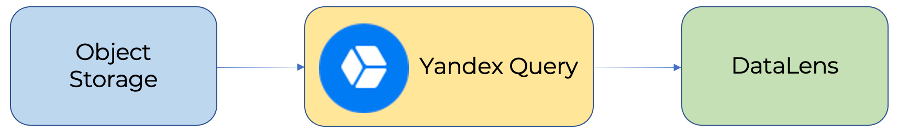
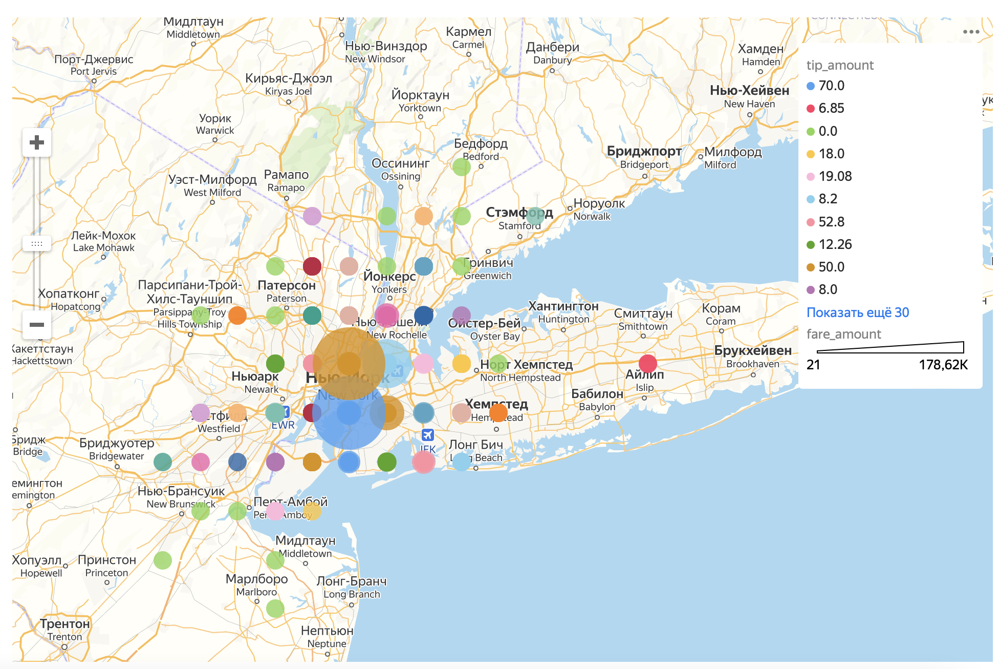

# Визуализация данных из {{objstorage-full-name}} на дашбордах {{datalens-full-name}}

{{datalens-full-name}} - это сервис визуализации и анализа данных. С помощью интеграции {{yq-full-name}} и {{datalens-full-name}} можно визуализировать данные, хранимые в {{objstorage-full-name}}. {{datalens-full-name}} формирует запрос на языке YQL, {{yq-full-name}} исполняет запрос и возвращает результаты, а {{datalens-full-name}} эти результаты визуализирует.

Ниже приведена архитектура решения с {{cloud-logging-short-name}}.


В примере ниже отобразим на карте стоимость поездок Нью-Йоркского желтого такси, в зависимости от района высадки пассажиров, где цветом отражается величина чаевых водителю.  Данные заранее размещены в {{ objstorage-full-name }} в общедоступном бакете `yq-sample-data` в каталоге `nyc_taxi_csv`.







## Настройка { #setup }

Для настройки необходимо выполнить следующие шаги:
1. [Создать подключение](#create_connection) в {{yq-full-name}} к данным, хранимым в {{objstorage-full-name}}.
1. В {{yq-full-name}} [подготовить запрос](#query), формирующий структуру данных.
1. [Создать источник данных](#create_connection_lens) в {{datalens-full-name}}.
1. В {{datalens-full-name}} [создать датасет](#create_dataset).
1. [Создать чарт](#create_chart) в {{datalens-full-name}} для визуализации данных.

### Создать подключение к данным в {{yq-full-name}} {#create_connection}

Для начала работы необходимо создать подключение к {{objstorage-full-name}}:




### Создание источника данных в {{datalens-full-name}} {#create_connection_lens}

Для создания подключения вам потребуется [сервисный аккаунт](../../iam/concepts/users/service-accounts.md) с [ролью](../../iam/operations/sa/assign-role-for-sa.md) **editor**.


Чтобы создать подключение к {{ yq-full-name }} необходимо:

1. Перейти на [страницу подключений](https://datalens.yandex.ru/connections).

1. Нажать кнопку **Создать подключение**.

1. Выбрать подключение **{{ yq-full-name }}**.

1. Выбрать каталог, в котором будет создано подключение к {{yq-full-name}}.
1. Указать параметры подключения:

   * **Название подключения**. Задайте название ``yellow-taxi``.

   * **Облако и каталог**. Выберите каталог, в котором будет находиться ваш сервисный аккаунт.
   * **Сервисный аккаунт**. Выберите существующий сервисный аккаунт или создайте новый.
   
   * **Уровень доступа SQL запросов**. Позволяет использовать произвольный SQL-запрос для [формирования датасета](../../datalens/concepts/dataset/settings.md#sql-request-in-datatset).

1. Нажать **Создать** в левом нижнем углу. Подключение появится в списке.



### Создание датасета {#create_dataset}

1. На главной странице сервиса {{ datalens-full-name }} нажмите **Создать датасет**.
1. В левой части экрана нажмите  **Добавить**.
1. Выберите подключение `yellow-taxi`, созданное в предыдущем пункте.
1. В свойствах подключения перейдите во вкладку **SQL** и в поле **Подзапрос** вставьте текст запроса:

    ```sql
    SELECT 
        *
    FROM 
        bindings.`tutorial-analytics` 
    ```

2. Нажмите кнопку **Создать**. Датасет появится в списке.
3. Если все настроено правильно, то в поле **Предпросмотр** появятся данные следующего вида:
    
4. Создайте вычисляемое поле:
   1. Перейдите во вкладку **Поля**.
   2. Нажмите кнопку **Добавить поле**.
   3. В поле **Название поля** укажите `dropoff_point`.
   4. В поле **Формула** введите: 
        ```
        GEOPOINT(ROUND([dropoff_latitude],1),ROUND([dropoff_longitude],1))
        ```
   5. Нажмите кнопку **Сохранить**.
   6. В разделе **Предпросмотр** появится новое поле `dropoff_point`, содержащее данные вида: `[40.7,-74]`.
5. Для сохранения датасета нажмите кнопку **Сохранить** в правом верхнем углу.


## Чарт с данными {#create_chart}
Для создания чарта необходимо выполнить следующие шаги:
1. Перейдите в раздел **Чарты** в интерфейсе {{datalens-full-name}}.
1. Нажмите кнопку **Создать чарт** и выберите пункт **Чарт**.
1. Выберите датасет `yellow-taxi`.
1. Выберите тип диаграммы **Карта**.
1. В поле **Точки** перетащите измерение `dropoff_point`.
1. В поле **Размер точек** перетащите измерение `fare_amount`.
1. В поле **Цвета** перетащите измерение `tip_amount`.

В результате работы запроса будет выведена карта, отражающая распределение стоимости поездки в зависимости от региона, где цветом отражается величина чаевых водителю.


