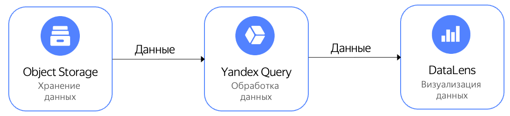

# Визуализация данных из {{objstorage-full-name}} на дашбордах {{datalens-full-name}}

{{datalens-full-name}} - это сервис визуализации и анализа данных. С помощью интеграции {{yq-full-name}} и {{datalens-full-name}} можно визуализировать данные, хранимые в {{objstorage-full-name}}. {{datalens-full-name}} формирует запрос на языке YQL, {{yq-full-name}} исполняет запрос и возвращает результаты, а {{datalens-full-name}} эти результаты визуализирует.

Ниже приведена архитектура решения с {{cloud-logging-short-name}}.


В примере ниже отобразим на карте стоимость поездок Нью-Йоркского желтого такси, в зависимости от района высадки пассажиров, где цветом отражается величина чаевых водителю.  Данные заранее размещены в {{ objstorage-full-name }} в общедоступном бакете `yq-sample-data` в каталоге `nyc_taxi_csv`.







## Настройка { #setup }

Для настройки необходимо выполнить следующие шаги:
1. [Создать подключение](#create_connection) в {{yq-full-name}} к данным, хранимым в {{objstorage-full-name}}.
1. В {{yq-full-name}} [подготовить запрос](#query), формирующий структуру данных.
1. [Создать источник данных](#create_connection_lens) в {{datalens-full-name}}.
1. В {{datalens-full-name}} [создать датасет](#create_dataset).
1. [Создать чарт](#create_chart) в {{datalens-full-name}} для визуализации данных.

### Создать подключение к данным в {{yq-full-name}} {#create_connection}

Для начала работы необходимо создать подключение к {{objstorage-full-name}}:



### Подготовка запроса к данным { #query }

В {{objstorage-full-name}} данные хранятся в виде файлов. Для использования их в {{datalens-full-name}}, данные необходимо привести к структурированному виду - описать их схему.

Ниже приведен пример запроса, разбирающий хранимые в {{objstorage-full-name}} в формате [CSV](../sources-and-sinks/object-storage.md#csv_with_names) данные:

```sql
SELECT 
    *
FROM 
    `yellow-taxi`.object("nyc_taxi_csv/yellow_tripdata_2016-01-100k.csv", csv_with_names)
WITH SCHEMA (
    INT AS VendorID,
    Datetime AS tpep_pickup_datetime,
    Datetime AS tpep_dropoff_datetime,
    Int AS passenger_count,
    float AS trip_distance,
    String AS RatecodeID,
    String AS store_and_fwd_flag,
    Double AS pickup_longitude,
    Double AS pickup_latitude,
    Double AS dropoff_longitude,
    Double AS dropoff_latitude,    
    Int AS payment_type,
    Double AS fare_amount,
    String AS extra,
    Double AS mta_tax,
    Double AS tip_amount,
    Double AS tolls_amount,
    Double AS improvement_surcharge,
    Double AS total_amount)
```

Для проверки, что подключение создано правильно, выполните запрос выше в консоли {{yq-full-name}}:
1. Нажмите кнопку **New analytics query**.
1. Вставьте текст запроса в поле ввода.
1. Нажмите кнопку **Run**.
1. Если все настроено правильно, то во вкладке **Results** будут результаты исполнения запроса - информация про поездки Нью-Йоркского желтого такси.

### Создание источника данных {#create_connection_lens}

Для создания подключения вам потребуется [сервисный аккаунт](../../iam/concepts/users/service-accounts.md) с [ролью](../../iam/operations/sa/assign-role-for-sa.md) **viewer**.


Чтобы создать подключение к {{ yq-full-name }} необходимо:



1. Перейти на [страницу подключений](https://datalens.yandex.ru/connections).

1. Нажать кнопку **Создать подключение**.

1. Выбрать подключение **{{ yq-full-name }}**.



1. Перейти [по ссылке](https://datalens.yandex.ru/connections/new/yq) на мастер создания подключений. 



1. Выбрать каталог, в котором будет создано подключение к {{yq-full-name}}.
1. Указать параметры подключения:

   * **Название подключения**. Задайте название ``yellow-taxi``.

   * **Облако и каталог**. Выберите каталог, в котором будет находиться ваш сервисный аккаунт.
   * **Сервисный аккаунт**. Выберите существующий сервисный аккаунт или создайте новый.
   
   * **Уровень доступа SQL запросов**. Позволяет использовать произвольный SQL-запрос для [формирования датасета](../../datalens/concepts/dataset/settings.md#sql-request-in-datatset).

2. Нажать **Создать** в левом нижнем углу. Подключение появится в списке.



### Создание датасета {#create_dataset}

1. На главной странице сервиса {{ datalens-full-name }} нажмите **Создать датасет**.
1. В левой части экрана нажмите  **Добавить**.
1. Выберите подключение `yellow-taxi`, созданное в предыдущем пункте.
1. В свойствах подключения перейдите во вкладку **SQL** и в поле **Подзапрос** вставьте текст запроса:

    ```sql
    SELECT 
        *
    FROM 
        `yellow-taxi`.object("nyc_taxi_csv/yellow_tripdata_2016-01-100k.csv", csv_with_names)
    WITH SCHEMA (
        INT AS VendorID,
        Datetime AS tpep_pickup_datetime,
        Datetime AS tpep_dropoff_datetime,
        Int AS passenger_count,
        float AS trip_distance,
        String AS RatecodeID,
        String AS store_and_fwd_flag,
        Double AS pickup_longitude,
        Double AS pickup_latitude,
        Double AS dropoff_longitude,
        Double AS dropoff_latitude,    
        Int AS payment_type,
        Double AS fare_amount,
        String AS extra,
        Double AS mta_tax,
        Double AS tip_amount,
        Double AS tolls_amount,
        Double AS improvement_surcharge,
        Double AS total_amount)
    ```

1. Нажмите кнопку **Создать**. Датасет появится в списке.
1. Если все настроено правильно, то в поле **Предпросмотр** появятся данные следующего вида:
    
1. Создайте вычисляемое поле:
   1. Перейдите во вкладку **Поля**.
   1. Нажмите кнопку **Добавить поле**.
   1. В поле **Название поля** укажите `dropoff_point`.
   1. В поле **Формула** введите: 
        ```
        GEOPOINT(ROUND([dropoff_latitude],1),ROUND([dropoff_longitude],1))
        ```
   1. Нажмите кнопку **Сохранить**.
   1. В разделе **Предпросмотр** появится новое поле `dropoff_point`, содержащее данные вида: `[40.7,-74]`.
1. Для сохранения датасета нажмите кнопку **Сохранить** в правом верхнем углу.


## Чарт с данными {#create_chart}
Для создания чарта необходимо выполнить следующие шаги:
1. Перейдите в раздел **Чарты** в интерфейсе {{datalens-full-name}}.
1. Нажмите кнопку **Создать чарт** и выберите пункт **Чарт**.
1. Выберите датасет `yellow-taxi`.
1. Выберите тип диаграммы **Карта**.
1. В поле **Точки** перетащите измерение `dropoff_point`.
1. В поле **Размер точек** перетащите измерение `fare_amount`.
1. В поле **Цвета** перетащите измерение `tip_amount`.

В результате работы запроса будет выведена карта, отражающая распределение стоимости поездки в зависимости от региона, где цветом отражается величина чаевых водителю.


