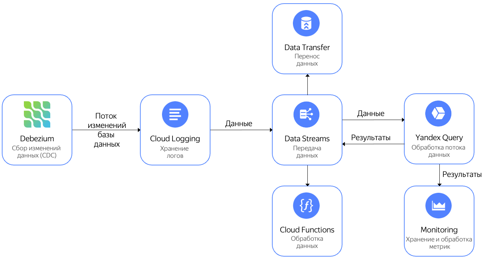

# Анализ потока изменений Debezium

[Debezium](https://debezium.io) — это сервис для захвата изменений в базах данных и отправки их на обработку в другие системы. С помощью {{yds-full-name}} можно захватывать эти изменения, а с помощью {{yq-full-name}} выполнять их обработку.

Обработанные данные можно отправить:
- В {{ monitoring-name }} для нанесения на графики и алертинга.
- Записать в другой поток {{yds-full-name}}, откуда данные можно отправить на обработку в {{sf-name}} или в {{data-transfer-name}} [для отправки в различные системы хранения](../../data-streams/tutorials/data-ingestion.md).

Ниже приведена архитектура решения:


Пример запроса получения числа изменений в таблицах базы данных с разбивкой по времени каждые 10 секунд:

```sql
$debezium_data = 
SELECT 
    JSON_VALUE(data,"$.payload.source.table") AS table_name, 
    DateTime::FromMilliseconds(cast(JSON_VALUE(data,"$.payload.source.ts_ms") AS uint64)) AS `timestamp`
FROM 
(
    SELECT 
        CAST(Data AS json) AS data 
    FROM yds.`debezium` 
    WITH 
    (
        format=raw,
        SCHEMA
        (
            Data String
        )
    )
);

SELECT 
    table_name, 
    HOP_END() 
FROM 
    $debezium_data 
GROUP BY 
    HOP(`timestamp`, "PT10S", "PT10S", "PT10S"),
    table_name
 LIMIT 2;
```

Описание работы с потоковыми данными, получаемыми из {{yds-full-name}}, находится в разделе [Чтение данных из Data Streams](../sources-and-sinks/data-streams.md).

## Настройка { #setup }
Для получения потока данных необходимо:
1. [Создать поток данных](#create_stream) {{yds-full-name}}.
1. [Настроить реквизиты подключения](#credentials) к {{yds-full-name}}
1. [Настроить и запустить](#debezium_server) Debezium Server.
1. [Запустить запрос в {{yql-full-name}}](#query) к передаваемым данным.

### Создание потока данных { #create_stream }

Создайте поток данных {{yds-full-name}} с именем `debezium`. Процедура создания потока данных подробно описана в [документации {{yds-full-name}}](../../data-streams/operations/manage-streams.md)

### Настройка реквизитов подключения к {{yds-full-name}} { #credentials }



### Настройка Debezium Server { #debezium_server }



## Запуск запроса {{yql-full-name}} { #query }

Создайте подключение с именем `yds-connection`, для этого нужно выполнить следующие действия:



Создайте [привязку к данным](../concepts/glossary.md#binding) к {{yds-full-name}} с именем `debezium` и единственной колонкой **data** с типом **Json**, для этого нужно выполнить следующие действия:




В редакторе запросов в интерфейсе {{yq-full-name}} выполните следующий запрос:

```sql
$debezium_data = 
SELECT 
    JSON_VALUE(data,"$.payload.source.table") AS table_name, 
    DateTime::FromMilliseconds(cast(JSON_VALUE(data,"$.payload.source.ts_ms") AS Uint64)) AS `timestamp`
FROM bindings.`debezium`;

SELECT 
    table_name, 
    HOP_END() 
FROM 
    $debezium_data 
GROUP BY 
    HOP(`timestamp`, "PT10S", "PT10S", "PT10S"),
    table_name
LIMIT 2;
```





