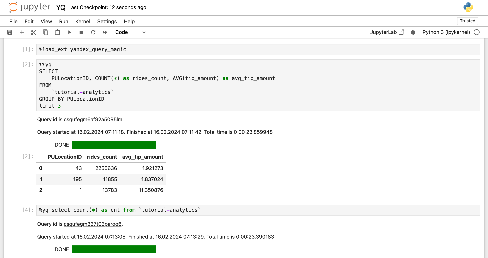

# Анализ данных с помощью {{ jlab }}

{{ yq-full-name }} поддерживает интеграцию с [{{ jlab }}](https://jupyter.org) и [VSCode](https://code.visualstudio.com/docs/datascience/jupyter-notebooks) через магические команды Python `cell` (`%%yq`) и `line` (`%yq`). Интеграция позволяет упростить рабочие процессы сбора и анализа данных, делая их более эффективными и удобными.



Чтобы анализировать данные {{ yq-name }} с помощью {{ jlab }}:

1. [Установите и настройте пакет yandex_query_magic](#setup-plugin).
1. [Попробуйте шаблонизацию запросов](#templating).
1. [Обработайте результаты выполнения](#capture-command-result).

## Перед началом работы {#before-you-begin}

1. 

1. [Получите доступ](https://jupyter.org/install) к окружению {{ jlab }}Lab или {{ jlab }} Notebook.

## Установка и настройка пакета yandex_query_magic {#setup-plugin}



- {{ jlab }}

  Установите пакет [yandex_query_magic](https://pypi.org/project/yandex-query-magic/), выполнив в ячейке ноутбука команду:

  ```python
  %pip install yandex_query_magic --upgrade
  ```

- Shell

  1. Установите пакет [yandex_query_magic](https://pypi.org/project/yandex-query-magic/) c помощью pip:

     ```shell
     pip install yandex_query_magic --upgrade
     ```

  1. Включите {{ jlab }}-расширение для элементов управления интерфейса в {{ jlab }} Notebook:

     ```shell
     %jupyter contrib nbextension install --user
     ```

     Если вы столкнетесь с ошибкой `"No module named 'notebook.base'"`, попробуйте перейти на версию {{ jlab }} Notebook 6.4.12:

     ```shell
     pip install --upgrade notebook==6.4.12
     ```



### Настройка пакета {#global-settings}

Настройки пакета `yandex_query_magic` можно задать с помощью line команды `yq_settings`, где указываются необходимые аргументы:

```shell
%yq_settings --folder-id <идентификатор_каталога> ...
```

Доступные параметры:

* `--folder-id <идентификатор_каталога>` — идентификатор каталога для выполнения запросов {{ yq-name }}. По умолчанию используется каталог, где запущена виртуальная машина с {{ jlab }}.
* `--vm-auth` — устанавливает режим аутентификации ключом учетной записи виртуальной машины. Подробнее см. в инструкции [{#T}](../../compute/operations/vm-connect/auth-inside-vm.md).
* `--env-auth <переменная_окружения_environment_variable>` — устанавливает режим аутентификации авторизованным ключом, содержимое которого находится в переменной окружения (Environment Variable). Этот режим предназначен для работы в условиях, когда нет доступа к файловой системе компьютера, где установлен {{ jlab }}. Например, в [{{ ml-platform-full-name }}](../../datasphere/concepts/index.md). В этом случае создайте [секрет {{ ml-platform-name }}](../../datasphere/operations/data/secrets.md), а имя созданного секрета укажите в параметре `--env-auth`.
* `--sa-file-auth <авторизованный_ключ>` — устанавливает режим аутентификации авторизованными ключами. Подробнее см. в инструкции [{#T}](../../iam/operations/authorized-key/create.md).

### Проверка работы пакета {#check-installation}

Команду `%yq line magic` можно использовать, когда весь SQL-запрос представлен одной строкой. В этом случае SQL-запрос выполняется с помощью ключевого слова `%yq`.

Если {{ jlab }} запущен в виртуальной машине с [привязанным к ней сервисным аккаунтом](../../compute/operations/vm-connect/auth-inside-vm), загрузите расширение в {{ jlab }}:

```sql
%load_ext yandex_query_magic
%yq SELECT "Hello, world!"
```

Где:

* `%yq` — имя {{ jlab }} magic.
* `SELECT "Hello, world!"` — текст запроса к {{ yq-name }}.

Если к виртуальной машине не привязан сервисный аккаунт:

1. [Создайте](../../iam/operations/sa/create.md) сервисный аккаунт и [назначьте](../../iam/operations/sa/assign-role-for-sa.md) ему роль `yq.viewer`.

1. [Создайте авторизованный ключ](../../iam/operations/authorized-key/create.md) для сервисного аккаунта.

1. Выполните следующие команды, указав путь к файлу с авторизованным ключом:

    ```sql
    %load_ext yandex_query_magic
    %yq_settings --sa-file-auth '<путь_к_файлу_с_ключом>'
    %yq SELECT "Hello, world!"
    ```

    Например:

    ```sql
    %load_ext yandex_query_magic
    %yq_settings --sa-file-auth '/home/test/authorized_key.json'
    %yq SELECT "Hello, world!"
    ```

    Путь к файлу `authorized_key.json` указывается относительно директории, в которой сохранен файл с текущим {{ jlab }} Notebook.

Чтобы выполнять многострочные SQL-запросы, необходимо использовать `%%yq cell magic`. Текст запроса должен начинаться с ключевого слова `%%yq`:

```sql
%%yq --folder-id <идентификатор_каталога> --name "Мой запрос" --description "Тестовый запрос" --raw-results

SELECT
    col1,
    COUNT(*)
FROM table
GROUP BY col1
```

Где:

* `--folder-id` — идентификатор каталога для выполнения запроса {{ yq-name }}. По умолчанию используется каталог, указанный ранее через `%yq_settings`. Если он не указан, то используется каталог, в котором запущена виртуальная машина.
* `--name` — имя запроса.
* `--description` — описание запроса.
* `--raw-results` — возвращает необработанные результаты выполнения запроса в {{ yq-name }}. Спецификация формата доступна в разделе [{#T}](../api/yql-json-conversion-rules.md).


