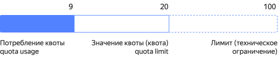

# Концепции {{ quota-manager-name }}





Например, квота на количество виртуальных машин в облаке равна 12. Потребление квоты может быть от 0 до 12 — то количество ВМ, которые используются в данный момент. Если для ваших задач требуется больше ВМ, вам нужно увеличить значение квоты, например, до 25. Тогда потребление квоты будет от 0 до 25.

Потенциально квоты можно увеличить до _лимитов_.

**Лимиты** — технические ограничения, обусловленные особенностями архитектуры {{ yandex-cloud }}, физическими характеристиками оборудования или внешними ограничениями. Например, лимиты в сервисе {{ certificate-manager-name }} определяются правилами выдачи сертификатов Let's Encrypt.

Взаимосвязь квот и лимитов показана схеме ниже.

Квоты выделяются и действуют на уровне облака {{ yandex-cloud}} и распределяются между всеми каталогами и сервисами.

Сервис {{ quota-manager-name }} помогает автоматически отслеживать значения и потребление квот. С помощью методов API вы можете настроить оповещения, когда потребление ресурсов достигает пороговых значений. Это позволит вовремя увеличить значение квоты или предотвратить аномальную ситуацию и перерасход ресурсов.

В настоящий момент для работы с квотами доступны интерфейсы: 

* [Консоль]({{ link-console-quotas }}) — получение информации и запрос изменений квот.
* [API](../../quota-manager/api-ref/authentication.md) — получение информации о квотах.

Позднее появится возможность получения информации и изменения квот через CLI и API.

## Выделение квот {#quotas-allocation}

При создании облака ресурсы автоматически получают квоты по умолчанию. Когда вы измените квоту, значение по умолчанию не сохранится. Сброс квоты к начальному значению не предусмотрен.

Для некоторых ресурсов значение квоты не устанавливается. В консоли напротив таких ресурсов указано — **{{ ui-key.yacloud.iam.cloud.quotas.label_quota-empty }}**.

Квоты потенциально могут быть увеличены до значений лимитов. Выделенные квоты не гарантируют наличие свободных ресурсов.

## Зачем нужны квоты {#quotas-need}

Квоты служат мягким ограничением для запроса ресурсов и позволяют контролировать объем потребления облачных сервисов: новые пользователи не могут занять слишком много ресурсов в тестовых целях.

## Типы ресурсов {#resources-types}

В {{ yandex-cloud }} управление квотами происходит согласно [иерархии ресурсов](../../resource-manager/concepts/resources-hierarchy.md). Поэтому при выполнении команды CLI или запроса API потребуется указать тип ресурса:

* `resource-manager.cloud`
* `organization-manager.organization`
* `billing.account`

Квоты и лимиты по умолчанию для всех сервисов {{ yandex-cloud}} см. в разделе [{#T}](../../overview/concepts/quotas-limits.md#quotas-limits-default).

Потребление квот см. на странице сервиса [{{ quota-manager-name }}]({{ link-console-quotas }}).