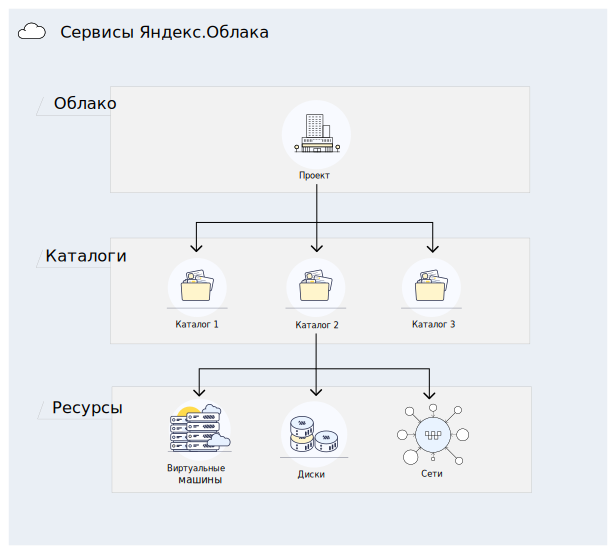

# Иерархия ресурсов Яндекс.Облака

Когда вы получаете доступ к Яндекс.Облаку, вам выделяется отдельное рабочее пространство — _облако_. В нем вы будете создавать каталоги.

В каталогах размещаются ресурсы — виртуальные машины, диски и др. При создании ресурса указывается, в каком каталоге он будет создан.

[!KEYREF service-name-short] предоставляет стандартную ресурсную модель, которая представлена на рисунке ниже. Эта модель используется в большинстве сервисов Яндекс.Облака.

Все ресурсы в облаке по умолчанию изолированы от пользователей вне облака. Владелец облака может управлять правами доступа к облаку и ресурсам в нем.

Права доступа на ресурсы в облаке наследуются. Права на облако распространяются на все ресурсы внутри облака. Права на каталог распространяются на все ресурсы в каталоге. Подробнее об этом в разделе [[!TITLE]](#access-rights-inheritance).

Некоторые типы ресурсов не создаются в каталогах, поэтому имеют собственную логику проверки прав доступа. Например, при управлении ключами доступа для сервисного аккаунта проверяются права доступа на этот сервисный аккаунт.

## Облако как ресурс Яндекс.Облака {#cloud}

_Облако_ — это изолированное пространство, в котором создаются каталоги.

При создании ресурса внутри облака, доступ к ресурсу закрыт для всех, кроме участников и владельцев облака.

### Владелец облака {#owner}

При создании облака ему назначается владелец. Владелец облака — это пользователь, которому назначена роль `[!KEYREF roles-cloud-owner]` на это облако.

Владелец может выполнять любые операции с облаком и ресурсами в нем.

Владелец может выдавать доступ к облаку другим пользователям: назначать им роли и отнимать их. В том числе владелец может назначить других владельцев облака или отнять роль владельца у себя.

У облака должен быть хотя бы один владелец. Единственный владелец облака не сможет отнять эту роль у себя.

На данный момент вы можете быть владельцем только одного облака. При этом вы не можете создать облако самостоятельно или изменить информацию о нем. Для изменения информации обратитесь в службу технической поддержки.

### Участник облака {#member}

Участник облака — это пользователь, которому назначена роль `[!KEYREF roles-cloud-member]` на это облако.

Роль участника облака необходима для выполнения операций с ресурсом в облаке, за исключением ресурсов с [публичным доступом](#public-access). Без роли `[!KEYREF roles-cloud-member]` пользователь не сможет выполнять никаких операций с ресурсом, даже если ему назначена необходимая роль на сам ресурс.

> Например, если участнику облака назначена роль `[!KEYREF roles-editor]` на один из каталогов внутри облака, он может создавать ресурсы в этом каталоге. Если у пользователя отнять роль участника облака, он не сможет больше выполнять никаких операций.

Сама роль `[!KEYREF roles-cloud-member]` не дает прав на выполнение каких-либо операций с ресурсами. Эта роль используется в сочетании с другими ролями.

>[!NOTE]
>Владелец облака уже является его участником, назначать ему роль `[!KEYREF roles-cloud-member]` не надо.

### Публичный доступ к облаку {#public-access}

Облако и любой ресурс в нем можно сделать публичным. Тогда для доступа к ним не требуется быть участником облака.

Чтобы сделать облако или ресурс публичным, необходимо назначить на него роль для [системной группы](../../iam/concepts/users/users#system) `[!KEYREF subjects-allAuthenticatedUsers]`.

> Например, можно предоставить любому пользователю доступ на просмотр всех ресурсов в облаке. Для этого достаточно назначить на это облако роль `[!KEYREF roles-viewer]` для субъекта `[!KEYREF subjects-allAuthenticatedUsers]` .

## Каталог как ресурс Яндекс.Облака {#folder}

_Каталог_ — это пространство, в котором создаются и группируются ресурсы Яндекс.Облака.

Как и каталоги в файловой системе, каталоги в Яндекс.Облаке упрощают управление ресурсами. Вы можете группировать ресурсы в каталоги по типу ресурса, по проекту, по отделу, который работает с этими ресурсами, или по любому другому признаку.

> [!NOTE]
> Сейчас каталоги не могут содержать вложенные каталоги, а также нельзя удалить каталог. Для удаления каталога обратитесь в службу технической поддержки.

Вы можете управлять правами доступа сразу ко всем ресурсам в каталоге. Допустим, в вашей организации есть сотрудники, которые работают только с виртуальными машинами. Вы можете создать каталог, в котором будут только виртуальные машины, и предоставить сотрудникам доступ к этому каталогу.

Вы можете посмотреть содержимое каталога в консоли управления. Если вы хотите узнать, к какому каталогу относится ресурс, воспользуйтесь API или CLI, выполнив метод `Get` для этого ресурса.

## Наследование прав доступа {#access-rights-inheritance}

Когда пользователь (субъект) выполняет какую-либо операцию с ресурсом, сервис Yandex Identity and Access Management (IAM) проверяет наличие необходимых прав доступа у пользователя на этот ресурс.

Права доступа на ресурсы внутри облака наследуются согласно этой иерархии: Облако → Каталог → Ресурс.

> Например, в облаке `mycloud` в каталоге `robots` созданы сервисные аккаунты `Alice` и `Bob`.
>
> Если пользователю на облако `mycloud` назначены роли `[!KEYREF roles-cloud-member]` и `[!KEYREF roles-viewer]`, то он сможет посмотреть список всех каталогов в облаке и их содержимое.
>
> Если пользователю назначить роль `[!KEYREF roles-editor]` по отношению к `Alice`, он сможет управлять `Alice`, но не сможет управлять `Bob`.
>
> Если пользователю назначить роль `[!KEYREF roles-admin]` в каталоге `robots`, он получит разрешения администратора на управление каталогом и всеми ресурсами в нем, в том числе `Alice` и `Bob`.

Для некоторых ресурсов нельзя назначать роли, для них права наследуются от каталога. Например, на данный момент нельзя назначить роль на виртуальную машину. При попытке получить информацию о виртуальной машине, IAM проверит права доступа на каталог, которому принадлежит эта виртуальная машина. Если для каталога тоже не заданы права доступа, то IAM проверит, что у субъекта есть необходимые права доступа в этом облаке.

#### См. также

- [[!TITLE]](../operations/cloud/set-access-bindings.md)
- [[!TITLE]](../operations/folder/create.md)
- [[!TITLE]](../operations/folder/set-access-bindings.md)