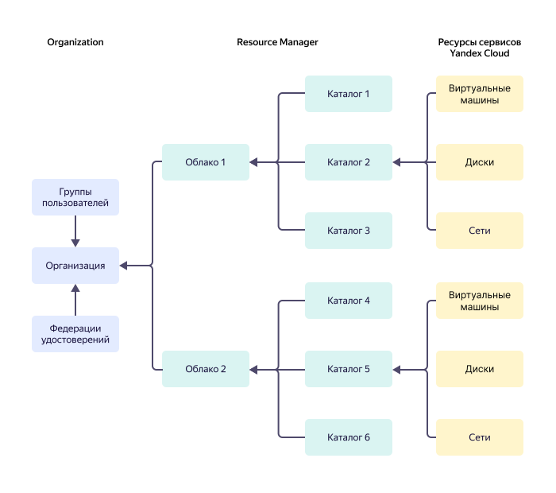

# Иерархия ресурсов {{ yandex-cloud }}

Ресурсная модель {{ resmgr-name }} представлена на диаграмме. Этой модели следует большинство сервисов {{ yandex-cloud }}.

Все ресурсы {{ yandex-cloud }} — [виртуальные машины](../../compute/concepts/vm.md), [диски](../../compute/concepts/disk.md), [сети](../../vpc/concepts/network.md#network) и другие — размещаются в [каталогах](#folder). При создании ресурса указывается каталог, в котором он будет создан.

Каждый каталог принадлежит одному [облаку](#cloud). Не существует каталогов вне облака. Нельзя создать каталог внутри другого каталога.

[Облака](#cloud) принадлежат организациям.

Организации не взаимодействуют друг с другом. Ресурсы одной организации не могут взаимодействовать с ресурсами другой организации средствами {{ yandex-cloud }}. Сервис [{{ org-full-name }}](../../organization/) управляет организациями.

Внутри организации вы можете настроить доступ к ресурсу на [уровнях](#access-rights-inheritance):
* Организация.
* Облако.
* Каталог.
* Отдельный ресурс, если сервис поддерживает разграничение доступа на этом уровне.

По умолчанию новый пользователь-участник организации не имеет доступа к ресурсам в облаках организации. Права доступа ему необходимо выдать явно: назначить роль непосредственно на ресурс или на каталог, облако или организацию этого ресурса.

## Ресурсы {{ resmgr-name }} {#rm-resources}

### Облако {#cloud}

_Облако_ — изолированное пространство, в котором создаются каталоги.

Облака по умолчанию изолированы друг от друга. Переносить ресурсы между облаками нельзя. Для ресурсов, которые поддерживают кросс-облачное взаимодействие, его можно настроить отдельно.

#### Владелец облака {#owner}

При создании облака ему назначается владелец. _Владелец облака_ — пользователь, которому назначена роль `{{ roles-cloud-owner }}` на это облако.

Владелец может выполнять любые операции с облаком и ресурсами в нем.

Владелец может выдавать доступ к облаку другим пользователям: назначать им [роли](../../iam/concepts/access-control/roles.md) и отзывать их. Только владелец облака может назначать пользователям и отзывать у них роль `resource-manager.clouds.owner`. В том числе владелец может отозвать эту роль у себя.

У облака должен быть хотя бы один владелец. Пользователь, который создал облако, автоматически становится его владельцем. Единственный владелец облака не может отозвать у себя роль `resource-manager.clouds.owner`.

#### Участник облака {#member}

Роль `{{ roles-cloud-member }}` не дает прав на выполнение каких-либо операций с ресурсами. Эта роль используется в сочетании с другими ролями. 



### Каталог {#folder}

_Каталог_ — пространство, в котором создаются и группируются ресурсы {{ yandex-cloud }}.

Как и каталоги в файловой системе, каталоги в {{ yandex-cloud }} упрощают управление ресурсами. Вы можете группировать ресурсы в каталоги по типу ресурса, проекту, отделу, который работает с этими ресурсами, или по любому другому признаку.

## Наследование прав доступа {#access-rights-inheritance}

Когда пользователь ([субъект](../../iam/concepts/access-control/index.md#subject)) выполняет какую-либо операцию с ресурсом, сервис {{ iam-name }} проверяет права доступа у пользователя на этот ресурс.

Права доступа к ресурсам наследуются:
* Права на организацию распространяются на ресурсы организации:
  * [Федерации](../../iam/concepts/federations.md).
  * Группы.
  * Облака организации.
* Права на облако распространяются на все каталоги внутри облака.
* Права на каталог распространяются на все ресурсы каталога.

>Например, для организации `myorganization` со следующей структурой:
>* Облако `mycloud`:
>  * Каталог `robots`:
>    * Сервисный аккаунт `Alice`.
>    * Сервисный аккаунт `Bob`.
>
> Если пользователю назначить роль `resource-manager.viewer` на организацию, он увидит список всех облаков, каталогов и ресурсов в организации, но не сможет ими управлять.
> 
> Если добавить пользователю роль `{{ roles-editor }}` на облако `mycloud`, он сможет управлять всеми ресурсами облака, включая `Alice` и `Bob`, но дать доступ другому пользователю к ним он не сможет.
> 
> Роль `{{ roles-admin }}` на каталог `robots` позволит пользователю управлять доступом ко всем ресурсам каталога, включая `Alice` и `Bob`.

На некоторые ресурсы нельзя назначать роль непосредственно, для таких ресурсов роль назначается на каталог, облако или организацию. Если права на каталог отсутствуют, {{ iam-name }} проверит права доступа к облаку и организации.

## Удаление ресурсов {{ resmgr-name }} {#deleting-resources}

Вы можете удалить [облако](../operations/cloud/delete.md) или [каталог](../operations/folder/delete.md). При удалении вы указываете, удалять ли ресурс сразу или по истечении заданного срока удаления. Срок удаления по умолчанию — 7 дней. В течение этого срока ресурсы будут остановлены, облако/каталог перейдет в статус ожидания удаления `PENDING_DELETION`.

После завершения периода ожидания облако/каталог переходит в статус `DELETING`. В этом статусе происходит процесс необратимого удаления, занимающий до 72 часов. В результате вместе с облаком/каталогом удаляются все созданные в нем ресурсы.

### Причины невозможности удаления каталогов {#inability-to-delete}

В статусе `DELETING` удаление каталога может быть отменено системой. Возможные причины:

* [IP-адрес](../../vpc/concepts/address.md) {{ vpc-full-name }} из удаляемого каталога используется [виртуальной машиной](../../compute/concepts/vm.md) в другом каталоге.
* В удаляемом каталоге есть кластеры управляемых баз данных, защищенные от удаления.

В случае такой отмены удаление будет остановлено, каталог вернется в статус `ACTIVE`, а пользователь получит сообщение с описанием причин, которые не позволили удалить каталог. При этом часть ресурсов каталога может оказаться удалена: такие ресурсы не будут восстановлены после отмены удаления. Другая часть ресурсов может оказаться не удалена: такие ресурсы продолжат тарифицироваться.

#### См. также {#see-also}

* [{#T}](../operations/cloud/set-access-bindings.md).
* [{#T}](../operations/folder/create.md).
* [{#T}](../operations/folder/set-access-bindings.md).