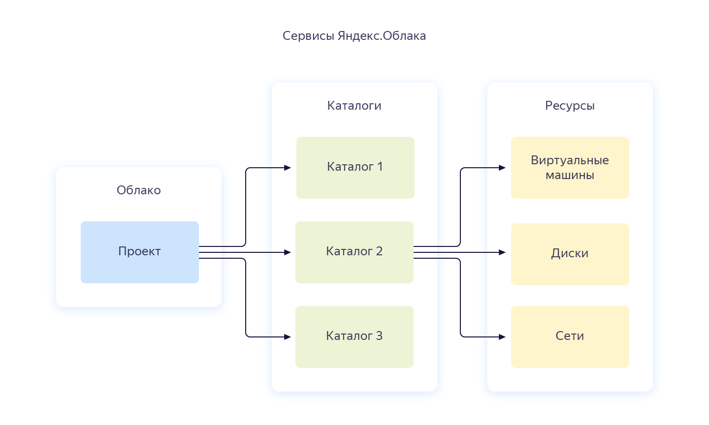

# Иерархия ресурсов {{ yandex-cloud }}

Когда вы получаете доступ к {{ yandex-cloud }}, вам выделяется отдельное рабочее пространство — _облако_. В нем вы будете создавать каталоги.

В каталогах размещаются ресурсы — виртуальные машины, диски и др. При создании ресурса указывается, в каком каталоге он будет создан. Вложенные каталоги сейчас не поддерживаются.

{{ resmgr-name }} предоставляет стандартную ресурсную модель, которая представлена на рисунке ниже. Эта модель используется в большинстве сервисов {{ yandex-cloud }}.

Все ресурсы в облаке по умолчанию изолированы от пользователей вне облака. Владелец облака может управлять правами доступа к облаку и ресурсам в нем.

Права доступа на ресурсы в облаке наследуются. Права на облако распространяются на все ресурсы внутри облака. Права на каталог распространяются на все ресурсы в каталоге. Подробнее об этом в разделе [{#T}](#access-rights-inheritance).

Некоторые типы ресурсов не создаются в каталогах, поэтому имеют собственную логику проверки прав доступа. Например, при управлении ключами доступа для сервисного аккаунта проверяются права доступа на этот сервисный аккаунт.

## Облако как ресурс {{ yandex-cloud }} {#cloud}

_Облако_ — это изолированное пространство, в котором создаются каталоги.

При создании ресурса внутри облака, доступ к ресурсу закрыт для всех, кроме участников и владельцев облака.

### Владелец облака {#owner}

При создании облака ему назначается владелец. Владелец облака — это пользователь, которому назначена роль `{{ roles-cloud-owner }}` на это облако.

Владелец может выполнять любые операции с облаком и ресурсами в нем.

Владелец может выдавать доступ к облаку другим пользователям: назначать им роли и отнимать их. В том числе владелец может назначить других владельцев облака или отнять роль владельца у себя.

У облака должен быть хотя бы один владелец. Единственный владелец облака не сможет отнять эту роль у себя.

### Участник облака {#member}

Участник облака — это пользователь, которому назначена роль `{{ roles-cloud-member }}` на это облако.

Роль участника облака необходима пользователю с аккаунтом на Яндексе для выполнения операций с ресурсом в облаке. Исключение — ресурсы с [публичным доступом](#public-access).

> Например, если участнику облака назначена роль `{{ roles-editor }}` на один из каталогов внутри облака, он может создавать ресурсы в этом каталоге. Если у пользователя отнять роль участника облака, он не сможет больше выполнять никаких операций.

Сама роль `{{ roles-cloud-member }}` не дает прав на выполнение каких-либо операций с ресурсами. Эта роль используется в сочетании с другими ролями.



Роль `{{ roles-cloud-member }}` не нужна для владельцев облака и сервисных аккаунтов.



### Публичный доступ к облаку {#public-access}

Облако и любой ресурс в нем можно сделать публичным, [назначив роль системной группе](../../iam/operations/roles/grant.md#access-to-all). Тогда для доступа к ресурсу не требуется быть участником облака, а необходимо только знать идентификатор ресурса. Подробнее о [системных группах](../../iam/concepts/access-control/system-group.md).

## Каталог как ресурс {{ yandex-cloud }} {#folder}

_Каталог_ — это пространство, в котором создаются и группируются ресурсы {{ yandex-cloud }}.

Как и каталоги в файловой системе, каталоги в {{ yandex-cloud }} упрощают управление ресурсами. Вы можете группировать ресурсы в каталоги по типу ресурса, по проекту, по отделу, который работает с этими ресурсами, или по любому другому признаку.

Вы можете управлять правами доступа сразу ко всем ресурсам в каталоге. Допустим, в вашей организации есть сотрудники, которые работают только с виртуальными машинами. Вы можете создать каталог, в котором будут только виртуальные машины, и предоставить сотрудникам доступ к этому каталогу.

Вы можете посмотреть содержимое каталога в консоли управления. Если вы хотите узнать, к какому каталогу относится ресурс, воспользуйтесь API или CLI, выполнив метод `Get` для этого ресурса (команду `get` в CLI).

## Наследование прав доступа {#access-rights-inheritance}

Когда пользователь (субъект) выполняет какую-либо операцию с ресурсом, сервис Yandex Identity and Access Management (IAM) проверяет наличие необходимых прав доступа у пользователя на этот ресурс.

Права доступа на ресурсы внутри облака наследуются согласно этой иерархии: Облако → Каталог → Ресурс.

> Например, в облаке `mycloud` в каталоге `robots` созданы сервисные аккаунты `Alice` и `Bob`.
>
> Если пользователю на облако `mycloud` назначены роли `{{ roles-cloud-member }}` и `{{ roles-viewer }}`, то он сможет посмотреть список всех каталогов в облаке и их содержимое.
>
> Если пользователю назначить роль `{{ roles-editor }}` по отношению к `Alice`, он сможет управлять `Alice`, но не сможет управлять `Bob`.
>
> Если пользователю назначить роль `{{ roles-admin }}` в каталоге `robots`, он получит разрешения администратора на управление каталогом и всеми ресурсами в нем, в том числе `Alice` и `Bob`.

Для некоторых ресурсов нельзя назначать роли, для них права наследуются от каталога. Например, на данный момент нельзя назначить роль на виртуальную машину. При попытке получить информацию о виртуальной машине, IAM проверит права доступа на каталог, которому принадлежит эта виртуальная машина. Если для каталога тоже не заданы права доступа, то IAM проверит, что у субъекта есть необходимые права доступа в этом облаке.

#### См. также {#see-also}

- [{#T}](../operations/cloud/set-access-bindings.md)
- [{#T}](../operations/folder/create.md)
- [{#T}](../operations/folder/set-access-bindings.md)
