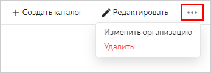

# Изменение организации для облака




В [консоли управления]({{ link-console-main }}) доступен выбор интерфейса навигации между ресурсами и сервисами. Чтобы сменить способ навигации, в блоке с информацией аккаунта нажмите кнопку , затем выберите  **Эксперименты** и включите опцию **Новая навигация**.



Чтобы изменить назначенную облаку организацию:



- Консоль управления





На стадии [Preview](../../../overview/concepts/launch-stages.md) действует ограничение: доступна только 1 организация и 1 облако.




- Консоль управления


  1. В [консоли управления]({{ link-console-main }}) выберите облако в списке слева.
  1. В правом верхнем углу нажмите кнопку  и выберите **Изменить организацию**.

      

  1. Выберите новую организацию из списка и нажмите **Изменить**.

- API

  Сейчас нет возможности изменить назначенную облаку организацию с помощью API.

