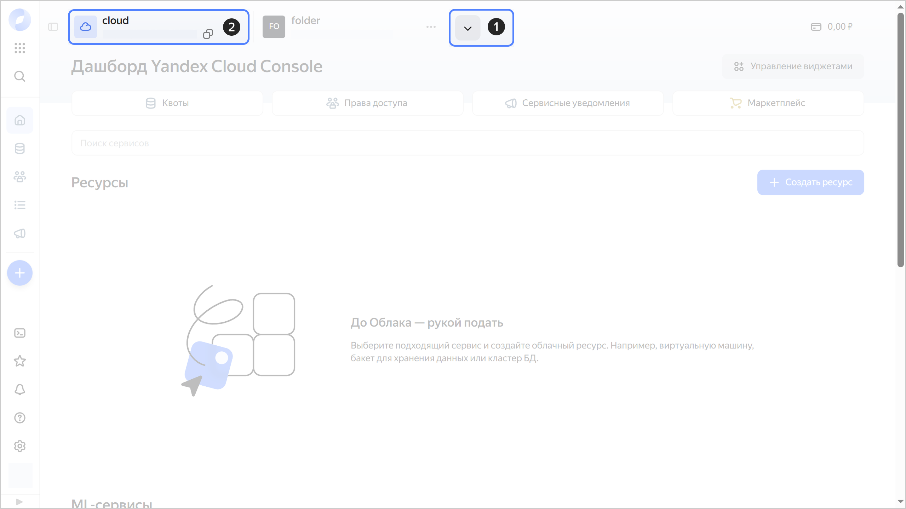
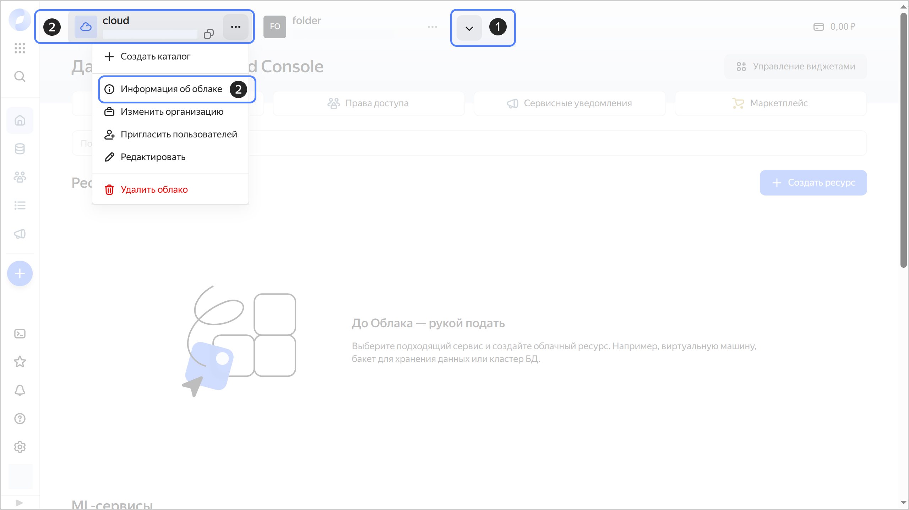
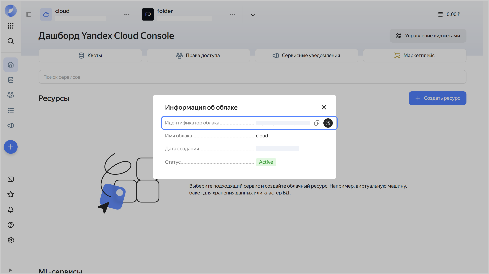

# Получение идентификатора облака



- Консоль управления {#console}

  Вы можете получить идентификатор облака на дашборде или на вкладке **{{ ui-key.yacloud.dashboard.DashboardPage.CloudInfoDialog.title_cloud-info-dialog_ddcbY }}**.

  **Получение идентификатора на дашборде**

  1. В [консоли управления]({{ link-console-main }}) на панели сверху нажмите  и выберите нужное [облако](../../concepts/resources-hierarchy.md#cloud).
  1. Идентификатор облака указан сверху, под именем облака. Чтобы скопировать идентификатор, наведите на него указатель и нажмите .

     
    
     

     

  **Получение идентификатора на вкладке {{ ui-key.yacloud.dashboard.DashboardPage.CloudInfoDialog.title_cloud-info-dialog_ddcbY }}**

  1. В [консоли управления]({{ link-console-main }}) на панели сверху нажмите  и выберите нужное [облако](../../concepts/resources-hierarchy.md#cloud).
  1. Справа от названия облака нажмите  и выберите **{{ ui-key.yacloud.common.resource-acl.button_cloud-info }}**.
  1. В открывшемся окне идентификатор облака указан в поле **{{ ui-key.yacloud.dashboard.DashboardPage.CloudInfoTooltip.cloud-id_rncSU }}**. Чтобы скопировать идентификатор, наведите на него указатель и нажмите .

     

     
    
     

     

- CLI {#cli}

  Если вы знаете имя [облака](../../concepts/resources-hierarchy.md#cloud), задайте его в качестве параметра команды `get`:

  ```
  yc resource-manager cloud get <имя_облака>
  ```
  Результат:

  ```
  id: b1gd129pp9ha********
  ...
  ```

  Если вы не знаете имя облака, получите список облаков с идентификаторами:

  

- API {#api}

  Чтобы получить список [облаков](../../concepts/resources-hierarchy.md#cloud) с идентификаторами, воспользуйтесь методом REST API [list](../../api-ref/Cloud/list.md) для ресурса [Cloud](../../api-ref/Cloud/index.md) или вызовом gRPC API [CloudService/List](../../api-ref/grpc/Cloud/list.md).


