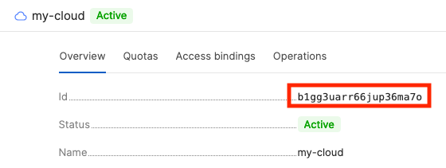

# Получение идентификатора облака



- Консоль управления

  1. В [консоли управления]({{ link-console-main }}) в списке слева нажмите на нужное облако.

      Если вы находитесь на странице сервиса, разверните список облаков и каталогов в левом верхнем углу.


      


      


  1. Откроется страница с информацией о выбранном облаке. Скопируйте **Идентификатор** на вкладке **Обзор**.


      


      


- CLI

  Если вы знаете имя облака, задайте его в качестве параметра команды `get`:

  ```
  yc resource-manager cloud get <имя облака>
  ```
  Результат:

  ```
  id: b1gd129pp9ha0vnvf5g7
  ...
  ```

  Если вы не знаете имя облака, получите список облаков с идентификаторами:

  ```
  yc resource-manager cloud list
  ```
  Результат:

  ```
  +----------------------+------------+--------------------------+
  |          ID          |    NAME    |      ORGANIZATION ID     |
  +----------------------+------------+--------------------------+
  | b1g66mft1vopnevbn57j | my-cloud-1 |                          |
  | b1gd129pp9ha0vnvf5g7 | my-cloud-2 |                          |
  +----------------------+------------+--------------------------+
  ```

- API

  Чтобы получить список облаков с идентификаторами, воспользуйтесь методом REST API [list](../../api-ref/Cloud/list.md) для ресурса [Cloud](../../api-ref/Cloud/index.md) или вызовом gRPC API [CloudService/List](../../api-ref/grpc/cloud_service.md#List).


