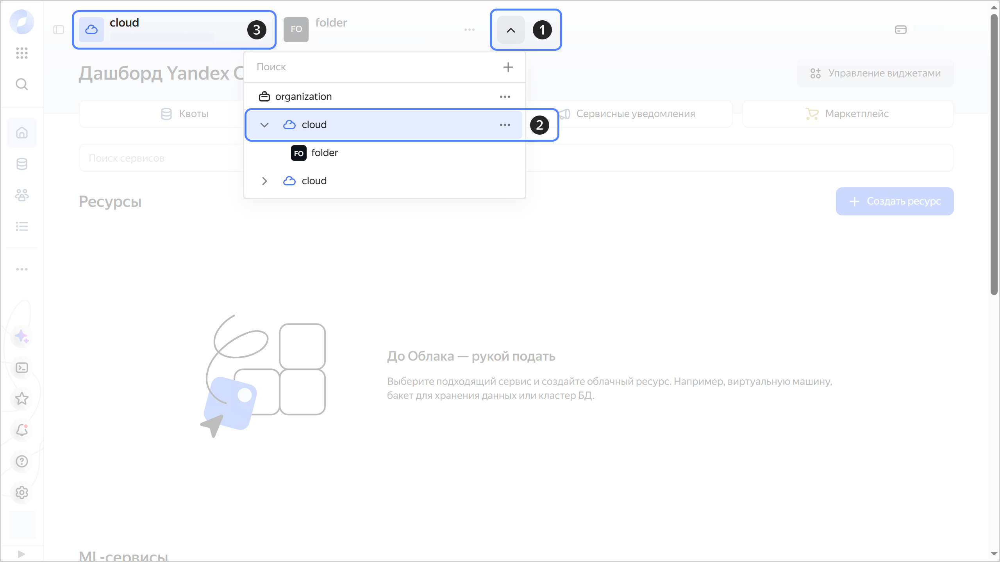

# Переключение на другое облако



- Консоль управления {#console}

  1. В [консоли управления]({{ link-console-main }}) на панели сверху нажмите .
  1. В открывшемся списке выберите нужное облако или каталог внутри этого облака.
  1. На дашборде указана основная информация об облаке и каталоге. [Идентификатор](./get-id.md) облака указан сверху, под именем облака.

     

- CLI {#cli}

  Есть два способа выбрать облако, которое используется в CLI по умолчанию:
  * выбрать облако при [создании профиля](../../../cli/operations/profile/profile-create.md);
  * изменить параметр `cloud-id` в конфигурации профиля.

  Чтобы изменить параметр `cloud-id` для текущего профиля:

  1. Посмотрите описание команды для изменения параметров конфигурации:

      ```
      yc config set --help
      ```

  1. Узнайте идентификатор облака, которое вы хотите использовать. Для этого получите список доступных облаков:

      ```
      yc resource-manager cloud list
      +--------------------------+----------------------+-------------------------------+
      |            ID            |         NAME         |          DESCRIPTION          |
      +--------------------------+----------------------+-------------------------------+
      | <идентификатор_облака_1> | <имя_облака_1>       | ...                           |
      | <идентификатор_облака_2> | <имя_облака_2>       | ...                           |
      +--------------------------+----------------------+-------------------------------+
      ```

      

      Если в списке только одно облако, значит у вас нет доступа к другим облакам. Чтобы получить доступ к облаку, попросите [владельца](../../concepts/resources-hierarchy.md#owner) облака [добавить](../../../organization/operations/add-account.md) вас в его облако.

      

  1. Укажите идентификатор облака, которое будет использоваться по умолчанию:

      ```
      yc config set cloud-id <идентификатор_облака>
      ```

- API {#api}

  Сейчас нет возможности переключиться на другое облако с помощью API.


