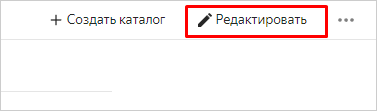

# Переименование облака

Чтобы переименовать облако, у вас должна быть роль [`editor`](../../../iam/concepts/access-control/roles.md#editor) или выше на это облако. Переименовать заблокированное облако нельзя. Если вы не можете выполнить эту операцию, обратитесь к [администратору](../../../iam/concepts/access-control/roles.md#admin) или [владельцу облака](../../concepts/resources-hierarchy.md#owner).



- Консоль управления

  1. В [консоли управления]({{ link-console-main }}) выберите облако в списке слева.
  1. Нажмите кнопку  **Редактировать** в правом верхнем углу.

      

  1. В открывшемся окне введите новое имя облака. Требования к имени:

	 

  1. Нажмите **Сохранить**.

- API

  Чтобы переименовать облако, воспользуйтесь методом REST API [update](../../api-ref/Cloud/update.md) для ресурса [Cloud](../../api-ref/Cloud/index.md) или вызовом gRPC API [CloudService/Update](../../api-ref/grpc/cloud_service.md#Update).

- {{ TF }}

  Подробнее о {{ TF }} [читайте в документации](../../../tutorials/infrastructure-management/terraform-quickstart.md#install-terraform).

  Чтобы переименовать облако, созданное с помощью {{ TF }}:

  1. Откройте файл конфигурации {{ TF }} и измените значение параметра `name` во фрагменте с описанием облака.

      

      ```hcl
      ...
      resource "yandex_resourcemanager_cloud" "cloud1" {
        name            = "cloud-main"
        organization_id = "bpf7nhb9hkphksfevi77"
      }
      ...
      ```

      

      Более подробную информацию о параметрах ресурса `yandex_resourcemanager_cloud` в {{ TF }}, см. в [документации провайдера]({{ tf-provider-resources-link }}/resourcemanager_cloud).
  1. В командной строке перейдите в папку, где вы отредактировали конфигурационный файл.
  1. Проверьте корректность конфигурационного файла с помощью команды:

      ```bash
      terraform validate
      ```
     
      Если конфигурация является корректной, появится сообщение:
     
      ```bash
      Success! The configuration is valid.
      ```

  1. Выполните команду:

      ```bash
      terraform plan
      ```
  
      В терминале будет выведен список ресурсов с параметрами. На этом этапе изменения не будут внесены. Если в конфигурации есть ошибки, {{ TF }} на них укажет.
  1. Примените изменения конфигурации:

      ```bash
      terraform apply
      ```
     
  1. Подтвердите изменения: введите в терминале слово `yes` и нажмите **Enter**.

      Проверить измененное имя облака можно в [консоли управления]({{ link-console-main }}) или с помощью команды [CLI](../../../cli/quickstart.md):

      ```bash
      yc resource-manager cloud list
      ```

