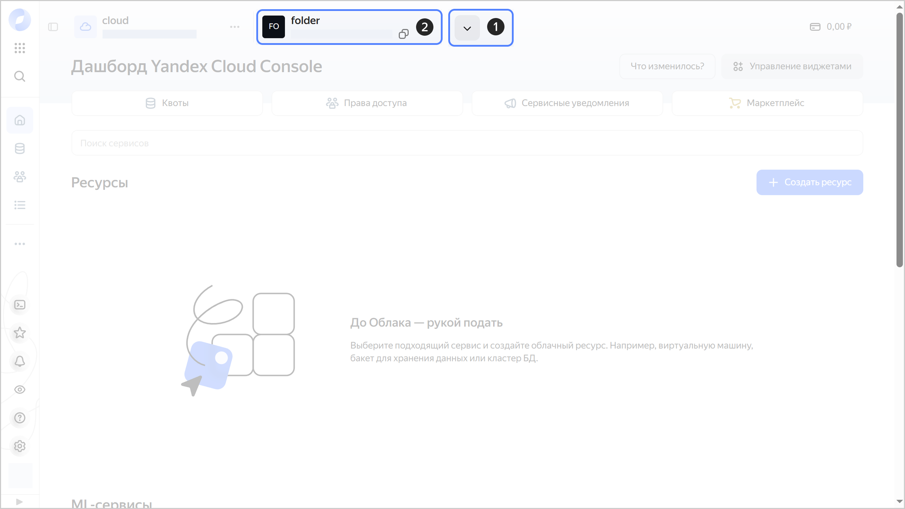
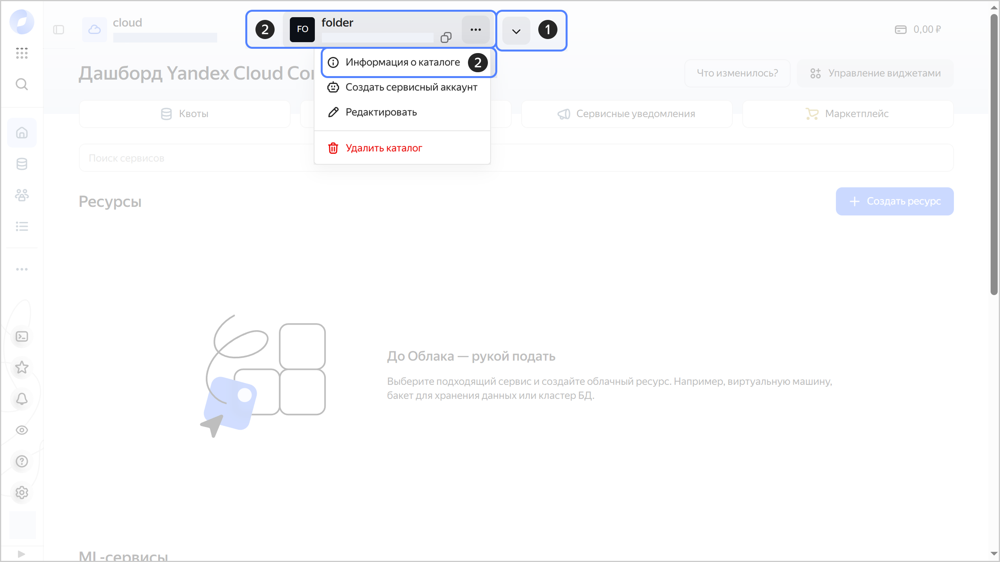
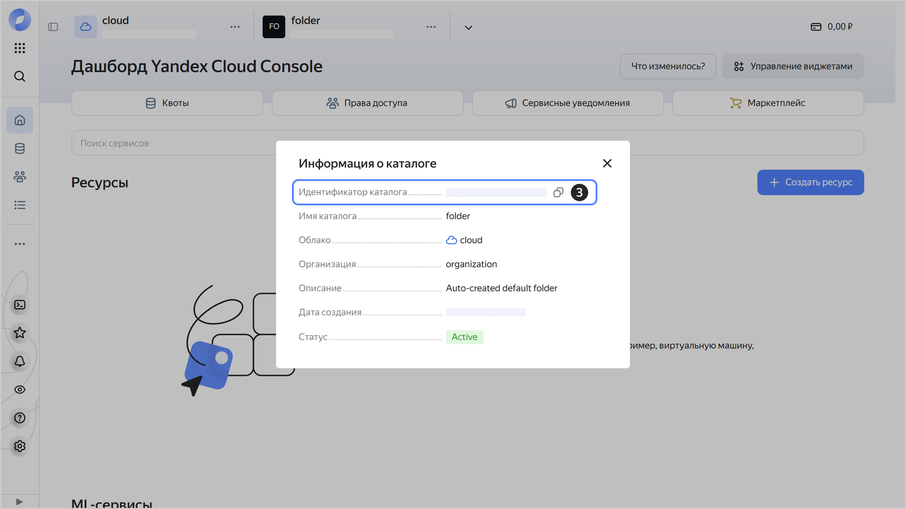

# Получение идентификатора каталога



- Консоль управления {#console}

  Вы можете получить идентификатор каталога на дашборде или на вкладке **{{ ui-key.yacloud.dashboard.FoldersSelector.FolderInfoTooltip.title_folder-info-dialog_c4F7i }}**.

  **Получение идентификатора на дашборде**

  1. В [консоли управления]({{ link-console-main }}) на панели сверху нажмите  и выберите нужный [каталог](../../concepts/resources-hierarchy.md#folder).
  1. Идентификатор каталога указан сверху, под именем каталога. Чтобы скопировать идентификатор, наведите на него указатель и нажмите .

     
    
     

     

  **Получение идентификатора на вкладке {{ ui-key.yacloud.dashboard.FoldersSelector.FolderInfoTooltip.title_folder-info-dialog_c4F7i }}**

  1. В [консоли управления]({{ link-console-main }}) на панели сверху нажмите  и выберите нужный [каталог](../../concepts/resources-hierarchy.md#folder).
  1. Справа от названия каталога нажмите  и выберите **{{ ui-key.yacloud.common.resource-acl.button_folder-info }}**.
  1. В открывшемся окне идентификатор каталога указан в поле **{{ ui-key.yacloud.dashboard.FoldersSelector.FolderInfoDialog.folder-id_6KQJv }}**. Чтобы скопировать идентификатор, наведите на него указатель и нажмите .

     

     
    
     

     
  
  Вы также можете получить идентификатор из URL страницы каталога в консоли управления:
  
  ```text
  {{ link-console-main }}/folders/<идентификатор_каталога>
  ```

- CLI {#cli}

  

  Если вы знаете имя [каталога](../../concepts/resources-hierarchy.md#folder), получите его идентификатор с помощью команды `get`:

  ```bash
  yc resource-manager folder get my-folder
  ```

  Результат:

  ```text
  id: b1gd129pp9ha********
  ...
  ```

  Если вы не знаете имя каталога, получите список каталогов с идентификаторами для облака по умолчанию:

  ```bash
  yc resource-manager folder list
  ```

  Результат:

  ```text
  +----------------------+--------------------+------------------+--------+
  |          ID          |        NAME        |      LABELS      | STATUS |
  +----------------------+--------------------+------------------+--------+
  | b1gd129pp9ha******** | my-folder          |                  | ACTIVE |
  | b1g66mft1vop******** | default            |                  | ACTIVE |
  +----------------------+--------------------+------------------+--------+
  ```

  Чтобы посмотреть список каталогов в другом облаке, укажите идентификатор каталога в `cloud-id`:

  ```bash
  yc resource-manager folder list --cloud-id b1glku4lgd6g********
  ```

- API {#api}

  Чтобы получить список [каталогов](../../concepts/resources-hierarchy.md#folder) с идентификаторами, воспользуйтесь методом REST API [list](../../api-ref/Folder/list.md) для ресурса [Folder](../../api-ref/Folder/index.md) или вызовом gRPC API [FolderService/List](../../api-ref/grpc/Folder/list.md).


