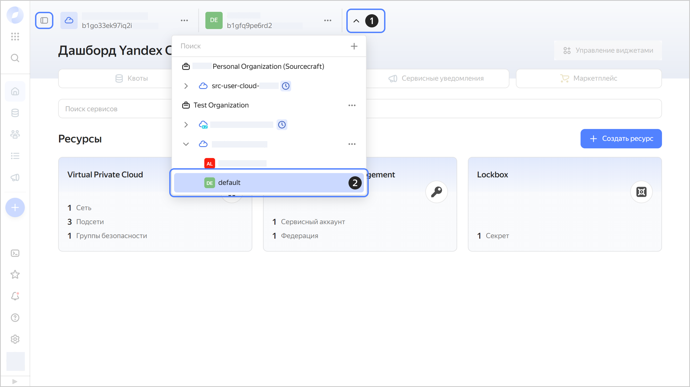

# Переключиться на другой каталог



- Консоль управления {#console}

  1. В [консоли управления]({{ link-console-main }}) на панели сверху нажмите .
  1. Выберите нужный каталог.

     Также вы можете закрепить панель со списком облаков и каталогов, нажав  **{{ ui-key.yacloud.dashboard.TogglCloudTreeButton.tooltip__pin_panel }}**.

  

