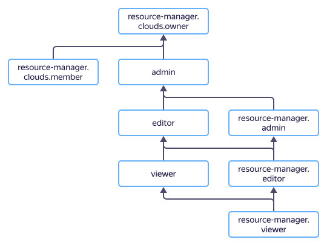

# Управление доступом в {{ resmgr-name }}

В этом разделе вы узнаете:
* [на какие ресурсы можно назначить роль](#resources);
* [какие роли действуют в сервисе](#roles-list);
* [какие роли необходимы](#required-roles) для того или иного действия.





## На какие ресурсы можно назначить роль {#resources}



## Какие роли действуют в сервисе {#roles-list}



### Сервисные роли {#service-roles}

#### resource-manager.auditor {#resource-manager-auditor}



#### resource-manager.viewer {#resource-manager-viewer}



#### resource-manager.editor {#resource-manager-editor}



#### resource-manager.admin {#resource-manager-admin}



#### resource-manager.clouds.member {#resource-manager-clouds-member}



#### resource-manager.clouds.owner {#resource-manager-clouds-owner}



### Примитивные роли {#primitive-roles}





## Какие роли мне необходимы {#required-roles}

В таблице ниже перечислено, какие роли нужны для выполнения указанного действия. Вы всегда можете назначить роль, которая дает более широкие разрешения, нежели указанная. Например, назначить `editor` вместо `viewer`.

Действие | Методы | Необходимые роли
----- | ----- | -----
**Просмотр информации** | |
Просмотр информации о любом ресурсе | `get`, `list` | `viewer` на этот ресурс
Просмотр информации о каталоге или облаке | `get`, `list` | `resource-manager.viewer` на каталог или облако
Просмотр метаинформации о каталоге или облаке | `get`, `list` | `resource-manager.auditor` на каталог или облако
**Управление ресурсами** | |
[Создание облака](../operations/cloud/create.md) | | Для создания первого облака роли не требуются, только аутентификация (так как пользователю автоматически назначается роль `resource-manager.clouds.owner` в созданной организации). В дальнейшем требуется роль `resource-manager.editor` или `editor` на организацию
[Изменение облака](../operations/cloud/update.md) | `update` | `editor` или `resource-manager.editor` на облако
[Удаление облака](../operations/cloud/delete.md) | `delete` | `resource-manager.clouds.owner` на облако
[Создание каталога в облаке](../operations/folder/create.md) | `create` | `editor` или `resource-manager.editor` на облако
[Изменение каталога](../operations/folder/update.md) | `update` | `editor` или `resource-manager.editor` на каталог
[Удаление каталога](../operations/folder/delete.md) | `delete` | `editor` или `resource-manager.editor` на каталог
**Управление доступом к ресурсам** | |
Приглашение нового пользователя в организазцию | | `{{ roles-organization-admin }}` |
[Сделать нового пользователя владельцем облака](../operations/cloud/set-access-bindings.md) | `setAccessBindings`, `updateAccessBindings` | `resource-manager.clouds.owner` на это облако
Просмотр назначенных ролей на ресурс | `listAccessBindings` | `viewer` на этот ресурс
Просмотр назначенных ролей на каталог или облако | `listAccessBindings` | `resource-manager.viewer` на каталог или облако
[Назначение роли](../../iam/operations/roles/grant.md), [отзыв роли](../../iam/operations/roles/revoke.md) на каталог или облако | `setAccessBindings`, `updateAccessBindings` | `admin` или `resource-manager.admin` на каталог или облако

#### Что дальше {#what-is-next}

* [Как назначить роль](../../iam/operations/roles/grant.md).
* [Как отозвать роль](../../iam/operations/roles/revoke.md).
* [Подробнее об управлении доступом в {{ yandex-cloud }}](../../iam/concepts/access-control/index.md).
* [Подробнее о наследовании ролей](../../resource-manager/concepts/resources-hierarchy.md#access-rights-inheritance).
