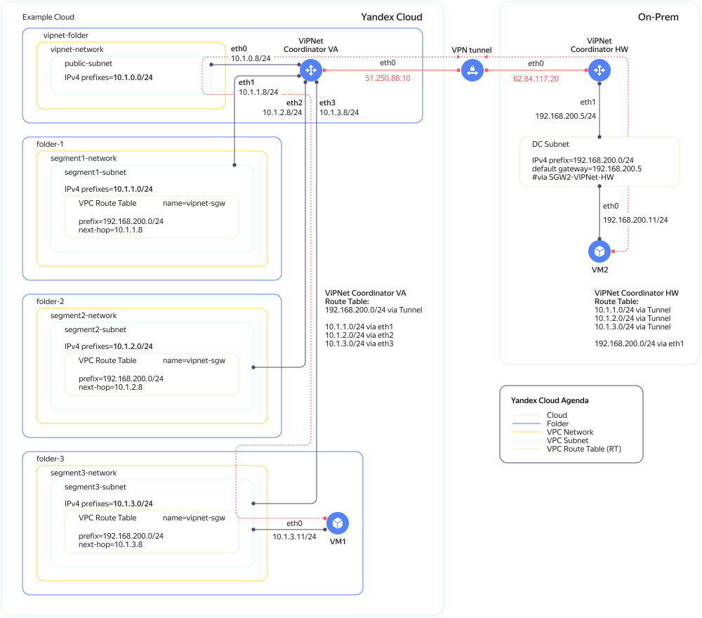

# ViPNet Coordinator VA в {{ yandex-cloud }}

Вы можете установить [ViPNet Coordinator VA](https://infotecs.ru/product/vipnet-coordinator-va.html#soft) в облаке и использовать его как VPN-шлюз для Site-to-site VPN между ресурсами облака и ресурсами удаленной площадки (on-premises).

ViPNet Coordinator VA устанавливается на ВМ с четырьмя сетевыми интерфейсами. Один интерфейс получает [публичный](../../vpc/concepts/address.md#public-addresses) IP-адрес, на нем работает туннель до шлюза на удаленной площадке. Остальным интерфейсам можно выдать [внутренние](../../vpc/concepts/address.md#internal-addresses) адреса и подключить к разным [подсетям](../../vpc/concepts/network.md#subnet) одной зоны доступности.

При работе в облаке у ViPNet Coordinator VA недоступны следующие функции:
* Экспорт и импорт ключей и настроек в формате `vbe`.
* Кластер горячего резервирования.
* Агрегирование интерфейсов.
* DHCP-сервер.
* VLAN.
* L2OverIP.
* Экспорт системного журнала и журнала регистрации IP-пакетов на USB-носитель или по протоколу TFTP.
* Добавление резервного набора персональных ключей.
* Локальное обновление ПО.
* Импорт сертификата с помощью USB-носителя.
* Аутентификация с помощью устройства.

Чтобы развернуть ViPNet Coordinator VA в {{ yandex-cloud }}:
1. [Ознакомьтесь с описанием решения](#description).
1. [Подготовьте облако к работе](#before-begin).
1. [Подготовьте окружение](#environment-preparing).
1. [Создайте образы дисков ViPNet Coordinator VA](#create-coordinator-images).
1. [Создайте ВМ с ViPNet Coordinator VA в облаке](#create-vipnet-cloud).
1. [Настройте ViPNet Coordinator VA](#set-up-vipnet).

Если созданные ресурсы вам больше не нужны, [удалите их](#clear-out).


## Описание решения {#description}

VPN-туннель работает между двумя решениями ViPNet: Coordinator VA — на стороне облачной инфраструктуры, и Coordinator HW — на стороне площадки on-premises.



Конфигурация облака:

* ViPNet Coordinator VA:

    Интерфейс | Внутренний адрес | Публичный адрес | Подсеть | Примечание
    --- | --- | --- | --- | ---
    `eth0` | 10.1.0.8 | `Автоматически` | `public-subnet` | Публичный адрес транслируется во внутренний по One-to-One NAT
    `eth1` | 10.1.1.8 | `Без адреса` | `segment1-subnet` | -
    `eth2` | 10.1.2.8 | `Без адреса` | `segment2-subnet` | -
    `eth3` | 10.1.3.8 | `Без адреса` | `segment3-subnet` | -

* Весь трафик до ресурсов удаленной площадки идет на внутренние интерфейсы ViPNet Coordinator VA по статическим маршрутам:

    Подсеть | Префикс назначения | Next hop
    --- | --- | ---
    `segment1-subnet` | 192.168.200.0/24 | 10.1.1.8
    `segment2-subnet` | 192.168.200.0/24 | 10.1.2.8
    `segment3-subnet` | 192.168.200.0/24 | 10.1.3.8

На стороне удаленной площадки:

* ViPNet Coordinator HW:

    Интерфейс | Адрес | Подсеть
    --- | --- | ---
    `eth0` | Публичный адрес | -
    `eth1` | 192.168.200.5 | 192.168.200.0/24

* Трафик до ресурсов облака идет на внутренний интерфейс ViPNet Coordinator HW по статическому маршруту:

    Подсеть | Префикс назначения | Next hop
    --- | --- | ---
    192.168.200.0/24 | 10.1.1.0/24, 10.1.2.0/24, 10.1.3.0/24 | 192.168.200.5


## Перед началом работы {#before-begin}





Чтобы создать ВМ с несколькими сетевыми интерфейсами, [запросите в технической поддержке]({{ link-console-support }}/create-ticket) включение флага `MULTI_INTERFACE_INSTANCES_ALPHA` на облако.




## Необходимые платные ресурсы {#paid-resources}

В стоимость инфраструктуры входит:
* Плата за вычислительные ресурсы, диски и образы ВМ (см. [тарифы {{ compute-full-name }}](../../compute/pricing.md)).
* Плата за хранение данных в бакете и операции с ними (см. [тарифы {{ objstorage-full-name }}](../../storage/pricing.md)).
* Плата за публичный IP-адрес и исходящий трафик (см. [тарифы {{ vpc-full-name }}](../../vpc/pricing.md)).




## Подготовьте окружение {#environment-preparing}


### Установите ПО на локальной машине {#local-software}

* [Oracle VM VirtualBox](https://www.oracle.com/virtualization/technologies/vm/downloads/virtualbox-downloads.html).
* [qemu-img](https://www.qemu.org/docs/master/tools/qemu-img.html).
* [jq](https://stedolan.github.io/jq/download/).


### Создайте облачную сеть {#create-network}

Если у вас еще нет [облачной сети](../../vpc/concepts/network.md#network), создайте ее в каталоге для ViPNet Coordinator VA, например, в каталоге `vipnet-folder`:



- Консоль управления

    1. В [консоли управления]({{ link-console-main }}) перейдите в каталог `vipnet-folder`.
    1. В списке сервисов выберите **{{ vpc-name }}**.
    1. Нажмите **Создать сеть**.
    1. Задайте имя сети, например, `vipnet-network`.
    1. Отключите опцию **Создать подсети**.
    1. Нажмите **Создать сеть**.

- CLI

    Чтобы создать облачную сеть выполните команду:

    ```
    yc vpc network create --name vipnet-network --folder-id <идентификатор_каталога_vipnet-folder>
    ```

    Где:
    * `name` — имя облачной сети.
    * `folder-id` — идентификатор каталога, в котором будет создана сеть.




### Создайте подсети {#create-subnets}

Создайте [подсеть](../../vpc/concepts/network.md#subnet) `public-subnet` для внешнего интерфейса ViPNet Coordinator VA:



- Консоль управления

    1. В [консоли управления]({{ link-console-main }}) перейдите в каталог `vipnet-folder`.
    1. В списке сервисов выберите **{{ vpc-name }}**.
    1. Выберите облачную сеть `vipnet-network`.
    1. Нажмите **Добавить подсеть**.
    1. Укажите имя подсети, например, `public-subnet`.
    1. Выберите [зону доступности](../../overview/concepts/geo-scope.md), например, `{{ region-id }}-a`.
    1. Введите **CIDR** подсети, например, `10.1.0.0/24`.
    1. Нажмите **Создать подсеть**.

    Аналогично создайте подсети для `vipnet-network` или другой сети:
    * `segment1-subnet`, CIDR – `10.1.1.0/24`;
    * `segment2-subnet`, CIDR – `10.1.2.0/24`;
    * `segment3-subnet`, CIDR – `10.1.3.0/24`.

    

    Все подсети должны находиться в одной зоне доступности.

    

- CLI

    1. Создайте подсеть `public-subnet`:

        ```
        yc vpc subnet create \
        --name public-subnet \
        --folder-id <идентификатор_каталога_vipnet-folder> \
        --network-name vipnet-network \
        --zone <зона_доступности> \
        --range 10.1.0.0/24
        ```

        Где:
        * `name` — имя подсети.
        * `folder-id` — идентификатор каталога, в котором размещена облачная сеть.
        * `network-name` — имя облачной сети.
        * `zone` — [зона доступности](../../overview/concepts/geo-scope.md), например, `{{ region-id }}-a`.
        * `range` — CIDR подсети.

    1. Аналогично создайте подсети для облачных ресурсов:
        * `segment1-subnet`, CIDR – `10.1.1.0/24`;
        * `segment2-subnet`, CIDR – `10.1.2.0/24`;
        * `segment3-subnet`, CIDR – `10.1.3.0/24`.

    

    Все подсети должны находится в одной зоне доступности.

    




### Создайте таблицы маршрутизации {#create-subnets}

Создайте таблицы маршрутизации `segment1-rt`, `segment2-rt`, `segment3-rt`:



- Консоль управления

    1. В [консоли управления]({{ link-console-main }}) перейдите в каталог `vipnet-folder`.
    1. В списке сервисов выберите **{{ vpc-name }}**.
    1. Выберите облачную сеть `vipnet-network`.
    1. На панели слева выберите  **Таблицы маршрутизации**.
    1. Нажмите **Создать**.
    1. Укажите **Имя** — `segment1-rt`.
    1. Нажмите **Добавить маршрут** и укажите:
        * **Префикс назначения** — `192.168.200.0/24`;
        * **Next hop** — `IP-адрес`;
        * **IP-адрес** — `10.1.1.8`.
    1. Нажмите **Добавить**.
    1. Нажмите **Создать таблицу маршрутизации**.

    Аналогично создайте таблицы `segment2-rt`, `segment3-rt`, указав IP-адреса `10.1.2.8` и `10.1.3.8`, соответственно.



Привяжите таблицы маршрутизации к подсетям:



- Консоль управления

    1. В [консоли управления]({{ link-console-main }}) перейдите в каталог `vipnet-folder`.
    1. В списке сервисов выберите **{{ vpc-name }}**.
    1. Выберите облачную сеть `vipnet-network`.
    1. На панели слева выберите  **Таблицы маршрутизации**.
    1. Выберите подсеть `segment1-subnet` и нажмите  → **Привязать таблицу маршрутизации**.
    1. Выберите таблицу `segment1-rt`.
    1. Нажмите кнопку **Привязать**.

    Аналогично привяжите таблицы `segment2-rt` и `segment3-rt` к подсетям `segment2-subnet` и `segment3-subnet`, соответственно.




## Создайте образы дисков для ВМ с ViPNet Coordinator VA {#create-coordinator-images}


### Создайте ВМ с ViPNet Coordinator VA на локальной машине {#create-vipnet-local}

ВМ создается из подготовленного для {{ compute-name }} образа диска. Требования к образу:
* Ключи установлены в системе.
* Тип аутентификации ключей — `по паролю`.
* Формат образа — `qcow2`.


#### Загрузите образ ViPNet Coordinator VA {#download-image}

1. Запросите образ ViPNet Coordinator VA на [сайте ИнфоТеКС](https://infotecs.ru/product/vipnet-coordinator-va.html#soft):
    1. В блоке **Материалы для загрузки** на вкладке **ПО** выберите демоверсию **ViPNet Coordinator VA (для развертывания в среде VMWare ESX, Oracle VM)**.
    1. На открывшейся странице укажите ваши данные.
    1. Подтвердите согласие с политикой обработки персональных данных и нажмите **ОТПРАВИТЬ ЗАЯВКУ**.
1. Дождитесь письма со ссылкой на загрузку ViPNet Coordinator VA, информацией о размере файла и контрольной сумме по алгоритму MD5. Ссылка будет действительна в течение 5 дней с момента заполнения формы на сайте.
1. Загрузите архив с ViPNet Coordinator VA и проверьте его целостность:

    

    - Linux / macOS

      1. Создайте каталог `vipnet` и загрузите в него архив:

          ```bash
          mkdir vipnet
          cd vipnet
          curl -O <ссылка_на_загрузку_ViPNet_Coordinator_VA>
          ```

      1. Узнайте имя архива:

          ```bash
          ls -la
          ```

          Результат:

          ```bash
          -rw-r--r--   1 user  457853789 Aug 21 12:28 va_vipnet_base_x86_64_4.5.1-5668.ova.zip
          ```

      1. Узнайте контрольную сумму архива по алгоритму MD5:

          ```bash
          md5 <имя_архива>
          ```
    
          Результат:

          ```bash   
          MD5 (va_vipnet_base_x86_64_4.5.1-5668.ova.zip) = 42c0f1401aa77fc5366e7eff8cc8ed4a
          ```

          Сравните контрольную сумму с той, что была указана в письме. Если значения не совпадают, повторите загрузку.

      1. Распакуйте архив:

          ```bash
          unzip <имя_файла>
          ```

          Результат:

          ```bash
          Archive:  va_vipnet_base_x86_64_4.5.1-5668.ova.zip
            inflating: va_vipnet_base_x86_64_4.5.1-5668.ova
          ```

    - PowerShell

      1. Создайте каталог `vipnet` и загрузите в него архив:

          ```powershell
          mkdir vipnet
          cd vipnet
          curl.exe -O <ссылка_на_загрузку_ViPNet_Coordinator_VA>
          ```

      1. Узнайте имя архива:

          ```powershell
          Get-ChildItem
          ```

          Результат:

          ```powershell
          Mode            LastWriteTime       Length    Name
          ----            -------------       ------    ----
          ------    8/24/2022   2:07 PM    457853789    va_vipnet_base_x86_64_4.5.1-5668.ova.zip
          ```

      1. Узнайте контрольную сумму архива по алгоритму MD5:

          ```powershell
          Get-FileHash <имя_архива> -Algorithm MD5
          ```

          Результат:

          ```powershell  
          Algorithm    Hash                                Path
          ---------    ----                                ----
          MD5          42C0F1401AA77FC5366E7EFF8CC8ED4A    C:\Users\User1\vipnet\va_vipnet_base_x86_64_4.5.1-5668.ova.zip
          ```

          Сравните контрольную сумму с той, что была указана в письме. Если значения не совпадают, повторите загрузку.

      1. Распакуйте архив:

          ```powershell
          Expand-Archive <имя_архива>
          ```

    


#### Подготовьте USB-диск с ключами {#prepare-usb-drive}

В руководстве используются демоверсии ключей.



- Linux / macOS

  1. Подключите USB-диск к компьютеру и отформатируйте его средствами операционной системы. Файловая система USB-диска — FAT32.
  1. Загрузите на USB-диск файл с ключами:

      ```bash
      curl -O https://files.infotecs.ru/_dl/sess/vipnet_demokeys/vipnet_demokeys.zip
      unzip vipnet_demokeys.zip
      cp Coordinator\ 4\ MOBILE/Coordinator\ 4\ MOBILE/abn_0004.dst <путь_к_корневой_директории_USB-диска>
      ```

  1. Проверьте, что ключи записались на USB-диск:

      ```bash
      ls <путь_к_корневой_директории_USB-диска>
      ```

      Результат:

      ```bash
      abn_0004.dst
      ```

  1. Средствами операционной системы отключите USB-диск от компьютера, но не извлекайте его из USB-порта.

- PowerShell

  1. Подключите USB-диск к компьютеру и отформатируйте его средствами операционной системы. Файловая система USB-диска — FAT32.
  1. Загрузите на USB-диск файл с ключами:
   
      ```powershell
      curl.exe -O https://files.infotecs.ru/_dl/sess/vipnet_demokeys/vipnet_demokeys.zip
      Expand-Archive vipnet_demokeys.zip
      Copy-Item -Path "<путь_к_директории_vipnet>\vipnet_demokeys\Coordinator 4 MOBILE\Coordinator 4 MOBILE\abn_0004.dst" -Destination <путь_к_корневой_директории_USB-диска>
      ```

  1. Проверьте, что ключи записались на USB-диск:

      ```powershell
      Get-ChildItem <путь_к_корневой_директории_USB-диска>
      ```

      Результат:

      ```powershell
      Mode            LastWriteTime    Length Name
      ----            -------------    ------ ----
      -a----    1/26/2022   5:38 PM     27456 abn_0004.dst
      ```

  1. Средствами операционной системы отключите USB-диск от компьютера, но не извлекайте его из USB-порта.




#### Создайте ВМ с ViPNet Coordinator VA в VirtualBox {#create-vm-virtualbox}

1. С помощью Oracle VM VirtualBox откройте файл с образом ViPNet Coordinator VA в формате `ova`.
1. В открывшемся окне нажмите **Import** и дождитесь завершения импорта настроек.
1. Выберите ВМ с именем `vm` и нажмите **Start**.


#### Настройте ViPNet Coordinator VA на локальной машине {#configure-vm-virtualbox}

1. В окне выбора способа загрузки ВМ выберите `VA`.
1. Дождитесь появления приглашения `va login:` в консоли ВМ.
1. Подключите USB-диск с ключами к ВМ: слева сверху откройте меню **Devices** → **USB** и выберите USB-диск с ключами.
1. В поле `va login` введите `user`.
1. В поле `Password` введите `user`.
1. На запрос `Please select setup wizard operating mode` введите `2` (full screen interface).
1. Примите лицензионное соглашение — выберите `Yes` и нажмите `Next`. 
1. Выберите континент `Europe`, страну `Russia`, временную зону `MSK+00` и нажмите `Yes`.
1. При необходимости установите текущие дату и время.
1. Выберите `usb` в качестве источника для загрузки информации о ключах. После чтения USB-диска будет показана информация о найденных файлах с ключевой информацией. Нажмите `Next`. 
1. Введите пароль `11111111` и нажмите `Next`. Данные из файла будут загружены в ВМ.
1. Настройте сетевые интерфейсы `eth0` и `eth1`:
    * `Activate interface on boot`.
    * `Get IP-address automatically on boot (via DHCP)`.
1. Настройте сетевые интерфейсы `eth2` и `eth3`: `Don't activate interface on boot`.
1. Настройте следующие параметры:
    * В поле `Enable/Disable NTP server mode` выберите `Disable starting the DNS server on boot`.
    * В поле `Enter hostname` укажите `yc-vipnet-1`.
    * На вопрос `Do you want to specify custom virtual IP address range?` выберите ответ `Leave the default setting`.
    * На вопрос `Do you want to probe VPN-connection with some host in order to verify the configuration you've just made?` выберите ответ `No`.
    * На вопрос `Do you want to start VPN services before leaving the installation wizard?` выберите ответ `No`.
1. Нажмите `FINISH` и дождитесь перезагрузки ВМ.
1. Отключите USB-диск: слева сверху откройте меню **Devices** → **USB** и выберите USB-диск с ключами.
1. Выключите ВМ: слева сверху откройте меню **Machine** → **ACPI Shutdown**.
1. Дождитесь появления логотипа VirtualBox в окне консоли ВМ и закройте окно. Подтвердите выключение ВМ — нажмите **Power off**.


#### Конвертируйте образы дисков в qcow2 {#prepare-image}



- Linux / macOS

  1. Перейдите в директорию, где хранятся файлы ВМ и узнайте имена файлов в формате `vdi`:

      ```bash
      cd <путь_к_директории_VirtualBox_VMs>/vm
      ls -ogh *.vdi
      ```

      Результат:

      ```bash
      -rw-------  1    272M Aug 21 15:22 va_vipnet_base_x86_64-disk1.vdi
      -rw-------  1    311M Aug 21 15:22 va_vipnet_base_x86_64-disk2.vdi
      ```
  
  1. Преобразуйте диски в формат `qcow2` с помощью утилиты `qemu-img`:

      ```bash
      qemu-img convert -f vdi -O qcow2 <имя_файла_VDI_с_диском_1> va_vipnet_base_x86_64-disk1.qcow2
      qemu-img convert -f vdi -O qcow2 <имя_файла_VDI_с_диском_2> va_vipnet_base_x86_64-disk2.qcow2
      ```

  1. Проверьте, что диски сохранились в формате `qcow2`:

      ```bash
      ls -ogh *.qcow2
      ```

      Результат:

      ```bash
      -rw-r--r--  1    236M Aug 21 15:32 va_vipnet_base_x86_64-disk1.qcow2
      -rw-r--r--  1    246M Aug 21 15:32 va_vipnet_base_x86_64-disk2.qcow2
      ```

- PowerShell

  1. Перейдите в директорию, где хранятся файлы ВМ и узнайте имена файлов в формате `vdi`:

      ```powershell
      cd <путь_к_директории_VirtualBox_VMs>/vm
      Get-ChildItem *.vdi
      ```

      Результат:

      ```powershell
      Mode            LastWriteTime       Length Name
      ----            -------------       ------ ----
      ------    8/24/2022  10:42 PM    324009984 va_vipnet_base_x86_64-disk2.vdi
      ------    8/24/2022  10:42 PM    286261248 va_vipnet_base_x86_64-disk1.vdi
      ```
  
  1. Преобразуйте диски в формат `qcow2` с помощью утилиты `qemu-img`:

      ```powershell
      qemu-img.exe convert -f vdi -O qcow2 <имя_файла_VDI_с_диском_1> va_vipnet_base_x86_64-disk1.qcow2
      qemu-img.exe convert -f vdi -O qcow2 <имя_файла_VDI_с_диском_2> va_vipnet_base_x86_64-disk2.qcow2
      ```

  1. Проверьте, что диски сохранились в формате `qcow2`:

      ```powershell
      Get-ChildItem -Name *.qcow2
      ```

      Результат:

      ```powershell
      ------    8/24/2022  10:52 PM    324009984 va_vipnet_base_x86_64-disk2.qcow2
      ------    8/24/2022  10:52 PM    286261248 va_vipnet_base_x86_64-disk1.qcow2
      ```




### Загрузите образы дисков в {{ objstorage-name }} {#upload-image-s3}



- Консоль управления

  1. Создайте бакет:
      1. В [консоли управления]({{ link-console-main }}) выберите каталог, в котором хотите создать бакет.
      1. Выберите сервис **{{ objstorage-name }}**.
      1. Нажмите кнопку **Создать бакет**.
      1. Задайте параметры бакета:
          * **Имя** — `my-vipnet-images`.
          * **Макс. размер** — `Без ограничения`.
          * **Доступ на чтение объектов** — `Ограниченный`.
          * **Доступ к списку объектов** — `Ограниченный`.
          * **Доступ на чтение настроек** — `Ограниченный`.
          * **Класс хранилища** — `Холодное`.
      1. Нажмите **Создать бакет**.
  1. Загрузите в бакет образы дисков в формате `qcow2`:
      1. Выберите созданный бакет.
      1. Нажмите **Загрузить**.
      1. В появившемся окне выберите файлы и нажмите **Открыть**.
      1. Нажмите **Загрузить**.
      1. Обновите страницу.
  1. Получите ссылки на загруженные объекты:
      1. Нажмите на имя объекта.
      1. Нажмите **Получить ссылку**.
      1. Укажите **Время жизни** ссылки в часах или днях (максимум 7 дней).
      1. Нажмите **Получить ссылку**.
      1. Скопируйте полученные ссылки.




### Создайте образы дисков в {{ compute-name }} {#create-image-compute}



- Консоль управления

  1. В [консоли управления]({{ link-console-main }}) выберите каталог `example_folder`.
  1. Выберите сервис **{{ compute-name }}**.
  1. На панели слева выберите  **Образы**.
  1. Нажмите **Загрузить образ**.
  1. Введите имя образа — `vipnet-va-disk1`.
  1. Вставьте ссылку на образ первого диска в {{ objstorage-name }}.
  1. Нажмите **Загрузить**.
  1. Повторите создание для второго образа `vipnet-va-disk2`.

- CLI

  Чтобы создать образы дисков в {{ compute-name }}, выполните следующие команды:

  ```bash
  yc compute image create vipnet-va-disk1 --source-uri="<ссылка_на_образ_первого_диска>"
  yc compute image create vipnet-va-disk2 --source-uri="<ссылка_на_образ_второго_диска>"
  ```




## Создайте ВМ с ViPNet Coordinator VA в облаке {#create-vipnet-cloud}



- CLI

  1. Задайте переменные для создания ВМ:

      ```bash
      VM_NAME=vipnet-va
      ZONE_ID={{ region-id }}-a
      DISK1_NAME=vipnet-va-disk1
      DISK2_NAME=vipnet-va-disk2
      ETH0_SUBNET=public-subnet
      ETH1_SUBNET=segment1-subnet
      ETH2_SUBNET=segment2-subnet
      ETH3_SUBNET=segment3-subnet
      ```

  1. Выполните команду для создания ВМ:

      ```bash
      yc compute instance create \
        --name=$VM_NAME \
        --hostname=$VM_NAME \
        --zone $ZONE_ID \
        --create-boot-disk name=$DISK1_NAME,type=network-hdd,image-name=$DISK1_NAME\
        --create-disk name=$DISK2_NAME,type=network-hdd,image-name=$DISK2_NAME,auto-delete=true\
        --cores=2 \
        --memory=4G \
        --core-fraction=100 \
        --network-interface subnet-name=$ETH0_SUBNET,ipv4-address=10.1.0.8,nat-ip-version=ipv4 \
        --network-interface subnet-name=$ETH1_SUBNET,ipv4-address=10.1.1.8 \
        --network-interface subnet-name=$ETH2_SUBNET,ipv4-address=10.1.2.8 \
        --network-interface subnet-name=$ETH3_SUBNET,ipv4-address=10.1.3.8 \
        --metadata serial-port-enable=1
      ```

      Где:
      * `name` — имя ВМ.
      * `hostname` — имя хоста ВМ.
      * `zone` — зона доступности, которая соответствует выбранной подсети для ВМ.
      * `create-boot-disk` — параметры загрузочного диска.
      * `create-disk` — параметры дополнительного диска.
      * `cores` — количество ядер (vCPU).
      * `memory` — объем памяти (RAM).
      * `core-fraction` — уровень производительности vCPU.
      * `network-interface` — параметры сетевого интерфейса.
      * `metadata` — метаданные ВМ.




## Настройте ViPNet Coordinator VA {#set-up-vipnet}


### Подключитесь к ViPNet Coordinator VA по серийной консоли {#serial-console}



- Консоль управления

    Перейдите в серийную консоль созданной ВМ:
    1. В [консоли управления]({{ link-console-main }}) выберите каталог `vipnet-folder`.
    1. Перейдите в сервис **{{ compute-name }}** и выберите ВМ `vipnet-va`.
    1. Перейдите на вкладку **Серийная консоль**.
    1. Введите логин `user` и пароль демоверсии `11111111`.

    После успешной аутентификации вы войдете в командную строку ViPNet Coordinator VA:

    ```text
    yc-vipnet-1> version
    Product: ViPNet Coordinator VA
    Platform: VA VIRTUALBOX
    License: VA500
    Software version: 4.5.1-5668
    yc-vipnet-1> 
    ```




### Включите протокол SSH {#enable-ssh}



- Консоль управления

    1. Войдите в режим администратора:

        ```text
        yc-vipnet-1> enable
        Type the administrator password: 
        ```

    1. Введите пароль администратора для демоверсии `11111111`:

        ```text
        yc-vipnet-1#
        ```

    1. Включите протоколы ICMP и SSH:

        ```text
        firewall service-object add name @ICMP icmp
        firewall local add 1 rule LICMP src @any dst @any service @ICMP pass
        firewall local add 1 rule LSSH  src @any dst @any service @SSH pass
        ```

    1. Выйдите из режима администратора и из серийной консоли:

        ```text
        exit
        exit
        ```




### Подключитесь к ViPNet Coordinator VA по SSH {#connect-ssh}

1. Получите публичный адрес ViPNet Coordinator VA:

    ```bash
    VIPNET_IP=$(yc compute instance get \
      --name=$VM_NAME \
      --format=json | jq -r '.network_interfaces[0].primary_v4_address.one_to_one_nat.address')
    ```

1. Запустите SSH-клиент:

    ```bash
    ssh user@$VIPNET_IP
    ```


## Как удалить созданные ресурсы {#clear-out}

Чтобы перестать платить за созданные ресурсы:
* [Удалите](../../compute/operations/vm-control/vm-delete.md) ВМ с ViPNet Coordinator VA.
* [Удалите](../../compute/operations/image-control/delete.md) образы дисков.
* [Удалите](../../storage/operations/buckets/delete.md) бакет.
