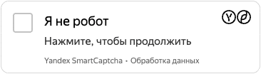
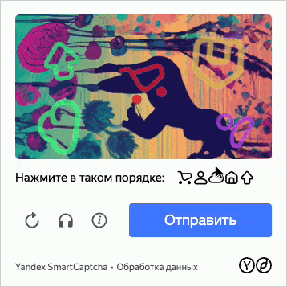

# Типы заданий

[Валидация пользователя](./validation.md) состоит из двух этапов. На первом этапе выполняется базовая проверка, где пользователю предлагается решить [основное задание](#main-task). После выполнения основного задания запрос пользователя автоматически отправляется в {{ captcha-name }}. Если сервис посчитает запрос подозрительным, он предложит пользователю решить [дополнительное задание](#additional-task). 

Если в настройках капчи задан максимальный [уровень сложности](#additional-task-difficulty), то сервис всегда будет предлагать пользователю решить дополнительное задание высокой сложности, вне зависимости от результатов выполнения основного задания.

## Основное задание {#main-task}

При выполнении основного задания выполняется базовая проверка.

В {{ captcha-name }} можно выбрать один из двух типов основных заданий:

* **{{ ui-key.yacloud.smartcaptcha.value_pre-check-checkbox }}** — пользователь должен нажать кнопку **Я не робот**.
  
  

  

  

* **{{ ui-key.yacloud.smartcaptcha.value_pre-check-slider }}** — пользователь должен переместить слайдер слева направо.
  
  

  Слайдер находится на стадии [Preview](../../overview/concepts/launch-stages.md), поэтому может некорректно работать на некоторых видах устройств. Например, на телевизорах.

  
  
  

  

  

## Дополнительное задание {#additional-task}

Если результат выполнения основного задания кажется сервису подозрительным или если для капчи задан максимальный [уровень сложности](#additional-task-difficulty), пользователю предлагается решить дополнительное задание. В этом случае сервис более детально анализирует поведение пользователя.

### Типы дополнительных заданий {#additional-task-types}

В {{ captcha-name }} есть несколько типов дополнительных заданий:

*  **Распознавание текста** — пользователь должен ввести искаженный текст с картинки в специальное поле.
  
  

  

  

*  **Силуэты** — на картинке размещается несколько значков, которые пользователь должен отметить в определенном порядке.
  
  

  Силуэты находятся на стадии [Preview](../../overview/concepts/launch-stages.md), поэтому могут некорректно работать на некоторых видах устройств. Например, на телевизорах.

  
  
  

  

  

*  **Калейдоскоп** — пользователь должен собрать картинку из частей, меняя их местами с помощью ползунка. Чтобы решить задание, нужно выставить ползунок в таком положении, при котором части картинки располагаются в правильном порядке.
  
  

  Калейдоскоп находится на стадии [Preview](../../overview/concepts/launch-stages.md), поэтому может некорректно работать на некоторых видах устройств. Например, на телевизорах.

  
  
  

  

  

## Уровни сложности заданий капчи {#task-difficulty}

В {{ captcha-name }} есть несколько уровней сложности, которые влияют на прохождение основного и дополнительного заданий, а также на порог показа [невидимой капчи](invisible-captcha.md).

Уровни сложности: 

* **{{ ui-key.yacloud.smartcaptcha.value_complexity-easy }}**. Порог прохождения основного задания на низком уровне. При прохождении дополнительного задания пользователям будут предлагаться простые изображения для распознавания текста, силуэтов или калейдоскопа.
* **{{ ui-key.yacloud.smartcaptcha.value_complexity-medium }}**. Порог прохождения основного задания на среднем уровне. При прохождении дополнительного задания пользователям будут предлагаться изображения среднего уровня сложности для распознавания текста, силуэтов или калейдоскопа.
* **{{ ui-key.yacloud.smartcaptcha.value_complexity-hard }}**. Порог прохождения основного задания на высоком уровне. При прохождении дополнительного задания пользователям будут предлагаться изображения высокого уровня сложности для распознавания текста, силуэтов или калейдоскопа.
* **{{ ui-key.yacloud.smartcaptcha.value_complexity-force_hard }}**. Решение дополнительного задания обязательно, вне зависимости от результатов выполнения основного задания. Порог прохождения основного задания и уровень сложности изображений дополнительного задания такие же, как и для значения **{{ ui-key.yacloud.smartcaptcha.value_complexity-hard }}**.